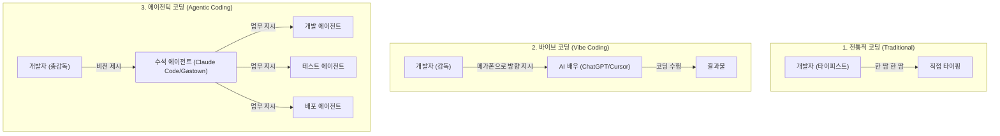
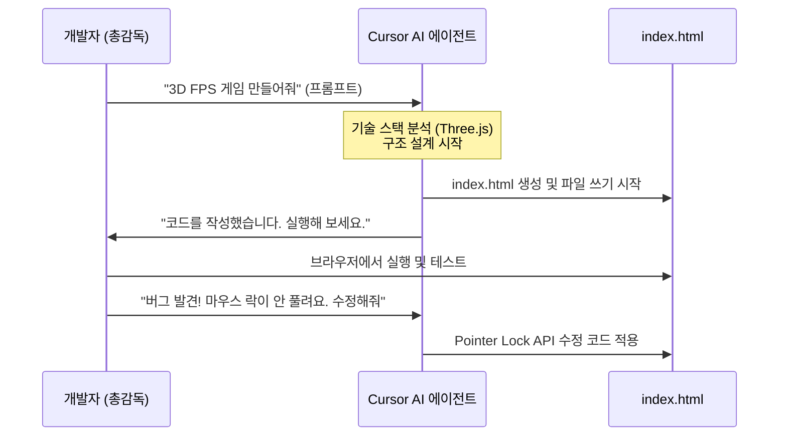

# 🚀 1주차 1일차: AI 코딩 생태계의 전환과 바이브 코딩(Vibe Coding)의 태동

안녕하세요! 여러분의 AI 코딩 여정을 함께할 15년 차 실리콘밸리 수석 아키텍트이자 시니어 멘토입니다. 

오늘날 소프트웨어 엔지니어링은 인류 역사상 가장 급격한 패러다임 전환을 겪고 있습니다. 단순히 코드를 암기하고 타이핑하는 시대는 끝났습니다. 이제 우리는 AI를 '단순 조수'가 아닌 **'자율적인 개발 파트너'**로 삼아 소프트웨어를 설계하고 빌드하는 시대에 살고 있습니다.

첫째 날인 오늘은 AI 코딩의 핵심 철학인 **바이브 코딩(Vibe Coding)**의 개념을 정립하고, 현대 AI 코딩 도구의 3대 인터페이스와 **AI 코딩 8단계 발전 모델**을 깊이 있게 비교하며, Cursor AI를 활용한 실습을 진행하겠습니다.

---

## ☕ 1분 비유: 바이브 코딩과 에이전틱 코딩이란?
개념이 헷갈릴 때는 영화 촬영 현장을 떠올려 보세요.



- **전통적인 코딩**: 감독(개발자)이 배우의 대사 한 마디, 몸짓 하나를 대본에 적어주고 직접 무대 장치까지 망치질하며 만드는 방식입니다.
- **바이브 코딩 (Vibe Coding)**: 감독이 의자에 앉아 큰 목소리로 **"여기선 좀 더 슬프게 울어봐!", "저기 빌딩에서 뛰어내려!"** 하고 지시(프롬프트)하면, AI 배우가 알아서 연기(코드 생성)를 하는 방식입니다. 세부적인 대사는 배우에게 맡기고 전체적인 '느낌(Vibe)'과 흐름만 잡습니다.
- **에이전틱 코딩 (Agentic Coding)**: 이제 감독은 촬영장에 잘 나가지도 않습니다. **"이런 느낌의 3D 액션 영화를 만들어줘"**라고 수석 에이전트(기획자 에이전트)에게 지시하면, 수석 에이전트가 서브 에이전트들(시나리오 작가, 카메라 감독, 조명 감독, 배우 에이전트들)을 거느리고 알아서 영화를 완성해 옵니다.

---

## 🎯 Section 1: 바이브 코딩(Vibe Coding)의 본질과 감정의 주기

### 1. 바이브 코딩의 탄생
전 OpenAI 수석 과학자 안드레이 카파시(Andrey Karpathy)가 트위터에서 언급하며 세계적인 열풍을 일으킨 **'바이브 코딩(Vibe Coding)'**은 **"코드를 직접 작성하지 않고, LLM과 대화하며 소프트웨어의 방향성과 흐름(Vibe)만을 조율하는 개발 방식"**을 의미합니다. 

2025년 말~2026년 초에 이르러 Claude 3.5 Sonnet, GPT-5, Gemini 3 Pro 등 추론 능력이 극대화된 모델들이 등장하며, "말만 하면 프로그램이 완성되는" 바이브 코딩이 단순한 유행을 넘어 실제 상용 MVP(최소 기능 제품) 개발의 핵심 프로세스로 자리 잡았습니다.

### 2. 바이브 코더가 겪는 감정의 3단계 주기
AI와 함께 개발하다 보면 누구나 아래와 같은 감정 변화를 겪게 됩니다. 멘토로서 여러분이 이 주기를 미리 알고 의연하게 대처하기를 바랍니다.

1. **경이로움 (Astonishment)**: "어떻게 말 한마디에 3D 게임 코드를 한 번에 다 짜주지? 나는 천재다!"
2. **좌절과 분노 (Frustration & Anger)**: "조금 복잡한 기능을 추가하니까 AI가 코드를 다 망쳐놨어. 버그 투성이고 동작을 안 해! AI 코딩은 역시 거품이야."
3. **수용과 마스터 (Acceptance & Mastery)**: "아하, AI의 한계(컨텍스트 윈도우 크기, 망각 현상)를 이해하고, 일을 작게 쪼개어 지시하며 설계 문서(`agents.md`, `plan.md`)를 통해 가이드라인을 주면 되는구나!"

---

## 🎯 Section 2: 에이전틱 AI 코딩 (Agentic AI Coding)의 누락된 매뉴얼

많은 사람들이 바이브 코딩과 에이전틱 코딩을 혼용하지만, 아키텍처 관점에서는 명확한 차이가 존재합니다.

- **바이브 코딩 (Vibe Coding)**: 단발성 프롬프트 인터랙션 중심. 개발자가 AI의 출력을 실시간으로 보며 복사-붙여넣기 하거나 한 단계씩 수동 승인하는 방식 (주로 IDE 내 채팅창 인터페이스).
- **에이전틱 코딩 (Agentic Coding)**: AI에게 **'도구(Tools)'**와 **'자율성(Autonomy)'**을 부여하여, 스스로 계획을 세우고, 파일을 수정하고, 터미널 명령어를 실행하고, 테스트를 수행하며 목표를 달성할 때까지 **피드백 루프(Loop)**를 도는 방식.

### 🛠️ 에이전틱 코딩의 5대 핵심 요소
1. **에이전트(Agent)와 서브 에이전트(Sub-Agent)**: 상위 에이전트가 작업을 더 작은 태스크로 쪼개어 특화된 하위 에이전트에게 할당.
2. **컨텍스트(Context)와 메모리(Memory)**: 대규모 코드베이스에서 현재 작업에 필요한 파일들만 선별하여 LLM의 제한된 기억 공간(Context Window)에 효율적으로 적재하는 기술.
3. **도구(Tools)와 플러그인(Plugins)**: AI가 파일 읽기/쓰기, grep 검색, 터미널 실행, 웹 검색 등을 수행할 수 있게 하는 API 기능.
4. **Model Context Protocol (MCP)**: 서로 다른 서비스(Jira, GitHub, DB 등)와 AI 에이전트를 표준화된 방식으로 연결하는 프로토콜.
5. **워크플로우(Workflows)**: 계획 단계(Plan) -> 실행 단계(Execute) -> 검증 단계(Review)를 거치며 에이전트가 스스로 실수를 바로잡는 흐름.

---

## 🎯 Section 3: AI 코딩 인터페이스의 3가지 축 비교

현재 AI 코딩 생태계는 크게 세 가지 형태의 인터페이스로 나뉩니다. 각 인터페이스의 기술 스펙과 장단점을 비교해 봅시다.

| 비교 항목 | 1. IDE 통합형 에이전트 | 2. 기존 IDE 플러그인 | 3. 터미널 기반 CLI 에이전트 |
| :--- | :--- | :--- | :--- |
| **대표 도구** | **Cursor AI**, Windsurf, Antigravity IDE | **GitHub Copilot**, OpenAI Codex Extension | **Claude Code**, Gemini CLI, AMP Code |
| **주요 인터페이스**| 파일 탐색기, 코드 에디터, AI 에이전트 3패널 통합 | 에디터 내 자동완성, 인라인 채팅창 | 터미널(Command Line Interface) |
| **작동 원리** | 프로젝트 폴더 전체를 인덱싱하여 의미론적 검색(Semantic Search)과 파일 수정 제안 제공 | 현재 열려 있는 탭의 코드 위주로 다음 줄 자동완성 및 주석 해석 | 에이전트가 쉘 명령을 직접 내리며 테스트/수정 루프를 자율적으로 수행 |
| **자율성 수준** | 중간 (사용자가 제안된 변경 사항을 수락/거절) | 낮음 (단순 자동완성 및 질의응답) | 높음 (YOLO 모드 시 사용자 승인 없이 빌드 및 수정 가능) |
| **추천 대상** | 초보 개발자, 신속한 UI 프로토타이핑, MVP 제작 | 타이핑 속도를 올리고 싶은 기존 개발자 | 대규모 코드베이스 리팩토링, 자동화 빌드/테스트를 원하며 CLI에 익숙한 시니어 개발자 |

> [!NOTE]
> **왜 2026년 현재 CLI(터미널) 기반의 에이전트가 가장 각광받을까요?**
> 터미널 인터페이스는 단순해 보이지만, AI 에이전트에게는 **가장 강력한 입출력 창구**이기 때문입니다. IDE의 복잡한 UI 요소를 렌더링하는 연산 낭비 없이, 에이전트가 `npm test`를 돌려 에러 로그를 직접 읽고 `git diff`로 코드 변경을 즉각 확인하여 수정할 수 있기 때문에 생산성이 극대화됩니다.

---

## 🎯 Section 4: AI 코딩의 8단계 발전 모델 (Steve Yegge 프레임워크)

소프트웨어 엔지니어가 AI를 받아들이고 진화하는 과정은 아래와 같이 8단계로 정의할 수 있습니다.

```text
[1단계] ChatGPT 창에 질문하기 (단발성)
  ▼
[2단계] Cursor AI 등에서 승인을 누르며 개발 (IDE 비서)
  ▼
[3단계] YOLO 모드 도입 (에이전트가 알아서 코드 수정)
  ▼
[4단계] 코드가 아닌 '에이전트 가이드 스펙(agents.md)' 관리에 집중
  ▼
[5단계] Claude Code CLI 도입 (터미널에서 에이전트가 빌드하고 테스트하는 화면 관람) ──★ [기업 실무 권장 Sweet Spot]
  ▼
[6단계] 동시 다발적 멀티 에이전트 실행 (UI 수정과 DB 수정을 각각 다른 에이전트에 위임)
  ▼
[7단계] 10개 이상의 복합 에이전트 관리 및 수동 코디네이션
  ▼
[8단계] 완전 자율 오케스트레이션 (마스터 에이전트가 하위 매니저와 워커 에이전트 무리를 지휘)
```

- **기업의 핵심 실무 타겟 (Sweet Spot)**: 가장 안정적이면서도 극적인 생산성 향상을 가져다주는 지점은 **5단계(CLI 기반 자율 에이전트)**와 **6단계(멀티 에이전트 협업)** 사이입니다. 8단계의 완전 자율 스웜은 혁신적이지만, 아직은 비용 제어 및 무한 루프(비용 과다 청구) 위험이 있어 세심한 아키텍처 설계가 필요합니다.

---

## 🎯 Section 5: [실습] Cursor AI 설정을 통한 3D FPS 게임 만들기

백문이 불여일타(百聞이 不如一打)입니다. 직접 AI 에이전트를 부려 웹 브라우저에서 실행되는 3D FPS 게임을 구축해 봅시다.

### 1단계: Cursor AI 설정
1. [Cursor 공식 홈페이지](https://cursor.sh)에서 운영체제(Mac/Windows)에 맞는 설치 파일을 다운로드합니다.
2. 회원가입 후 무료 크레딧을 확보합니다.
3. 설정(Settings) -> Models에서 사용할 프론티어 모델(예: Claude 3.5 Sonnet, GPT-4o)을 활성화합니다.

### 2단계: 프로젝트 디렉토리 생성 및 에이전트 대화창 열기
1. 컴퓨터에 빈 폴더(예: `fps-game`)를 만듭니다.
2. Cursor에서 `Open Folder`를 통해 이 폴더를 엽니다.
3. `Ctrl + L` (Mac은 `Cmd + L`)을 눌러 AI Chat 패널을 열고 에이전트 모드(Agent Mode)를 켭니다.

### 3단계: 프롬프트 입력 및 자율 코딩 시작
AI Chat 패널에 아래 프롬프트를 입력합니다.

> **Prompt:**
> "Three.js 라이브러리를 사용하여 브라우저에서 실행되는 간단한 3D FPS(1인칭 슈팅) 게임을 만들어줘. 
> 1. 플레이어는 W, A, S, D 키로 이동하고 마우스로 시점을 전환하며, 마우스 클릭으로 총을 쏠 수 있어야 해.
> 2. 아레나 공간에 랜덤하게 움직이는 붉은색 몬스터들이 스폰되게 해줘. 플레이어가 총을 쏘아 몬스터를 맞추면 몬스터가 사라지고 점수가 올라가야 해.
> 3. 화면 UI에 현재 점수(Score)와 플레이어의 체력(HP)을 표시해 줘.
> 4. HTML, CSS, JavaScript 코드를 작성하여 단일 `index.html` 파일 혹은 구조화된 파일들로 생성해줘."



### 4단계: 테스트 및 버그 수정 (Vibe Coding Loop)
1. 에이전트가 생성을 완료하면 파일 탐색기에 `index.html`이 생긴 것을 확인할 수 있습니다.
2. 해당 파일을 마우스 우클릭하여 브라우저에서 엽니다 (`Open with Live Server` 또는 단순히 브라우저 창으로 드래그 앤 드롭).
3. 조작해 본 후 발생하는 문제(예: "화면이 너무 어두워요", "플레이어 속도가 너무 빨라요")를 대화창에 그대로 입력해 보세요.
4. AI 에이전트가 제시하는 코드를 확인하고 승인(Accept)을 누르면 파일이 자동으로 업데이트됩니다.

---

## 🏗️ 아키텍트의 의사결정 노트 (ADR - Architectural Decision Record)

### 결정사항: 첫 주 실습 도구로 왜 'CLI 에이전트'가 아닌 'Cursor IDE'를 채택했는가?
- **배경**: 현재 가장 핫한 AI 도구는 단연 터미널에서 작동하는 Claude Code CLI입니다. 하지만 왜 본 교육 과정의 1주차는 Cursor와 같은 IDE 기반의 AI 에이전트로 시작할까요?
- **대안 비교**: 
  - *대안 A (Claude Code CLI 우선)*: 텍스트만으로 파일 생성 및 터미널 피드백이 일어나므로 초보자에게 시각적 피드백이 부족합니다. 3D 게임 화면의 변화나 코드 변경 사항의 레이아웃을 한눈에 보기 어렵습니다.
  - *대안 B (Cursor IDE 우선)*: 에디터 패널에서 수정되는 코드가 실시간으로 하이라이트(Diff) 표시되므로, 내 지시가 코드에 어떻게 반영되는지 직관적으로 학습할 수 있습니다.
- **의사결정 이유**: 학습 과정의 점진적 공개(Progressive Disclosure) 원칙에 따라, 코드의 물리적인 변화를 눈으로 보며 감각을 익히는 **IDE 기반 에이전트 학습**이 선행되어야만 2주차에 만날 CLI 에이전트의 막강한 텍스트 로그 흐름을 깊이 이해할 수 있기 때문입니다.

---

## 🎯 시니어 멘토의 오늘의 브리핑 (Micro-Lecture)

- **핵심 요약**: 바이브 코딩은 AI라는 배우에게 세부 연출을 맡기는 새로운 개발 문법입니다. 버그가 난다고 낙담하지 마세요. 그것은 AI의 성능 한계를 마주한 것이며, 개발자로서 여러분의 역할이 바로 그 컨텍스트(맥락)를 정돈하고 통제하는 '엔지니어'로 거듭나는 시점입니다.
- **도전 과제**: 오늘 빌드한 3D FPS 게임에 **"플레이어가 데미지를 입었을 때 화면이 붉게 깜빡이는 효과를 CSS 애니메이션으로 추가해줘"**라고 추가 지시를 내리고 적용해 보세요!

---
> 🔙 **[위키 가이드로 돌아가기](../0-3. 나만의_AI_학습위키_확장가이드.md)** | **[2일차 교재 읽기](./Day2_LLM_동작_원리와_컨텍스트_엔지니어링.md)**
