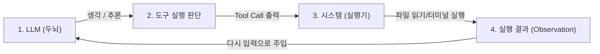
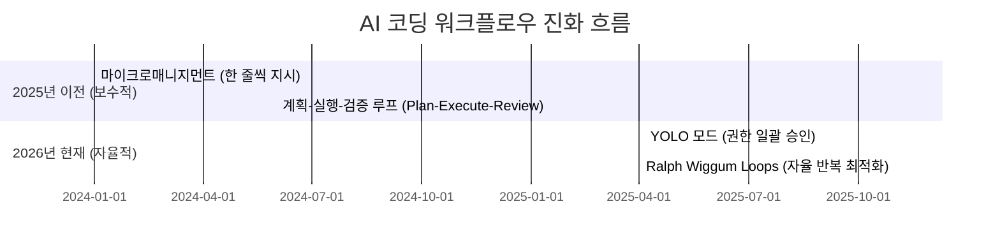

# 🚀 1주차 2일차: LLM의 작동 원리와 컨텍스트 엔지니어링 (Context Engineering)

안녕하세요! 시니어 멘토입니다. 

어제 우리는 AI 에이전트를 조작해 3D FPS 게임을 직접 빌드해 보았습니다. 아마 한 줄의 코딩 없이 게임이 뚝딱 만들어지는 것을 보며 놀라움과 함께, 한편으로는 **"이 녀석이 정말 코드를 이해하고 짜는 걸까? 대체 어떤 원리로 돌아가는 걸까?"**라는 의문이 생기셨을 겁니다.

오늘은 AI 코딩의 두뇌 역할을 하는 **LLM(대규모 언어 모델)의 진짜 속사정**을 파헤쳐 보겠습니다. 이 원리를 알아야만 AI가 망가뜨리는 스파게티 코드를 제어하고, 고부가가치의 소프트웨어를 설계할 수 있게 됩니다.

---

## ☕ 1분 비유: LLM은 기억상실증에 걸린 속독가이자 수학 계산기다
LLM의 실체를 이해하기 위해 '금붕어 속독가'의 방을 상상해 보세요.

```text
[금붕어 속독가 (LLM)의 방]
- 이 속독가는 기억상실증에 걸려 책상 위의 쪽지(Context Window) 외에는 아무것도 기억하지 못합니다 (Stateless).
- 손님이 질문을 던지면, 책상 위의 쪽지들을 한눈에 훑어보고(Attention), 확률적으로 가장 어울리는 단어 한 개를 포스트잇에 써서 보여줍니다.
- 손님이 이전 대화를 포스트잇 뒤에 계속 붙여주지 않으면(Illusion of Memory), 방금 한 질문도 잊어버립니다.
```

- **토큰(Token)**: 속독가가 글자를 읽을 때 단어 단위가 아니라 글자 조각(음절/형태소) 단위로 쪼개서 읽는 메모리 조각입니다.
- **컨텍스트 윈도우(Context Window)**: 이 속독가의 '책상 크기'입니다. 책상이 꽉 차면 예전 쪽지들은 쓰레기통으로 버려집니다(기억 상실).
- **생각하고 답하기(Reasoning)**: 속독가에게 "답하기 전에 먼저 연습장에 계산 과정을 써봐(Chain of Thought)"라고 지시하면, 오답률이 기적적으로 줄어듭니다.

---

## 🎯 Section 1: LLM의 핵심 아키텍처와 추론(Inference) 원리

### 1. 토큰(Token)이란 무엇인가?
LLM은 글자를 컴퓨터가 이해하는 숫자들의 배열(벡터)로 변환해 처리합니다. 이때 텍스트를 나누는 최소 단위를 **토큰(Token)**이라고 합니다.
- 영어의 경우 보통 1단어가 0.75개의 토큰에 대응되지만, 한글은 자소 분리 및 형태소 특성상 단어 대비 토큰 수가 훨씬 많이 소비됩니다 (비용 증가 및 컨텍스트 낭비 유발).
- AI 코딩 시 **영어로 프롬프트를 작성하거나, 주석을 영어로 적는 것이 비용 효율성과 AI 성능 면에서 유리한 이유**가 바로 이 토큰 소비 효율성 때문입니다.

### 2. stateless(상태 없음)와 기억의 환상(Illusion of Memory)
가장 오해하기 쉬운 사실은 **LLM 자체는 이전 대화를 전혀 기억하지 못한다**는 점입니다. LLM API는 매 호출마다 완전히 리셋되는 무상태(Stateless) 시스템입니다.
- 그렇다면 ChatGPT나 Cursor는 어떻게 대화 맥락을 기억할까요?
- 비결은 AI 어플리케이션(소프트웨어 레이어)이 **이전 대화 내역 전체를 복사해서 다음 질문 맨 앞에 교묘하게 끼워 넣은 채로 LLM에게 다시 전달**하기 때문입니다. 이를 **'기억의 환상'**이라고 부릅니다. 대화가 길어질수록 이 전송량이 누적되어 토큰 비용이 폭증하고, 결국 컨텍스트 윈도우 한계를 초과하면 옛 대화를 망각하기 시작합니다.

### 3. LLM의 추론과 생각(Chain of Thought)
최신 모델(예: o1, GPT-5, Gemini 3 Pro)은 답변을 내기 전에 `<thinking>` 블록을 생성해 단계별로 문제를 스스로 추론합니다. 
- 수학이나 코딩 문제에서 "단계별로 생각해봐(Let's think step by step)"라는 문구 하나만으로 답변 품질이 향상되는 이유는, 확률적 언어 모델이 **다음 단어를 예측할 때 논리적 전개 과정을 먼저 출력함으로써 최종 오답 확률을 수학적으로 낮추기 때문**입니다.

---

## 🎯 Section 2: AI 에이전트의 정의 - 도구(Tools)와 루프(Loops)

LLM은 단순히 텍스트를 생성하는 모델이지만, 이를 감싸고 있는 소프트웨어 아키텍처가 결합되면 **에이전트(Agent)**로 거듭납니다.



- **ReAct 패턴 (Reasoning + Acting)**: 에이전트는 문제를 해결하기 위해 **"생각(Thought) -> 행동(Act) -> 관찰(Observe)"**의 루프를 무한히 돕니다.
- **도구(Tools)**: 에이전트가 사용할 수 있도록 제공된 함수들입니다. (예: `view_file`, `write_to_file`, `run_command`). LLM은 직접 파일을 수정할 능력이 없지만, "이 파일을 이렇게 수정하라"는 특정 포맷의 텍스트(Tool Call)를 출력하면, 시스템 프로그램이 이를 가로채 대신 코드를 수정해 줍니다.

---

## 🎯 Section 3: 컨텍스트 엔지니어링과 `agents.md` 전략

### 1. 컨텍스트 엔지니어링(Context Engineering)의 중요성
AI 코딩 에이전트의 성패는 **"컨텍스트 윈도우라는 제한된 책상 위에 어떤 정보(파일)를 올려두고 일하게 할 것인가"**에 달려 있습니다. 불필요한 라이브러리 파일이나 방대한 로그를 책상 위에 올려두면, 에이전트는 길을 잃고 헛소리(Hallucination)를 시작합니다.

### 2. 프로젝트의 나침반, `agents.md` (또는 `claude.md`)
AI 코딩 도구(Cursor, Claude Code 등)가 폴더 전체를 파악할 수 있도록 최상위 루트에 생성하는 메타 설정 지침서입니다.
- **핵심 역할**: 프로젝트의 아키텍처 규격, 코딩 컨벤션, 핵심 비즈니스 규칙, 사용 기술 스택을 명시하여 AI가 멋대로 구조를 변경하는 것을 철저히 방지합니다.
- **작성 원칙**:
  - 간결하고 명확하게 작성할 것.
  - 구조 변경이나 리팩토링 시 가장 먼저 이 문서를 업데이트할 것 (Single Source of Truth).

---

## 🎯 Section 4: AI 코딩 워크플로우의 진화

AI 코딩 워크플로우는 사용자의 개입 수준에 따라 다음과 같이 발전해 왔습니다.



1. **마이크로매니지먼트 (Micromanagement)**: 개발자가 프롬프트창 앞에서 대기하며 한 줄씩 코드를 수동 복사하는 구시대적 방식.
2. **Plan-Execute-Review**: 에이전트가 `plan.md`를 먼저 쓰고 승인받은 뒤, 차례로 구현하고 리뷰를 받는 안전한 방식 (대규모 기업 아키텍처에 필수적).
3. **YOLO 모드 (You Only Live Once)**: 에이전트에게 파일 변경 및 터미널 명령어 실행 권한을 무조건 승인(`-y` 플래그 등)하여, 일일이 확인하지 않고 고속으로 개발을 위임하는 방식.
4. **Ralph Wiggum 루프 (Ralph Loops)**: 호주 개발자 제프리 헌틀리(Geoffrey Huntley)가 창안한 개념으로, **에이전트가 코드를 짜고 -> 테스트를 돌리고 -> 에러가 나면 스스로 디버깅하고 -> 다시 테스트하는 과정을 자율적으로 10회 이상 반복(Feedback Loop)하도록 방치하는 기법**입니다. "밤새 켜놓고 아침에 일어나서 완성본을 확인하는" 초고성능 자율 반복 워크플로우입니다.

---

## 🎯 Section 5: Artificial Analysis를 통한 최신 LLM 비교 벤치마크

어떤 모델을 코딩에 사용해야 할지 막막할 때는 **Artificial Analysis (artificialanalysis.ai)** 벤치마크 사이트를 참고해야 합니다. 2026년 현재 시장을 지배하는 주요 코딩 모델들의 강점과 약점을 비교해 보겠습니다.

```mermaid
radar
    title 주요 코딩 LLM 기능 비교
    "추론 능력 (Complex Coding)": [9.5, 9.0, 8.8]
    "생성 속도 (Tokens/Sec)": [7.0, 9.5, 8.5]
    "컨텍스트 윈도우 크기": [9.0, 8.0, 10.0]
    "가성비 (Price)": [6.0, 8.0, 9.0]
```
*(범례: 파랑 = Claude 3.5 Sonnet, 초록 = GPT-5/5.2 Codex, 주황 = Gemini 3 Pro)*

### 1. 대표적인 코딩 LLM 진영 비교
- **Claude 3.5 Sonnet (v2)**: 코딩 에이전트의 표준 표준입니다. 논리적 오류 디버깅 및 리팩토링 능력에서 최고의 성능을 냅니다.
- **GPT-5.2 / GPT-5.2 Codex**: 대규모 복합 연산 및 Greenfield(무에서 유를 창조하는) 초기 코드 스캐폴딩(뼈대 구성)에 매우 강합니다.
- **Gemini 3 Pro**: 200만 토큰에 달하는 압도적인 컨텍스트 윈도우를 자랑합니다. 거대한 레거시 프로젝트 전체를 통째로 컨텍스트로 집어넣고 분석할 때 타사 모델이 범접할 수 없는 퍼포먼스를 보여줍니다.

### 2. November 2025 Inflection Point (2025년 11월의 티핑 포인트)
이 시점을 기점으로 LLM의 코딩 에이전트 호환 및 도구 호출 실패율(Tool Call Failure)이 1% 이하로 떨어지는 기술적 특이점이 발생했습니다. 그전까지는 에이전트가 쉘 명령어나 파일 수정 형식을 자주 틀려 중단되었으나, 현재는 수십 단계의 자율 반복 루프를 에러 없이 완주할 수 있게 되었습니다.

---

## 🏗️ 아키텍트의 의사결정 노트 (ADR)

### 결정사항: 컨텍스트 비용 제어를 위해 무조건 큰 모델만 쓰는 것이 아닌, '하이브리드 모델 모델 협업' 체계 채택
- **배경**: Claude 3.5 Sonnet이나 GPT-5 같은 프론티어 모델은 강력하지만 비용이 매우 비싸고 느립니다. 단순 주석 수정이나 오타 검사, 단순 반복 코드 복사에도 이 모델들을 쓰는 것은 자원 낭비입니다.
- **대안 비교**: 
  - *대안 A*: 모든 프롬프트에 Claude 3.5 Sonnet만 고집한다. (생산성은 높으나 API 한도 초과 및 비용 폭탄 발생).
  - *대안 B*: 단순 코드 편집이나 터미널 검증은 GPT-4o-mini 또는 Gemini Flash 등 경량 모델에 위임하고, 메인 설계 및 까다로운 알고리즘 개발에만 Sonnet을 할당한다.
- **의사결정 이유**: 에이전틱 코딩의 핵심은 비용 대비 효율입니다. 경량 모델의 성능도 크게 개선되었으므로, **초기 기획/뼈대 생성(Flash 모델) -> 핵심 비즈니스 로직 적용(Frontier 모델) -> 테스트 및 코드 정리(Flash 모델)** 구조의 파이프라인을 구축하는 것이 아키텍처 효율성 면에서 월등히 뛰어납니다.

---

## 🎯 시니어 멘토의 오늘의 브리핑 (Micro-Lecture)

- **핵심 요약**: AI 에이전트는 마술 상자가 아닙니다. 무상태(Stateless)인 LLM에게 매번 이전 대화의 맥락을 똑똑하게 밀어 넣어주는 소프트웨어의 협업 결과물입니다. 따라서 우리는 코드 자체를 짜는 행위보다, AI에게 주는 정보의 가치(`agents.md` 작성)를 높이는 데 집중해야 합니다.
- **도전 과제**: 오늘 배운 `agents.md` 규칙을 바탕으로, 여러분의 프로젝트 폴더 루트에 `agents.md` 파일을 만들고 **"이 프로젝트는 HTML5 표준을 따르며 모든 CSS 스타일은 style.css에 격리한다"**는 나만의 컨벤션 지침을 3줄 요약하여 직접 작성해 보세요.

---
> 🔙 **[1일차 교재 읽기](./Day1_AI_코딩_환경과_바이브_코딩.md)** | **[3일차 교재 읽기](./Day3_IDE_도구_비교와_첫_앱_개발.md)**
