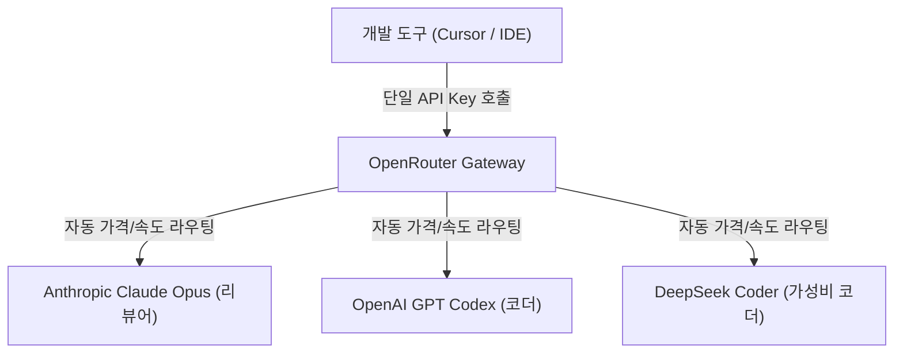

# 🚀 1주차 4일차: 책임감 있는 YOLO 모드와 다중 모델 협업 (Cross-Model Collaboration) 실습

안녕하세요! 여러분의 시니어 멘토입니다.

어제 우리는 다양한 AI IDE 도구들의 강점과 특성을 배웠습니다. 오늘은 AI 코딩의 날개를 달아줄 **YOLO 모드(자율 실행 모드)**의 책임감 있는 활용법을 배우고, **OpenRouter**를 연동하여 다양한 거대 언어 모델들을 자유롭게 스위칭하는 실습을 진행하겠습니다. 아울러 복잡한 요구사항을 해결하기 위한 **다중 모델 협업(Cross-Model Collaboration)** 아키텍처를 살펴보겠습니다.

---

## ☕ 1분 비유: 다중 모델 협업은 종합병원의 협진 시스템이다
환자(프로젝트)를 치료할 때 한 명의 의사가 모든 것을 담당하기보다는, 각 분야의 전문의들이 모여 협진을 할 때 치료 성공률이 올라갑니다.

```text
1. OpenRouter (원무과 및 환자 분류 시스템)
   - 접수처에서 환자의 상태에 따라 적합한 진료과(모델)로 초고속 라우팅해 줍니다.

2. GPT Codex / Claude Sonnet (수술실 전문의)
   - 메스를 들고 실제로 환부를 도려내고 꿰매는 실무 작업을 진행합니다. (코드 생성 및 버그 수정 최강자)

3. Claude Opus (진료 부장 / 과장)
   - 수술이 끝난 뒤 환자의 상태를 정밀 진단(코드 리뷰)하고, 놓친 부작용이나 추가 합병증 위험(보안 취약점, 리팩토링 요소)이 없는지 최종 승인합니다. (고도의 구조 분석 최강자)
```

---

## 🎯 Section 1: YOLO 모드와 에이전트 LLM 선택 전략

### 1. YOLO 모드(자율 실행 모드)란 무엇인가?
YOLO(You Only Live Once) 모드는 AI 에이전트가 코드를 수정하고, 터미널 명령어를 입력하고, 파일을 새로 빌드할 때 **사용자에게 일일이 승인 요청을 구하지 않고 백그라운드에서 직접 실행하는 모드**입니다.
- **장점**: 승인 팝업을 클릭하느라 끊기던 개발 흐름이 매끄러워져 개발 속도가 3배 이상 빨라집니다.
- **주의사항**: 무한 루프 버그가 발생하거나 잘못된 명령어가 자율 실행될 경우 프로젝트 전체가 꼬이거나 로컬 데이터가 삭제될 위험이 있습니다. 따라서 반드시 Git 커밋이 완료된 깨끗한 브랜치 상태에서 작동시키는 것이 철칙입니다.

### 2. YOLO 모드에 적합한 LLM
자율 실행 모드에서는 사소한 구문 에러가 루프 중단을 유발하므로, **명령어 규격을 정확히 준수하고 환각(Hallucination)이 극히 낮은 모델**을 골라야 합니다.
- **GPT Codex (GPT-5.2 기반)**: 높은 구문 정확도와 쉘 스크립트 실행 성공률을 보여 YOLO 모드에 매우 적합합니다.
- **Claude 3.5 Sonnet**: 자율 수정과 빌드 피드백을 수용하는 유연성이 가장 뛰어납니다.

---

## 🎯 Section 2: 바이브 코딩 성공을 위한 5대 원칙 (Be the Boss)

AI가 알아서 코드를 작성하더라도, 프로젝트의 주도권은 항상 **'개발자 본인'**에게 있어야 합니다. 이를 위한 5가지 황금 규칙입니다.

1. **Be the Boss (너가 보스다)**: AI 에이전트는 직무를 수행하는 주니어 개발자일 뿐입니다. 결과물의 설계 품질과 최종 동작 여부에 대한 책임은 전적으로 아키텍트인 여러분에게 있습니다.
2. **청사진을 먼저 그려라 (Plan First)**: 구현을 요청하기 전에 반드시 구조 계획서(`plan.md`)를 작성하게 하고, 이를 사람이 먼저 승인한 후 구현 단계로 넘어가야 합니다.
3. **점진적으로 일하라 (Work Incrementally)**: 한 번에 10가지 기능을 만들라고 지시하지 마세요. "카드 추가 기능 구현" -> "로컬 스토리지 연동" -> "스타일 다듬기" 등 단계를 쪼개고, 매 단계마다 Git 커밋을 남기세요.
4. **증거를 요구하라 (Demand Evidence)**: "다 만들었습니다"라는 에이전트의 말만 믿지 마세요. 테스트 코드를 돌리거나 콘솔 로그를 통해 작동 데이터를 눈으로 직접 확인(Evidence)해야 합니다.
5. **게으른 프롬프트를 버려라**: "알아서 다듬어줘" 같은 모호한 명령 대신, 구체적인 디자인 시안, 데이터 타입 정의서 등을 제시하여 오차를 줄이세요.

---

## 🎯 Section 3: OpenRouter를 활용한 다중 모델 라우팅 설정

OpenRouter(openrouter.ai)는 하나의 API 키로 OpenAI, Anthropic, Google, Meta, Mistral 등 전 세계 수백 개의 LLM을 호출할 수 있는 통합 API 게이트웨이 서비스입니다.



### ⚙️ OpenRouter 설정 및 비용 방어 방법
1. [OpenRouter](https://openrouter.ai)에 가입하고 API 키를 발급받습니다.
2. OpenRouter 계정 설정에서 **'Spend Limit(지출 한도)'**를 설정하여 하루 또는 한 달 최대 비용(예: $5)을 하드 캡핑합니다. 에이전트가 무한 루프를 돌아 API를 과다 호출해도 비용 폭탄을 완벽히 방지할 수 있습니다.
3. Cursor 또는 IDE의 LLM Provider 설정에서 OpenRouter 엔드포인트(`https://openrouter.ai/api/v1`)와 발급받은 API 키를 등록합니다.

---

## 🎯 Section 4: [실습] Next.js 포트폴리오 웹사이트 & AI 디지털 트윈 챗봇

### 1단계: Next.js 사이트 스케폴딩 생성 (YOLO 모드)
Cursor에서 빈 폴더를 열고 YOLO 모드를 켠 채로 다음 명령어를 실행하도록 에이전트에 지시합니다.
```bash
npx -y create-next-app@latest ./ --typescript --tailwind --app --src-dir --import-alias "@/*"
```
에이전트가 옵션들을 자동으로 선택하며 빈 Next.js 프로젝트를 구축합니다.

### 2단계: AI 디지털 트윈(Digital Twin) 챗봇 연동
나를 대신해 답변해 주는 디지털 트윈 챗봇 API 라우트를 개설합니다.
- `src/app/api/chat/route.ts` 파일을 생성하고 OpenRouter API를 연동합니다.
- 시스템 프롬프트(System Prompt)에 나의 성향, 사용하는 어조, 경력 사항을 주입하여 에이전트가 나와 똑같이 대답하도록 훈련시킵니다.

```typescript
// 예시: src/app/api/chat/route.ts
// 1. OpenRouter를 통해 나를 복제한 디지털 트윈 챗봇 구현
import { NextResponse } from 'next/server';

export async function POST(request: Request) {
  const { messages } = await request.json();
  
  const response = await fetch("https://openrouter.ai/api/v1/chat/completions", {
    method: "POST",
    headers: {
      "Authorization": `Bearer ${process.env.OPENROUTER_API_KEY}`,
      "Content-Type": "application/json"
    },
    body: JSON.stringify({
      model: "google/gemini-2.5-pro", // 나를 모사하기에 적절한 추론 모델 선택
      messages: [
        {
          role: "system",
          content: "당신은 소프트웨어 아키텍트 홍길동의 디지털 트윈(분신)입니다. 진중하고 시니어다운 말투로 기술적인 답변을 해주세요."
        },
        ...messages
      ]
    })
  });
  
  const data = await response.json();
  return NextResponse.json(data.choices[0].message);
}
```

---

## 🎯 Section 5: 다중 모델 협업(Cross-Model Collaboration)과 코드 리뷰

코딩 도구 내에서 하나의 모델만 계속 쓰는 것보다 상황에 따라 모델을 바꾸는 기술이 고수의 기술입니다.
- **코딩 시점**: **GPT Codex / Claude Sonnet**을 탑재하여 빠르게 코드를 작성하고 기능을 밀어붙입니다.
- **검증 및 리팩토링 시점**: 작성이 완료되면 모델을 **Claude Opus**로 전환하고 다음과 같이 요청합니다.
  > "방금 작성된 `src/app/api/chat/route.ts` 파일의 예외 처리 로직과 보안 취약점(API Key 유출 가능성 등)을 정밀 리뷰해 줘. 그리고 리팩토링할 대상 리스트를 뽑아줘."
- **효과**: 코딩 모델이 놓친 널 포인터(Null Pointer) 예외나 파일 누수(Resource Leak) 버그를 Opus의 초고성능 추론 능력을 통해 이중 필터링하여 고품질 코드를 배포할 수 있습니다.

---

## 🏗️ 아키텍트의 의사결정 노트 (ADR - Architectural Decision Record)

### 결정사항: 단일 API 직접 결제 대신 OpenRouter 게이트웨이 아키텍처 채택
- **배경**: AI 에이전트 프로젝트가 성장함에 따라 OpenAI, Anthropic, Google의 여러 모델을 유연하게 교체해 가며 개발해야 합니다. 이때 각 서비스사마다 결제 정보를 따로 입력하고 API 크레딧을 별도로 관리하는 것은 운영 리소스 낭비입니다.
- **대안 비교**: 
  - *대안 A*: OpenAI / Anthropic 개별 개발자 포털 결제 연동.
  - *대안 B*: OpenRouter 단일 플랫폼 결제 및 API 키 발급.
- **의사결정 이유**: OpenRouter를 사용하면 결제 통합 관리뿐 아니라, **특정 모델 서버가 다운되었을 때 자동으로 호환 모델로 실시간 스위칭(Fallback)**해 주는 라우팅 정책을 아키텍처 레벨에서 손쉽게 구현할 수 있어 개발의 지속성이 확보됩니다.

---

## 🎯 시니어 멘토의 오늘의 브리핑 (Micro-Lecture)

- **핵심 요약**: YOLO 모드는 강력한 고속도로 주행 장치이지만, 브레이크 장치(Git 커밋 및 비용 한도 관리) 없이 가속 페달만 밟으면 대형 사고로 이어집니다. 또한, 다양한 LLM들의 장단점을 파악하고 적재적소에 스위칭하는 '다중 모델 협업' 감각을 키워야 진정한 에이전틱 엔지니어로 성장할 수 있습니다.
- **도전 과제**: 오늘 Next.js 디지털 트윈 챗봇 코드를 완성한 후, 모델을 **Claude Opus**로 변경해 전체 코드 리뷰를 요청하고, 지적받은 개선 사항 중 한 가지를 적용해 보세요!

---
> 🔙 **[3일차 교재 읽기](./Day3_IDE_도구_비교와_첫_앱_개발.md)** | **[5일차 교재 읽기](./Day5_상용_MVP_개발과_웹_아키텍처.md)**
