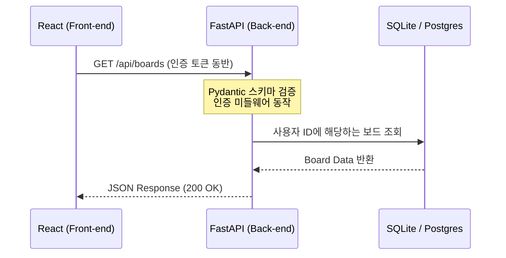

# 🚀 1주차 5일차: 풀스택 상용 MVP 아키텍처와 컨텍스트 리셋 디버깅 기법

안녕하세요! 시니어 멘토입니다.

1주차의 마지막 날인 오늘은 가볍게 게임이나 장난감을 만드는 수준을 넘어, **실제 상업적 가치가 있는 상용 MVP(최소 기능 제품)를 풀스택으로 빌드**하고 배포 환경까지 설정해 보겠습니다. 아울러 안드레이 카파시가 경고한 AI 코딩의 함정을 파헤치고, 복잡한 시스템 개발 중 에이전트가 꼬였을 때 해결하는 핵심 디버깅 기법인 **'컨텍스트 리셋(Context Reset)'**을 학습하며 1주차를 마크하겠습니다.

---

## ☕ 1분 비유: 풀스택과 Docker는 표준 컨테이너 식당이다
식당(어플리케이션)을 차릴 때, 주방(Back-end), 홀(Front-end), 창고(Database), 그리고 이 모든 것을 담아 언제든 다른 도시로 이동할 수 있게 만든 푸드트럭(Docker) 구조로 비유할 수 있습니다.

```text
1. React 프론트엔드 (홀 인테리어)
   - 손님이 직접 보고 만지는 메뉴판, 테이블, 벨입니다. (화면 UI 및 입력)

2. FastAPI 백엔드 (서빙 웨이터)
   - 손님의 주문을 받아 주방에 전달하고, 음식이 나오면 손님에게 가져다줍니다. (API 통신 및 비즈니스 로직)

3. PostgreSQL/SQLite 데이터베이스 (식재료 창고)
   - 회원 정보와 칸반 카드 데이터를 안전하게 저장하는 곳입니다.

4. Docker (표준 푸드트럭)
   - 주방, 홀, 창고의 모든 장비와 전기 배선(OS, 라이브러리 설정)을 푸드트럭 하나에 그대로 패키징합니다. 이 트럭은 서울(내 컴퓨터)이든, 부산(클라우드 AWS 서버)이든 시동만 걸면 즉시 동일하게 작동합니다. (가상화 격리)
```

---

## 🎯 Section 1: 카파시의 '슬롭 아포칼립스(Slop Apocalypse)'와 상용 MVP 개발 5대 규칙

안드레이 카파시는 AI 코딩 에이전트가 급격히 발전함에 따라 다음과 같은 심각한 부작용을 경고했습니다.
- **실력 퇴화 (Skill Atrophy)**: 개발자가 코드를 직접 깊이 고민하지 않고 AI가 주는 코드를 수락하기만 하면서 논리적 사고력이 점차 저하되는 현상.
- **슬롭 아포칼립스 (Slop Apocalypse)**: 에이전트가 생각 없이 마구 양산해 낸 동작은 하지만 아무도 유지보수할 수 없는 쓰레기 코드(Slop Code)의 대홍수.

### 💡 상용 MVP 개발을 위한 5대 아키텍처 규칙
이 함정에서 벗어나 상용화 가능한 MVP를 구축하기 위해 우리는 아래 규칙을 반드시 준수해야 합니다.
1. **타입 안전성(Type Safety) 확보**: 백엔드와 프론트엔드 간의 데이터 교환 시 Pydantic이나 TypeScript 등을 활용해 데이터 규격을 명확히 검증합니다.
2. **독립된 설정 파일 분리**: API 키, DB 패스워드 등 민감한 설정은 소스코드에 하드코딩하지 않고 `.env` 파일로 격리합니다.
3. **도커화(Dockerization)**: 로컬 개발 환경과 배포 환경이 백분의 일의 오차도 없이 일치하도록 컨테이너 기반으로 구조를 짭니다.
4. **Git 체크포인트 생활화**: 작은 기능 단위로 커밋을 세분화하여, 에이전트가 꼬였을 때 즉시 안전한 과거 시점으로 복구할 수 있게 합니다.
5. **설계 문서의 최신화**: 구현 전 `plan.md`를 갱신하고 에이전트가 이를 엄격히 따르도록 지시합니다.

---

## 🎯 Section 2: 3-Tier 풀스택 아키텍처 (FastAPI + React) 구성

상용 MVP를 만들기 위해 2026년 가장 높은 생산성을 보장하는 **FastAPI(Python)**와 **React(JavaScript)** 조합을 채택합니다.



- **FastAPI의 강점**: 비동기 처리가 매우 빠르며, 코드 작성 시 타입 힌트를 기반으로 API 문서(OpenAPI/Swagger)가 자동 생성되므로 AI 에이전트가 이를 읽고 프론트엔드 연동 코드를 짤 때 오차가 거의 없습니다.
- **Docker 가상화**: `Dockerfile`과 `docker-compose.yml`을 설정하여 한 번의 명령(`docker-compose up --build`)으로 데이터베이스, 백엔드 서버, 프론트엔드 앱이 완벽하게 가동되도록 묶어줍니다.

---

## 🎯 Section 3: [실습] Docker 기반 풀스택 칸반 앱 빌드

실제로 아래 폴더 구조를 에이전트와 함께 구축합니다.
```text
/kanban-app
  ├── backend/
  │    ├── main.py (FastAPI 엔트리포인트)
  │    ├── database.py (SQLAlchemy DB 연동)
  │    ├── models.py (DB 테이블 정의)
  │    ├── schemas.py (Pydantic 스키마)
  │    └── Dockerfile
  ├── frontend/
  │    ├── src/ (React 컴포넌트)
  │    └── Dockerfile
  └── docker-compose.yml
```

### ⚙️ 핵심 DB 스키마 설계
단순한 텍스트 임시 저장이 아닌, 관계형 데이터베이스(RDBMS) 설계를 적용하여 사용자(User)별 보드(Board)와 카드(Card) 정보가 안전하게 영속성(Persistence)을 갖도록 합니다.

---

## 🎯 Section 4: 에이전트 디버깅의 정수 - 컨텍스트 리셋과 `plan.md`

### 1. Codex 에이전트 루프 실패 현상 (Codex Loop Failure)
칸반 보드의 핵심인 **드래그 앤 드롭(Drag & Drop) 연동**을 구현하다 보면, 프론트엔드 상태값과 백엔드 DB 간의 동기화 버그가 자주 일어납니다. 이때 에이전트에게 수정을 계속 지시하면, 에이전트가 이전에 시도했던 잘못된 코드 스니펫과 에러 로그들로 대화창(Context Window)을 가득 채워, 결국 **스스로 짠 정상 코드마저 덮어쓰고 망가뜨리는 늪(Loop)에 빠지게 됩니다.**

### 2. 컨텍스트 리셋(Context Reset) 솔루션
에이전트가 갈팡질팡할 때는 주저 없이 아래의 **컨텍스트 리셋 요령**을 발휘해야 합니다.

```text
[컨텍스트 리셋 및 복구 절차]
1. 작동하지 않는 불필요한 테스트 코드와 에러가 난 파일들을 깨끗하게 정리합니다.
2. 현재까지 성공한 부분만 Git Commit을 남겨 코드의 베이스라인을 안전하게 잠급니다.
3. 진행 중인 AI 대화 세션(Chat Window)을 완전히 종료하고, '새로운 채팅방(New Chat)'을 개설합니다.
4. 루트의 'plan.md' 파일에 현재 구현된 스펙과 바로 다음에 구현해야 할 타겟 작업 한 가지만 명확히 작성합니다.
5. 에이전트에게 'plan.md'와 현재 작업할 파일만 로드하게 한 후 새롭게 지시를 시작합니다.
```

이렇게 하면 AI의 책상(Context Window)이 리프레시되어, 과거의 에러 패턴에 얽매이지 않고 기적적으로 깔끔한 정답 코드를 한 번에 도출해 냅니다.

---

## 🎯 Section 5: AI 비서 기능 탑재 및 1주차 마무리

### 1. OpenRouter 실시간 연동
마지막 단계로, 칸반 보드 내부에 AI 어시스턴트 채팅창을 만들어 OpenRouter 실시간 API와 연동합니다. 사용자가 칸반 카드들을 보고 **"내 할 일 카드 중에서 시급한 작업 순서대로 3가지만 요약해줘"**라고 물으면, 백엔드의 DB 정보를 API로 스캔하여 AI 비서가 완벽히 답변하도록 인터프리터를 조율합니다.

### 2. 1주차 최종 회고와 2주차로의 다리
- **1주차 (Vibe Coding)**: 우리는 주로 Cursor와 같은 마우스 클릭과 IDE가 결합된 시각적인 환경에서 AI를 승인(Accept)해 가며 코딩을 경험했습니다.
- **2주차 (Vibe Engineering)**: 2주차부터는 차원이 달라집니다. 마우스를 내려놓고 터미널 창에서 직접 쉘 명령어를 가동하고 자율적으로 프로젝트 폴더 전체를 뒤엎으며 일하는 최고성능 CLI 에이전트인 **Claude Code**의 세계로 들어섭니다.

---

## 🏗️ 아키텍트의 의사결정 노트 (ADR - Architectural Decision Record)

### 결정사항: MVP 데이터베이스 저장방식 - JSON 파일 저장 vs SQLite RDBMS 설계
- **배경**: MVP 단계에서 칸반 보드의 데이터를 가장 빠르고 간단하게 저장하는 방법은 JSON 파일 하나에 데이터를 쓰는 것입니다. 하지만 상용 MVP로의 확장을 감안해야 합니다.
- **대안 비교**: 
  - *대안 A*: `data.json` 파일에 쓰기/읽기 수행. (설계가 쉽고 환경 구축이 매우 빠름. 그러나 다중 사용자 접속 시 파일 락 충돌 및 데이터 오염 위험이 매우 큼).
  - *대안 B*: SQLAlchemy ORM 기반의 SQLite/PostgreSQL 연동. (초기 엔티티 매핑 설정이 필요하나, 향후 로그인 기능 추가 및 복수 사용자 보드 격리가 매우 용이함).
- **의사결정 이유**: 아키텍처의 지속 가능성 원칙에 따라, AI 에이전트에게 **SQLAlchemy ORM을 활용한 SQLite DB 스키마 설계**를 시키는 것이 향후 프로덕션 서비스(AWS/Supabase 이전)로 마이그레이션할 때 코드 한 줄 변경만으로 대응할 수 있어 장기적으로 큰 기술적 비용을 아끼는 설계입니다.

---

## 🎯 시니어 멘토의 오늘의 브리핑 (Micro-Lecture)

- **핵심 요약**: AI가 작성한 코드가 복잡해져 디버깅 루프에 빠진다면, 그것은 에이전트의 잘못이 아닌 컨텍스트(Context) 청소를 게을리한 여러분의 탓입니다. 대화창을 비우고 Git으로 백업한 뒤 `plan.md`로 중심을 잡는 것, 이것이 실리콘밸리 시니어 아키텍트들이 AI와 협업하는 진정한 노하우입니다.
- **도전 과제**: 오늘 빌드한 FastAPI 백엔드의 Swagger 문서 페이지(`/docs`)에 접속하여 AI가 작성한 API 명세서가 잘 나오는지 확인해 보고, 프론트엔드와 백엔드를 연동해 보세요!

---
> 🔙 **[4일차 교재 읽기](./Day4_YOLO_모드와_외부_API_연동.md)** | 🚀 **[2주차 1일차 교재 읽기](../2주차_Vibe_Engineering/Day1_클로드_코드_소개와_CLI_개발_에이전트.md)**
