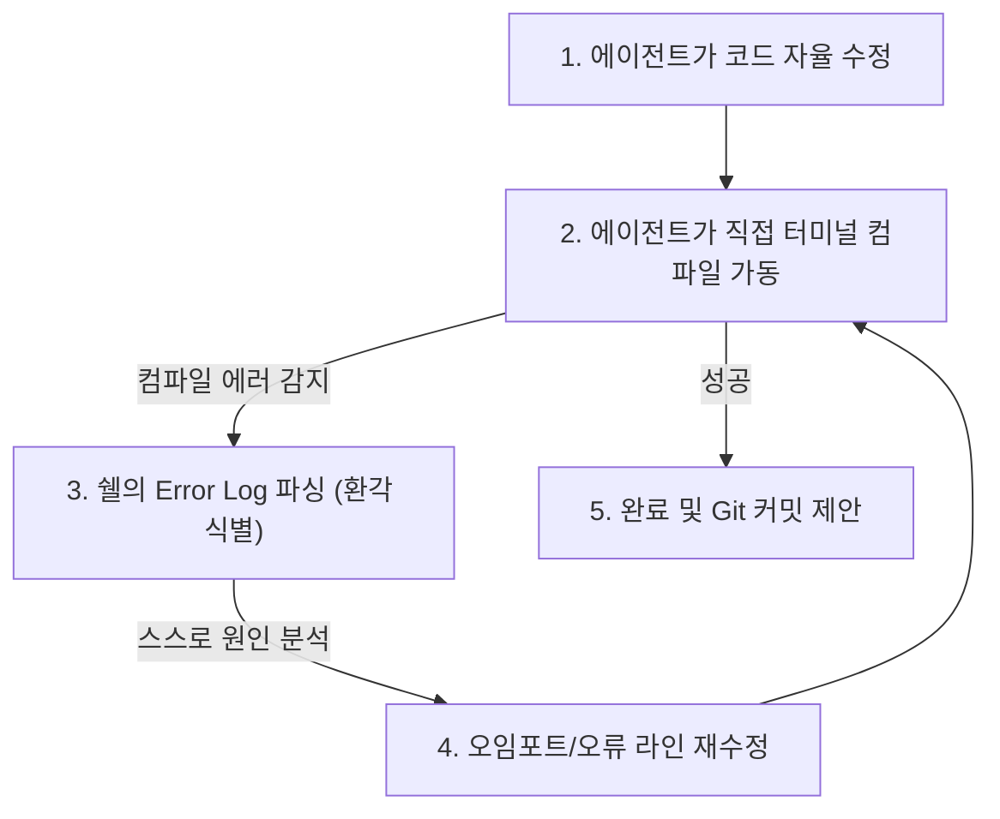

# 🚀 2주차 1일차: 클로드 코드(Claude Code)와 터미널 기반 CLI 에이전트의 시대

안녕하세요! 시니어 멘토입니다.

1주차 과정 동안 여러분은 Cursor와 같은 그래픽 IDE 도구를 사용하여 프롬프트를 입력하고 웹 애플리케이션을 완성해 보았습니다. 참 흥미로운 경험이었을 것입니다.

2주차인 **Pro Week**부터는 캐주얼한 '바이브 코딩'을 넘어, 보다 엄격하고 고성능인 **'바이브 엔지니어링(Vibe Engineering)'**의 영역으로 진입합니다. 그 첫걸음으로, 2026년 소프트웨어 업계에 가장 큰 충격을 던진 터미널 기반 자율 AI 에이전트 **'클로드 코드(Claude Code)'**의 아키텍처와 설치 방법, 그리고 오픈소스 대안 도구들을 상세히 비교 분석해 보겠습니다.

---

## ☕ 1분 비유: CLI 에이전트는 눈을 가린 채 명령어를 외치는 비서가 아니라 직접 컴퓨터를 조작하는 해커다
기존의 IDE 채팅창 AI와 CLI 자율 에이전트의 차이는 다음과 같습니다.

```text
- 기존 IDE AI (비서)
  "부장님, 코드는 다 작성했습니다. 복사해서 사용하세요. 터미널 명령어도 적어드릴 테니 복사해서 쉘에 직접 입력하고 엔터를 눌러주세요."

- CLI 에이전트 (Claude Code - 파트너 개발자)
  (터미널 창을 열자마자) "코드 분석 끝났습니다. 테스트 패키지가 누락되어 있으니 제가 직접 'npm install'을 실행하겠습니다. 아, 에러가 나네요? 코드 12번 줄의 오타를 직접 수정하고 다시 테스트를 돌려보겠습니다. 빌드 성공했습니다!"
```

- **터미널 실행권한(Shell Execution)**: AI 에이전트가 로컬 쉘의 권한을 얻어 직접 리눅스 명령어를 입력하고 수행 결과를 읽어들입니다.
- **자율 디버깅(Self-Correction)**: 사람이 컴파일 오류를 보고 알려줄 필요 없이, 에이전트가 직접 컴파일하고 에러 출력을 분석해 코드를 고칩니다.

---

## 🎯 Section 1: 클로드 코드(Claude Code)의 등장 배경과 아키텍처

### 1. Claude Code란 무엇인가?
Anthropic사가 개발한 **Claude Code**는 기존의 웹 채팅창이나 IDE 사이드바 형태를 탈피하여, 개발자의 **터미널(Terminal/CLI)에서 백그라운드 프로세스로 동작하는 자율형 코딩 에이전트**입니다.

### 2. 왜 IDE가 아닌 CLI(명령줄 인터페이스)인가?
- **컨텍스트 미니멀리즘**: IDE처럼 무거운 웹뷰나 그래픽 인터페이스를 렌더링하지 않고 오직 텍스트 커맨드와 파일 입출력(I/O)에만 집중하므로 극도로 민감하고 빠른 피드백이 가능합니다.
- **직접적 도구 조작**: CLI 환경에서 에이전트는 `git`, `npm`, `pytest`, `docker` 등 로컬 머신의 모든 개발 도구를 직접 쉘 명령어로 호출해 결과를 파악합니다. 즉, 인간이 하는 행동을 100% 모사할 수 있습니다.

---

## 🎯 Section 2: Claude Code 설치 및 초기 실행 가이드

### 1. 설치 및 인증 환경 구축
Claude Code는 Node.js 환경에서 작동하는 CLI 패키지입니다. 
```bash
# 1. 글로벌 패키지로 설치
npm install -g @anthropic-ai/claude-code

# 2. 프로젝트 디렉토리로 이동하여 초기화
cd /path/to/project
claude init
```
`claude init`을 실행하면 로컬 Anthropic 계정 로그인을 안내하는 웹 링크가 표시되며, 웹 브라우저 인증을 완료하면 로컬 쉘과 에이전트가 연결됩니다.

### 2. 기본 조작법 및 컨텍스트 스캔
터미널에 `claude`를 입력하면 자율 프롬프트 환경이 켜집니다.
- **`/init`**: 프로젝트 전반의 파일들을 스캔해 인덱싱 빌드를 수행합니다.
- **`/test`**: 프로젝트 내 테스트 명령어를 자동 검색해 검증을 가동합니다.
- **`/search`**: Ripgrep 기반의 고속 코드 검색을 AI가 직접 수행합니다.

---

## 🎯 Section 3: 에이전트의 환각(Hallucination) 대처 및 코드 리팩토링

자율 코딩 CLI는 파일 수정 범위가 크기 때문에 에이전트가 존재하지 않는 가상의 모듈을 임포트하는 **'환각 현상'**이 일어나면 큰 오류가 전파될 수 있습니다.



- **해결책**: Claude Code는 환각이 발생하더라도 멈추지 않고 스스로 에러 로그를 읽고 재작성하는 자정 작용(Self-Correction) 능력이 탑재되어 있습니다. 개발자는 터미널에 흘러가는 변경점(Diff)을 주시하며, 비정상적인 구조로 수정이 가해지면 즉시 `Ctrl + C`를 눌러 에이전트의 동작을 강제 중단(Abort)시켜야 합니다.

---

## 🎯 Section 4: 오픈소스 대안 기술 비교: OpenCode & AMP Code

Claude Code는 매우 편리하지만 Anthropic의 최고 사양 모델을 터미널에서 지속적으로 호출하기 때문에 API 비용이 급증할 수 있습니다. 이를 대비한 최신 2026 대안 도구들을 비교해 봅니다.

### 1. OpenCode (GLM-4.7 등 오픈 모델 연동)
- **개념**: 완전 오픈소스 CLI 에이전트 프레임워크.
- **특징**: Anthropic API 대신, 로컬에 띄운 Ollama나 OpenRouter를 통해 무료/오픈소스 모델(예: Llama-3, GLM-4.7)을 연결하여 Claude Code와 유사한 터미널 에이전트 환경을 구축할 수 있습니다. 
- **가격**: API 사용료가 완전 무료이거나 극도로 저렴합니다.

### 2. AMP Code
- **개념**: OpenRouter와 Ollama 인프라를 활용하여 다중 백엔드 모델을 가동하는 멀티 모델 CLI 코딩 도구.
- **특징**: 터미널 환경뿐 아니라 VS Code, Cursor, Windsurf의 플러그인까지 교차 지원하며, **AMP Free 요금제 활용 시 일일 $10 상당의 프론티어 모델 크레딧을 광고 시청 조건으로 제공**하여 현업 개발자들 사이에서 큰 화제를 모았습니다.

---

## 🏗️ 아키텍트의 의사결정 노트 (ADR - Architectural Decision Record)

### 결정사항: 자율형 CLI 코딩 도구 도입 - Claude Code vs AMP Code
- **배경**: 개발 조직 전체에 터미널 기반 자율 AI 코딩 도구를 도입하여 기술 부채 해결 및 테스트 자동화를 꾀하고자 합니다. 비용과 결제 관리의 최적화가 요구됩니다.
- **대안 비교**: 
  - *대안 A (Claude Code)*: 단일 모델(Claude 3.5 Sonnet)에 고도로 튜닝되어 오작동률이 가장 낮으나, Anthropic 독점 결제로 비용 유연성이 떨어짐.
  - *대안 B (AMP Code)*: OpenRouter를 경유해 Llama 3.1, DeepSeek Coder, GPT-5 등 다양한 가성비 오픈소스 모델을 필요에 따라 전환해 가며 쓸 수 있고, 일일 무료 크레딧을 활용해 개발 비용을 극적으로 낮출 수 있음.
- **의사결정 이유**: 기업 실무 프로덕션 개발에는 코드 품질 보증이 최우선이므로 오작동률이 가장 적은 **Claude Code**를 메인 도구로 채택합니다. 다만, 개인 토이 프로젝트 및 예산이 극도로 제한된 테스트 단계에서는 **AMP Code**를 활용해 다중 모델 비용 효율성을 취하는 하이브리드 아키텍처 가이드라인을 수립합니다.

---

## 🎯 시니어 멘토의 오늘의 브리핑 (Micro-Lecture)

- **핵심 요약**: 1주차의 그래픽 인터페이스를 벗어나 터미널 CLI로 들어온 순간, AI 에이전트는 비로소 온전한 개발 도구의 자유를 얻게 되었습니다. Claude Code는 스스로 코드를 수정하고 에러 로그를 검증하는 루프를 돕니다. 이제 우리는 단순한 코더가 아닌, 이 자율 에이전트의 권한과 방향성을 조율하는 '감리자(Reviewer)'의 시선으로 코드를 대해야 합니다.
- **도전 과제**: 로컬 컴퓨터에 Node.js 환경이 준비되어 있다면 터미널에 `npm install -g @anthropic-ai/claude-code`를 입력하여 설치를 시도해 보고, `/help` 명령어를 쳐서 에이전트가 어떤 명령어 도구를 지원하는지 리스트를 확인해 보세요.

---
> 🔙 **[1주차 5일차 교재 읽기](../1주차_Vibe_Coding/Day5_상용_MVP_개발과_웹_아키텍처.md)** | **[2일차 교재 읽기](./Day2_체크포인트와_자율_반복_루프.md)**
