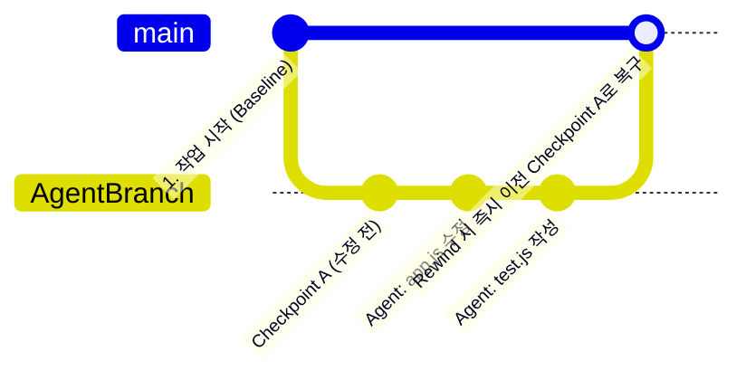
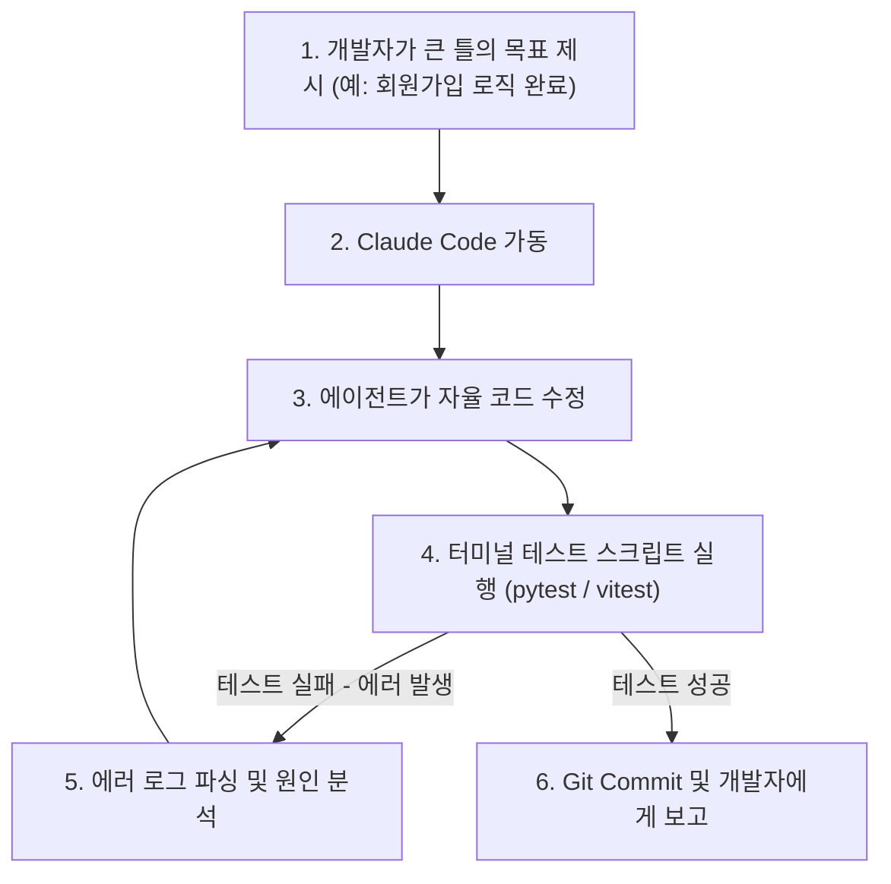

# 🚀 2주차 2일차: 자율주행 코딩을 위한 체크포인트(Checkpoints)와 랄프 루프(Ralph Loops)

안녕하세요! 여러분의 시니어 멘토입니다.

어제 우리는 터미널 기반 코딩 에이전트인 Claude Code를 최초로 연동하고 구조를 살펴봤습니다. 자율적으로 명령을 수행하는 AI 비서를 보니 든든하시겠지만, 한편으로는 **"이 녀석이 내 코드를 엉망으로 고쳐놓거나 전부 날려버리면 어쩌지?"** 혹은 **"자리를 비운 사이에 자율적으로 에러를 고치며 돌아가게 만드는 방법은 없을까?"** 하는 불안감과 기대가 동시에 생기셨을 겁니다.

오늘은 자율형 에이전트 개발의 가장 강력한 안전장치인 **체크포인트(Checkpoints)** 시스템과, 밤사이에 알아서 코드를 완성하는 **랄프 루프(Ralph Loops)**의 실무 아키텍처를 학습하겠습니다.

---

## ☕ 1분 비유: 체크포인트는 게임의 '보스전 직전 퀵세이브'이고, 랄프 루프는 '자율 청소기'다
위험한 코딩 에이전트를 다룰 때 아래 두 가지 비유를 기억하세요.

```text
1. 체크포인트 (Checkpoint & Rewind)
   - 액션 RPG 게임에서 무시무시한 보스를 잡으러 가기 전에 'F5' 키를 눌러 세이브를 해두는 것과 같습니다. 에이전트가 코드를 엉망진창으로 꼬아놓으면, 스트레스받지 않고 세이브를 로드하듯 '되감기(Rewind)' 단 한 번으로 코드를 온전히 복구합니다.

2. 랄프 루프 (Ralph Loops - 자율 로봇 청소기)
   - 로봇 청소기를 켜두면 온 집안의 먼지를 흡입하다가 문턱에 걸리거나 가구에 부딪칩니다. 청소기는 멈추지 않고 스스로 바퀴 각도를 조절하고 뒤로 갔다 앞으로 가기를 반복(Feedback Loop)하며 방 전체를 깨끗하게 청소해 냅니다. 개발자는 그저 청소기가 일하는 동안 커피를 마시면 됩니다.
```

---

## 🎯 Section 1: 클로드 코드(Claude Code)의 세션 관리와 단축키

Claude Code는 터미널 컨텍스트를 실시간으로 압축하고 제어하기 위해 여러 유틸리티 명령어를 제공합니다.

- **`/compact`**: 대화가 길어지면 에이전트가 기억하는 과거 토큰 양이 많아져 비용이 올라가고 반응이 느려집니다. `/compact` 명령은 현재까지 완료된 코드 수정 상태의 핵심 맥락만 추출하여 대화 기록을 깔끔하게 요약·압축합니다. (토큰 절약 필수 기술)
- **`/undo`**: 에이전트가 방금 수행한 파일 변경 사항과 터미널 작업을 바로 직전 상태로 즉각 되돌립니다.
- **`/history`**: 현재 대화 세션에서 가동된 도구(Tool Call) 실행 내역을 한눈에 조회합니다.
- **설정 변경 (`.claudecode.json`)**: 프로젝트 루트에 설정 파일을 두어 기본 모델 유형, 허용할 명령어 블랙리스트, 토큰 사용 제한 한도 등을 제어할 수 있습니다.

---

## 🎯 Section 2: 자율 코딩의 안전벨트 - 체크포인트(Checkpoints)와 Git

에이전트가 내 코드를 수정할 때 가장 중요한 것은 **원자적 변경(Atomic Change)의 관리**입니다. Claude Code는 내부적으로 Git 파일 트리를 상시 감시하여 독자적인 **체크포인트** 체계를 생성합니다.



- **동작 원리**: 에이전트가 특정 수정 업무를 시작하기 전에 시스템은 `.git` 메모리에 임시 체크포인트를 자동으로 생성합니다.
- **되감기(Rewind)**: 에이전트가 빌드를 깨뜨리고 미로에 빠져 더 이상 코드를 정상화하지 못할 때, 개발자는 터미널에 `/undo` 또는 `git reset --hard` 관련 복구 프롬프트를 내려 즉각 수정 전의 체크포인트 시점으로 리와인드할 수 있습니다. 이를 통해 과감한 YOLO 자율 코딩 시도가 가능해집니다.

---

## 🎯 Section 3: 무승인 자율 코딩 - YOLO 모드 설정

기본적으로 Claude Code는 파일을 고치거나 패키지를 설치할 때마다 사용자에게 `[y/N]` 승인을 요구합니다. 그러나 대규모 수정 시에는 이 방식이 비효율적입니다.

### ⚙️ YOLO 모드 가동법
```bash
# 사용자 승인 단계를 완전히 건너뛰고 에이전트가 자율적으로 판단하여 터미널과 파일을 제어함
claude --yolo
```

> [!WARNING]
> **YOLO 모드의 최소한의 방어벽(Guardrails)**
> 1. 중요 디렉토리 격리: 프로덕션 서버 환경이나 로컬의 소중한 개인 문서 폴더가 에이전트의 작업 범위에 들어가지 않도록 프로젝트 폴더 바깥의 접근을 차단합니다.
> 2. `git status` 확인: 항상 `git status`가 완전히 깨끗하고(Clean) 다른 모든 코드들이 커밋되어 있을 때만 실행하십시오. 언제든 hard reset으로 복구할 수 있는 대피소를 확보하는 것입니다.

---

## 🎯 Section 4: Geoffrey Huntley의 '랄프 루프(Ralph Loops)' 자율 반복 최적화

랄프 루프(Ralph Loops)는 **개발자가 자리를 비운 사이 AI 에이전트가 자율적으로 코드 작성 -> 빌드 -> 테스트 검증 -> 디버깅 -> 코드 작성을 반복하도록 스크립팅하는 기법**입니다.



### 랄프 루프의 강점
사람이 지켜보며 "이 부분 틀렸어, 고쳐봐"라고 개입(Micro-management)하면, 오히려 AI에게 주는 컨텍스트 정보가 오염되거나 개발자의 감정이 소모됩니다. 
반면 에이전트에게 **"이 폴더에 있는 모든 테스트가 통과(Pass)할 때까지 필요한 모든 코드를 고치고 테스트를 반복해"**라고 랄프 루프를 주입해 놓으면, 에이전트는 기계적인 에러 출력을 양분 삼아 오차 없는 논리 구조를 밤새 자율적으로 완결해 냅니다.

---

## 🏗️ 아키텍트의 의사결정 노트 (ADR - Architectural Decision Record)

### 결정사항: 자율형 에이전트 복구 전략 - 에이전트 자체 /undo vs Git Branch 격리
- **배경**: 자율 코딩 에이전트가 대규모 리팩토링 중 실패했을 때 프로젝트 전체가 붕괴되는 현상을 아키텍처 레벨에서 차단해야 합니다.
- **대안 비교**: 
  - *대안 A (에이전트 내장 /undo)*: 명령어가 간편하고 빠르지만, 내부 캐시가 날아가거나 세션이 비정상 종료되면 복구 시점을 잃어버릴 우려가 있음.
  - *대안 B (Git Branch + Stash 강제 규격화)*: 에이전트를 띄우기 전 반드시 `feat/agent-work`와 같은 임시 브랜치를 자동으로 파서 에이전트가 작업하게 하고, 작업이 실패하면 브랜치를 삭제(Drop)하는 스크립트를 적용함.
- **의사결정 이유**: 안전성 최우선 원칙에 따라, **대안 B(Git Branch 기반 물리 격리)**를 표준 파이프라인으로 채택합니다. 에이전트의 오작동은 로컬 파일 파괴로 이어질 수 있으므로, 툴 자체의 캐시 기능인 `/undo`에 의존하기보다 버전 관리 시스템(VCS)인 Git의 엄격한 브랜치 생명주기로 감싸는 것이 훨씬 더 강력한 기술 부채 방어책입니다.

---

## 🎯 시니어 멘토의 오늘의 브리핑 (Micro-Lecture)

- **핵심 요약**: 랄프 루프와 체크포인트는 AI 코딩 에이전트의 생산성을 무한대로 늘려주는 기폭제입니다. AI가 실수를 저질렀을 때 비난하거나 화를 내는 대신, 즉시 롤백할 수 있는 체크포인트를 확보하고, AI 스스로 깨지고 배우는 자율 반복 디버깅 환경을 다듬어 주는 것이 미래의 수석 아키텍트가 가져야 할 진정한 소양입니다.
- **도전 과제**: 여러분의 프로젝트 폴더에서 일부러 JS 코드의 중괄호 하나를 지워 에러를 낸 뒤, Claude Code에게 **"현재 폴더의 빌드 에러를 검사해서 성공할 때까지 고치고 검증해"**라고 지시해 보고, 에이전트가 어떻게 에러를 읽고 자율 해결하는지 눈으로 확인해 보세요.

---
> 🔙 **[1일차 교재 읽기](./Day1_클로드_코드_소개와_CLI_개발_에이전트.md)** | **[3일차 교재 읽기](./Day3_MCP_스킬_플러그인_비교.md)**
