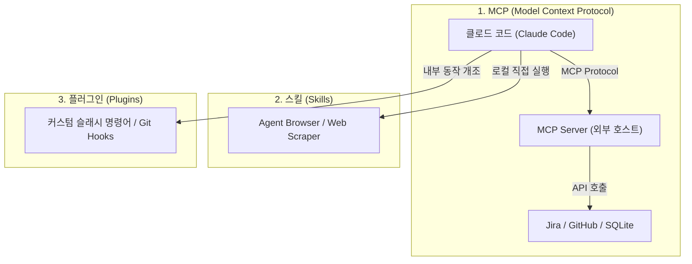

# 🚀 2주차 3일차: 외부 도구 연결을 위한 3대 기둥 - MCP, 스킬(Skills), 플러그인(Plugins)

안녕하세요! 시니어 멘토입니다.

어제 우리는 에이전트가 오작동했을 때 코드를 안전하게 복구하는 체크포인트 기법과 스스로 수정 루프를 도는 랄프 루프를 학습했습니다. 하지만 에이전트가 내 컴퓨터 내부 파일만 만질 수 있다면 활용도가 제한적입니다. AI 비서가 Jira 티켓을 조회하고, GitHub에 PR을 날리고, 실시간 주식 정보를 조회하거나 웹 서칭을 하려면 **'외부 세계와 연결하는 통로'**가 필요합니다.

오늘은 Claude Code의 능력을 무한히 확장해 주는 3대 핵심 빌딩 블록인 **MCP, 스킬(Skills), 플러그인(Plugins)**의 작동 메커니즘을 상세히 비교 학습하겠습니다.

---

## ☕ 1분 비유: MCP, 스킬, 플러그인은 스마트폰의 주변기기 및 확장팩이다
스마트폰(Claude Code)의 능력을 더 키우고 싶을 때 우리는 세 가지 방식을 사용할 수 있습니다.

```text
1. Model Context Protocol (MCP - 표준 블루투스 규격)
   - 블루투스라는 공통 규격이 있으면 스마트폰에 무선 마우스, 이어폰, 체중계 등 제조사가 다른 온갖 기기를 무한정 페어링하여 쓸 수 있습니다. (외부 데이터/서비스를 연결하는 업계 공통 표준 인터페이스)

2. 스킬 (Skills - 앱스토어에서 다운받는 전용 앱)
   - 스마트폰에 번역 앱이나 그림 그리기 앱을 다운받아 새로운 기술을 추가하는 것입니다. 스마트폰 내에서 직접 실행되는 가볍고 직관적인 도구입니다. (로컬 에이전트 전용 함수)

3. 플러그인 (Plugins - 스마트폰 OS 루팅 및 테마 튜닝)
   - 폰의 런처 화면을 싹 바꾸거나, 홈 버튼을 누르면 다른 특수 기능이 실행되게끔 폰의 운영체제(OS) 작동 방식 자체를 개조하는 강력한 확장 기능입니다. (시스템 내부 훅 및 커스텀 명령어 추가)
```

---

## 🎯 Section 1: 클로드 코드 확장 3총사 개념 정립

에이전트 아키텍처를 확장하기 위해 Anthropic은 세 가지 확장 문법을 지원합니다.



---

## 🎯 Section 2: Model Context Protocol (MCP) 아키텍처의 혁신

### 1. MCP가 해결한 과거의 문제점
과거에는 AI 도구마다 외부 연결 코드(예: Jira 연결 스크립트)를 각자 따로 구현해야 했습니다. 이로 인해 코드 중복과 아키텍처 파편화가 발생했습니다.
Anthropic이 주도한 **MCP(Model Context Protocol)**는 **"AI 클라이언트와 외부 데이터 소스를 연결하는 업계 공통의 표준 규격"**을 정의하여 이 문제를 완벽히 해결했습니다.

### 2. MCP 작동 원리 (Host와 Client)
- **MCP Client (Claude Code 등)**: 사용자의 질문을 받고, 어떤 MCP Server의 기능이 필요한지 판단해 요청을 보냅니다.
- **MCP Server (호스트)**: 실제 리소스(예: 파일 시스템, 데이터베이스, API)가 위치한 서버입니다. 클라이언트의 요청을 받아 물리 연산을 수행하고 결과를 표준화된 JSON 형식으로 리턴합니다.
- **실무 사례**:
  - **Context7**: 웹 공간의 고도화된 시맨틱 검색 기능을 에이전트에게 제공하는 MCP 서버.
  - **Polygon.io**: 실시간 주가 및 금융 시장 데이터를 파싱하여 에이전트에게 넘겨주는 MCP 서버.

---

## 🎯 Section 3: 스킬(Skills)과 플러그인(Plugins)의 개념과 설치

### 1. 스킬 (Skills)
스킬은 에이전트가 로컬 런타임에서 직접 실행할 수 있는 독립된 JavaScript/TypeScript 함수 파일입니다. 
- **작동 방식**: 복잡한 네트워크 프로토콜 연동 없이, 특정 작업을 완수하는 단발성 기능입니다.
- **대표 실습 (Agent Browser 스킬)**: 
  - 에이전트에게 웹 브라우징 능력을 줍니다. AI가 스스로 가상의 브라우저를 띄워 특정 웹페이지의 링크를 클릭하고 스크롤하여 데이터를 긁어올 수 있게 설계된 유틸리티입니다.

### 2. 플러그인 (Plugins)
플러그인은 Claude Code의 생명주기(Lifecycle) 이벤트나 CLI 입출력 흐름에 직접 개입하는 강력한 확장 스펙입니다.
- **작동 방식**: 슬래시 명령어(예: `/review`, `/deploy`)를 새로 등록하거나, Git 커밋 전에 자동으로 보안 검사를 돌리는 등 에이전트 엔진 자체의 내부 설정을 제어합니다.

---

## 🎯 Section 4: 아키텍트 관점의 최종 선택 가이드 (MCP vs Skills vs Plugins)

어떤 도구를 사용해 시스템을 확장해야 할지 결정할 때 아래 벤치마크 가이드를 따르십시오.

| 비교 항목 | 1. MCP (Model Context Protocol) | 2. 스킬 (Skills) | 3. 플러그인 (Plugins) |
| :--- | :--- | :--- | :--- |
| **표준화 수준** | 업계 표준 (공용 프로토콜) | 독자 규격 (에이전트 전용) | 독자 규격 (IDE/CLI 종속) |
| **실행 주체** | 독립된 외부 프로세스 (Server) | 에이전트 내부 함수 | 에이전트 코어 확장 |
| **보안 경계** | 안전 (네트워크/포트로 권한 제어) | 중간 (로컬 스크립트 실행) | 위험 (코어 권한 상속) |
| **적합한 태스크**| 데이터베이스 쿼리, Jira/GitHub 등 외부 API 통신 | 파일 포맷 파싱, 웹 브라우징, 특정 연산 수행 | 커스텀 슬래시 명령어 추가, 로컬 Git 이벤트 가로채기 |

---

## 🏗️ 아키텍트의 의사결정 노트 (ADR - Architectural Decision Record)

### 결정사항: 사내 ERP 및 업무 도구 통합 시 MCP 표준 아키텍처 채택
- **배경**: 사내 인트라넷 업무일지 자동화 및 Jira 이슈 관리를 AI 에이전트에 연동하고자 합니다. 향후 코딩 도구가 Cursor에서 Claude Code 혹은 제3의 도구로 바뀌더라도 연동 로직을 그대로 재사용할 수 있어야 합니다.
- **대안 비교**: 
  - *대안 A (전용 플러그인 제작)*: 개발이 비교적 쉬우나, Cursor나 Claude Code 등 개별 도구에 종속되어 도구가 바뀔 때마다 확장을 새로 짜야 함.
  - *대안 B (독립 MCP 서버 구축)*: 통신 규격을 맞추는 초기 러닝 커브가 존재하나, 표준 MCP 규격을 따르므로 Cursor, Claude Code, Windsurf 등 MCP 프로토콜을 지원하는 시장의 모든 AI 에이전트가 서버 주소 등록만으로 즉시 사용할 수 있음.
- **의사결정 이유**: 유연성과 벤더 종속성(Vendor Lock-in) 방지의 원칙에 따라, **대안 B(MCP 아키텍처)**를 사내 표준으로 선언합니다. 표준 프로토콜로 API 게이트웨이를 분리해 두는 것이 미래의 AI 인프라 급변에 가장 안정적으로 대처할 수 있는 방안입니다.

---

## 🎯 시니어 멘토의 오늘의 브리핑 (Micro-Lecture)

- **핵심 요약**: AI에게 더 큰 힘을 주는 유일한 방법은 외부 통신망(도구)을 달아주는 것입니다. 그 중심에 표준 프로토콜인 MCP가 있습니다. MCP, 스킬, 플러그인의 용도를 명확히 구분하여 설계할 때, 안전하면서도 진정으로 자율적인 업무 자동화 파이프라인을 연동해 낼 수 있습니다.
- **도전 과제**: 오늘 배운 개념을 되새기며, **"만약 내 컴퓨터의 주소록 SQLite DB를 에이전트에게 읽게 하려면 MCP, 스킬, 플러그인 중 어떤 것을 설계하는 것이 아키텍처적으로 가장 적합할지"** 생각하고 그 이유를 한 문장으로 정리해 보세요.

---
> 🔙 **[2일차 교재 읽기](./Day2_체크포인트와_자율_반복_루프.md)** | **[4일차 교재 읽기](./Day4_Jira와_GitHub_연동_자동화.md)**
