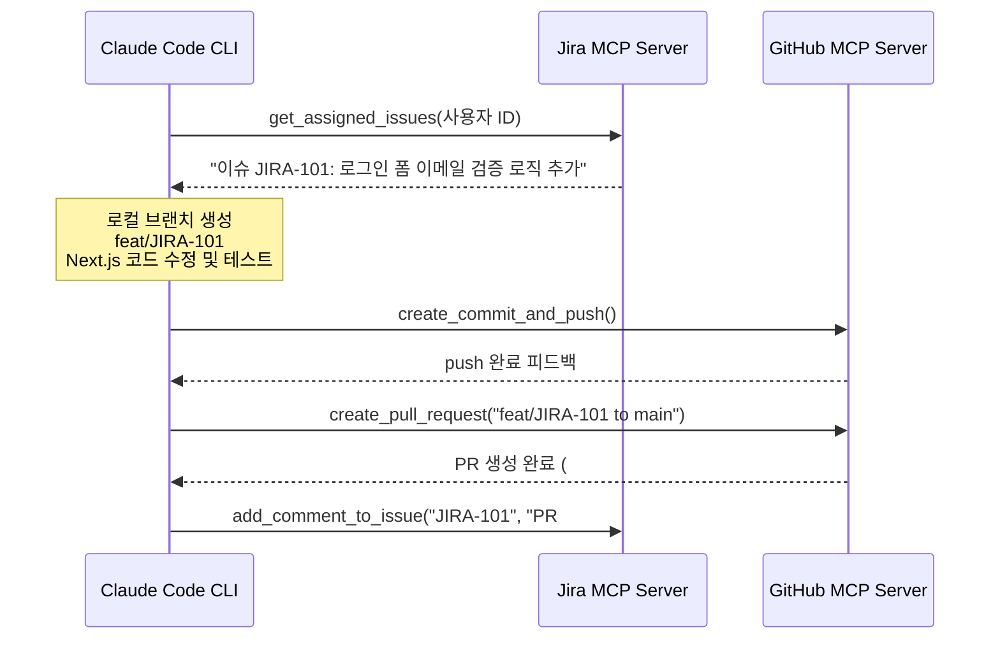

# 🚀 2주차 4일차: Jira 이슈에서 GitHub PR까지 - 완전 자율 개발 파이프라인 구축

안녕하세요! 시니어 멘토입니다.

어제 우리는 외부 세계의 데이터와 도구를 연결하는 통로인 MCP(Model Context Protocol)의 개념을 정립했습니다. 오늘은 이 MCP 기술을 결합하여 현대적인 소프트웨어 애자일(Agile) 관리 도구인 **Jira**와 소스코드 저장소인 **GitHub**를 에이전트와 연동해 보겠습니다.

이를 통해 **"AI 에이전트가 Jira 티켓을 스스로 감지하고 -> 브랜치를 파서 코드를 개발한 뒤 -> 테스트를 완료하고 -> GitHub에 Pull Request(PR)를 올려 배포를 준비하는"** 완전 자율형 소프트웨어 개발 수명주기(SDLC) 자동화 파이프라인을 구축하겠습니다.

---

## ☕ 1분 비유: 자율 개발 파이프라인은 100% 자동화된 조립 공장 라인이다
인간 관리자가 지시서를 가공하고 공장을 직접 돌리는 기존 방식과 자율 파이프라인의 차이를 비교해 보세요.

```text
- 기존 방식 (수동 조립)
  1. 기획자가 Jira에 "버그를 고쳐달라"고 적습니다.
  2. 개발자가 출근해서 이를 읽고 로컬에 브랜치를 만듭니다.
  3. 코드를 고쳐서 테스트해 보고, 깃허브에 커밋을 보낸 뒤 웹 브라우저를 열어 직접 마우스로 PR 버튼을 클릭합니다.

- 자율 개발 파이프라인 (자동 컨베이어 벨트)
  Jira에 티켓이 등록(Work Order)되는 순간, 에이전트 로봇 팔(Claude Code)이 지시를 파싱하여 컨베이어 벨트를 가동합니다. 로봇 팔이 깃허브 창고에서 브랜치를 인출하고, 용접(코딩 및 테스트)을 끝낸 뒤, 배송 트럭에 박스를 실어 보내고(GitHub PR) 완료 표식(PR 링크)을 티켓에 붙입니다.
```

---

## 🎯 Section 1: Jira MCP 및 GitHub MCP 서버 연동 아키텍처

AI 자율 개발의 핵심은 **"시스템 간의 맥락 공유"**입니다. 에이전트가 이 두 플랫폼을 제어할 수 있도록 MCP 게이트웨이를 묶어줍니다.



### ⚙️ 설정 프로시저
1. **Jira MCP Server 등록**:
   - Jira API 토큰을 발급받아 Claude Code 환경 설정에 주입합니다.
   - 에이전트가 Jira 티켓의 설명, 상태값 수정, 코멘트 등록 권한을 얻습니다.
2. **GitHub MCP Server 등록**:
   - Personal Access Token(PAT)을 발급받아 연동합니다.
   - 에이전트가 로컬 커밋 푸시뿐만 아니라 저장소(Repository) 레벨의 PR 오픈, 라벨 지정 등의 권한을 상속받습니다.

---

## 🎯 Section 2: 이슈 기반 에이전트 개발 수명주기 (SDLC)

실제 현업에서는 다음과 같이 규격화된 단계별 흐름을 거쳐 자율 개발이 진행됩니다.

1. **이슈 파싱**: 에이전트가 할당된 Jira 티켓의 상세 설명(Description)과 인수 조건(Acceptance Criteria)을 읽고 구조화된 구현 계획을 작성합니다.
2. **샌드박스 브랜치 생성**: 티켓 넘버에 맞춰 안전한 신규 브랜치(`feat/JIRA-XXX`)를 로컬 Git에 개설합니다.
3. **자율 구현 및 빌드 검증**: 에이전트가 대상 컴포넌트를 빌드하고, 로컬 웹서버 빌드 테스트를 돌려 빌드 오류 유무를 체크합니다.
4. **Git Push & PR 상신**: 빌드가 최종 성공하면 자동으로 커밋을 수행하고 오리진 저장소로 밀어 넣은(Push) 뒤, Jira 설명에 부합하는 변경 요약문이 적힌 PR을 생성합니다.

---

## 🎯 Section 3: [실습 사례] Jira 티켓을 통해 Next.js 쇼핑몰 로그인 보완하기

쇼핑몰 로그인 화면에서 이메일 형식 형식을 검증하라는 Jira 티켓(`JIRA-204`)이 들어왔다고 가정하고 이를 처리하는 실습 예시입니다.

- **인수 조건**: 
  - 이메일 입력창에 `@` 문자가 없거나 특수문자가 들어간 경우 경고창 출력.
  - 이메일 검증 실패 시 로그인 버튼 비활성화.
  - 테스트 코드가 정상 동작할 것.

### 🛠️ 에이전트 가동
```bash
# Claude Code에 Jira 티켓 해결 위임 명령 실행 (YOLO 모드 병행)
claude "JIRA-204 티켓을 읽고, Next.js 로그인 화면 컴포넌트에 이메일 정규식 검증 기능을 구현해줘. 테스트 코드를 통과한 뒤 깃허브 브랜치 feat/JIRA-204에 커밋하고 PR을 생성해줘." --yolo
```
에이전트는 Jira MCP 서버를 호출해 해당 요구사항 상세를 긁어오고, Next.js의 `LoginForm.tsx` 파일을 수정한 후, `npm run test`를 돌립니다. 최종 검증 성공 시 `git checkout -b` -> `git push` -> `gh pr create` 프로세스를 사람의 개입 없이 자율 완결합니다.

---

## 🎯 Section 4: 자율 에이전트 디버깅의 정석 (Disciplined Debugging)

에이전트가 루프 안에서 망가지지 않도록 예방하는 아키텍트의 규칙입니다.

1. **무한 연산 루프 방지**:
   - 에이전트가 빌드에 계속 실패하면서 같은 작업을 3회 이상 재시도하면, 콘솔 출력을 멈추고 로그의 `Exit Code`와 스택 트레이스(Stack Trace)를 사람이 강제로 확인해야 합니다.
2. **Git Hook을 이용한 정적 분석**:
   - 에이전트가 실수로 세미콜론을 빠뜨리거나 린트(Lint) 에러가 있는 상태로 푸시하는 것을 방지하기 위해 `Husky` 등을 이용해 `Pre-commit Hook`을 걸어둡니다. 에이전트가 코드를 엉망으로 짜면 Git 커밋 자체가 거부되므로, 에이전트 스스로 린트를 수정하도록 유도할 수 있습니다.

---

## 🏗️ 아키텍트의 의사결정 노트 (ADR - Architectural Decision Record)

### 결정사항: 에이전트 개발 통제 수단 - 프롬프트 수동 지시 vs Jira 티켓 연동 애자일(Agile)
- **배경**: AI 에이전트가 대규모 개발을 진행할 때, 개발자가 실시간으로 대화창에 명령을 치는 것은 비효율적이고 비정형화되어 관리가 불가능합니다.
- **대안 비교**: 
  - *대안 A (자유 프롬프트 방식)*: 메신저처럼 AI에게 즉흥적으로 명령을 줌. (빠르지만 아키텍처 히스토리가 남지 않고 협업 시 상태 공유가 불가능).
  - *대안 B (이슈 기반 개발 방식)*: Jira 티켓에 인수 조건을 상세히 명시하고 에이전트가 이를 추적하게 함. (기록이 정밀하게 남고 버전 릴리즈와 직접 링크됨).
- **의사결정 이유**: 투명성과 아키텍처 거버넌스의 원칙에 따라, **대안 B(Jira 티켓 연동 방식)**를 기업 실무의 표준으로 채택합니다. 에이전트에게 내리는 명령을 Jira 티켓의 '인수 조건(Acceptance Criteria)' 규격으로 서술하여 사람이 승인하는 필터링을 한 번 거치는 것이, 소프트웨어 아키텍처의 형상 제어를 위해 훨씬 안정적인 설계입니다.

---

## 🎯 시니어 멘토의 오늘의 브리핑 (Micro-Lecture)

- **핵심 요약**: Jira 이슈에서 GitHub PR까지 이어지는 흐름을 자동화하면 개발 생산성이 최소 5배 이상 급증합니다. 이제 개발자의 업무는 '코드를 치는 행위'에서 '티켓의 요구사항을 명확히 정의하고, 에이전트가 제출한 PR의 코드를 아키텍처 관점에서 냉정하게 검증하는 행위'로 고도화됩니다.
- **도전 과제**: 오늘 설명한 자동화 파이프라인 흐름을 바탕으로, **"에이전트가 작업을 끝내고 PR을 올렸을 때, 슬랙(Slack) 채널로 PR 링크와 완성 스크린샷을 자동으로 쏘아주는 연동 아키텍처"**를 머릿속으로 구상하고 필요한 MCP 서버가 무엇일지 고민해 보세요.

---
> 🔙 **[3일차 교재 읽기](./Day3_MCP_스킬_플러그인_비교.md)** | **[5일차 교재 읽기](./Day5_SaaS_플랫폼_설계와_커스텀_스킬.md)**
