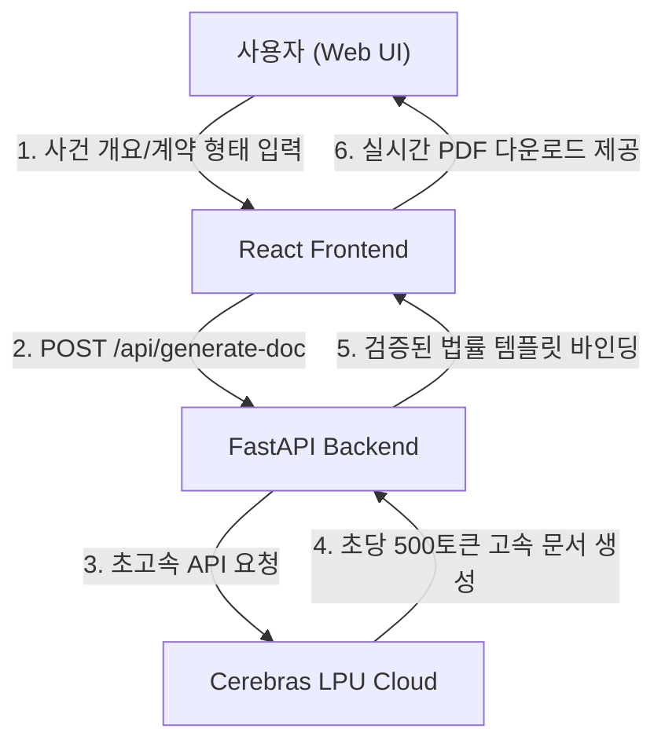

# 🚀 2주차 5일차: 초고속 LPU(Cerebras) 연동 SaaS 플랫폼 자율 빌드와 협업

안녕하세요! 시니어 멘토입니다.

2주차의 마지막 날인 오늘은 2주간 다져온 모든 기술(FastAPI, React, Jira, GitHub MCP, Claude Code)을 총결집하는 날입니다. 

단순한 데이터 조회를 넘어, 초고속 추론 하드웨어인 **Cerebras LPU(Linear Processing Unit)**를 백엔드에 연동하고, 에이전트 전용 전술서인 **`claude.md`**를 작성하여 **'AI 법률 문서 생성 SaaS 플랫폼'**을 최종 가동 및 배포하는 상용 아키텍처 실습을 진행하겠습니다.

---

## ☕ 1분 비유: Cerebras LPU는 생각을 빛의 속도로 쏟아내는 순간이동 통로다
일반적인 GPU 기반의 AI 추론과 Cerebras LPU의 차이는 다음과 같이 이해하면 쉽습니다.

```text
- 일반 GPU (동네 버스)
  질문을 던지면 AI가 답변을 한 자, 한 자 조심스럽게 출력합니다. (초당 30~50토큰). 법률 계약서처럼 긴 문서를 뽑을 때는 화면 앞에서 한참을 대기해야 합니다.

- Cerebras LPU (하이퍼루프 탄환 열차)
  질문을 던지고 눈을 한 번 깜빡이는 순간(0.1초), A4 용지 3장 분량의 복잡한 계약서 전문이 화면에 쾅 하고 한 번에 쏟아져 나옵니다. (초당 450~800토큰 이상의 초고속 추론). 딜레이가 아예 체감되지 않는 순간이동급 속도입니다.
```

- **LPU (Linear Processing Unit)**: AI 연산에 필요한 메모리와 코어를 단일 칩에 융합하여 메모리 대역폭 한계를 깨부순 초고속 연산 칩셋입니다.
- **`claude.md`**: Claude Code 에이전트에게 공장의 공정 배치도를 쥐여주듯, 소스코드의 의존성과 개발 목표를 각인시키는 전략 지침서입니다.

---

## 🎯 Section 1: Cerebras LPU 추론 혁신과 지연시간(Latency) 제로 아키텍처

SaaS(Software as a Service) 시장에서 사용자 경험(UX)의 핵심은 **응답 속도**입니다.
- 법률 문서 자동 생성, 실시간 코드 분석 등 대량의 텍스트 생성이 필요한 비즈니스 도메인에서 기존 LLM API의 지연 시간(Latency)은 큰 허들이었습니다.
- **Cerebras LPU** API를 백엔드 서버에 연동하면, 초당 400토큰을 넘나드는 속도로 문서를 생성할 수 있어 사용자가 로딩 화면(Spinner)을 구경할 시간조차 주지 않는 실시간 인터랙션 아키텍처를 구현할 수 있습니다.

---

## 🎯 Section 2: `claude.md` 설계서 작성과 커스텀 스킬(Skills) 제작

### 1. `claude.md` 가이드라인 스펙
`claude.md`는 1주차에 배운 `agents.md`와 유사하지만, **Claude Code CLI가 터미널 세션을 띄울 때 가장 먼저 읽도록 설계된 지침서**입니다.
- **포함 내용**: 현 프로젝트의 백엔드와 프론트엔드 연동 명세, DB 마이그레이션 규칙, 그리고 API 스토리지의 엔드포인트 세부 사항을 명확히 규정하여 에이전트가 코드를 임의로 흩뜨리는 것을 방지합니다.

### 2. Cerebras 연동용 커스텀 스킬 개발
FastAPI 백엔드가 아닌 에이전트 터미널 내에서 직접 Cerebras API를 찔러 테스트 텍스트를 고속으로 생성할 수 있도록 JS 기반의 **커스텀 에이전트 스킬(Custom Skill)**을 구축합니다.

---

## 🎯 Section 3: [실습] AI 법률 문서 생성 SaaS 플랫폼 빌드

FastAPI와 React를 기반으로 하며, Cerebras LPU를 탑재한 SaaS의 전체 아키텍처는 다음과 같습니다.



### ⚙️ 자율 애자일 빌드 프로세스
1. **Jira 티켓 발행 (`FEAT-301`)**: "FastAPI 백엔드에 Cerebras API 연동 라우트(`POST /api/generate`)를 생성하고, React 화면에 생성 결과를 마크다운 뷰어로 렌더링하라."
2. **Claude Code 가동**: `claude.md`를 바탕으로 에이전트가 백엔드의 `main.py`와 프론트엔드의 `DocGenerator.tsx`를 자율적으로 생성하고 배포 파일을 구성합니다.
3. **Cerebras LPU 테스트**: 에이전트가 직접 터미널 테스트 스크립트를 가동하여 지연 속도가 1초 미만으로 정상 생성되는지 검증합니다.

---

## 🎯 Section 4: 통합 검증 및 프로덕션 브랜치 머지 (Week 2 victory)

모든 코드 작성이 완료되면 다음 단계의 엔지니어링 검증을 수행합니다.

1. **상태값 예외 처리 검증**: Cerebras API Key가 누락되었거나 한도 초과 시, 사용자 화면에 에러가 나지 않고 Fallback 로컬 템플릿이 구동되는지 테스트합니다.
2. **자율 PR 커밋 및 스쿼시 머지**:
   - `claude` 내부에서 `/test`를 수행하여 모든 컴포넌트 동작을 검증합니다.
   - 통과 시 GitHub MCP를 이용해 `main` 브랜치로 머지하는 PR을 올리고 자율 빌드를 마무리합니다.

이로써 **Week 2: Vibe Engineering** 과정이 성공적으로 끝났습니다. 이제 우리는 CLI 환경에서 에이전트와 완벽히 호흡하는 엔지니어로 거듭났습니다!

---

## 🏗️ 아키텍트의 의사결정 노트 (ADR - Architectural Decision Record)

### 결정사항: AI 생성 엔진 배치 위치 - 프론트엔드 직접 호출 vs 백엔드 API 게이트웨이 격리
- **배경**: Cerebras LPU 및 OpenAI API 키를 어디에 두고 호출하느냐는 애플리케이션 보안 아키텍처의 생명선입니다.
- **대안 비교**: 
  - *대안 A (프론트엔드 직접 호출)*: React 브라우저 단에서 직접 Cerebras API를 쏨. (속도가 미세하게 빠르고 백엔드 리소스가 들지 않으나, 브라우저 개발자 도구의 네트워크 탭에 API Key가 그대로 노출되어 탈취 위험이 매우 큼).
  - *대안 B (백엔드 API 라우팅 격리)*: API Key는 백엔드 서버의 `.env` 환경 변수로 안전하게 가두고, 프론트엔드는 백엔드의 `/api/generate` 라우트만 호출하게 함.
- **의사결정 이유**: 보안 최우선의 원칙에 따라, **대안 B(백엔드 격리)**를 표준으로 강제합니다. 상용 SaaS 아키텍처에서 API Key가 클라이언트에 노출되는 것은 절대 허용할 수 없는 아키텍처 안티 패턴(Anti-pattern)입니다.

---

## 🎯 시니어 멘토의 오늘의 브리핑 (Micro-Lecture)

- **핵심 요약**: SaaS 빌드의 마무리는 보안과 성능의 조화입니다. Cerebras LPU를 활용해 얻은 획기적인 속도 개선은 백엔드의 안전한 라우팅 가드레일 아래 보호되어야 합니다. `claude.md`를 통해 에이전트를 영리하게 다룰 줄 안다면, 상용 플랫폼 가동도 클릭 몇 번과 텍스트 명령어 몇 개로 하루 만에 완성할 수 있습니다.
- **도전 과제**: 2주차 과정을 모두 마친 스스로를 격려하며, 다음 주 **Week 3: Expert Week**에서 만나게 될 **'멀티 에이전트 협업 체계(Sub-agents, Swarms)'**에 대비해, **"내 에이전트 여러 마리가 동시에 일을 쪼개어 하면 어떤 시너지가 날지"** 아키텍트 관점의 짧은 기대평을 정리해 보세요.

---
> 🔙 **[4일차 교재 읽기](./Day4_Jira와_GitHub_연동_자동화.md)** | 🚀 **[3주차 1일차 교재 읽기](../3주차_Agentic_Engineering/Day1_멀티_에이전트_오케스트레이션과_훅.md)**
