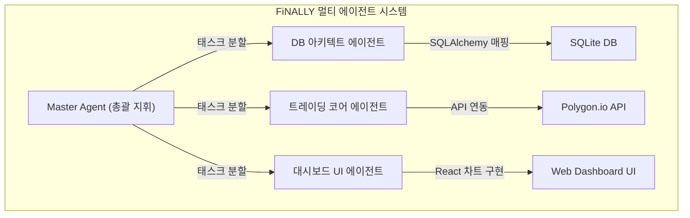

# 🚀 3주차 1일차: 멀티 에이전트 오케스트레이션과 통제된 카오스 (Controlled Chaos)

안녕하세요! 시니어 멘토입니다.

3주차이자 최종 단계인 **Agentic Engineering** 주간에 오신 것을 환영합니다! 지난 2주간 우리는 1개의 에이전트를 가이드하여 단일 애플리케이션을 자율 빌드했습니다. 하지만 현실 세계의 복잡한 시스템(예: 실시간 주식 거래 매칭 시스템, 다중 정산 분산 백엔드)은 에이전트 1개만으로는 개발 속도나 토큰 한계(Context Bloat) 때문에 구현이 거의 불가능합니다.

오늘은 **여러 마리의 AI 에이전트들이 동시에 병렬로 작동하는 멀티 에이전트(Multi-Agent) 스웜(Swarm)** 및 오케스트레이션 기법을 정립하고, 에이전트의 이벤트 감지 안전벨트인 **'훅(Hooks)'** 및 **'통제된 카오스(Controlled Chaos)'** 아키텍처를 학습하며 금융 거래 실습 프로젝트인 **FiNALLY** 구축을 시작하겠습니다.

---

## ☕ 1분 비유: 멀티 에이전트 스웜은 오케스트라 지휘자와 단원들이다
1마리의 에이전트가 코딩하는 것과 멀티 에이전트 팀이 협업하는 것의 차이를 오케스트라 연주로 비유해 보세요.

```text
- 단일 에이전트 (솔로 피아니스트)
  피아니스트 혼자서 건반을 두드리며 곡을 완성합니다. 피아노는 완벽히 치지만 드럼, 바이올린, 플루트 소리까지 동시에 낼 수는 없습니다. (단일 도메인 한계)

- 멀티 에이전트 스웜 (오케스트라 협연)
  지휘자(Master Agent)가 단상에 서서 지휘봉을 흔들면, 바이올린 단원(Sub-Agent A)이 멜로디를 켜고, 드럼 단원(Sub-Agent B)이 박자를 맞추며, 첼로 단원(Sub-Agent C)이 베이스를 채웁니다. 각 악기 전문 에이전트들이 동시에 연주(병렬 코딩)하여 웅장하고 완벽한 심포니(거대 풀스택 시스템)를 완성해 냅니다.
```

- **통제된 카오스 (Controlled Chaos)**: 자유롭게 연주하는 연주자들이 박자를 놓치거나 불협화음을 내지 않도록, 지휘자가 메트로놈과 규칙(Negative Feedback Loop)으로 통제하는 아키텍처 기법입니다.
- **훅 (Hooks)**: 바이올린 독주가 끝나는 순간(이벤트 감지), 지휘자의 지시 없이도 드럼 파트가 자동으로 연주를 시작하게 만드는 신호 시스템입니다.

---

## 🎯 Section 1: 단일 에이전트에서 멀티 에이전트(Sub-Agents)로의 진화

코딩 에이전트 아키텍처는 컨텍스트 윈도우 효율성을 극대화하기 위해 다중 에이전트 구조로 진화했습니다.

- **서브 에이전트(Sub-Agent)**: 메인 에이전트(Claude Code)가 일을 처리하다가 "이 파일의 정렬 알고리즘 검증해줘"와 같이 매우 구체적이고 좁은 영역의 태스크를 마주했을 때, 자신의 컨텍스트를 오염시키지 않기 위해 **메모리가 격리된 가상의 단발성 하위 에이전트를 스폰(Spawn)하여 일을 시키고 결과 텍스트만 전달받는 방식**입니다.
- **에이전트 팀(Agent Teams)**: 각기 다른 역할(예: DB 설계자 에이전트, UI 테스터 에이전트)을 정의하고, 이들이 메시지 브로커(Message Broker)를 통해 비동기로 통신하며 공동의 레포지토리를 빌드하는 구조입니다.

---

## 🎯 Section 2: Claude Code Pro - 커스텀 명령어와 훅(Hooks)

고급 에이전틱 엔지니어링을 위해 에이전트의 내부 라이프사이클에 개입하는 프로 기능을 조작합니다.

### 1. 커스텀 슬래시 명령어 (Custom Slash Commands)
에이전트 대화창에 기본 내장된 `/search`, `/test` 외에, `/review`나 `/deploy` 같이 우리 팀만의 고유 규격을 등록합니다.
- **예시**: `/review` 입력 시 로컬의 정적 분석 도구(ESLint, SonarQube)가 자동으로 돌고 그 리포트를 에이전트 컨텍스트에 한 번에 입력해 주는 자동화 숏컷을 매핑할 수 있습니다.

### 2. 에이전트 훅 (Hooks)
훅은 에이전트 내에서 특정 이벤트가 감지되었을 때 자동으로 실행되는 트리거 장치입니다.
- **트리거 유형**: 
  - `onFileWrite`: 에이전트가 특정 파일 수정을 완료했을 때, 자동으로 단위 테스트 코드를 실행하여 정합성을 상시 검증.
  - `onTerminalExit`: 실행한 쉘 명령어가 비정상 종료(Exit Code 1)되었을 때, 자동으로 에러 스택 트레이스를 파싱하여 디버그 에이전트를 기동.

---

## 🎯 Section 3: [프로젝트 기동] 멀티 에이전트 금융 거래 플랫폼 FiNALLY

3주차 캡스톤 프로젝트인 **FiNALLY(Finance Intelligent Agentic Network)**는 실시간 모의 주식 거래 및 마켓 데이터 시각화 웹앱입니다.



### ⚙️ 멀티 에이전트 역할 분담
1. **DB 설계 에이전트**: 사용자 자산, 주식 잔고, 거래 주문 체결 원장을 저장하는 관계형 데이터베이스 아키텍처를 설계하고 마이그레이션 코드를 짭니다.
2. **트레이딩 에이전트**: 외부 Polygon.io API를 연결하여 실시간 호가 데이터를 폴링(Polling)하고 가상 매매 주문 로직을 실행하는 백엔드 코어를 구현합니다.
3. **대시보드 에이전트**: TailwindCSS와 Recharts 라이브러리를 활용해 실시간 차트가 깜빡이지 않고 부드럽게 갱신되는 프론트엔드를 구축합니다.

이 에이전트들이 Master Agent의 조율 아래 동시다발적으로 파일을 생성 및 링크하는 방식으로 프로젝트가 기동됩니다.

---

## 🎯 Section 4: 통제된 카오스 (Controlled Chaos) 가드레일 설계

여러 에이전트가 한 폴더에서 날뛰게 방치하면 코드가 무참히 깨집니다. 카오스를 막는 3대 통제 규칙입니다.

1. **파일 락킹 (File Locking)**: 특정 파일(예: `main.py`)을 수정 중인 에이전트가 있을 때, 다른 에이전트가 해당 파일에 쓰기 접근을 할 수 없도록 파일 잠금 세마포어(Semaphore)를 가동합니다.
2. **네거티브 피드백 루프 (Negative Feedback Loop)**: 에이전트의 연산이 비정상 루프(예: 무한 리다이렉션)에 빠졌을 때, Master Agent가 해당 에이전트 세션을 강제 종료(Kill)하고 마지막 세이브 포인트로 되감는 자율 통제 정책입니다.
3. **샌드박스 격리 (Sandboxing)**: 미검증된 주식 트레이딩 로직을 실행할 때는 실제 시스템 가동 환경과 완전히 분리된 가상 샌드박스 내부에서만 에이전트가 코드를 쓰게 제한합니다.

---

## 🏗️ 아키텍트의 의사결정 노트 (ADR - Architectural Decision Record)

### 결정사항: 에이전트 간 비동기 메시지 프로토콜 - HTTP REST API vs Event-driven Pub/Sub (Redis)
- **배경**: FiNALLY 프로젝트 내에서 동작하는 복수의 자율 서브 에이전트들이 서로의 작업 완료 상태(예: DB 스키마 완성 상태)를 어떻게 실시간으로 전달받아 연쇄 작업을 수행할지 정의해야 합니다.
- **대안 비교**: 
  - *대안 A (HTTP 동기 호출)*: 구현이 직관적이나, 상대 에이전트가 작업을 끝낼 때까지 대기(Blocking)해야 하므로 병렬 처리 성능이 저하됨.
  - *대안 B (Redis Pub/Sub 이벤트 드리븐)*: Redis 브로커를 띄우고 에이전트들이 특정 이벤트 채널(예: `db:schema:ready`)을 구독(Subscribe)함. 완료 이벤트가 발행(Publish)되는 즉시 다음 에이전트가 깨어나 작업을 이어받음.
- **의사결정 이유**: 확장성과 동시성 극대화의 원칙에 따라, **대안 B(Redis Pub/Sub)**를 에이전트 협업 메시징 아키텍처 표준으로 선정합니다. 여러 에이전트가 독립적으로 가동되는 스웜 환경에서는 결합도(Coupling)를 낮추고 완벽한 비동기 이벤트를 바인딩하는 것이 아키텍처의 병목 현상을 방지하는 최선의 결정입니다.

---

## 🎯 시니어 멘토의 오늘의 브리핑 (Micro-Lecture)

- **핵심 요약**: 1마리의 천재 에이전트보다, 평범하지만 완벽히 동기화된 에이전트 팀이 만드는 아키텍처가 훨씬 더 크고 안전합니다. 멀티 에이전트 세상을 다스리기 위해서는 '통제된 카오스' 규칙을 설계하는 오케스트라 지휘자로서의 시야를 가져야 합니다.
- **도전 과제**: 오늘 다룬 에이전트 협업 개념을 상상해 보며, **"데이터베이스 테이블을 만드는 에이전트와 이 테이블에 데이터를 밀어 넣는 테스터 에이전트가 동시에 실행될 때 일어날 수 있는 대표적인 충돌 상황(Race Condition)"**이 무엇일지 예측하고 예방법을 한 문장으로 정리해 보세요.

---
> 🔙 **[2주차 5일차 교재 읽기](../2주차_Vibe_Engineering/Day5_SaaS_플랫폼_설계와_커스텀_스킬.md)** | **[2일차 교재 읽기](./Day2_샌드박스와_원격_클라우드_실행.md)**
