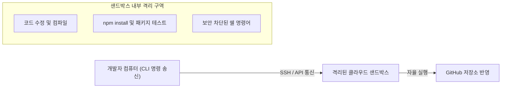

# 🚀 3주차 2일차: 원격 클라우드 샌드박스(Sandboxing) 실행과 보안 격리

안녕하세요! 시니어 멘토입니다.

어제 우리는 다중 에이전트 스웜이 유발할 수 있는 혼돈을 방지하는 '통제된 카오스' 프레임워크를 배웠습니다. 그 통제 수단 중 하나로 **'샌드박스 격리'**를 언급했었죠. 에이전트에게 쉘 명령어와 파일 제어권을 백퍼센트 일임하는 YOLO 모드를 가동할 때, 이를 개발자의 개인 노트북에서 직접 돌리는 것은 보안 및 하드웨어 안전 면에서 매우 위험합니다.

오늘은 내 소중한 하드웨어를 완벽히 보호하면서 AI 에이전트를 마음껏 날뛰게 할 수 있는 **원격 클라우드 샌드박스(Sandboxing)**의 실무 아키텍처와 **Sprites.dev**를 활용한 GitHub PR 연동 실습을 진행하겠습니다.

---

## ☕ 1분 비유: 샌드박스는 미검증 신약을 테스트하는 최고 보안등급 생화학 실험실이다
내 로컬 컴퓨터와 클라우드 샌드박스 환경의 차이를 실험실 비유로 이해해 보세요.

```text
- 로컬 실행 (가정집 부엌에서 생화학 실험하기)
  출처가 불분명한 독특한 화학 물질(AI가 짜낸 미검증 코드 및 터미널 명령어)을 내 부엌 싱크대에서 직접 섞어봅니다. 만약 가스가 분출되거나 폭발(시스템 파일 파괴, 백도어 유출)한다면 내 집 전체가 파괴됩니다. (보안 붕괴)

- 클라우드 샌드박스 실행 (특수 차폐막이 쳐진 원격 실험 센터)
  로컬 컴퓨터는 원격 카메라로 모니터링만 하고, 실제 실험은 우주 저 멀리 격리된 무인 기지(Sprites.dev / Cloud Container) 안에서 진행시킵니다. 기지가 폭발하고 독가스가 유출되어도(무한 루프, 디스크 포맷 명령어 오작동), 클릭 한 번으로 새 기지(컨테이너 초기화)를 1초 만에 띄우면 그만이며 내 부엌(로컬 PC)은 털끝 하나 상하지 않습니다.
```

- **격리 경계(Isolation Boundary)**: CPU, 메모리, 하드디스크, 네트워크 카드를 물리적/논리적으로 완전히 쪼개어 가상 공간에 유폐시키는 기술입니다.
- **원격 오케스트레이션**: 내 마우스와 키보드는 터미널 명령만 내릴 뿐, 실제 코드가 작성되고 실행되는 디스크는 클라우드 가상 컴퓨터에 존재하는 아키텍처입니다.

---

## 🎯 Section 1: 샌드박싱(Sandboxing)의 필요성과 보안 위협 요소

AI 코딩 에이전트가 로컬 쉘 권한을 가질 때 다음과 같은 실무적 보안 위협이 도사리고 있습니다.
1. **의도치 않은 파일 파괴**: 에이전트가 리팩토링 범위를 오판하여 `rm -rf /` 혹은 중요 시스템 라이브러리(`usr/lib`)를 덮어쓰는 에러 유발.
2. **악성 의존성 설치 (Dependency Poisoning)**: AI가 존재하지 않는 패키지명을 지어내어 설치를 시도할 때, 해커가 등록해 둔 악성 타이포 패키지(Typosquatting)가 로컬에 침투하여 API Key나 SSH Key를 탈취하는 행위.
3. **무한 연산 폭주**: 로컬 CPU와 메모리를 점유하는 무한 리다이렉션 코드가 가동되어 컴퓨터가 완전히 먹통(DDoS)이 되는 사태.

따라서 기업의 상용 아키텍처 설계 시 **"개발 에이전트는 무조건 격리된 가상 컨테이너 환경에서 실행되어야 한다"**는 절대적인 보초 규칙이 요구됩니다.

---

## 🎯 Section 2: Claude Code 원격 클라우드 샌드박스 연동

Claude Code는 터미널 실행 세션을 로컬 머신이 아닌, 원격 Docker 데몬이나 호스팅되는 클라우드 인프라로 전환할 수 있는 엔드포인트 파라미터를 제공합니다.



- **네트워크 화이트리스트 정책**: 샌드박스 컨테이너 내부에서는 오직 GitHub와 지정된 패키지 저장소(NPM, PyPI)만 통신을 허용하고, 기타 사설 IP나 미검증 도메인으로의 데이터 반출(Exfiltration)은 방화벽 레벨에서 원천 봉쇄합니다.

---

## 🎯 Section 3: 에이전트 원격 실행의 5가지 패턴

코딩 에이전트를 가동하는 클라우드 토폴로지는 목적에 따라 5가지로 구현됩니다.
1. **Cloud Sandbox CLI**: 로컬 터미널에서 명령을 치지만, 코드는 AWS Fargate 등 원격 컨테이너에서 자율 수정되는 방식.
2. **Web IDE Sandbox**: 웹 브라우저(VS Code Web / OpenVSCode Server) 인터페이스를 통해 클라우드 가상 리소스를 조작하는 형태.
3. **Mobile Termux Execution**: 이동 중 스마트폰 SSH 클라이언트를 사용해 원격지에 상주한 Claude Code 에이전트에게 핫픽스 빌드를 지시하는 패턴.
4. **GitHub Actions Workflow Integration**: GitHub에 이슈가 등록되면 Actions 러너(Runner)가 깨어나 샌드박스 내에서 에이전트를 구동하고 수정 코드를 커밋하는 완전 자동화 루프.
5. **REST API-driven Agent SDK**: 서비스 자체 백엔드에서 에이전트 API를 호출하여 고객의 코드를 원격 샌드박스에서 컴파일해 주는 가상 호스팅 구조.

---

## 🎯 Section 4: [실습] 제3사 샌드박스 Sprites.dev와 GitHub PR 자율 연동

**Sprites.dev**는 AI 코딩 에이전트 구동에 고도로 최적화된 초경량 클라우드 가상 샌드박스 서비스입니다. 

### ⚙️ 연동 및 실행 프로세스
1. **Sprites.dev 연동**: GitHub 계정으로 가입하고, 타겟 소스코드 레포지토리(예: `FiNALLY-trading-app`)에 대한 접근 권한을 부여합니다.
2. **원격 샌드박스 가동**: Sprites.dev 대시보드에서 신규 에이전트 컨테이너 세션을 생성하면, 가상 CPU 4개와 메모리 8GB가 탑재된 컨테이너가 0.5초 만에 부팅되어 내 소스코드를 클론합니다.
3. **원격 YOLO 자율 개발 가동**:
   ```bash
   # Sprites.dev 원격 샌드박스 쉘에 접속하여 Claude Code 가동
   claude --yolo "src/components/Chart.tsx 파일에 실시간 캔들스틱 차트를 그리는 기능을 추가하고, 빌드 테스트를 완수한 뒤 자동으로 브랜치를 파서 GitHub에 PR을 올려줘."
   ```
   - 샌드박스 내부에서 코드가 자율적으로 생성 및 검증되며, 완료되는 순간 GitHub API를 통해 PR이 웹상에 생성됩니다. 내 개인 PC의 하드웨어 리소스나 전력은 단 1%도 낭비되지 않습니다.

---

## 🏗️ 아키텍트의 의사결정 노트 (ADR - Architectural Decision Record)

### 결정사항: 에이전트 실행 환경 격리 방식 - 로컬 VM(VirtualBox/WSL) vs 클라우드 샌드박스(Sprites.dev)
- **배경**: AI 자율 에이전트 오작동으로 인한 개발 서버 파괴 및 보안 키 유출 문제를 방어해야 합니다.
- **대안 비교**: 
  - *대안 A (로컬 가상머신/WSL 격리)*: 네트워크 결제가 불필요하고 인터넷 연결 없이도 격리가 가능하지만, 로컬 컴퓨터 리소스를 갉아먹으며 가상 디스크 이미지 관리가 무겁고 개발 팀 배포가 어려움.
  - *대안 B (클라우드 온디맨드 샌드박스 - Sprites.dev)*: 컨테이너 API 호출 방식으로 개별 빌드 세션마다 완전히 초기화된 환경을 0.5초 만에 공급받을 수 있고 개발 팀원들이 단일 대시보드에서 에이전트 동작 로그를 동시 관람할 수 있음.
- **의사결정 이유**: 확장성과 개발자 생산성 극대화의 원칙에 따라, **대안 B(클라우드 샌드박스)**를 사내 표준 에이전트 개발 규격으로 선언합니다. 개발자가 직접 VM을 설치하고 네트워크 포트를 뚫는 기술 부채를 유발하기보다, 잘 래핑된 인프라(Sprites.dev API)로 격리벽을 세우는 것이 개발 조직 전체의 일관된 보안 가드레일을 유지하는 데 압도적으로 우수합니다.

---

## 🎯 시니어 멘토의 오늘의 브리핑 (Micro-Lecture)

- **핵심 요약**: AI에게 자율적으로 명령을 내리는 YOLO 모드는 반드시 샌드박스라는 격리된 방패막 안에서 가동되어야만 상용 보안 가치와 로컬 하드웨어의 평화를 지킬 수 있습니다. 클라우드 원격 샌드박스 연동을 마스터할 때 비로소 우리는 대규모 코드를 안전하게 뜯어고치는 에이전틱 아키텍트로 거듭납니다.
- **도전 과제**: 오늘 배운 원격 샌드박스 개념을 대입하여, **"만약 에이전트가 샌드박스 컨테이너 안에서 무한 루프 버그를 발생시켜 CPU 점유율이 100%로 굳어버렸을 때, 아키텍트로서 이를 복구하는 가장 신속하고 단순한 인프라 조치 방법"**이 무엇일지 한 문장으로 대답해 보세요.

---
> 🔙 **[1일차 교재 읽기](./Day1_멀티_%EC%97%90%EC%9D%B4%EC%A0%84%ED%8A%B8_%EC%98%A4%EC%BC%80%EC%8A%A4%ED%8A%B8%EB%A0%88%EC%9D%B4%EC%85%98%EA%B3%BC_%ED%9B%85.md)** | **[3일차 교재 읽기](./Day3_대규모_코드베이스_협업과_Agent_SDK.md)**
