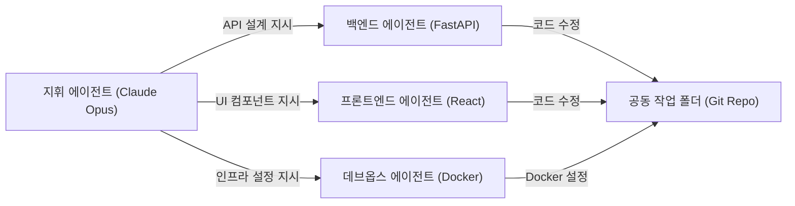
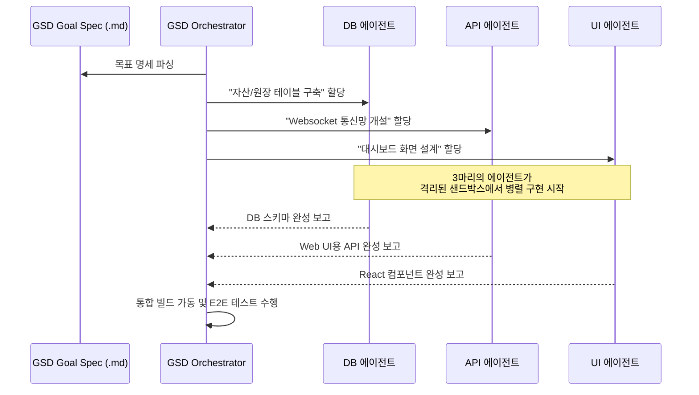

# 🚀 3주차 4일차: 에이전트 팀 스웜(Swarms)과 GSD 스펙 기반 오케스트레이션

안녕하세요! 시니어 멘토입니다.

어제 우리는 대규모 코드베이스에서의 컨텍스트 격리 전술과 SDK 조종법을 익혔습니다. 오늘은 3주차의 하이라이트인 **"복수 에이전트의 오케스트레이션(Orchestration)"** 실제 사례를 살펴보겠습니다. 

단순히 여러 에이전트가 자유롭게 소통하는 **'에이전트 팀 스웜(Agent Teams Swarms)'**과 스티브 예기(Steve Yegge)가 정의한 엄격한 명세 규격 기반 설계인 **'GSD(Goal-Spec-Design)'** 프레임워크를 심도 있게 비교해 보고, 실시간 트레이딩 대시보드를 자율 협업으로 구축하는 과정을 클론 분석해 보겠습니다.

---

## ☕ 1분 비유: 에이전트 팀 스웜은 집단 지성 위원회이고, GSD는 무결점 매뉴얼 공장이다
여러 AI 에이전트를 모아 일시키는 두 가지 아키텍처 사상입니다.

```text
1. 에이전트 팀 스웜 (Agent Teams Swarms - 자유 토론식 건축 현장)
   - DB 업자, 목수, 배관공 AI가 거실에 모여 앉아 "제가 이 파이프를 놓을 테니, 그 위에 보드를 덮어주세요" 하고 실시간 대화(Peer-to-Peer)하며 집을 짓는 구조입니다. 유연하고 창의적이지만, 말이 길어지면 배가 산으로 갈 수 있습니다.

2. GSD (Goal-Spec-Design - 철저한 설계도 조립 라인)
   - 초대형 빌딩의 CAD 설계도(Goal Spec)를 인쇄기에 넣는 즉시, 중앙 로봇 제어기(Master Orchestrator)가 "로봇 A는 101호 벽돌 50개 쌓기", "로봇 B는 102호 전선 포설"과 같이 수학적으로 쪼개진 태스크 카드를 인출해 배포합니다. 로봇들은 한 치의 잡담도 없이 정밀 설계도대로 집을 완성해 냅니다. (명세 기반 자율 조립)
```

- **GSD (Goal-Spec-Design)**: 애자일 백로그의 스펙 문서를 AI가 해석할 수 있는 엄격한 규격(Spec)으로 파싱하여, 최상위 오케스트레이터가 하위 에이전트들의 행동 영역을 완전히 선점 및 제어하는 아키텍처 프레임워크입니다.

---

## 🎯 Section 1: Claude Code Agent Teams - 풀스택 스웜(Swarms)

대규모 프로젝트 개발 시, 역할이 분화된 에이전트들이 협력하는 **스웜(Swarms) 아키텍처**를 가동합니다.



### 🛠️ 스웜의 협업 흐름
1. **지휘 에이전트 (Claude Opus)**: 요구사항을 수령하여 프론트엔드, 백엔드, 인프라용 세부 태스크로 쪼갭니다.
2. **백엔드 에이전트(GPT-5.2)** & **프론트엔드 에이전트(Claude Sonnet)**: 동일한 Git 레포지토리 내의 다른 디렉토리에서 병렬로 자율 코딩을 시작합니다.
3. **데브옵스 에이전트**: 작성된 앱의 포트 설정을 맞추고 컨테이너 빌드를 실행해 봅니다.
4. **상호 교정**: 백엔드 API 명세가 바뀌면 프론트엔드 에이전트가 이를 감지해 연동 컴포넌트의 타입 정의를 자동으로 갱신합니다.

---

## 🎯 Section 2: GSD (Goal-Spec-Design) 명세 기반 오케스트레이션

**GSD**는 임의 대화형 스웜이 갖는 불확실성을 예방하기 위해 설계된 **'엄격한 명세 기반 자동화 프레임워크'**입니다.

### 📋 GSD 파이프라인 5단계
1. **Goal (목표 정의)**: 기획서 또는 지라 티켓에서 사람이 도출한 궁극적 개발 목표.
2. **Spec (명세 작성)**: 목표를 이룩하기 위해 필요한 파일 트리, 데이터베이스 마이그레이션 스키마, 연동 API 스펙을 엄격한 마크다운 규격으로 선제 기술.
3. **Design (아키텍처 설계)**: 컴포넌트 간의 상호작용 및 파일 변경 다이어그램을 AI가 스스로 사전 작성.
4. **Execution (자율 병렬 구현)**: 각 세부 설계 노드에 분산 할당된 서브 에이전트들이 자율 코딩을 개시.
5. **Validation (자동 인수 테스트)**: 정의된 인수조건(Acceptance Criteria) 테스트 통과를 검증하고 최종 코드베이스에 머지.

---

## 🎯 Section 3: [사례] 실시간 트레이딩 대시보드 구축 5시간 딥다이브

GSD와 Agent Teams를 결합하여 실시간 주식 모의 트레이딩 대시보드를 구축한 아키텍처 사례 연구입니다.

### ⚙️ 구현 컴포넌트
- **실시간 호가 피드**: WebSockets을 통한 실시간 주가 캔들스틱 차트.
- **주문 체결 대기열**: Redis Queue 기반의 가상 체결 엔진.
- **포트폴리오 평가**: 현재 평가 자산 및 수익률 실시간 연산 엔진.



### 💡 5시간의 자율 수정과 E2E 테스트 검증 결과
- **발생한 문제**: 실시간 호가 데이터가 밀려 들어올 때 React 컴포넌트가 과도하게 리렌더링되며 자바스크립트 스레드가 잠기는 메모리 릭(Memory Leak) 발생.
- **에이전트의 해결**: 테스터 에이전트가 메모리 프로파일을 감지하고 UI 에이전트에게 경고를 쏨. UI 에이전트가 `React.memo`와 `useCallback`을 적용하고 실시간 상태 데이터 버퍼링(Throttle/Debounce) 로직을 삽입하여 렌더링 딜레이를 10ms 이하로 방어해 냄.

---

## 🎯 Section 4: GSD vs Claude Agent Teams 기술 성능 비교

| 비교 항목 | 1. 에이전트 팀 스웜 (Agent Teams) | 2. GSD (Goal-Spec-Design) |
| :--- | :--- | :--- |
| **작동 스타일** | P2P 대화 및 자유 토론식 구현 | 엄격한 하향식(Top-down) 할당 구현 |
| **사전 명세 필요성** | 낮음 (즉흥적인 작업에 용이) | 극도로 높음 (설계 문서 필수) |
| **대규모 협업 안정성**| 중간 (의견 충돌 시 컨텍스트 꼬임 발생 가능) | 최상 (격리된 노드 구현으로 충돌 배제) |
| **결함 복구 방식** | 에이전트 간 피드백 루프로 자율 수정 | 상위 오케스트레이터의 세션 리셋 및 재배포 |
| **추천 프로젝트** | 소규모 풀스택 프로토타입, MVP 빠른 구축 | 정밀 원장 정산, 금융 시스템, 엔터프라이즈 레거시 |

---

## 🏗️ 아키텍트의 의사결정 노트 (ADR - Architectural Decision Record)

### 결정사항: 상용 트레이딩 엔진 구축 - 대화형 스웜 vs GSD 오케스트레이션
- **배경**: 자산 체결 및 돈이 오가는 금융 시뮬레이션 시스템의 특성상 사소한 코드 버그가 전체 자산 손실로 번질 위험이 있으므로, 에이전트의 개발 정밀도를 극대화해야 합니다.
- **대안 비교**: 
  - *대안 A (자유 스웜)*: 자유롭게 토론하며 구현하므로 개발 속도는 빠르나, 예외 상황에 대한 안전장치 구현이 보장되지 않음.
  - *대안 B (GSD 명세 프레임워크)*: 모든 비즈니스 예외 처리 조건(예: 잔액 부족 시 주문 거부)을 `spec.md`에 사전에 꼼꼼히 규정하고, 에이전트가 이 명세를 100% 만족하는 테스트 코드를 통과해야만 머지할 수 있게 엄격히 제어함.
- **의사결정 이유**: 결함 불허 및 규정 준수(Compliance)의 원칙에 따라, **대안 B(GSD 오케스트레이션)**를 프로젝트 공식 개발 표준 아키텍처로 결정합니다. 금융 거래 원장 같이 정밀한 시스템에서는 AI 에이전트에게 절대 자유를 주는 것보다, 인간 아키텍트가 정의한 명세의 통제 아래에서만 일하게 하는 것이 소프트웨어 안전성을 보장하는 유일한 길입니다.

---

## 🎯 시니어 멘토의 오늘의 브리핑 (Micro-Lecture)

- **핵심 요약**: 다중 에이전트 협업의 최정점은 '설계도 기반 오케스트레이션'입니다. GSD 기법을 활용할 때 비로소 우리는 AI가 만들어내는 쓸데없는 쓰레기 코드(Slop Code)에서 벗어나, 명확한 설계 사상대로 돌아가는 정밀한 엔터프라이즈 시스템을 자율 조립해 낼 수 있습니다.
- **도전 과제**: 오늘 배운 GSD 협업 모델을 떠올려보며, **"프론트엔드 에이전트와 백엔드 에이전트가 API 통신 규격으로 갈등을 빚을 때, GSD 프레임워크의 마스터 오케스트레이터가 이 갈등을 중재하고 규격을 동기화하는 기준 문서가 무엇이 되어야 하는지"** 한 단어로 대답해 보세요.

---
> 🔙 **[3일차 교재 읽기](./Day3_대규모_코드베이스_협업과_Agent_SDK.md)** | 🚀 **[5일차 교재 읽기](./Day5_최종_프로젝트_배포와_엔지니어링_회고.md)**
