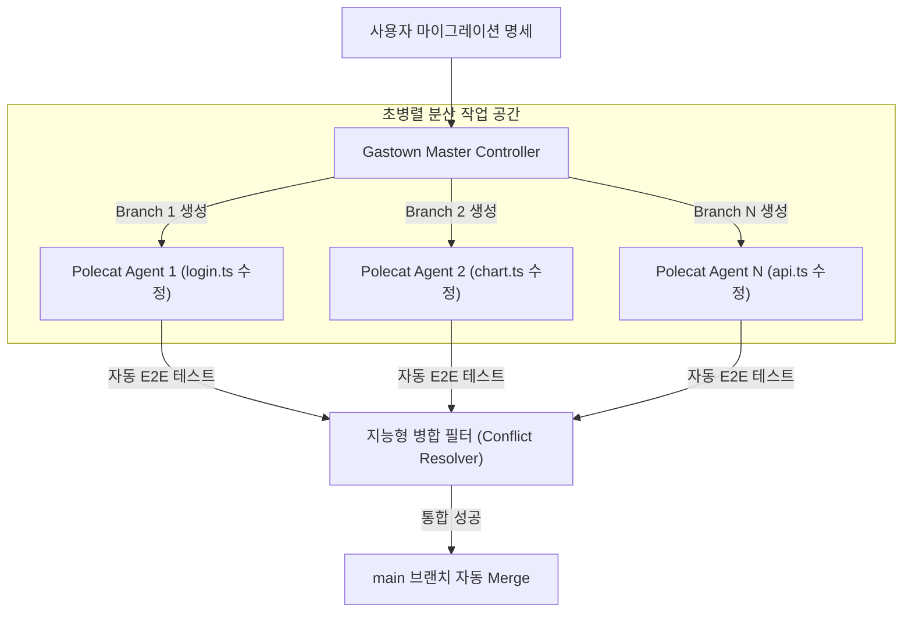

# 🚀 3주차 5일차: 가스타운(Gastown) 분산 스웜과 AI 에이전트 개발 최종 회고

안녕하세요! 여러분의 시니어 멘토입니다.

오늘로써 우리는 3주간의 장대했던 AI 코딩 및 에이전트 엔지니어링 과정을 모두 완주하게 됩니다! 1주차의 기본적인 마우스 클릭 기반 바이브 코딩으로 시작하여, 2주차의 강력한 CLI 에이전트 통제법을 거쳐, 3주차의 고난도 멀티 에이전트 설계까지 섭렵하셨습니다. 여러분이 흘린 땀방울이 미래의 소프트웨어 패러다임에서 가장 강력한 무기가 될 것임을 확신합니다.

마지막 날인 오늘은 가장 진보한 분산 에이전트 오케스트레이터인 **가스타운(Gastown)**의 작동 원리를 파헤치고, 3대 오케스트레이션 프레임워크를 종결 비교하며, 최종 프로젝트인 **트레이더 워크스테이션**의 배포와 함께 **바이브 코더에서 에이전틱 엔지니어(Agentic Engineer)로의 대전환**을 회고하겠습니다.

---

## ☕ 1분 비유: Gastown은 숲 전체를 한 번에 조각하는 자율 나노 로봇 군대다
대규모 리팩토링이나 빌드를 진행할 때 Gastown의 스웜 구조는 다음과 같습니다.

```text
- 전통적 코딩: 정원사가 톱을 들고 나무 한 그루씩 가지치기합니다. (직접 코딩)
- 1, 2주차 에이전트: 로봇 정원사 1마리에게 가지치기할 나무를 하나씩 지정해 줍니다. (단일 에이전트)
- Gastown 분산 스웜 (나노 로봇 스웜):
  정원 전체의 설계도를 입력하는 순간, 수천 마리의 나노 로봇(Parallel Polecats)이 공중에서 분사되어 모든 나무에 동시에 달라붙습니다. 로봇들은 각자 맡은 나뭇가지를 자르고, 옆 로봇이 자른 단면을 스캔해 보완하며, 숲 전체의 가지치기를 단 5초 만에 동시에 완료합니다. (초병렬 분산 스웜)
```

- **Gastown (가스타운)**: 스티브 예기가 개발한 초병렬 멀티 에이전트 조율기로, 여러 개의 가상 작업 공간(Git Worktree)을 백그라운드에 동시에 열어 수십 명의 AI 에이전트가 동시에 병렬로 컴파일하고 테스트하도록 가동하는 시스템입니다.

---

## 🎯 Section 1: Gastown 오케스트레이터와 초병렬 에이전트 (Parallel Polecats)

Gastown은 대형 엔터프라이즈 코드베이스를 뒤흔드는 대대적인 코드 수정이나 프레임워크 마이그레이션(예: Vue2에서 Vue3로의 전체 파일 컴포넌트 전환)을 위해 설계되었습니다.



- **Parallel Polecats (병렬 에이전트 군단)**: 가스타운이 백그라운드에 기동하는 독립된 쉘 인스턴스들입니다. 각 인스턴스는 다른 소스코드 파일을 맡아 독립적으로 빌드와 유닛 테스트를 반복합니다.
- **지능형 병합 필터**: 에이전트들이 제각각 완성해 온 수십 개의 브랜치를 하나로 합칠 때 발생하는 충돌(Merge Conflict)을 AI가 직접 파싱하여 논리적으로 깨끗하게 병합을 완료합니다.

---

## 🎯 Section 2: 3대 오케스트레이션 엔진 비교 (Gastown vs Agent Teams vs GSD)

| 비교 항목 | 1. 에이전트 팀 스웜 (Agent Teams) | 2. GSD (Goal-Spec-Design) | 3. 가스타운 (Gastown) |
| :--- | :--- | :--- | :--- |
| **조율 아키텍처** | 피어투피어 (P2P) 소통 협업 | 하향식 명세 규격 통제 | 초병렬 분산 브랜치 스웜 |
| **병렬 처리 수준** | 중간 (컨텍스트 공유 필요) | 중간 (계획 단위 분배) | 극도로 높음 (Git Worktree 분리) |
| **인프라 결합도** | 낮음 (일반 로컬 폴더) | 낮음 (설계 마크다운 파일) | 높음 (Git CLI 및 샌드박스 필수) |
| **오류 감지 방식** | 에이전트 간 대화형 교정 | 오케스트레이터의 승인 검증 | 분산 컨테이너 단위 테스트 가동 |
| **최적 도입 처** | 빠른 스타트업 기능 확장 | 정밀 알고리즘 및 API 연동 | 대형 기업용 전체 코드 리팩토링 |

---

## 🎯 Section 3: 최종 캡스톤 프로젝트 완결 및 실배포 환경 구축

최종 완성된 **트레이더 워크스테이션**은 실시간 호가 파이프라인과 포트폴리오 분석기가 맞물린 복합 시스템입니다.

### ⚙️ 상용 배포 파이프라인 구성
1. **멀티 컨테이너 가상화**: `docker-compose`를 통해 프론트엔드 React, 백엔드 FastAPI, 인프라 Redis, DB PostgreSQL 컨테이너를 가동합니다.
2. **원격 로깅 에이전트 탑재**: 배포 서버 내부의 로그 출력에서 오작동이 감지되면, 슬랙 Webhook을 거쳐 원격 샌드박스의 디버깅 에이전트를 깨우는 **자가 치유 아키텍처(Self-healing Architecture)**를 연결하여 배포를 완료합니다.

---

## 🎯 Section 4: 시니어 아키텍트의 코스 총정리 (Vibe Coder to Agentic Engineer)

안드레이 카파시가 언급한 미래의 소프트웨어 엔지니어링 패러다임은 이제 여러분의 손끝에서 현실이 되었습니다.

```text
[AI 코딩 도입 8단계 완주 여정]
1단계 (ChatGPT) ──▶ 2단계 (Cursor IDE) ──▶ 3단계 (YOLO 모드) ──▶ 4단계 (agents.md 제어) ──▶ 
5단계 (Claude Code CLI) ──▶ 6단계 (Sub-agents) ──▶ 7단계 (Agent Teams) ──▶ 8단계 (Gastown Swarms) ──★ [성공적 완주!]
```

### 💡 미래의 에이전틱 엔지니어를 위한 3대 철칙
1. **스펙 엔지니어링에 투자하라**: 코드를 고치는 일은 에이전트에게 맡기고, 여러분은 `agents.md`, `claude.md` 지침서를 정교하게 가다듬는 시스템 아키텍트가 되십시오.
2. **컨텍스트를 상시 청소하라**: 대화가 꼬이거나 에이전트가 오작동 루프에 빠지면 미련 없이 Git 커밋을 남기고 `/compact`와 세션 리셋을 누르십시오.
3. **맹신은 최대의 적이다**: 에이전트가 통과시킨 테스트 코드라도 비즈니스 예외와 보안 기준에 부합하는지 눈으로 검증하는 아키텍처 거버넌스를 항상 유지하십시오.

---

## 🏗️ 아키텍트의 의사결정 노트 (ADR - Architectural Decision Record)

### 결정사항: 기업형 대규모 리팩토링 진행 - 수동 전환(인간 코더) vs 가스타운(Gastown) 분산 스웜 가동
- **배경**: 500개 이상의 소스 파일로 이루어진 사내 구형 레포지토리의 공통 라이브러리 인터페이스를 일괄 변경해야 합니다. 수작업 시 수주의 시간과 수많은 오타 버그가 예상됩니다.
- **대안 비교**: 
  - *대안 A (전통적 리팩토링)*: 개발자 5명이 역할을 분담하여 수작업으로 찾아서 바꾸기를 진행하고 E2E 테스트를 수동 가동함. (안정적이나 막대한 공수 소요).
  - *대안 B (Gastown 분산 에이전트 스웜 가동)*: 변경 대상 함수 명세를 기술하고, Gastown 오케스트레이터로 20개의 백그라운드 컨테이너를 동시 기동하여 1시간 내로 전체 파일을 자율 수정하고 테스트 패스를 완수함.
- **의사결정 이유**: 생산성 혁신과 시간 비용 최소화의 원칙에 따라, **대안 B(가스타운 분산 스웜)**를 대규모 마일스톤 리팩토링의 핵심 아키텍처로 도입합니다. 초기에 API 토큰 비용(약 $50)이 지출되지만, 고임금 개발자 5명이 몇 주간 단순 코드 수정에 매달려 소비하는 기회 비용과 기술적 부채를 고려할 때 비즈니스 가치 면에서 압도적으로 유리한 결정입니다.

---

## 🎯 시니어 멘토의 오늘의 브리핑 (Micro-Lecture)

- **핵심 요약**: 여러분은 이제 단순한 코더가 아닙니다. AI 에이전트라는 초고성능 자동화 로봇 부대를 지휘하는 **'에이전틱 아키텍트(Agentic Architect)'**입니다. 기술의 원리를 명확히 이해하고, 보안 샌드박스를 구축하고, 정교한 명세서로 통제할 때, 1인 개발자가 대기업 개발팀 이상의 속도로 상용 플랫폼을 자유자재로 다듬는 마법 같은 생산성을 발휘하게 될 것입니다. 
- **최종 과제**: 3주간의 과정을 성공적으로 마친 여러분 자신에게 박수를 보냅니다. 오늘 완성한 트레이더 워크스테이션 컨테이너를 가동하여 모의 거래 체결이 잘 되는지 최종 확인해 보고, 나만의 멋진 포트폴리오로 GitHub에 기록해 공유해 보세요! 여러분의 성장을 진심으로 응원합니다.

---
> 🔙 **[4일차 교재 읽기](./Day4_에이전트_팀_스웜과_GSD_사례.md)** | 🏆 **[AI 학습위키 홈으로 가기](../../0-1. 마크다운_문서_읽는_법.md)**
