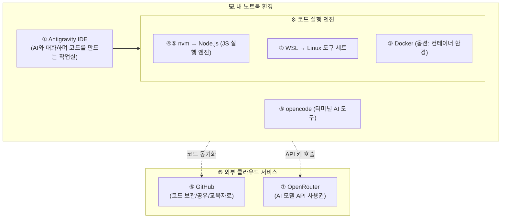
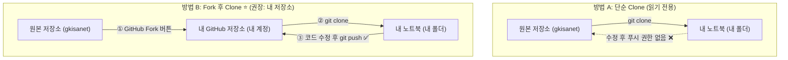

# 🧰 교육 준비물 — 내 컴퓨터에 무엇을 설치할 것인가

> **문서 목적**: 교육 첫날 **09:00에 바로 시작할 수 있도록**, 교육 전에 각자 PC에 설치·가입해야 하는 것들을 순서대로 정리한 문서입니다.
>
> **⚠️ 이 문서는 교육 전에 미리 하고 오셔야 합니다.**
> 설치는 다운로드 대기 시간이 대부분이라, 현장에서 다 같이 하면 **3시간 중 1시간이 설치로 날아갑니다.**

---

## ⏱️ 얼마나 걸리나요

| 구분 | 예상 소요 시간 | 비고 |
| :--- | :---: | :--- |
| **필수 항목만 진행** | 약 30분 | 대부분 다운로드 대기 시간 |
| **옵션(WSL/Docker) 포함** | 약 60~90분 | 재부팅 1회 포함 |

> 💡 **네트워크가 느린 사내망에서는 더 걸립니다.** 점심시간이나 퇴근 전에 걸어두고 다른 일 하십시오.

---

## ✅ 한 장 체크리스트 (이것만 다 되면 준비 끝)

| # | 항목 | 필수 여부 | 예상 시간 | 완료 |
|:-:|------|:--------:|:--------:|:---:|
| 0 | **[마크다운 문서 읽는 법](0-1.%20마크다운_문서_읽는_법.md)** / **[마크다운 문법 요약](0-2.%20마크다운_문법.md)** | 🟡 **추천** | 5분 | ☐ |
| 1 | **Antigravity IDE** 설치 + 구글 로그인 | 🔴 **필수** | 10분 | ☐ |
| 2 | **WSL** 설치 (Windows 사용자) | 🟡 옵션 (**강력 추천**) | 20분 + 재부팅 | ☐ |
| 3 | **Docker Desktop** 설치 | ⚪ 옵션 (안 해도 됨) | 15분 | ☐ |
| 4 | **nvm** 설치 | 🔴 **필수** | 5분 | ☐ |
| 5 | **Node.js LTS** 설치 (nvm으로) | 🔴 **필수** | 3분 | ☐ |
| 6 | **GitHub** 가입 | 🔴 **필수** | 5분 | ☐ |
| 7 | **OpenRouter** 가입 + API 키 발급 | 🔴 **필수** | 10분 | ☐ |
| 8 | **opencode** 설치 + 키 연결 | 🟡 옵션 (**추천**) | 5분 | ☐ |
| 9 | **교육 자료 내려받기** (clone 또는 fork) | 🔴 **필수** | 3분 | ☐ |
| 10 | **AGENTS.md / Rules 등록** | 🔴 **필수** | 5분 | ☐ |

---

## 🗺️ 먼저 그림으로 — 이게 다 뭐 하는 물건인가

설치 안내부터 보면 "왜 이걸 깔지?"를 모른 채 따라만 하게 됩니다. 전체 구조도를 먼저 확인합니다.



> ### 🔑 한 줄 요약
> **Antigravity = 작업실 / Node·WSL = 엔진 / GitHub = 창고 / OpenRouter = AI 사용권**

---

## ⚠️ 시작 전에 — 3가지만 확인

| 점검 항목 | 점검 내용 및 권장 조치 |
| :--- | :--- |
| **1. 관리자 권한 확인** | 사내 PC는 설치 권한이 막혀 있을 수 있으므로 전산팀 사전 확인 또는 개인 노트북 준비 |
| **2. 디스크 여유 공간** | **최소 20GB 이상** 여유 공간 확보 (WSL 및 개발 도구 설치 대비) |
| **3. 사내 보안 규정** | OpenRouter는 외부 AI 서비스이므로 **교육 중 사내 실데이터 절대 입력 금지** |


> 📌 **권장 사양**: Windows 10/11 64bit · RAM 8GB 이상(16GB 권장) · SSD
> macOS·Linux 사용자는 각 단계에 별도 안내를 달아 두었습니다.

---

---

# 1️⃣ Antigravity IDE 설치 🔴 필수

## 이게 뭔가요

**구글이 만든 AI 코딩 전용 편집기**입니다. 2025년 11월에 공개됐고, 교육 내내 여기서 작업합니다.

```
   [일반 편집기]                    [Antigravity]

   내가 코드를 친다                 내가 "이렇게 만들어줘"라고 말한다
        ↓                                ↓
   내가 실행해 본다                 AI가 파일을 직접 만들고 고친다
        ↓                                ↓
   내가 에러를 고친다               AI가 터미널에서 실행하고
                                    브라우저로 확인까지 한다
```

교재 [참고1_AI_TOOLS_COMPARISON.md](./참고1_AI_TOOLS_COMPARISON.md) 에서 말한 **3세대 Agentic IDE**가 바로 이것입니다.

## 설치 방법

1. **https://antigravity.google/download** 접속
2. 본인 OS(Windows / macOS / Linux) 선택 → 설치 파일 다운로드
3. 설치 파일 실행 → 계속 "다음"
4. 실행 후 **구글 계정으로 로그인**

| 항목 | 내용 |
|------|------|
| **최소 사양** | Windows 10 (64bit) 이상 |
| **비용** | 무료 (개인 사용, 사용량 한도 있음) |
| **기반 모델** | Gemini 3 Pro, Claude Sonnet 등 선택 가능 |
| **로그인** | 구글 계정 필수 |

> ✅ **성공 확인**: 실행했을 때 오른쪽에 **Agent 패널(채팅창)** 이 보이면 됩니다.

> 💡 **VS Code 쓰시던 분께**: Antigravity는 VS Code 계열이라 화면이 거의 같습니다.
> 기존 확장·설정을 그대로 가져올 수 있는지 첫 실행 시 물어봅니다.

---

# 2️⃣ WSL 설치 🟡 옵션이지만 강력 추천 (Windows 전용)

## 이게 뭔가요

**WSL(Windows Subsystem for Linux)** = **윈도우 안에서 리눅스를 돌리는 기능**입니다.
윈도우를 지우거나 듀얼부팅 하는 게 아니라, 그냥 프로그램 하나 깔리듯 들어옵니다.

## 왜 추천하나요 ⭐

| 구분 | Windows 기본 명령 프롬프트(CMD) | WSL (리눅스 환경) |
| :--- | :--- | :--- |
| **명령어 호환성** | AI가 알려준 리눅스 명령어 입력 시 ❌ 에러 발생 | AI가 알려준 명령어 그대로 입력 시 ✅ 즉시 실행 |
| **기본 내장 도구** | Python, Git, Curl 등 별도 수동 설치 필요 | **Python3, Git, Curl 등 개발 필수 도구 기본 내장** |
| **실무 표준** | 도구 매뉴얼의 90%가 리눅스 기준이라 진입 장벽 존재 | 실무 개발 표준 환경과 100% 동일하여 학습 용이 |

즉, **WSL을 깔면 "파이썬 설치"라는 번거로운 단계 자체가 사라집니다.**

## 설치 방법

1. 시작 메뉴에서 **PowerShell** 검색 → **마우스 우클릭 → "관리자 권한으로 실행"**
2. 아래 한 줄 입력 후 Enter

```powershell
wsl --install
```

3. 설치가 끝나면 **PC 재부팅**
4. 재부팅 후 자동으로 우분투 창이 뜹니다 → **사용자 이름 / 비밀번호** 설정
   - ⚠️ 비밀번호는 **입력해도 화면에 아무것도 안 보입니다.** 정상입니다. 그냥 치고 Enter.
   - ⚠️ 이 비밀번호는 나중에 `sudo` 쓸 때 필요합니다. **꼭 기억하십시오.**

## 설치 확인

우분투 터미널에서:

```bash
python3 --version     # 예: Python 3.12.3   ← 자동으로 깔려 있습니다
git --version         # 예: git version 2.43.0
```

> ✅ **성공 확인**: 위 두 개가 버전 번호를 뱉으면 성공입니다.

## 알아두면 좋은 것

| 궁금증 | 답 |
|--------|-----|
| 윈도우 파일을 리눅스에서 볼 수 있나? | ✅ `/mnt/c/Users/내이름/` 으로 접근됩니다 |
| 지우고 싶으면? | `wsl --unregister Ubuntu` — 윈도우엔 아무 영향 없음 |
| 무겁지 않나? | 가상머신(VMware)보다 훨씬 가볍습니다 |
| Antigravity에서 쓸 수 있나? | ✅ VS Code 계열이라 WSL 연결 지원 |

> ### 🍎 **macOS / Linux 사용자는 이 단계를 건너뛰십시오.**
> 이미 리눅스 계열이라 Python·git이 들어 있습니다.
> (맥은 `xcode-select --install` 한 번만 실행해 두면 충분합니다.)

---

# 3️⃣ Docker 설치 ⚪ 옵션 (안 해도 교육 진행됩니다)

## 이게 뭔가요

**프로그램 + 실행에 필요한 모든 것을 통째로 상자에 넣어 두는 기술**입니다.

| 구분 | Docker 없이 실행할 때 | Docker로 실행할 때 |
| :--- | :--- | :--- |
| **상황** | _"제 컴퓨터에선 잘 되는데 왜 거기선 안 되죠?"_ | 표준 컨테이너 상자째로 전달 |
| **원인/결과** | OS, 라이브러리 버전, 환경 설정 차이로 실행 실패 ❌ | **어떤 컴퓨터에서 실행해도 100% 동일하게 동작 ✅** |

## 교육에서 꼭 필요한가요?

> ### ❌ **필수 아닙니다.**
> 2일차 실습(Chrome Extension, Vercel 배포)에는 Docker가 필요 없습니다.
> **"나중에 서버 프로그램도 만들어 보고 싶다"** 는 분만 미리 깔아 두십시오.

## 설치 방법 (원하는 분만)

1. **https://www.docker.com/products/docker-desktop/** 접속
2. **Docker Desktop** 다운로드 → 설치
3. 설치 중 **"Use WSL 2 based engine"** 체크 확인 (2단계를 먼저 해야 합니다)
4. 재부팅 후 Docker Desktop 실행

```bash
docker --version      # 예: Docker version 27.x.x
```

> ⚠️ **주의**: Docker Desktop은 **RAM을 꽤 씁니다(2~4GB).**
> 8GB 노트북이라면 교육 중에는 꺼 두시는 편이 낫습니다.
> ⚠️ **라이선스**: 250인 이상 기업의 상업적 사용은 유료입니다. 개인 학습은 무료.

---

# 4️⃣ nvm 설치 🔴 필수

## 이게 뭔가요

**nvm = Node Version Manager**, 즉 **"Node.js 버전 갈아끼우는 장치"** 입니다.

## 왜 Node를 직접 안 깔고 nvm을 쓰나요?

| 구분 | 홈페이지에서 Node 직접 설치 | nvm(버전 매니저) 사용 |
| :--- | :--- | :--- |
| **버전 관리** | 단 하나의 버전으로 고정됨 | 프로젝트별로 원하는 버전 자유롭게 전환 |
| **실무 충돌** | A 프로젝트(v20), B 프로젝트(v24) 필요 시 매번 재설치 😵 | `nvm use 20`, `nvm use 24` 명령어 한 줄로 즉시 전환 ✅ |


> 🔑 **그래서 개발자들은 Node를 직접 설치하지 않습니다. 거의 항상 nvm으로 깝니다.**

## 설치 방법 — 본인 환경에 맞는 것 **하나만** 고르십시오

### 🅐 WSL / macOS / Linux 를 쓰는 경우 (**추천**)

터미널에 아래 한 줄:

```bash
curl -o- https://raw.githubusercontent.com/nvm-sh/nvm/v0.40.1/install.sh | bash
```

설치 후 **터미널을 완전히 닫았다가 다시 여십시오.** (안 그러면 명령어를 못 찾습니다)

```bash
nvm --version     # 예: 0.40.1
```

### 🅑 WSL 없이 윈도우에서 바로 쓰는 경우

윈도우용은 별개 프로그램인 **nvm-windows** 를 씁니다.

1. **https://github.com/coreybutler/nvm-windows/releases** 접속
2. 최신 버전의 **`nvm-setup.exe`** 다운로드 → 설치
3. **PowerShell을 새로 열어서** 확인

```powershell
nvm version       # 예: 1.2.2
```

> ⚠️ **중요**: 🅐와 🅑는 **이름만 같고 다른 프로그램**입니다.
> 명령어 문법도 조금 다릅니다. **둘 다 깔지 마시고 하나만** 쓰십시오.
> ⚠️ nvm-windows를 깔기 전에 **기존에 설치된 Node.js가 있으면 먼저 제거**하십시오. 충돌합니다.

---

# 5️⃣ Node.js LTS 설치 🔴 필수

## 이게 뭔가요

**Node.js = 자바스크립트를 브라우저 밖에서 실행하는 엔진**입니다.
교육에서 만드는 웹앱·개발 서버·각종 설치 도구(`npm`)가 전부 이걸 씁니다.

> **LTS(Long Term Support)** = "오래 지원해 주는 안정 버전".
> 최신 버전보다 **한 단계 아래지만 훨씬 안전합니다.** 실무는 거의 항상 LTS를 씁니다.

## 설치 방법 (nvm이 깔려 있어야 합니다)

### 🅐 WSL / macOS / Linux

```bash
nvm install --lts       # 최신 LTS 설치
nvm use --lts           # 사용 설정
nvm alias default lts/* # 앞으로 기본값으로 지정 (⭐ 이거 꼭 하십시오)
```

### 🅑 윈도우 (nvm-windows)

```powershell
nvm install lts
nvm use lts
```

> ⚠️ nvm-windows에서 `nvm use` 실행 시 **관리자 권한 PowerShell**이 필요할 수 있습니다.

## 설치 확인

```bash
node --version    # 예: v24.x.x  (앞 숫자가 짝수면 LTS입니다)
npm --version     # 예: 11.x.x
```

> ✅ **성공 확인**: 두 줄 다 버전이 나오면 성공.
> ❌ `command not found` 가 나오면 → **터미널을 닫았다 다시 여십시오.** 대부분 이걸로 해결됩니다.

---

# 6️⃣ GitHub 가입 🔴 필수

## 이게 뭔가요

**전 세계 개발자가 코드를 보관하고 공유하는 창고**입니다. 교육에서는 3가지 용도로 씁니다.

```
   ① 교육 자료 받기        ← 이 프로젝트를 여기서 내려받습니다
   ② 내가 만든 코드 저장    ← 노트북이 고장나도 코드는 살아 있습니다
   ③ Vercel 배포의 출발점   ← 2일차 실습: GitHub에 올리면 자동 배포
```

## 가입 방법

1. **https://github.com** → **Sign up**
2. 이메일 / 비밀번호 / 사용자명(Username) 입력
   - ⚠️ **Username은 공개되고 URL이 됩니다.** (`github.com/내이름`)
     회사에서도 쓸 수 있는 이름으로 정하십시오. `dragon_killer_99` 같은 건 피하시길.
3. 이메일 인증 완료
4. (선택) 2단계 인증(2FA) 설정 — 권장합니다

> ✅ **성공 확인**: `https://github.com/{내Username}` 에 들어가서 내 프로필이 보이면 성공.

---

# 7️⃣ OpenRouter 가입 🔴 필수

## 이게 뭔가요

**여러 회사의 AI 모델을 "하나의 키"로 골라 쓰게 해 주는 중개 서비스**입니다.

```
   [OpenRouter 없이]              [OpenRouter로]

   OpenAI 가입 + 결제 + 키         OpenRouter 가입 1번 + 결제 1번
   Anthropic 가입 + 결제 + 키   →  ↓
   Google 가입 + 결제 + 키         GPT · Claude · Gemini · 오픈소스 모델
   … 계정 3개, 카드 3번            전부 키 하나로 사용
```

> 📌 교재 [3-0. CONTEXT_관리.md](./3-0.%20CONTEXT_관리.md) **Part 2 "모델 스펙 읽는 법"** 실습을
> 이 사이트에서 진행합니다. **가입은 반드시 하고 오셔야 합니다.**

## 가입 및 키 발급

1. **https://openrouter.ai** 접속 → **Sign in** (구글/깃허브 계정으로 바로 가능)
2. 우측 상단 프로필 → **Keys** 메뉴
3. **Create Key** → 이름 입력(예: `education`) → 생성
4. **⚠️ 생성 직후 화면에 딱 한 번만 보입니다. 즉시 복사해서 안전한 곳에 붙여넣으십시오.**

## 💳 결제는 꼭 해야 하나요?

| 방식 | 설명 | 추천 |
|------|------|:---:|
| **무료 모델만 사용** | 모델 이름 뒤에 `:free` 가 붙은 것들. 하루 사용량 제한 있음 | 맛보기용 |
| **소액 충전** | **$5(약 7,000원)** 만 넣어도 교육 전체를 돌리고 남습니다 | ⭐ **권장** |

> 💡 **$5면 충분합니다.** 교육 실습 정도의 사용량은 몇백 원 수준입니다.
> 카드 등록만 하고 자동충전은 꺼 두시면 초과 과금 걱정이 없습니다.

## 🔒 API 키 취급 주의 — 이건 꼭 읽으십시오

| 구분 | 위험 행위 (절대 금지 ❌) | 안전한 보관 방법 (권장 ✅) |
| :--- | :--- | :--- |
| **코드 저장** | 소스코드 파일 안에 API 키를 직접 하드코딩 | `.env` 파일에 저장하고 `.gitignore`에 `.env` 필수 등록 |
| **공유/업로드** | GitHub 공개 저장소에 푸시 (봇이 즉시 탈취) | 도구가 물어볼 때만 터미널/환경변수로 주입 |
| **메신저 전송** | 카카오톡·이메일로 타인에게 키 텍스트 전송 | 유출 의심 시 즉시 OpenRouter에서 키 삭제 후 재발급 |

> ⚠️ **경고**: API 키는 **내 통장과 연결된 신용카드 번호**와 같습니다. 절대 공개되지 않도록 주의하십시오.

---

# 8️⃣ opencode 설치 🟡 옵션 (추천)

## 이게 뭔가요

**터미널에서 쓰는 AI 코딩 에이전트**입니다. 교재의 **2세대 CLI Agent**에 해당합니다.

| 도구 | 세대 및 방식 | 주요 작업 스타일 |
| :--- | :--- | :--- |
| **Antigravity** | 3세대 Agentic IDE | GUI 화면을 보며 마우스 클릭 및 파일 Diff 승인 중심 |
| **opencode** | 2세대 CLI Agent | 터미널에서 자연어 문장 지시 ➔ AI가 파일 직접 탐색 및 수정 |

## 왜 둘 다 써 보나요?

> 교육 목표 4번 **"AI 도구 선별 능력"** 때문입니다.
> 같은 일을 **IDE로 할 때와 CLI로 할 때가 어떻게 다른지** 직접 겪어 봐야
> "이 작업엔 뭘 쓸까"를 스스로 판단할 수 있습니다.
> 또 opencode는 **OpenRouter 키를 그대로 꽂아 쓸 수 있어서** 7번 단계와 바로 연결됩니다.

## 설치 방법 — **하나만** 고르십시오

### 🅐 WSL / macOS / Linux (**추천**)

```bash
curl -fsSL https://opencode.ai/install | bash
```

### 🅑 npm 으로 (5번 단계가 끝났으면 어디서든 가능)

```bash
npm install -g opencode-ai
```

### 🅒 윈도우 패키지 매니저

```powershell
scoop install opencode
# 또는
choco install opencode
```

## OpenRouter 키 연결

```bash
opencode              # 실행
```

실행된 상태에서:

```
/connect
```

→ 목록에서 **OpenRouter** 선택 → 7번에서 복사해 둔 **API 키 붙여넣기**

> ✅ **성공 확인**: 아무 폴더에서 `opencode` 실행 후 `안녕, 이 폴더에 뭐가 있어?` 라고 물었을 때
> 파일 목록을 읽고 답하면 성공입니다.
> 💡 버전에 따라 `opencode auth login` 방식일 수도 있습니다. 둘 중 되는 것으로 하십시오.

---

# 9️⃣ 교육 자료 내려받기 🔴 필수

교육에서 다루는 **AutoReport 프로젝트**를 내 컴퓨터로 가져옵니다.
**두 가지 방법**이 있고, **차이를 아는 것 자체가 교육 내용**입니다.

## 🔀 clone vs fork — 다이어그램 비교



| 비교 항목 | 방법 A: 단순 Clone | 방법 B: Fork 후 Clone (⭐ 권장) |
| :--- | :--- | :--- |
| **특징** | 원본 저장소를 내 PC에 단순 다운로드 | 내 GitHub에 복사본(저장소)을 만든 후 내 PC에 다운로드 |
| **수정/저장** | 내 PC에서 수정해도 GitHub에 올릴 수 없음 | **내 저장소에 자유롭게 `git push` 가능** |
| **실습 적합성** | "단순히 읽기만 하겠다"는 경우 | **2일차 Vercel 자동 배포 실습에 필수** |

> ### 🎯 **교육에서는 방법 B(Fork)를 권장합니다.**
> 이유는 하나입니다. **2일차에 "GitHub에 올리면 자동 배포"를 실습하는데,
> 올릴 내 저장소가 없으면 실습이 안 됩니다.**

---

## 🅐 방법 A — 그냥 clone

터미널(WSL 또는 PowerShell)에서:

```bash
cd ~                                    # 홈 폴더로 이동 (원하는 위치로 바꿔도 됨)
git clone https://github.com/gkisanet/2026.WeLearning.git
cd 2026.WeLearning
```

## 🅑 방법 B — fork 후 clone ⭐ 권장

**① GitHub 웹에서 Fork**

1. **https://github.com/gkisanet/2026.WeLearning** 접속
2. 우측 상단 **`Fork`** 버튼 클릭
3. **Create fork** 클릭
4. 주소가 `https://github.com/{내Username}/2026.WeLearning` 로 바뀌면 성공

**② 내 저장소를 clone**

```bash
cd ~
git clone https://github.com/{내Username}/2026.WeLearning.git
cd 2026.WeLearning
```

> ⚠️ `{내Username}` 부분은 **본인 GitHub 아이디로 바꿔야 합니다.** 중괄호도 지우십시오.

**③ Git 사용자 정보 등록 (최초 1회, 안 하면 커밋이 안 됩니다)**

```bash
git config --global user.name "내이름"
git config --global user.email "가입한@이메일.com"
```

**④ 인증 방법 — 처음 `git push` 할 때 비밀번호를 물어보면**

> ⚠️ GitHub는 **계정 비밀번호를 더 이상 받지 않습니다.**
> 아래 둘 중 하나로 해결하십시오.
>
> - **간편**: GitHub 우상단 프로필 → Settings → Developer settings →
>   Personal access tokens → **Tokens (classic)** → Generate new token →
>   `repo` 체크 → 생성 → **이 토큰 문자열을 비밀번호 자리에 붙여넣기**
> - **더 간편**: `gh` CLI 설치 후 `gh auth login` (브라우저로 로그인)

## 확인

```bash
ls          # (윈도우 PowerShell은 dir)
```

`docs/`, `manifest.json`, `background.js` 같은 것들이 보이면 성공입니다.

## Antigravity에서 열기

```
Antigravity 실행 → File → Open Folder → 방금 받은 2026.autoreport 폴더 선택
```

---

# 🔟 AGENTS.md / Rules 등록 🔴 필수

## 왜 이걸 하나요 — 이게 사실 이 교육의 핵심입니다

| 문제 상황 (규칙 파일이 없을 때 ❌) | 해결책 (AGENTS.md / Rules 등록 시 ✅) |
| :--- | :--- |
| • AI가 매 세션마다 기억을 잃어버림<br>• 어제 정한 규칙을 오늘 또 어김<br>• 건드리지 말아야 할 파일을 멋대로 수정 | • 프로젝트 최상단에 표준 규칙(`AGENTS.md`) 파일 배치<br>• 매 대화마다 AI가 자동으로 규칙을 먼저 읽고 시작<br>• 일관된 코딩 스타일과 안전한 개발 유지 |

> 📌 이건 교육 1일차 **Part 6 "실전 Context 관리 기법"** 의 예습입니다.
> 지금은 **"등록하는 방법"** 만 익히고 오시면 됩니다. 내용의 의미는 교육에서 다룹니다.

## Antigravity의 규칙 파일은 3종류입니다

| 위치 | 파일 경로 | 적용 범위 | 우선순위 |
|------|----------|----------|:-------:|
| **글로벌** | `~/.gemini/GEMINI.md` | 내 PC의 **모든 프로젝트** | 1️⃣ 가장 높음 |
| **프로젝트** | 프로젝트 폴더의 `AGENTS.md` | **이 프로젝트만** | 2️⃣ |
| **워크스페이스 규칙** | 프로젝트의 `.agents/rules/*.md` | 이 프로젝트, 주제별 분리 | 3️⃣ |

> 💡 **`AGENTS.md` 를 쓰는 이유**:
> `GEMINI.md` 는 Antigravity 전용이지만, **`AGENTS.md` 는 Claude Code · opencode · Cursor 등
> 다른 AI 도구들도 똑같이 읽습니다.** 한 번 써 두면 도구를 바꿔도 그대로 쓸 수 있습니다.
> 그래서 이 교육은 **`AGENTS.md` 를 기본으로 권장**합니다.

---

## 📄 Step 1 — 추천 양식 가져오기

교육용 추천 양식을 **[참고3_AGENTS_템플릿.md](./참고3_AGENTS_템플릿.md)** 에 준비해 두었습니다.

파일 안의 **템플릿 본문을 복사**해서, 프로젝트 폴더 최상단에 **`AGENTS.md`** 라는 이름으로 저장하십시오.

```
2026.autoreport/
├── AGENTS.md          ← 여기에 만듭니다 (⭐ 폴더 맨 위)
├── docs/
├── manifest.json
└── ...
```

> ⚠️ **주의 1**: 파일 이름은 정확히 `AGENTS.md` (전부 대문자, 복수형 S)
> ⚠️ **주의 2**: 규칙 파일 하나는 **최대 12,000자**입니다. 길게 쓰지 마십시오.
> ⚠️ **주의 3**: 템플릿의 `[대괄호]` 부분은 **본인 프로젝트에 맞게 채워야** 의미가 있습니다.

---

## 🖱️ Step 2 — Antigravity Custom Rules에 등록하기

1. **프로젝트 열기**: Antigravity 실행 ➔ 프로젝트 폴더 열기
2. **패널 진입**: 오른쪽 Agent 패널 상단의 **`…` (점 세 개)** 클릭 ➔ **`Customizations`** 선택
3. **규칙 생성**: **`Rules`** 섹션 ➔ **`+ Workspace`** (이 프로젝트만 적용 ⭐) 클릭
4. **내용 입력**: `AGENTS.md` 내용 붙여넣기
5. **활성화 설정**: Activation을 **`[ Always On ]`** 으로 지정 ⭐

## 활성화 방식 4가지 — 무엇을 고를 것인가

| 방식 | 언제 적용되나 | 추천 용도 |
|------|--------------|----------|
| **Always On** | 항상 자동 적용 | ⭐ **프로젝트 기본 규칙 → 이걸 쓰십시오** |
| **Manual** | 내가 `@규칙이름` 으로 부를 때만 | 가끔만 쓰는 특수 규칙 |
| **Model Decision** | AI가 상황 보고 알아서 판단 | 애매한 보조 규칙 |
| **Glob** | 특정 파일 열었을 때만 (`*.js` 등) | 언어별·폴더별 규칙 |

> ✅ **성공 확인 (이건 꼭 해 보십시오)**
> Agent 패널에 이렇게 물어보십시오:
>
> ```
> 지금 적용되고 있는 규칙을 요약해서 알려줘.
> ```
>
> AI가 **내가 방금 넣은 규칙 내용을 말하면 성공**입니다.
> 엉뚱한 소리를 하면 → 파일 위치나 Always On 설정을 다시 확인하십시오.

---

---

# 🏁 최종 점검 — 이 명령어들이 다 되면 준비 완료

터미널을 열고 아래를 **순서대로** 실행해 보십시오.

```bash
node --version        # v20 이상 (짝수 버전)
npm --version         # 숫자가 나오면 OK
git --version         # 숫자가 나오면 OK
nvm --version         # 숫자가 나오면 OK  (윈도우는 nvm version)
python3 --version     # WSL 설치한 경우만
opencode --version    # 설치한 경우만
```

| 항목 | 이렇게 나와야 정상 | 안 되면 |
|------|------------------|--------|
| `node --version` | `v24.x.x` 같은 버전 | 5번 단계 다시 / 터미널 재시작 |
| `git --version` | `git version 2.x.x` | Windows는 [git-scm.com](https://git-scm.com) 에서 설치 |
| `nvm --version` | `0.40.x` 또는 `1.2.x` | 터미널을 **완전히 닫았다 다시** 열기 |
| Antigravity 실행 | Agent 패널이 보임 | 재설치 / 구글 로그인 확인 |
| GitHub | 내 프로필 페이지 열림 | 가입 메일 인증 확인 |
| OpenRouter | Keys 화면에 키가 있음 | 재발급 (키는 다시 못 봅니다) |
| AGENTS.md | AI가 규칙을 요약해 줌 | 파일 위치 / Always On 확인 |

---

# 🚑 자주 나는 문제 모음

| 증상 | 원인 | 해결 |
|------|------|------|
| `nvm: command not found` | 터미널이 아직 옛날 설정을 들고 있음 | **터미널 완전히 닫고 새로 열기** (90%가 이걸로 해결) |
| `node: command not found` (nvm은 됨) | Node를 설치만 하고 사용 설정을 안 함 | `nvm install --lts` → `nvm use --lts` |
| `wsl --install` 이 실패함 | 가상화(Virtualization) 꺼져 있음 | BIOS에서 **Intel VT-x / AMD-V** 활성화 |
| WSL 비밀번호 칠 때 아무것도 안 보임 | **정상 동작입니다** | 그냥 치고 Enter |
| `git push` 시 비밀번호가 계속 틀림 | 계정 비밀번호는 안 받습니다 | **Personal Access Token** 발급해서 사용 (9번 참고) |
| `npm install` 시 권한 에러(EACCES) | 시스템 폴더에 설치하려 함 | nvm으로 깐 Node를 쓰고 있는지 확인 (`which node`) |
| 사내망에서 다운로드가 계속 끊김 | 방화벽 / 프록시 | 전산팀 문의 또는 **개인 네트워크에서 설치** |
| Antigravity가 파일을 못 고침 | 폴더를 안 열고 파일만 열었음 | **File → Open Folder** 로 폴더째 열기 |
| OpenRouter 키를 잃어버림 | 키는 재확인 불가 | 기존 키 **삭제 후 새로 발급** |

---

# 📌 마지막으로 — 안 되면 그냥 오십시오

> ### ⭐ **1~7번 중 하나가 막혀도 교육 참석에는 지장 없습니다.**
> 
> 다만 어디서 막혔는지 **에러 메시지를 캡처해서** 오십시오.  
> 교육 시작 전 10분 동안 강사와 함께 해결합니다.
> 
> 그리고 에러 해결 자체가 이미 교육 내용의 일부입니다:  
> **"에러가 났을 때 AI에게 어떻게 물어보는가"** ← 이게 바이브 코딩의 핵심입니다.
> 
> 💡 **지금 당장 연습해 보십시오**:  
> 에러 메시지를 그대로 복사해서 AI에게 붙여넣고 **"이거 무슨 뜻이고 어떻게 고쳐?"** 라고 물어보십시오.


---

## 📚 다음 문서

| 순번 | 문서 | 언제 읽나 |
|:---:|------|----------|
| **1** | [1. 교육과정.md](./1.%20교육과정.md) | 교육 전체 일정과 목표 확인 |
| **2** | [2. AI의_이해.md](./2.%20AI의_이해.md) | ⭐ **교육 전 필수 예습** |
| **3** | [3-0. CONTEXT_관리.md](./3-0.%20CONTEXT_관리.md) | 메인 교재 (교육 중 사용) |
| 참고3 | [참고3_AGENTS_템플릿.md](./참고3_AGENTS_템플릿.md) | 10번 단계에서 사용 |
