# 💡 왜 바이브 코딩인가
### 부제: "AI로 무엇을 할 수 있는가"가 아니라, "우리가 지금 실제로 할 수 있는 것은 무엇인가"

## 1. 방송국에서 "AI 하자"는 말이 나오면 벌어지는 일

방송국은 **영상을 다루는 곳**이다 보니, AI 이야기가 나오면 자연스럽게 **생성형 영상 AI**부터 떠올립니다.  
그런데 실제로 검토해 보면 **적용할 수 있는 지점이 생각보다 훨씬 적습니다.**

이 교육은 그 지점에서 시작합니다.

> ### 🎯 **"AI로 무엇을 할 수 있는가"가 아니라,  
> ### "AI로 할 수 있는 것 중에서, 우리가 지금 실제로 할 수 있는 것은 무엇인가"**

---

## 2. 🔑 AI를 업무에 쓰는 방법은 크게 3가지입니다

| 구분 | 방식 | 설명 및 주요 적용 예시 | 본 교육 대상 |
| :--- | :--- | :--- | :---: |
| **① 최종 결과물로 활용** | AI에게 영상·이미지·음성을 생성시켜 방송에 송출 | AI 수어통역, AI 자막, AI 배경 영상, AI 아나운서 | 참고 |
| **② 시스템 내장/판단** | AI를 프로그램 내부에 탑재해 실행 중 실시간 판단 | 문서 자동 분류기, AI 챗봇, AI 에이전트 | 2단계 |
| **③ 도구 제작 (바이브 코딩)** | **AI에게 '코드'를 만들게 하여 내 업무 도구 제작** | **엑셀 정리 자동화, ERP 반복 입력 자동화, 사내 조회 웹앱** | **⭐ 핵심 목표** |

---

### ⚠️ 먼저 용어 오해 하나를 풀고 갑니다 — "생성형 AI"

| 구분 | 내용 |
| :--- | :--- |
| ❌ **흔한 오해** | "영상·이미지를 만드는 것만 생성형 AI다" |
| ✅ **실제 사실** | 새로운 텍스트를 만드는 ChatGPT와 **코드를 만드는 코딩 AI도 모두 생성형 AI**입니다. |

**생성형 AI(Generative AI)** 란 **"새로운 콘텐츠를 만들어내는 AI"** 를 말합니다.  
텍스트든 이미지든 영상이든 **코드든** 마찬가지입니다.  
바이브 코딩에서 AI가 코드를 짜 주는 것도 **엄연히 생성**입니다.

다만 위의 ①②③은 **AI를 어디에 활용하는가**를 나눈 것이고,  
분류형·생성형은 **AI가 무엇을 출력하는가**를 나눈 것입니다. 서로 다른 구분입니다.

| AI 종류 | 하는 일 | 예시 |
|---------|---------|------|
| **분류형·판별형 AI** | 정답 라벨이 있는 사례를 바탕으로 후보별 확률을 계산해 판정 | 스팸 분류, 불량품 판정 |
| **생성형 AI** | 데이터의 분포와 패턴을 학습해 새로운 결과물을 생성 | ChatGPT 답변, 이미지·음악·영상·코드 생성 |

②번인 **프로그램 안의 AI**에는 분류형 AI도, 생성형 AI도 들어갈 수 있습니다.  
③번 **바이브 코딩**에서는 생성형 LLM이 코드를 만들어 줍니다.

> ### 🔑 **그러면 ①과 ③의 진짜 차이는 무엇인가?**  
> **"무엇을 생성하게 하느냐"** 입니다.
>
> | 구분 | ① AI 생성물을 결과물로 직접 사용 | ③ 바이브 코딩 (도구 제작) |
> |---|---|---|
> | **AI가 만드는 것** | 방송에 나갈 **결과물 그 자체** | 도구의 **설계도(코드)** |
> | **틀렸는지 어떻게 아나** | ⚠️ 사람이 일일이 끝까지 봐야 안다 | ✅ **실행해 보면 즉시 안다** |
> | **틀리면** | 그대로 방송 사고 | 고쳐서 다시 실행하면 그만 |
>
> ⭐ **이 차이 하나가 ①과 ③의 난이도를 완전히 갈라놓습니다.**  
> ③이 쉬운 이유는 "생성형 AI가 아니라서"가 아니라,  
> **생성된 결과물이 검증 가능하고, 틀려도 되돌릴 수 있기 때문**입니다.

> 📄 생성형 AI의 정확한 정의와, **"생성형 = 트랜스포머"가 왜 틀린 등식인지**는 [2. AI의_이해.md](./2.%20AI의_이해.md) **Part 3.3** 에서 다룹니다.

---

## 3. 왜 ③인가? 하나씩 보겠습니다

### ① AI 생성물을 결과물로 쓰기 — 멋있지만, 방송에 쓸 데가 많지 않습니다

영상 생성 AI는 분명 놀랍습니다. 그런데 **잘 만드는 것과 방송에 쓸 수 있는 것은 다릅니다.**

| 생성 AI의 특성 | 실제 방송 적용 가능 여부 |
| :--- | :---: |
| **분위기 있는 배경 영상 / 타이틀 그래픽** | ✅ **적합** (보기 좋고 감성적인 영역) |
| **정확한 정보를 전달하는 영상 (보도/자막/수어)** | ❌ **부적합** (환각 및 정확성 한계) |

> 💡 **핵심 원리:** 영상·이미지 생성 AI는 **"그럴듯함"**을 만들도록 발전했지, 방송 수준의 **"정확함"**을 만들도록 발전한 것이 아닙니다.

방송국에서 다루는 영상의 상당수는 **정보를 전달하는 영상**입니다.  
그래서 "멋진 영상"은 만들어도 **"쓸 수 있는 영상"으로 이어지지 않는 경우가 많습니다.**

| 방송국에서 나오는 아이디어 | 현실 |
|---|---|
| AI 수어통역사 | ❌ 학습 데이터가 세계적으로도 수십 시간뿐. 검수에 통역사가 필요 |
| AI 실시간 자막 무검수 송출 | ❌ 고유명사 오인식 → 정정보도 사안 |
| AI 자동 편집 후 즉시 송출 | ❌ 맥락 오류·부적절 장면 위험 |
| AI 배경·타이틀 그래픽 | ✅ **이건 실제로 됩니다** (보기 좋으면 되는 영역) |

> 📄 **왜 그런지 끝까지 따라가 보고 싶다면**: [3-2. 사례연구_AI_수어통역.md](./3-2.%20사례연구_AI_수어통역.md)  
> "AI로 수어통역사를 만들자"는 제안이 **왜 6개 층위에서 전부 막히는지**를 분해한 문서입니다.  
> **지금 읽지 않아도 됩니다.** 다만 회의에서 이런 제안이 나왔을 때 근거로 쓰십시오.

---

### ② AI를 프로그램 안에 넣기 — 되긴 하지만, 생각보다 훨씬 어렵습니다

"우리 시스템에 AI를 붙이자"도 자주 나오는 이야기입니다. 여기엔 네 가지 벽이 있습니다.

| 장벽 요소 | 발생 문제 및 현실적 한계 |
| :--- | :--- |
| 💰 **비용 (Cost)** | 실행할 때마다 API 요금 발생 (호출 건수 증가 시 비용 급증) |
| 🔒 **보안 (Security)** | 입력 데이터가 외부 AI 서버로 전송 (사내 보안 문서/개인정보 유출 위험) |
| 🎲 **환각 (Hallucination)** | 그럴듯한 오답 발생 시 시스템 오작동 유발 (오답 확률 = 구조적으로 0% 불가) |
| 🔍 **검증 비용 (Verification)** | **⭐ 가장 큰 문제:** AI 결과를 사람이 전량 검수해야 한다면 인건비 절감 효과 상쇄 |

> ⚠️ **가장 흔한 실패 패턴**  
> **"AI가 처리 → 사람이 전량 검수"** 구조를 만들어 놓고 자동화라고 부르는 것입니다.  
> 생성이 100배 빨라져도 **검증 비용이 그대로면 전체 시간은 거의 줄지 않습니다.**

물론 **불가능하다는 뜻은 아닙니다.** 다만 예산·보안 심의·검증 체계를 갖춰야 하는 일이고,  
**개인이나 한 부서가 오늘 시작할 수 있는 일은 아닙니다.**

---

### ③ ⭐ 바이브 코딩 — 이건 오늘, 혼자서, 사실상 공짜로 됩니다

그러면 우리가 실제로 얻을 수 있는 건 무엇일까요.

> ### 🔑 **AI가 만든 가장 큰 실질적 변화는 "코딩 장벽이 사라진 것"입니다.**

예전과 지금의 차이를 비교해 보십시오:

| 구분 | 과거 (직접 코딩 / 외주 의존) | 현재 (바이브 코딩) |
| :--- | :--- | :--- |
| **상황** | "매주 엑셀 정리하는 데 2시간 소요" | "매주 엑셀 정리하는 데 2시간 소요" |
| **해결 시도** | • 개발팀 요청 ➔ 너무 사소해서 반려 • 외주 의뢰 ➔ 예산 없음 • 직접 학습 ➔ 몇 달 소요 | AI에게 지시: _"이 형식 엑셀을 읽어 이렇게 정리하는 도구 만들어줘"_ |
| **진행 과정** | 결국 몇 년째 수작업 반복 | AI가 코드 작성 ➔ 안 되는 부분 피드백 ➔ 30분 만에 완성 |
| **결과** | ⚠️ **매주 2시간 낭비** | ✅ **다음 주부터 2시간이 5분으로 단축** |

이게 **바이브 코딩(Vibe Coding)** 입니다.  
**"AI와 대화하면서 내가 쓸 도구를 만드는 것"** 이고, 이 교육의 전부입니다.

---

## 4. 🛡️ 그리고 이 방식은 구조적으로 안전합니다

바이브 코딩의 결정적 특징은 **완성된 도구 안에는 AI가 없다**는 점입니다.  
AI는 "만들 때"만 쓰이고, "쓸 때"는 정해진 규칙대로만 돕니다.

  
> 💡 *크롬 브라우저에서 [인터랙티브 다이어그램(HTML)](./images/curriculum_diagram_2.html)을 열어 단계별 상세 흐름을 인터랙티브하게 탐색할 수 있습니다.*

| 단계 | 동작 방식 | 비용 / 보안 / 안정성 |
| :--- | :--- | :--- |
| **🔨 만들 때** | AI와 대화하며 코드 작성 | 최소한의 질문 토큰만 소모 |
| **⚡ 쓸 때** | 완성된 도구가 내 컴퓨터에서 독립 실행 | ✅ **AI 호출 없음 (비용 0원)** ✅ **데이터 외부 전송 없음 (보안 100%)** ✅ **정해진 규칙대로 정확히 동작 (예측 가능)** |

앞에서 본 ①②의 문제들과 비교해 보십시오.

| 비교 항목 | ① AI 생성물을 결과물로 | ② AI 탑재 시스템 | ③ 바이브 코딩 ⭐ |
|---|:---:|:---:|:---:|
| **지금 당장 되는가** | 🔺 용도 한정 | ❌ 인프라 구축 필요 | ✅ **오늘 당장** |
| **실행 비용** | 건당 발생 | 건당 발생 | ✅ **0원 (무료)** |
| **데이터가 밖으로 나가나** | ⚠️ 사외 전송됨 | ⚠️ 사외 전송됨 | ✅ **안 나감 (로컬 실행)** |
| **틀렸는지 알 수 있나** | ❌ 사람이 다 읽어야 함 | 🔺 검수 체계 필요 | ✅ **실행해 보면 즉시** |
| **누가 할 수 있나** | 전문 인력 | 개발팀 + 예산 | ✅ **현업 담당자 본인** |
| **틀렸을 때 피해** | 방송 사고 리스크 | 시스템 오동작 | ✅ **사본 테스트로 피해 0** |

> ### 🎯 **결론**  
> **①②는 "언젠가 될 수도 있는 일"이고, ③은 "오늘 하면 되는 일"입니다.**  
> 그리고 ③은 **가장 안전한 방식이면서, 체감 효과가 가장 빠릅니다.**

---

## 5. 🧭 판단 기준을 하나 가져가십시오 — 판별 5문항

이 교육이 끝나면 여러분 손에 남을 가장 실용적인 도구는 **판별 5문항**입니다.

| 판별 문항 | 핵심 질문 |
|:---:|:---|
| **① 데이터** | 학습·참고할 자료가 이미 대량으로 존재하는가? |
| **② 정답** | "그럴듯하면" 되는가, "정확해야만" 하는가? |
| **③ 검증** | 틀렸는지 누가, 얼마나 싸게 알아내는가? |
| **④ 시간** | 실시간이어야 하는가? 되돌릴 수 있는가? |
| **⑤ 피해** | 틀렸을 때 피해 입는 특정한 사람이 있는가? |

이 5개를 **AI 수어통역**에 대보면 **전부 ❌** 가 나옵니다.  
그런데 **바이브 코딩으로 만드는 업무 자동화 도구**에 대보면 **전부 ✅** 가 나옵니다.

> 📄 **[참고2_AI_도입_판별표.md](./참고2_AI_도입_판별표.md)** — 채점표, 실제 업무 12건 판정 사례,  
> 업체에 던질 질문, **인쇄해서 회의에 들고 갈 한 장 요약**이 들어 있습니다.

---

## 6. 📦 이 교육이 끝나면 만들 수 있는 것들

| 분류 | 본 교육을 통해 제작할 수 있는 자동화 산출물 |
|:---:|:---|
| **문서 자동화** | 반복되는 엑셀·문서 정리를 자동으로 처리하는 도구 |
| **사내 ERP 연동** | ERP·사내 시스템의 반복 입력을 자동화하는 Chrome Extension |
| **팀 협업 웹앱** | 팀에서 같이 쓰는 간단한 조회·점검 웹앱 |
| **모바일/클라우드** | 그 웹앱을 인터넷에 공개해 스마트폰으로도 쓰게 하기 |
| **지속 성장** | 그리고 다음에 필요한 도구를, 혼자서 또 만들 수 있는 능력 |

> **💡 한 줄 요약**  
> 코딩 문법을 밑바닥부터 배우는 교육이 아닙니다.  
> **"필요한 도구를 스스로 만들 수 있게 되는" 교육**입니다.
