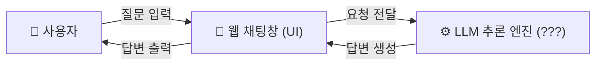
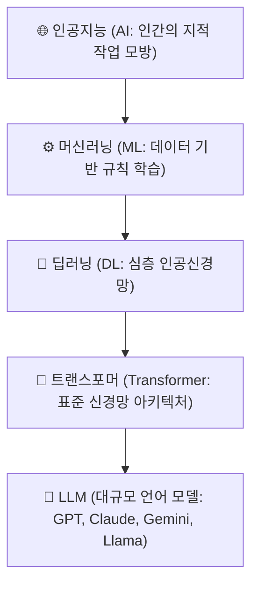
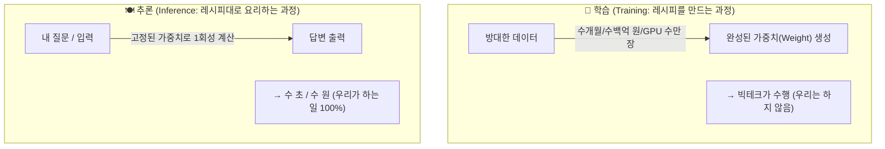
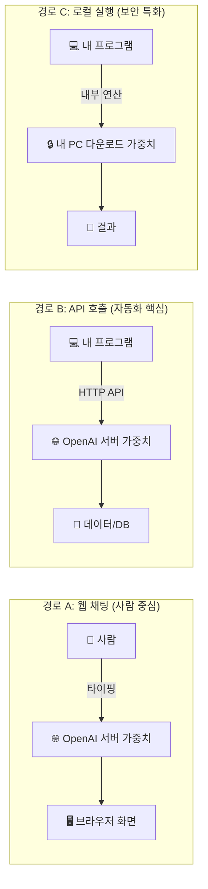
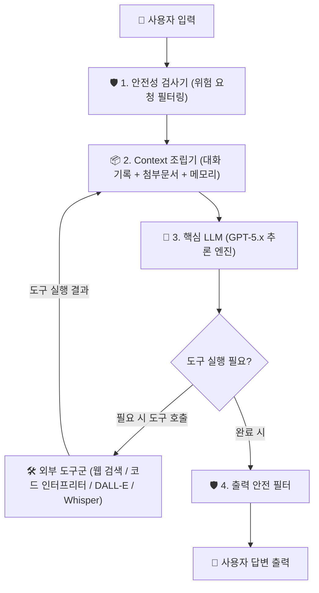
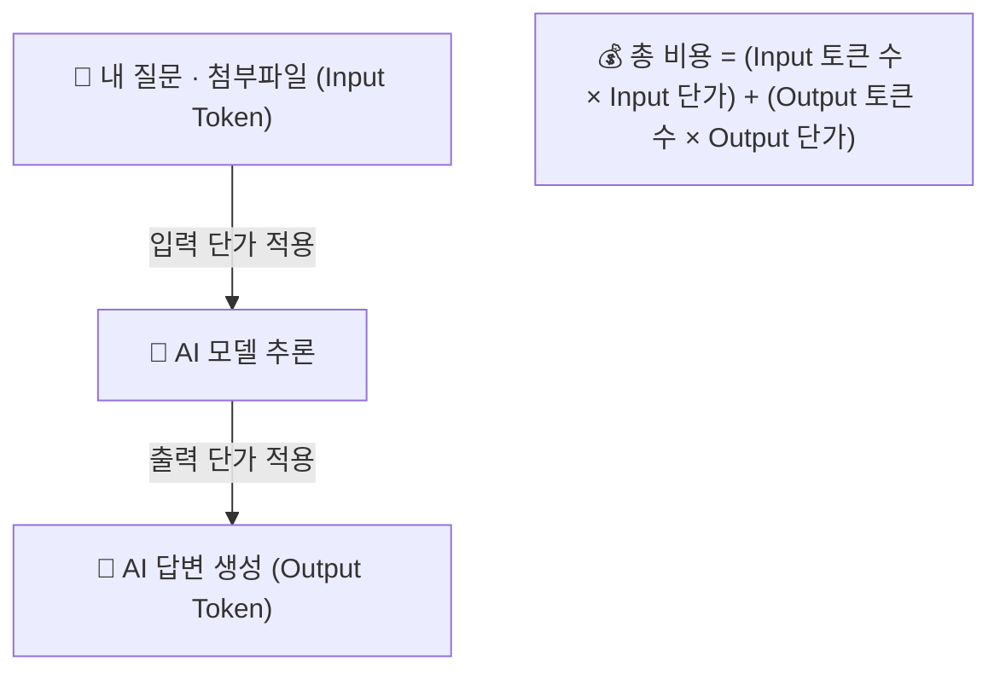
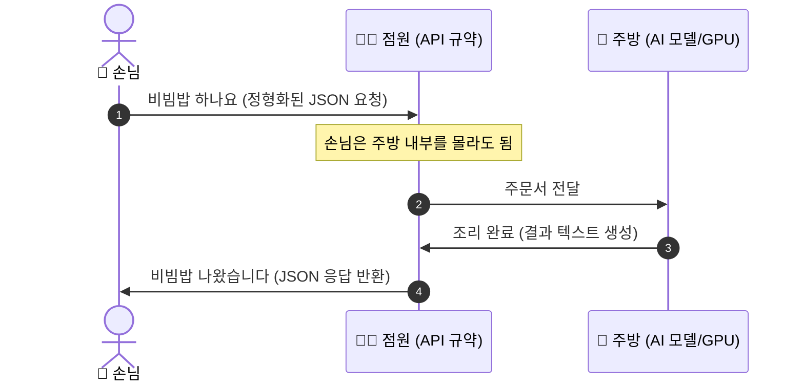
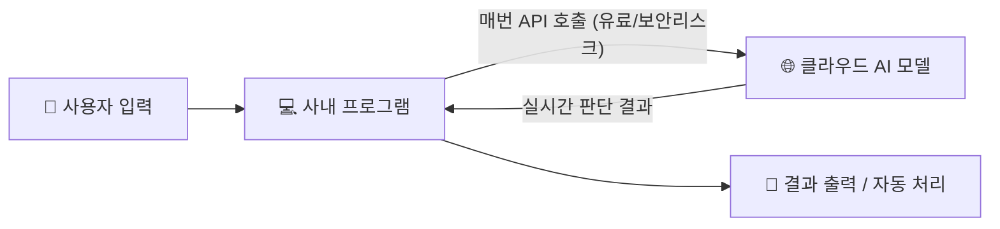
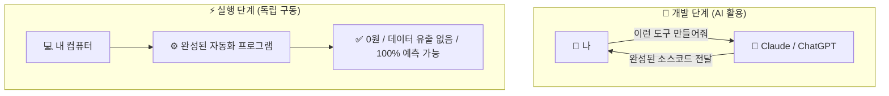
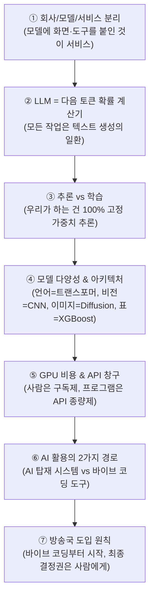

# 🤖 AI의 이해 — "AI를 쓴다"는 것이 정확히 무엇인가

> **교육 대상**: 프로그래밍 경험이 없거나 적은 직장인 / 방송기술직 직원
> **교육 목표**: AI의 작동 원리를 한 줄기로 이해하고, 비용 구조와 API의 필요성을 파악하며, 방송국 환경에서 AI를 안전하게 활용하는 기준을 세운다
> **핵심 메시지**: **"최근 우리가 대화하며 쓰는 AI는 대부분 LLM이다. LLM은 학습이 끝난 거대한 확률 계산기이고, ChatGPT 같은 서비스는 그 모델에 대화 기록과 여러 도구를 연결한 완성품이다."**

---

## 📖 이 교재가 답하는 질문들

이 교재는 **하나의 질문에서 다음 질문으로 이어지는 순서**로 구성되어 있습니다.
각 Part의 끝에는 다음 Part로 넘어가는 질문이 붙어 있습니다.

| Part | 제목 | 이 Part가 답하는 질문 |
|:---:|------|------------------------|
| **Part 0** | 회사·모델·서비스 구분 | OpenAI와 ChatGPT, GPT는 무엇이 다른가? |
| **Part 1** | AI의 정체 | AI는 실제로 무엇을 계산하고 있는가? |
| **Part 2** | AI를 사용한다는 것 | "AI를 쓴다"는 말은 정확히 무슨 동작인가? |
| **Part 3** | 모델의 세계 (HuggingFace) | 세상의 AI 모델들은 다 같은 원리인가?<br>"생성형 AI"란 정확히 무엇인가? |
| **Part 4** | AI는 공짜가 아니다 | 구독제와 API는 왜 따로 있고, 비용은 어떻게 생기는가? |
| **Part 5** | API란 무엇인가 | 프로그램이 Context와 도구를 조립해 AI를 쓰는 방법 |
| **Part 6** | 목적에 따른 AI 활용 방식 | "AI로 만들었다"의 두 가지 의미 |
| **Part 7** | 방송국에서의 AI | 왜 AI에게 결정권을 줄 수 없는가? |

<br>

---

<br>

# Part 0: 먼저 보는 AI 회사·모델·서비스

## 0.1 회사 이름과 AI 이름부터 구분하기

AI를 처음 접하면 **회사, 모델, 서비스 이름**이 한꺼번에 등장해서 가장 먼저 헷갈립니다.
자동차에 비유하면 쉽게 구분할 수 있습니다.

| 구분 | 자동차 비유 | AI 예시 |
|------|-------------|---------|
| **회사(Provider)** | 자동차 제조사 | OpenAI, Google, Anthropic, Meta |
| **모델(Model)** | 엔진 | GPT, Gemini, Claude, Llama |
| **서비스·앱(Service)** | 엔진과 기능을 조립한 완성차 | ChatGPT, Gemini 앱, Claude.ai, Kimi |

> **핵심:** 우리는 보통 완성된 **서비스**를 먼저 만나지만, 답변을 생성하는 핵심 계산기는 그 안의 **모델**입니다.

### 미국을 중심으로 한 주요 업체

| 회사 | 대표 모델 계열 | 일반 사용자가 만나는 서비스 | 알아둘 특징 |
|------|----------------|-----------------------------|-------------|
| **OpenAI** | GPT-5.6 Sol·Terra·Luna, GPT-Image-2 | ChatGPT | **ChatGPT는 서비스**, GPT는 그 안에서 쓰이는 모델 계열 |
| **Google** | Gemini 3.6 Flash, 3.5 Flash, 3.1 Pro(Preview) | Gemini | 검색·문서·클라우드 등 Google 생태계와 연결 |
| **Anthropic** | Claude Fable 5, Opus 5, Sonnet 5, Haiku 4.5 | Claude.ai, Claude Code | Claude라는 이름이 모델 계열과 서비스 양쪽에 쓰임 |
| **Meta** | Llama 4 Scout, Maverick | Meta AI 및 여러 외부 서비스 | 가중치를 받아 직접 운영할 수 있는 **오픈 웨이트** 생태계가 큼 |

### 중국의 주요 업체

| 회사 | 대표 모델·서비스 | 관계와 특징 |
|------|------------------|-------------|
| **Z.ai** | GLM-5.1, GLM-5V-Turbo, GLM-Image | GLM 계열의 텍스트·멀티모달·이미지 모델 제공 |
| **Moonshot AI** | Kimi, Kimi K2.5 | **Kimi는 별도 회사가 아니라 Moonshot AI의 서비스·모델 브랜드** |
| **DeepSeek** | DeepSeek V4 Pro, V4 Flash | 추론·코딩 모델과 API, 공개 가중치 생태계로 알려진 업체 |

> **모델명 기준일: 2026-08-28.** 모델은 휴대전화 신제품처럼 계속 바뀝니다.
> 이름을 전부 외우기보다 **회사 → 모델 → 서비스**의 관계를 구분하는 것이 중요합니다.
> 최신 명칭은 각 업체의 공식 모델 목록([OpenAI](https://developers.openai.com/api/docs/models/all), [Google](https://ai.google.dev/gemini-api/docs/models), [Anthropic](https://platform.claude.com/docs/en/about-claude/models/overview), [Meta](https://ai.meta.com/llama/get-started/), [Z.ai](https://docs.z.ai/guides/overview/overview), [Moonshot AI](https://platform.moonshot.ai/docs/guide/prompt-best-practice), [DeepSeek](https://api-docs.deepseek.com/api/list-models/))에서 확인합니다.

---

## 0.2 같은 회사도 모델을 여러 개 만드는 이유

최고 성능 모델 하나만 있으면 될 것 같지만, 실제 업무는 **성능·속도·비용**의 우선순위가 다릅니다.

| 모델 종류 | 자동차 비유 | 적합한 일 |
|-----------|-------------|-----------|
| **최상위·고성능형** | 힘이 세지만 연료를 많이 쓰는 대형차 | 복잡한 기획, 어려운 추론, 긴 코딩 작업 |
| **균형형** | 일상용 승용차 | 문서 작성, 요약, 일반 업무 대화 |
| **경량·고속형** | 작고 연비 좋은 경차 | 단순 분류, 형식 변환, 대량 반복 처리 |
| **특화형** | 목적에 맞춘 특수차 | 이미지, 음성, 영상, 임베딩 등 특정 작업 |

따라서 **"어느 회사가 제일 좋은가"** 보다 **"이 일에는 어느 정도의 모델이 필요한가"** 를 묻는 편이 실무적입니다.

---

## 📌 Part 0 정리

```text
회사(Provider)가 모델(Model)을 만들고,
그 모델에 화면·대화 기록·검색·파일·도구를 붙이면 서비스(Service)가 된다.

OpenAI  → GPT 모델 계열    → ChatGPT 서비스
Moonshot AI → Kimi 모델 계열 → Kimi 서비스
```

> ### 🔗 그러면 다음 질문이 생깁니다
> 이 회사들이 만드는 모델, 특히 요즘 말하는 **LLM은 대체 무엇인가?** → **Part 1**

<br>

---

<br>

# Part 1: AI의 정체

## 1.1 우리가 "AI"라고 부르는 것은 껍데기다

우리가 일상에서 "AI"라고 부르는 것은 대부분 **ChatGPT, Gemini, Claude** 같은 **웹 채팅 화면**입니다.



하지만 채팅창은 **자동차의 핸들**과 같습니다. 핸들을 안다고 엔진을 아는 것은 아닙니다.

> 🎯 **Part 1의 목표**
> 저 물음표(???) 안에서 **정확히 어떤 계산이 일어나는지**를 이해하는 것.
> 이걸 이해하면 뒤에 나오는 **비용, API, 환각, Context 관리**가 전부 자동으로 설명됩니다.

---

## 1.2 요즘 우리가 말하는 AI는 대부분 LLM이다

AI는 오래전부터 있었습니다. 다만 최근 사람들이 **"진짜 사람처럼 느껴진다"** 고 말하는 AI는 대체로
ChatGPT·Gemini·Claude 같은 **대규모 언어 모델(LLM, Large Language Model)** 기반 서비스입니다.

이전의 AI와 지금의 생성형 AI를 아주 단순하게 비교하면 다음과 같습니다.

| 구분 | 분류형·판별형 AI | 생성형 AI |
|------|------------------|-----------|
| **하는 일** | 주어진 후보 중 하나를 판정 | 새로운 텍스트·이미지·음성·영상·코드를 생성 |
| **대표적 학습 방식** | 정답 라벨이 있는 사례에서 판정 경계를 학습 | 데이터에 나타난 복잡한 분포와 패턴을 학습 |
| **결과 예시** | `스팸 97%`, `정상 3%` | 새로운 답변, 보고서, 그림, 음악, 코드 |
| **대표 사례** | 스팸 필터, 불량품 판정, 대출 위험도 분류 | ChatGPT, 이미지 생성, 음악·영상 생성 |

| 유형 | 동작 흐름 | 실제 처리 예시 |
| :--- | :--- | :--- |
| **분류형 AI** | 과거 메일 + 정답표 학습 ➔ 새 메일 판정 | 새 메일 입력 ➔ `스팸 97%, 정상 3%` ➔ **"스팸" 판정** |
| **생성형 AI** | 방대한 텍스트 패턴 학습 ➔ 새 문장 생성 | _"회의록 요약해줘"_ ➔ **이전에 없던 새로운 요약문 생성** |

> **오해 주의:** 생성형 AI는 영상·이미지만 만드는 AI가 아닙니다.
> ChatGPT가 답변을 만들고, 코딩 AI가 코드를 만드는 것도 모두 **생성**입니다.

### 왜 업무 교육에서는 영상·이미지보다 LLM을 먼저 배우는가

영상·이미지·음악 생성 모델은 주로 특정 형태의 결과물을 만듭니다. 반면 LLM은 사람이 일할 때 쓰는
**언어·지식·지시·문서·코드**를 다루고, 필요하면 검색·계산기·파일·업무 시스템 같은 도구를 호출할 수도 있습니다.

따라서 LLM이 모든 생성 모델보다 절대적으로 더 중요하다는 뜻이 아니라,
**대부분의 사무 업무와 자동화에서 가장 범용적인 출발점**이라는 뜻입니다.

---

## 1.3 AI의 계보 — 인공지능 → 머신러닝 → 딥러닝 → 트랜스포머

먼저 용어부터 정리합니다. 이 넷은 **경쟁 관계가 아니라 포함 관계**입니다.




| 용어 | 한 줄 정의 | 비유 |
|------|-----------|------|
| **인공지능(AI)** | 기계가 지적 작업을 수행 | "탈것" |
| **머신러닝(ML)** | 데이터로부터 규칙을 스스로 학습 | "엔진으로 가는 탈것" |
| **딥러닝(DL)** | 신경망을 깊게 쌓은 머신러닝 | "내연기관 자동차" |
| **트랜스포머** | 딥러닝 설계도(아키텍처)의 한 종류 | "특정 엔진 설계 방식" |
| **LLM** | 트랜스포머로 만든 초대형 언어 모델 | "그 엔진을 얹은 대형 트럭" |

> ⚠️ **자주 하는 오해**
> "딥러닝과 트랜스포머는 다른 것 아닌가요?" → **아닙니다.**
> 트랜스포머는 **딥러닝의 한 종류**입니다. 모든 트랜스포머는 딥러닝이지만,
> 모든 딥러닝이 트랜스포머는 아닙니다. (이건 Part 3에서 아주 중요해집니다)

LLM도 딥러닝의 한 종류입니다. 따라서 LLM이 왜 확률로 답하고,
학습이 끝난 뒤에는 지식이 저절로 바뀌지 않는지 이해하려면 딥러닝의 공통 흐름만 알면 됩니다.

---

## 1.4 LLM을 이해하기 위한 한 단계 — "숫자를 넣으면 확률이 나온다"

앞서 LLM이 **'딥러닝'**의 일종이라고 했습니다.
그렇다면 딥러닝이라는 기계 안에서는 대체 무슨 일이 일어나고 있을까요?

딥러닝 모델은 사람처럼 생각하는 뇌가 아니라, **"입력 숫자를 출력 숫자로 바꾸는 거대한 계산기"**입니다.

```text
[사람의 세상] 글자·이미지·소리  ──▶  [1. 숫자로 변환]
                                            │
                                            ▼
[AI 모델 내부]                    [2. 가중치 공식으로 계산]
                                            │
                                            ▼
[AI의 최종 출력]                  [3. 후보별 확률 점수]
```

이 원리를 이해하기 위해 딱 **3가지 사실**만 연결해서 기억하면 됩니다.

---

### 1️⃣ 컴퓨터는 글자를 모릅니다 (입력도 숫자, 출력도 숫자)
컴퓨터는 한글도, 영어도, 사진도 이해하지 못합니다. 오직 **숫자(0과 1)**만 압니다.
따라서 우리가 "안녕"이라는 글을 넣든, 강아지 사진을 넣든, AI에게 들어갈 때는 **전부 숫자로 변환**되어 들어갑니다.

### 2️⃣ AI의 '지식'은 계산 공식에 적힌 숫자들입니다 (가중치)
숫자가 들어오면 AI는 미리 정해진 거대한 수학 공식으로 계산을 합니다. 이 공식에 적혀 있는 수십억~수천억 개의 숫자를 **가중치(Weight, 파라미터)**라고 부릅니다.

* **요리 비유로 이해하기:**
  * **가중치(Weight):** 수많은 시행착오 끝에 완성된 **'절대 비밀 레시피'**
  * **학습(Training):** 최적의 맛을 내는 레시피(숫자들)를 알아내는 과정 (수백억 원의 비용과 수개월의 시간 소요)
  * **추론(Inference / 사용):** 완성된 레시피대로 재료(입력값)를 넣고 요리(계산)만 하는 과정 (우리가 ChatGPT를 쓸 때)

> 💡 **학습이 끝나면 가중치는 고정됩니다.**
> 우리가 AI 모델을 내려받는다는 것은 바로 이 **'완성된 가중치 파일'**을 받는다는 뜻입니다.
> 이미 완성된 공식이므로, 사용하는 도중에는 지식이 저절로 늘어나거나 바뀌지 않습니다.

### 3️⃣ 계산 결과는 '정답'이 아니라 '확률 점수'로 나옵니다
계산식을 거쳐 나온 최종 결과 역시 숫자입니다. 바로 **"각 후보가 맞을 확률(점수)"**입니다.

* **스팸 분류 AI:** `[메일 텍스트(숫자)]` ➔ 계산 ➔ `스팸일 확률 97%`, `정상일 확률 3%`
* **LLM (언어 모델):** `[지금까지의 문장(숫자)]` ➔ 계산 ➔ `다음에 '서울'이 올 확률 87%`, `'어디'가 올 확률 4%`

---

> ### 🔗 1.5로 이어지는 핵심 질문
> "분류 AI가 스팸일 확률을 맞히듯, **LLM은 다음에 올 단어의 확률을 맞히는 계산기**일 뿐입니다.
> 그렇다면 LLM은 우리가 입력한 문장을 **어떻게 숫자로 쪼개서 넣고, 어떻게 문장으로 다시 완성해 내는 걸까요?**"
> ➔ **1.5절에서 그 3단계 과정을 살펴봅니다.**

---

## 1.5 ⭐ 핵심: 그래서 LLM은 왜 "텍스트 생성기"인가

여기가 이 교재에서 **가장 중요한 부분**입니다.

LLM은 사람의 질문을 "이해"하고 "대답"하는 것처럼 보이지만,
실제로 하는 계산은 **단 하나**입니다.

> ### 🔑 **"지금까지의 텍스트 다음에 올 단어 조각(토큰) 하나의 확률을 계산한다."**
>
> 이것뿐입니다. 정말로 이것뿐입니다.

### 1단계: 텍스트를 숫자로 쪼갠다 (토큰화)

```
"대한민국의 수도는"
        │
        ▼  토큰화 (Tokenization)
["대한", "민국", "의", " 수도", "는"]
        │
        ▼  각 토큰을 사전의 번호로 변환
[15234, 8821, 374, 42100, 1102]     ← 이제 모델이 먹을 수 있는 숫자
```

### 2단계: 모델은 "다음 토큰 확률표"를 출력한다

모델이 내놓는 것은 문장이 아니라 **사전에 있는 모든 토큰(보통 5만~20만 개)에 대한 확률표**입니다.

| 후보 토큰 | 확률 점수 | 시각화 (확률 분포) | 최종 판정 |
| :--- | :---: | :--- | :---: |
| `" 서울"` | **87.2%** | `████████████████████` | **선택 (샘플링) ✅** |
| `" 어디"` | **4.1%** | `█` | 후보 제외 |
| `" 예로부터"` | **1.3%** | `▏` | 후보 제외 |
| `" 부산"` | **0.4%** | `▏` | 후보 제외 |
| `" 바나나"` | **0.00003%** | ` ` | 후보 제외 |
| ... | ... | (전체 12만 개 토큰에 점수 부여) | ... |


### 3단계: 뽑은 토큰을 입력에 붙이고, 다시 처음부터 반복한다 (자기회귀)

```
1회차  입력: "대한민국의 수도는"              → 출력: " 서울"
2회차  입력: "대한민국의 수도는 서울"          → 출력: "입니다"
3회차  입력: "대한민국의 수도는 서울입니다"     → 출력: "."
4회차  입력: "대한민국의 수도는 서울입니다."    → 출력: [끝] 토큰
                                                    │
                                                    ▼
최종 결과: "대한민국의 수도는 서울입니다."
```

> 💡 **채팅창에서 글자가 한 글자씩 타자 치듯 나오는 이유가 바로 이것입니다.**
> 답변을 통째로 만들어 놓고 천천히 보여주는 연출이 아니라,
> **진짜로 토큰을 하나씩 계산해서 뱉고 있는 중**입니다.

### 그러면 번역, 요약, 코딩, 분류는 뭔가?

**전부 똑같은 "다음 토큰 예측"입니다.** 다른 기능이 아닙니다.

| 우리가 시키는 일 | LLM이 실제로 하는 계산 |
|-----------------|----------------------|
| "이 문장 영어로 번역해줘" | `"한국어: 안녕하세요 / 영어:"` 다음에 올 확률 높은 토큰들을 이어 씀 |
| "이 보고서 요약해줘" | `"[본문 5000자] / 요약:"` 다음에 올 확률 높은 토큰들을 이어 씀 |
| "파이썬 코드 짜줘" | `"# 엑셀을 읽는 함수\ndef"` 다음에 올 확률 높은 토큰들을 이어 씀 |
| "이 민원 카테고리 분류해줘" | `"[민원내용] / 분류:"` 다음에 올 확률 높은 토큰을 씀 (`"시설"` 등) |
| "안녕?" (잡담) | `"사용자: 안녕? / AI:"` 다음에 올 확률 높은 토큰들을 이어 씀 |

> 🎯 **결론**
> LLM에게 "번역 기능", "요약 기능", "코딩 기능"이 따로 있는 게 아닙니다.
> **기능은 하나(다음 토큰 생성)이고, 우리가 앞에 붙이는 텍스트가 달라질 뿐**입니다.
> 그래서 LLM을 **"텍스트 생성기(Text Generation)"** 라고 부르는 것입니다.
> 그리고 그래서 **프롬프트(입력 텍스트)를 어떻게 쓰느냐가 결과를 좌우**합니다.
>
> 📌 여기서 말하는 **"생성(Generation)"이 곧 "생성형 AI(Generative AI)"의 그 생성**입니다.
> **ChatGPT는 대표적인 생성형 AI입니다.** 이 용어는 **Part 3.3**에서 정확히 정리합니다.

---

## 1.6 한 번만 답하는 모델이 어떻게 대화하는가

LLM 자체는 사람처럼 지난 일을 계속 기억하는 존재가 아닙니다.
기본 동작은 **입력 한 묶음을 받고 → 답변 한 묶음을 내는 일회성 계산**입니다.

```text
[모델만 단독으로 사용할 때]
질문 1개 입력 → 답변 1개 출력 → 계산 종료
```

그렇다면 ChatGPT에서는 왜 자연스럽게 추가 질문을 할 수 있을까요?
가장 단순한 방법은 **지금까지의 대화 전체를 새 질문과 함께 매번 다시 보내는 것**입니다.

```text
[첫 번째 요청]
사용자: 제주도 2박 3일 일정 짜줘.
                         → LLM → 첫 번째 답변

[두 번째 요청: 실제로는 아래 묶음을 다시 보냄]
사용자: 제주도 2박 3일 일정 짜줘.
AI:     첫 번째 답변 전체
사용자: 아이와 가는 일정으로 바꿔줘.
                         → LLM → 두 번째 답변
```

두 번째 요청에 첫 질문과 첫 답변이 들어 있으므로, 모델은 **"무슨 일정을 바꾸라는 것인지"** 알 수 있습니다.
모델이 기억을 꺼낸 것이 아니라, 서비스가 이전 내용을 **컨텍스트(Context)** 로 다시 넣어준 것입니다.

> **아주 단순화한 설명입니다.** 실제 서비스는 대화가 너무 길어지면 오래된 내용을 잘라내거나,
> 요약하거나, 관련 있는 내용만 찾아 넣기도 합니다. 그래도 핵심 원리는 같습니다.
> **모델이 기억하는 것이 아니라, 소프트웨어가 기억할 내용을 골라 다시 입력합니다.**

### GPT와 ChatGPT가 다른 이유

```text
GPT 모델
  = 입력을 받아 다음 토큰을 계산하는 핵심 엔진

ChatGPT 서비스
  = GPT 모델
  + 채팅 화면
  + 대화 기록 관리
  + 파일 첨부
  + 웹 검색
  + 코드 실행·이미지 생성 같은 도구
  + 안전장치와 사용자 설정
```

따라서 **GPT는 모델**, **ChatGPT는 GPT 모델을 중심으로 여러 기능을 조립한 서비스**입니다.
대화를 자연스럽게 이어주는 것은 모델 성능만의 결과가 아니라 **컨텍스트를 관리하는 소프트웨어 엔지니어링**의 결과이기도 합니다.

### 최신 정보와 첨부파일도 같은 원리다

- **지식 기준일(Knowledge cutoff)**: 모델 학습이 끝난 시점 이후의 사건은 가중치 안에 없습니다.
- **웹 검색**: 서비스가 인터넷에서 새 정보를 가져와 현재 입력에 붙인 뒤 모델에게 답하게 합니다.
- **파일 첨부**: 파일 내용을 읽어 현재 입력에 참고자료로 붙입니다. 보통 모델 자체를 다시 학습시키는 것이 아닙니다.

이 차이를 이해하려면 **학습·추론·파인튜닝**을 구분해야 합니다. Part 2에서 바로 이어서 설명합니다.

---

## 1.7 ⭐ 이 원리 하나로 설명되는 6가지 현상

"LLM = 확률 기반 텍스트 생성기"를 이해하면, AI를 쓰면서 겪는 대부분의 현상이 설명됩니다.
**이 표가 Part 1의 결론**입니다.

| # | 현상 | 원리로 설명하면 |
|:--:|------|----------------|
| 1 | **환각 (없는 사실을 지어냄)** | 모델은 "사실 확인"을 하지 않습니다. **그럴듯한 텍스트**를 만들 뿐입니다. 존재하지 않는 논문 제목도, 문법·문체상 자연스러우면 높은 확률을 받습니다. **거짓말이 아니라 설계상 당연한 동작**입니다 |
| 2 | **같은 질문에 매번 다른 답** | 확률표에서 **매번 새로 뽑기(샘플링)** 때문입니다. 1등만 고르게 하면(temperature=0) 거의 같은 답이 나옵니다 |
| 3 | **프롬프트를 바꾸면 결과가 확 달라짐** | 입력 텍스트가 곧 **확률 계산의 조건**입니다. 조건이 바뀌면 확률표 전체가 바뀝니다 |
| 4 | **간단한 숫자 계산을 틀림** | 계산기가 아니라 **"계산처럼 보이는 텍스트" 생성기**이기 때문입니다. (그래서 요즘 서비스는 계산을 코드 실행 도구에 넘깁니다) |
| 5 | **파일을 올려도 "학습"되지 않음** | 가중치는 학습이 끝나면 **고정**입니다. 파일 업로드는 가중치를 바꾸는 게 아니라, 파일 내용을 **현재 대화·프로젝트의 Context로 제공**하는 것입니다 |
| 6 | **최신 정보를 모름** | 가중치는 **학습 시점까지의 데이터**로 만들어졌습니다. 이후 정보는 애초에 들어있지 않습니다 → 그래서 웹 검색 도구를 따로 붙입니다 |

> 🔗 **특히 5번을 기억하십시오.**
> "AI에게 우리 회사 매뉴얼을 학습시키자"는 말이 왜 대부분 틀린 표현인지,
> 그리고 왜 **Context(문맥) 관리**가 바이브 코딩의 핵심 기술인지가 여기서 나옵니다.
> → 이 주제는 **[3-0. CONTEXT_관리.md](./3-0.%20CONTEXT_관리.md)** 에서 본격적으로 다룹니다.

---

## 1.8 트랜스포머 — 왜 이 구조가 표준이 되었나

LLM이 위 계산을 잘 해내는 이유는 **트랜스포머(Transformer)** 라는 설계 덕분입니다.

> 💡 **트랜스포머**
> 2017년 구글이 발표한 논문 *"Attention Is All You Need"* 에서 제안된 딥러닝 아키텍처.
> **Attention(주의) 메커니즘**으로 문장 안의 모든 단어가 서로를 동시에 참조합니다.

```
[이전 방식: RNN/LSTM]
  "나는" → "어제" → "친구와" → "밥을" → "먹었다"
  앞에서부터 한 단어씩 순서대로 읽음
  → 느리고(병렬 불가), 문장이 길면 앞부분을 잊어버림

[트랜스포머]
  "나는  어제  친구와  밥을  먹었다"
    ↕     ↕     ↕      ↕      ↕
   모든 단어가 서로를 동시에 쳐다봄 (Attention)
  → "먹었다"는 "밥을"과 강하게 연결, "어제"와는 시제로 연결
  → 한 번에 처리 가능(병렬), 멀리 떨어진 단어도 연결 가능
```

**트랜스포머가 전 분야를 점령한 이유 3가지:**

| # | 이유 | 결과 |
|:--:|------|------|
| 1 | **병렬 처리 가능 (GPU 친화적)** | 모든 단어를 동시 연산 → GPU 100% 활용해 모델을 거대하게 확장 가능 |
| 2 | **장거리 의존성 해결 (Attention)** | 문장이 길어져도 앞뒤 맥락 소실 없이 핵심 단어 간 관계를 직접 연결 |
| 3 | **멀티모달 확장성 (범용 아키텍처)** | 텍스트뿐만 아니라 이미지(ViT), 음성(Whisper), 영상 등 모든 데이터에 동일 구조 적용 가능 |

---

## 📌 Part 1 정리

| # | 핵심 개념 | 상세 원리 요약 |
|:-:| :--- | :--- |
| **1** | **대화형 AI = LLM** | 최근 대화형 AI의 중심은 LLM이며, 코드를 만드는 코딩 AI도 생성형 AI에 속함 |
| **2** | **포함 관계 계보** | 인공지능(AI) ⊃ 머신러닝(ML) ⊃ 딥러닝(DL) ⊃ 트랜스포머 ⊃ LLM |
| **3** | **가중치(Weight)의 의미** | 숫자를 넣으면 확률이 나오는 거대 수식이며, 수식의 계수(가중치)가 곧 AI의 지식 |
| **4** | **다음 토큰 확률 계산** | LLM이 하는 일은 "다음 토큰 예측"의 반복 (번역/요약/코딩/분류 모두 동일) |
| **5** | **일회성 계산기** | 모델은 기억 상실 상태이며, 서비스가 대화 기록(Context)을 매번 다시 주입해 줌 |
| **6** | **근본 원리의 파급** | 이 원리로 환각, 랜덤성, 계산 실수, "업로드 ≠ 학습", 최신정보 부재가 모두 설명됨 |

> ### 🔗 그러면 다음 질문이 생깁니다
> 가중치가 학습 후 **고정**된다면, 우리가 ChatGPT를 쓰는 행위는 도대체 무엇인가?
> 우리는 AI를 **만드는** 것인가, **쓰는** 것인가? → **Part 2**

<br>

---

<br>

# Part 2: "AI를 사용한다"는 것의 정확한 의미

## 2.1 학습(Training)과 추론(Inference) — 이 둘의 구분이 전부다

AI와 관련된 모든 활동은 **딱 두 가지**로 나뉩니다.



| 구분 | 학습 (Training) | 추론 (Inference) |
|------|----------------|------------------|
| **하는 일** | 가중치 숫자를 만들어냄 | 가중치는 그대로 두고 계산만 함 |
| **비유** | 학생이 몇 년간 공부하는 것 | 학생이 시험 문제 하나를 푸는 것 |
| **비용** | 대규모 GPU와 데이터에 막대한 비용 | 입력·출력 길이와 모델에 따라 매 요청 과금 |
| **시간** | 수주~수개월 | 보통 수 초, 복잡한 작업은 더 오래 걸림 |
| **가중치가 변하나?** | ✅ 변함 (그게 목적) | ❌ **변하지 않음** |
| **누가 하나** | OpenAI, Google, Meta 등 | **우리** |

> 🎯 **"AI를 사용한다" = 남이 만들어 놓은 가중치 파일에 내 입력을 넣고 계산을 시키는 것.**
> 대화를 많이 해도 그 자리에서 **모델의 가중치가 나에게 맞게 학습되는 것은 아닙니다.**
> 기억하는 것처럼 보이는 것은 서비스가 이전 대화나 별도로 저장한 사용자 정보를 다시 입력하기 때문입니다.

---

## 2.2 "AI를 사용한다"의 3가지 층위

같은 "AI 사용"이라도 난이도와 비용이 완전히 다릅니다.

| 층위 | 구분 | 내용 및 필요 자원 | 비용 및 예시 |
| :---: | :--- | :--- | :--- |
| **층위 1** | **추론만 수행 (Inference)**<br>*(우리의 99%)* | • 완성된 모델에 입력을 넣고 결과 획득<br>• 필요: 인터넷 + 계정 (또는 API 키) | • 사용량만큼만 결제<br>• 예: ChatGPT, Claude Code, API 호출 |
| **층위 2** | **모델 미세 조정 (Fine-tuning)**<br>*(특수 목적)* | • 완성된 모델 가중치를 내 데이터로 소폭 조정<br>• 필요: 수백~수만 건 정제 데이터 + GPU | • 수십만~수천만 원<br>• 예: 특수 사내 말투 모델 *(RAG로 대체 권장)* |
| **층위 3** | **백지부터 사전학습 (Pre-training)**<br>*(빅테크 영역)* | • 인터넷 규모 데이터로 가중치 백지 학습<br>• 필요: GPU 수만 장 + 수개월 | • 수백억 원 이상<br>• 예: OpenAI, Google, Meta 등이 수행 |

> 💡 이 교육 과정에서 다루는 것은 **전부 층위 1(추론)** 입니다.
> "AI를 활용한다"고 할 때 겁먹을 필요가 없는 이유가 이것입니다.

---

## 2.3 추론을 실행하는 3가지 경로

층위 1(추론)이라도 **어디서 계산하느냐**에 따라 3가지 방식이 있습니다.  
**이 표가 뒤의 Part 4(비용)와 Part 5(API)의 기반**이 됩니다.



| 항목 | A. 웹 채팅 | B. API | C. 로컬 실행 |
|------|-----------|--------|-------------|
| **가중치가 있는 곳** | 남의 서버 | 남의 서버 | **내 컴퓨터** |
| **모델 파일 다운로드** | 불가 | 불가 | 필요 (수 GB~수백 GB) |
| **자동화 가능?** | ❌ | ✅ | ✅ |
| **내 데이터가 나가나?** | ⚠️ 나감 | ⚠️ 나감 | ✅ 안 나감 |
| **필요 장비** | 없음 | 없음 | GPU |
| **비용 형태** | 월 구독료 | 사용량 과금 | 장비 구입비 + 전기료 |

> 🎯 **경로 C가 가능한 이유는 딱 하나입니다.**
> **가중치 파일을 공개한 모델(오픈 웨이트)** 이 존재하기 때문입니다.
> GPT-5나 Claude는 가중치를 공개하지 않으므로 경로 C가 불가능합니다.
> 그럼 그 공개된 모델들은 어디에 있을까요? → **Part 3**

---

## 📌 Part 2 정리

| # | 핵심 원리 요약 |
|:-:| :--- |
| **1** | 모든 AI 활동은 **학습(Training)** 또는 **추론(Inference)** 둘 중 하나이다. |
| **2** | 우리가 하는 것은 **100% 추론**이며, 가중치는 절대 변하지 않는다. |
| **3** | "AI 사용"이란 **남의 가중치에 내 입력을 넣고 계산시키는 것**이다. |
| **4** | 추론 실행 경로는 **웹 채팅 / API / 로컬 실행** 3가지가 있다. |
| **5** | 로컬 실행은 가중치가 공개된 **오픈 웨이트 모델**이 있어야만 가능하다. |

> ### 🔗 그러면 다음 질문이 생깁니다
> 공개된 모델들은 어디에 모여 있고, 그것들은 **전부 LLM/트랜스포머인가?** → **Part 3**

<br>

---

<br>

# Part 3: 모델의 세계 — HuggingFace와 아키텍처의 진실

## 3.1 HuggingFace — AI 모델의 앱스토어

**[HuggingFace](https://huggingface.co)** 는 전 세계 연구자·기업이 만든 **AI 모델 가중치 파일이 공개적으로 모여 있는 플랫폼**입니다. (2026년 기준 200만 개 이상)

| 역할 | 설명 |
|------|------|
| **모델 저장소** | 가중치 파일을 올리고 내려받는 곳 (= Part 2의 "경로 C"를 가능하게 함) |
| **Task별 분류** | 텍스트 생성, 번역, 음성 인식, 이미지 분류, 객체 탐지 등 수십 개 카테고리 |
| **데이터셋 / Spaces** | 학습용 데이터셋 공유, 브라우저에서 모델을 즉시 체험 |

HuggingFace에 들어가면 왼쪽에 이런 **Task 목록**이 보입니다.

```
Natural Language Processing
  ├─ Text Generation          (텍스트 생성)      ← LLM
  ├─ Text Classification      (분류/감성분석)
  ├─ Translation              (번역)
  ├─ Summarization            (요약)
  ├─ Question Answering       (질의응답)
  └─ Sentence Similarity      (문장 유사도)      ← RAG 검색의 핵심
Computer Vision
  ├─ Image Classification     (이미지 분류)
  ├─ Object Detection         (객체 탐지)
  ├─ Image Segmentation       (영역 분할)
  └─ Text-to-Image            (이미지 생성)
Audio
  ├─ Automatic Speech Recognition (음성 → 텍스트, STT)
  ├─ Text-to-Speech               (텍스트 → 음성, TTS)
  └─ Audio Classification         (소리 분류)
Tabular / Time Series / Reinforcement Learning ...
```

---

## 3.2 ⭐ 핵심 질문: 이 모델들은 전부 딥러닝인가? 전부 트랜스포머인가?

**정확한 답은 이렇습니다.**

> ### ✅ **딥러닝인가?** → **거의 대부분 예. 하지만 전부는 아닙니다.**
> ### ⚠️ **트랜스포머인가?** → **아닙니다. 분야마다 다릅니다.**

Task별 실제 아키텍처를 정리하면 다음과 같습니다.

| 분야 | Task | 대표 모델 | 실제 아키텍처 | 딥러닝? | 트랜스포머? |
|------|------|----------|--------------|:------:|:----------:|
| **언어** | 텍스트 생성 | Llama, Qwen, Mistral, Gemma | Decoder Transformer | ✅ | ✅ |
| **언어** | 분류/감성분석 | BERT, RoBERTa, DeBERTa | Encoder Transformer | ✅ | ✅ |
| **언어** | 문장 임베딩(검색) | BGE, E5, sentence-transformers | Encoder Transformer | ✅ | ✅ |
| **언어** | 번역 | NLLB, M2M100, T5 | Encoder-Decoder Transformer | ✅ | ✅ |
| **언어** | 개체명 인식 등 경량 처리 | spaCy, fastText | 통계/얕은 신경망 | ⚠️ 일부만 | ❌ |
| **음성** | 음성 인식 (STT) | Whisper | CNN + Transformer | ✅ | ✅ |
| **음성** | 음성 인식 (STT) | wav2vec 2.0 | CNN + Transformer | ✅ | ✅ (부분) |
| **음성** | 음성 합성 (TTS) | VITS, HiFi-GAN | GAN / Flow 기반 | ✅ | ❌ |
| **비전** | 이미지 분류 | ResNet, EfficientNet | **CNN (합성곱 신경망)** | ✅ | ❌ |
| **비전** | 이미지 분류 | ViT (Vision Transformer) | Transformer | ✅ | ✅ |
| **비전** | 객체 탐지 | **YOLO** | **CNN** | ✅ | ❌ |
| **비전** | 객체 탐지 | DETR, DINO | Transformer | ✅ | ✅ |
| **비전** | 이미지 생성 | Stable Diffusion 1.5 / XL | **Diffusion + U-Net(CNN)** | ✅ | ❌ (본체는) |
| **비전** | 이미지 생성 | SD3, FLUX | Diffusion + DiT(Transformer) | ✅ | ✅ |
| **정형데이터** | 표 데이터 예측 | **XGBoost, scikit-learn** | **결정 트리 / 부스팅** | ❌ | ❌ |
| **시계열** | 수요·시청률 예측 | Chronos, TimesFM | Transformer | ✅ | ✅ |
| **차세대 실험** | 텍스트 생성 | Mamba, RWKV | SSM / RNN 계열 | ✅ | ❌ |

### 이 표에서 반드시 가져가야 할 3가지

| # | 핵심 시사점 | 상세 내용 |
|:-:| :--- | :--- |
| **①** | **"AI 모델 = LLM"이 아님** | LLM은 HuggingFace의 수많은 Task 중 하나(Text Generation)에 불과함 |
| **②** | **분야별 최적 아키텍처 상이** | 언어·음성은 트랜스포머가 대세이나 비전은 CNN이 공존하며, 이미지 생성은 Diffusion 방식 사용 |
| **③** | **딥러닝이 아닌 모델의 유용성** | 표(엑셀) 데이터 예측은 지금도 XGBoost 같은 전통 머신러닝이 딥러닝보다 빠르고 정확함 |

> ⚠️ **중요한 실무 시사점**
> "우리 부서 엑셀 데이터로 예측 모델을 만들자"에 **LLM은 대체로 부적합**합니다.
> 표 데이터에는 XGBoost가, 이미지 검사에는 YOLO가, 회의록 받아쓰기에는 Whisper가 맞습니다.
> **"AI 도입 = LLM 도입"이 아니라, 문제에 맞는 Task와 모델을 고르는 것**이 시작입니다.

---

## 3.3 ⭐ "생성형 AI"란 무엇인가 — 생성과 트랜스포머는 **다른 축**이다

여기서 가장 많이 헷갈리는 용어를 정리합니다.

### 먼저 오해부터

| 흔한 오해 | 사실 |
|----------|------|
| "생성형 AI = 영상·이미지 만드는 것" | ❌ **ChatGPT도 100% 생성형 AI입니다** |
| "ChatGPT는 그냥 챗봇이고, 생성형 AI는 따로 있다" | ❌ 챗봇은 **껍데기**이고, 안에 있는 LLM이 생성형 AI입니다 |
| "생성형 AI = 트랜스포머" | ❌ **완전히 다른 두 개의 축입니다** |

> 💡 **교재 Part 1.4를 다시 보십시오.**
> LLM이 하는 일을 **"텍스트 생성기(Text Generation)"** 라고 불렀습니다.
> 그리고 3.1의 HuggingFace Task 목록 맨 위에 있던 것도 **`Text Generation`** 입니다.
> **그 "Generation"이 바로 "생성형(Generative)"의 그 생성입니다.**

---

### 축 ① — 생성형인가, 판별형인가 (**무엇을 출력하는가**)

| 유형 | 핵심 정의 | 출력 형태 | 주요 예시 |
| :--- | :--- | :--- | :--- |
| **생성형 (Generative)** | **새로운 콘텐츠를 창작**<br>(답의 후보가 무한함) | 텍스트, 이미지, 영상, 음성, 소스코드 | ChatGPT 답변, 이미지 생성, 영상 생성, 음성 합성 |
| **판별형 (Discriminative)** | **보기 중에서 고르거나 수치 계산**<br>(답의 후보가 정해짐) | 분류 라벨, 예측 수치, 객체 위치 좌표 | 스팸/정상 분류, 불량 검출, 얼굴 인식, 시청률 예측 |

**3.1의 HuggingFace Task 목록을 이 기준으로 다시 읽어 보십시오.**

| Task | 어느 쪽인가 |
|------|-----------|
| Text Generation / Translation / Summarization | **생성형** (텍스트를 새로 만듦) |
| Text-to-Image / Text-to-Speech | **생성형** |
| Text Classification / Image Classification | **판별형** (보기 중 하나) |
| Object Detection | **판별형** (무엇이 어디에 있는지) |
| Tabular Prediction (XGBoost 등) | **판별형** (숫자 예측) |

---

### 축 ② — 트랜스포머인가, 아닌가 (**어떤 설계로 계산하는가**)

이건 3.2에서 이미 봤습니다. **아키텍처(설계도)의 문제**입니다.

### ⭐ 그래서 두 축을 겹치면 이렇게 됩니다

| 구분 | 트랜스포머 아키텍처 사용 ✅ | 트랜스포머 아키텍처 미사용 ❌ |
| :--- | :--- | :--- |
| **생성형 (Generative)**<br>*(새 콘텐츠 창작)* | • LLM (GPT, Claude, Gemini)<br>• 번역 (T5, NLLB)<br>• 영상 생성 (DiT)<br>• 음성 인식 (Whisper) | • Stable Diffusion 1.5 *(U-Net 기반)*<br>• 음성 합성 VITS *(GAN/Flow)*<br>• 초기 GAN 이미지 생성기 |
| **판별형 (Discriminative)**<br>*(선택 / 수치 예측)* | • BERT 문서 분류<br>• ViT 이미지 분류<br>• DETR 객체 탐지 | • ResNet 이미지 분류 *(CNN)*<br>• YOLO 객체 탐지 *(CNN)*<br>• XGBoost 수요 예측 *(비딥러닝 트리)* |

> ### 🔑 **결론**
> **"생성형이냐"는 무엇을 출력하느냐의 문제이고,
> "트랜스포머냐"는 어떤 설계로 계산하느냐의 문제입니다. 두 축은 독립입니다.**
>
> 4칸이 전부 실제로 존재합니다. 그래서 **"생성형 AI = 트랜스포머"는 틀린 등식**입니다.

---

### 그런데 왜 그렇게 헷갈릴까 — 인과가 반대이기 때문

```
❌ 이렇게 생각하기 쉽습니다
   "트랜스포머라서 생성을 잘한다"

✅ 실제 순서는 이렇습니다
   "생성을 잘하는 방법을 여럿이 겨뤘는데, 트랜스포머가 이겼다"
```

트랜스포머가 생성 분야를 휩쓴 이유는 Part 1.6에서 본 그대로입니다.

| # | 이유 | 생성에 왜 유리했나 |
|:--:|------|------------------|
| 1 | **다음 토큰의 확률을 계산하는 구조** | 생성이라는 작업과 형태가 딱 맞았습니다 |
| 2 | **병렬 처리 가능** | 크게 키울 수 있었고, **키울수록 좋아졌습니다** |
| 3 | **입력 종류를 안 가림** | 텍스트에서 성공한 방식을 이미지·영상에 그대로 옮길 수 있었습니다 |

> 💡 그 결과 **2026년 현재 생성형 AI의 주류는 대부분 트랜스포머**가 되었습니다.
> 하지만 그건 **결과이지 정의가 아닙니다.** 위 표 오른쪽 칸이 그 증거입니다.

---

### ⚠️ 경계가 애매한 것도 있습니다

| 예 | 형태는 | 그런데 |
|----|-------|-------|
| **번역** | 텍스트를 새로 만드니 생성형 | 정답이 사실상 정해져 있어 **채점이 가능** |
| **음성 인식(Whisper)** | 텍스트를 새로 만드니 생성형 | 원문과 대조하면 되므로 **정확도를 숫자로 잴 수 있음** |

> 🎯 **이 구분이 실무에서 왜 중요한가**
>
> | | 생성형 | 판별형 |
> |---|-------|-------|
> | **정답이 정해져 있나** | ❌ 무한한 가능성 | ✅ 정해짐 |
> | **정확도를 숫자로 잴 수 있나** | ⚠️ 어렵다 | ✅ 쉽다 |
> | **환각이 생기나** | ⚠️ 구조적으로 생긴다 | ❌ 없다 (틀릴 뿐) |
> | **검증 비용** | 높다 | 낮다 |
>
> **판별형 AI는 이미 산업 현장에서 조용히 잘 쓰이고 있습니다.**
> 불량 검출, 얼굴 인식, 음성 인식, 수요 예측 — 대부분 판별형입니다.
>
> ⚠️ 그런데 요즘 **"AI 도입"이라고 하면 생성형만 떠올립니다.**
> **문제에 따라 판별형이 정답인 경우가 훨씬 많습니다.**
> (3.2의 "표 데이터에는 XGBoost, 이미지 검사에는 YOLO"가 바로 그 이야기입니다)

---

## 3.4 아키텍처를 직접 확인하는 법 (실습)

말로 외울 필요 없습니다. **모델 페이지에서 5초 만에 확인**할 수 있습니다.

1. **huggingface.co/models** 접속
2. 왼쪽에서 **Task 선택** (예: Object Detection)
3. 원하는 모델 클릭
4. 상단 **[Files and versions]** 탭 클릭
5. **`config.json`** 파일 클릭
6. **`"model_type"`** 또는 **`"architectures"`** 항목 확인 ➔ 이것이 정답지!

**실제로 보게 될 값들:**

```json
{ "model_type": "llama",   "architectures": ["LlamaForCausalLM"] }        // 트랜스포머 (LLM)
{ "model_type": "bert",    "architectures": ["BertForSequenceClassification"] } // 트랜스포머
{ "model_type": "resnet",  "architectures": ["ResNetForImageClassification"] }  // CNN — 트랜스포머 아님
{ "model_type": "vit",     "architectures": ["ViTForImageClassification"] }     // 트랜스포머
{ "model_type": "whisper", "architectures": ["WhisperForConditionalGeneration"] } // 트랜스포머
```

> 🎯 `model_type`에 `llama / qwen / bert / t5 / vit / whisper` 등이 있으면 **트랜스포머 계열**,
> `resnet / convnext / yolo / unet` 등이면 **CNN 계열**이라고 보면 거의 맞습니다.

---

## 3.5 그렇다면 ChatGPT는 모델 하나인가?

아닙니다. **ChatGPT는 "모델"이 아니라 "서비스(시스템)"** 입니다.  
핵심 LLM 하나를 중심으로, 여러 보조 모델과 도구들이 결합된 구조입니다.



> 💡 **오해 교정**
> "여러 AI가 릴레이로 처리한다"기보다는, **거대한 LLM 1개가 중심에 있고
> 주변에 검사기와 도구들이 붙어 있는 구조**입니다.
> 최근 모델이 계산과 최신 정보에 강해진 것도 모델이 똑똑해져서라기보다,
> **계산기와 검색을 도구로 붙였기 때문**인 경우가 많습니다.

---

## 📌 Part 3 정리

| # | 핵심 개념 | 상세 원리 요약 |
|:-:| :--- | :--- |
| **1** | **HuggingFace의 본질** | 전 세계 오픈소스 모델 가중치가 모여 있는 앱스토어 |
| **2** | **AI 모델 ≠ LLM** | LLM은 수많은 인공지능 Task 중 하나(Text Generation)일 뿐 |
| **3** | **아키텍처 다양성** | 언어/음성=트랜스포머, 비전=CNN+트랜스포머, 이미지=Diffusion, 표=XGBoost |
| **4** | **⭐ 생성형 vs 트랜스포머 독립성** | 출력물 기준(생성/판별)과 계산 구조(트랜스포머/비트랜스포머)는 서로 다른 축 |
| **5** | **아키텍처 확인법** | `config.json`의 `model_type`으로 5초 만에 확인 가능 |
| **6** | **ChatGPT의 시스템 구조** | 단일 모델이 아닌 LLM 1개 + 안전 필터 + Context 조립기 + 도구 결합 시스템 |


> ### 🔗 그러면 다음 질문이 생깁니다
> 이 모델들을 실제로 돌리려면 **뭐가 필요한가? 왜 공짜가 아닌가?** → **Part 4**

<br>

---

<br>

# Part 4: AI는 공짜가 아니다

## 4.1 왜 비용이 발생하는가

Part 1에서 본 것처럼, 답변 한 줄을 만들려면 **수십억 번의 곱셈**을 **토큰 하나마다** 반복해야 합니다.
그 계산을 하는 GPU는 비싸고 전기를 많이 먹습니다. **그래서 AI는 구조적으로 공짜일 수 없습니다.**

무료로 보이는 서비스도 계산 비용이 사라진 것은 아닙니다. 업체가 무료 체험 범위의 비용을 부담하거나,
사용량·기능·속도를 제한해 제공하는 것입니다.

---

## 4.2 돈을 내는 두 가지 방법 — 구독제와 API

클라우드 AI를 쓰는 결제 방식은 크게 **구독제**와 **API 사용량 결제**로 나뉩니다.

| 구분 | 구독제 | API |
|------|--------|-----|
| **주 사용자** | 사람이 채팅 화면에서 직접 사용 | 프로그램이 모델을 호출 |
| **결제 감각** | 매달 정해진 이용료 | 사용한 입력·출력만큼 종량 과금 |
| **사용량** | 요금제별 메시지·기능·속도 제한 안에서 사용 | 예산과 한도를 직접 정하고 사용 |
| **적합한 상황** | 글쓰기, 조사, 코딩처럼 사람이 대화하며 일할 때 | 자동화, 대량 처리, 사내 시스템 연동 |
| **컨텍스트 관리** | 서비스가 상당 부분 대신 관리 | 개발자가 대화 기록과 자료를 직접 구성 |
| **도구 연결** | 서비스가 제공하는 도구 범위에서 사용 | 검색·DB·ERP 등 필요한 도구를 직접 연결 |

```text
[구독제]
사람 → ChatGPT·Gemini·Claude 화면 → 모델
월 이용료를 내고, 서비스가 마련한 좌석과 기능을 사용

[API]
내 프로그램 → 업체의 API 창구 → 모델
요청할 때마다 사용량을 재고, 사용한 만큼 결제
```

### 왜 하나로 합치지 않고 나누었을까

사람이 하루에 몇 번 대화하는 방식과, 프로그램이 문서 수천 건을 자동 처리하는 방식은 사용량이 전혀 다릅니다.
구독제는 **사람이 편하게 쓰는 완성품의 가격**, API는 **프로그램이 가져다 쓴 계산량의 가격**에 가깝습니다.

> **주의:** ChatGPT 같은 서비스의 유료 구독을 했다고 OpenAI API 사용료까지 포함되는 것은 아닙니다.
> 일반적으로 채팅 서비스 구독과 API 사용량은 **별도 상품·별도 청구**입니다.

---

## 4.3 API 토큰 과금의 구조 — Input과 Output




| 구분 | Input Token | Output Token |
|------|-------------|--------------|
| **의미** | 내가 보내는 질문 + 첨부 문서 + 서비스가 다시 넣은 **이전 대화·요약** | AI가 생성하는 답변 |
| **비유** | 식당에 주문서를 넣는 것 | 요리가 나오는 것 |
| **단가** | 상대적으로 저렴 | 보통 Input의 **2~5배** |

> ⚠️ **가장 많이 놓치는 함정: 대화가 길어질수록 매 요청의 Input이 커지기 쉽습니다.**
> 단순한 채팅 구현이라면 20번째 질문을 할 때 1~19번째 대화 전체를 **다시 입력합니다.**
> 실제 서비스는 일부를 자르거나 요약할 수 있지만, 모델이 기억하지 못하므로 필요한 맥락을 다시 넣는 원리는 같습니다.
> → 대화가 길어지면 **비용은 오르고 품질은 떨어집니다.**
> → 이 문제를 다루는 기술이 **Context 관리**이며, **[교재 3]** 의 주제입니다.

### 가격 감각 잡기 (예시 — 실제 단가는 수시로 변동)

| 모델 유형 | Input (100만 토큰당) | Output (100만 토큰당) | 용도 |
|----------|---------------------|----------------------|------|
| **최상위 모델** | $2 ~ $5 | $10 ~ $20 | 복잡한 코딩·추론 |
| **경량·고속 모델** | $0.1 ~ $0.5 | $0.4 ~ $1.5 | 분류·요약 등 단순 반복 |
| **오픈소스 호스팅** | $0.1 ~ $0.3 | $0.3 ~ $0.6 | 비용 최적화 |

> 💡 **100만 토큰 ≒ 한글 약 70만~100만 자 ≒ 단행본 3~5권 분량**
> 📌 정확한 최신 단가는 **[OpenRouter](https://openrouter.ai/models)** 에서
> 모델별로 한눈에 비교할 수 있습니다. (AI 모델의 "가격 비교 사이트")

---

## 4.4 로컬 vs 클라우드 — 무엇을 선택할 것인가

구독제와 API는 **클라우드 사용료를 내는 방식**의 차이입니다.
로컬과 클라우드는 **AI 계산을 어느 컴퓨터에서 실행하는가**의 차이입니다. 서로 다른 구분입니다.

| 항목 | 로컬 (직접 구축) | 클라우드 (API) |
|------|-----------------|---------------|
| **초기 비용** | GPU 서버 수백만~수천만 원 | 0원 |
| **사용 비용** | 전기료 + 유지보수 | 토큰당 과금 |
| **성능** | 내 GPU가 감당하는 크기까지만 | 항상 최신·최고 성능 |
| **보안** | ✅ 데이터 유출 없음 | ⚠️ 외부 서버로 전송됨 |
| **난이도** | 높음 (설치·최적화 지식 필요) | 낮음 (API 키만 발급) |
| **적합한 경우** | **보안이 최우선 / 대량 상시 처리** | 소량~중량 / 빠른 시작 |

> 🎯 **방송국 관점의 판단 기준**
> 사내 문서·출연자 정보·미방송 원고처럼 **외부로 나가면 안 되는 데이터**를 다룬다면
> → 성능을 조금 포기하더라도 **로컬(경로 C)** 을 검토해야 합니다.
> 공개된 정보로 코드를 짜거나 초안을 만드는 작업이라면 → **클라우드 API**가 합리적입니다.

---

## 📌 Part 4 정리

| # | 핵심 원리 | 상세 요약 |
|:-:| :--- | :--- |
| **1** | **GPU 연산 = 유료** | AI는 토큰마다 수십억 번의 행렬 곱셈을 수행하므로 구조적으로 공짜일 수 없음 |
| **2** | **구독제 (사람 중심)** | 사람이 완성된 채팅 서비스를 정해진 월 이용료 범위 안에서 사용하는 방식 |
| **3** | **API 종량제 (프로그램 중심)** | 내 프로그램이 모델을 호출하여 사용한 토큰(Input + Output)만큼만 결제하는 방식 |
| **4** | **Input vs Output 단가** | 답변 생성(Output) 토큰 단가가 입력(Input)보다 통상 2~5배 비쌈 |
| **5** | **로컬 vs 클라우드 선택** | 사내 기밀/보안이 최우선이면 로컬(오픈 웨이트), 속도/편의/최신성이면 클라우드 API |

> ### 🔗 그러면 다음 질문이 생깁니다
> Part 2에서 본 "경로 B(API)"는 대체 뭐길래 자동화의 핵심이라고 하는가? → **Part 5**

<br>

---

<br>

# Part 5: API란 무엇인가

## 5.1 API의 정의

> 💡 **API (Application Programming Interface)**
> 프로그램과 프로그램이 서로 대화하기 위한 **정해진 규약(약속)**



AI API도 똑같습니다. 우리는 **GPU가 어떻게 생겼는지, 가중치가 몇 개인지 몰라도**
정해진 형식으로 텍스트를 보내면 텍스트를 돌려받습니다.

```text
프로그램이 보내는 것
  모델 이름 + 지시사항 + 질문 + 필요한 자료 + 사용할 도구 목록

API가 돌려주는 것
  생성된 답변 + 사용량 + 종료 이유 + 도구를 써야 한다는 요청
```

즉 API는 새로운 종류의 AI가 아니라, **이미 만들어진 LLM에게 프로그램이 질문을 전달하는 공식 창구**입니다.

---

## 5.2 웹 채팅 vs API — 결정적 차이는 "누가 쓰는가"

| 구분 | 웹 채팅 (Web Chat) | API (Application Interface) |
|------|--------|-----|
| **주 사용자** | **사람** (직접 타이핑 및 마우스 클릭) | **프로그램** (코드에 의한 자동 호출) |
| **호출 방식** | 웹 브라우저 창에서 1:1 대화 | 코드에서 HTTP 통신으로 JSON 요청 |
| **처리 속도** | 사람이 복사·붙여넣기 하는 속도 한계 | 대량 데이터를 초당 수십~수백 건 병렬 처리 |
| **자동화 여부** | ❌ 불가 (사람의 수작업 개입 필수) | ✅ 완벽 지원 (사내 ERP, DB, 엑셀 연동) |
| **비용 체계** | 월 정액 구독료 (월 $20 등) | 실제 사용한 토큰 단위 종량 과금 |

---

## 5.3 왜 API가 필요한가 — 그냥 웹에서 채팅하면 안 되나?

> **결론**: **AI의 판단력을 "사람의 손"이 아니라 "프로그램 안"에 넣기 위해서**입니다.

| 상황 | 웹 채팅 방식 | API 방식 |
|------|-------------|---------|
| **결재 문서 100건 분류** | 사람이 100번 복사+붙여넣기 (2시간) | 프로그램이 자동 처리 (2분) |
| **실시간 번역 자막** | 사람이 한 문장씩 입력 (불가능) | 송출 시스템이 실시간 처리 |
| **고객 문의 응답** | 상담원이 매번 복사+붙여넣기 | 챗봇이 자동 응답 |
| **코드 리뷰** | 개발자가 코드를 복사해서 질문 | 푸시하면 자동으로 리뷰 코멘트 |

> 🎯 **핵심 한 줄**
> **"웹 채팅은 사람이 AI를 쓰는 것이고, API는 프로그램이 AI를 쓰는 것이다."**

---

## 5.4 API에서 Context와 도구를 더 쉽게 맞출 수 있는 이유

ChatGPT 같은 구독 서비스는 편리하지만, 대화 기록을 어떤 순서로 넣고 어떤 도구를 연결할지는
서비스가 정한 방식에 크게 의존합니다. API에서는 개발자가 그 조립 방식을 직접 정할 수 있습니다.

| 직접 정할 수 있는 것 | 쉬운 예시 |
|----------------------|-----------|
| **역할과 규칙** | "당신은 방송 편성표 점검 도우미다. 추측하지 말고 누락만 표시하라" |
| **Context** | 현재 문서, 이전 대화 요약, 사내 용어집 중 필요한 것만 넣기 |
| **출력 형식** | 자유로운 문장 대신 `정상/오류/확인 필요` 세 칸으로 받기 |
| **도구** | 웹 검색, 계산기, 사내 DB 조회, ERP 입력 기능 연결 |
| **모델 선택** | 어려운 건 고성능 모델, 단순 분류는 저렴한 모델로 보내기 |
| **비용·기록** | 요청별 사용량과 결과를 저장하고 예산 한도 걸기 |

```text
내 프로그램
   ├─ 이번 작업에 필요한 Context만 고른다
   ├─ LLM에게 질문한다
   ├─ 필요하면 검색·DB·ERP 도구를 실행한다
   └─ 결과를 다시 LLM에 넣거나 정해진 곳에 저장한다
```

이것이 **Context 및 도구 커스터마이징이 쉽다**는 말의 뜻입니다.
API 자체가 대화를 더 잘하는 것이 아니라, **우리 업무에 맞게 대화 재료와 행동 수단을 조립할 수 있다**는 뜻입니다.

> **현실적인 선택:** 개인이 글을 쓰고 조사할 때는 구독제가 간단합니다.
> 같은 규칙으로 반복 처리하거나 사내 시스템과 연결해야 할 때부터 API의 장점이 커집니다.

---

## 📌 Part 5 정리

| # | 핵심 원리 | 상세 요약 |
|:-:| :--- | :--- |
| **1** | **API의 본질** | 프로그램끼리 데이터와 명령을 주고받는 공식 표준 규약 |
| **2** | **사용 주체 차이** | 웹 채팅은 사람이 직접 쓰는 창구, API는 프로그램이 대신 호출하는 창구 |
| **3** | **자동화의 필수 도구** | 수백~수만 건의 대량 작업과 사내 시스템 연동은 API로만 가능 |
| **4** | **유연한 커스터마이징** | 규칙, Context, 입출력 포맷, 연결 도구를 업무에 맞게 자유롭게 조립 가능 |

> ### 🔗 그러면 다음 질문이 생깁니다
> "AI로 프로그램을 만들었다"고 할 때, AI가 프로그램 **안에** 있는가,
> 아니면 AI가 프로그램을 **만들어준** 것인가? 이 둘은 완전히 다릅니다. → **Part 6**

<br>

---

<br>

# Part 6: 목적에 따른 AI 활용 방식

## 6.1 "AI를 활용한 개발"의 두 가지 의미

이 구분을 못 하면 **예산 산정과 보안 검토가 통째로 틀립니다.**

| 구분 | 의미 1: AI를 "탑재한" 시스템 | 의미 2: AI에게 "시켜서 만든" 도구 (바이브 코딩) |
| :--- | :--- | :--- |
| **구조** | 프로그램 내부에 AI API가 탑재되어 실시간 추론 | AI는 만들 때만 사용, 완성품 내부에는 AI 없음 |
| **AI 역할** | 프로그램의 **두뇌** (실시간 판단자) | 프로그램의 **개발자** (코드 작성자) |
| **실행 비용** | ⚠️ 매 실행마다 API 토큰 비용 발생 | ✅ **실행 비용 0원** (내 컴퓨터에서 규칙대로 실행) |
| **보안/환각** | ⚠️ 데이터 외부 유출 및 환각 오작동 위험 | ✅ **보안 100% 안전** 및 규칙 기반 확정적 동작 |
| **대표 예시** | AI 문서 자동 분류 ERP, 실시간 AI 챗봇 | **AutoReport 크롬 확장앱**, 엑셀 정리 자동화 매크로 |

---

## 6.2 의미 1 — AI API를 탑재한 프로그램

**정의**: 프로그램 내부에서 AI API를 호출하여, 실행 중에 AI가 실시간으로 판단하는 시스템

| 프로그램 | AI의 역할 | 실행 중 API |
|---------|----------|------------|
| AI 문서 분류 시스템 | 문서를 읽고 카테고리 판단 | ✅ 매번 호출 |
| AI 번역 자막 시스템 | 음성 인식 + 실시간 번역 | ✅ 매번 호출 |
| AI 챗봇 고객센터 | 질문에 답변 생성 | ✅ 매번 호출 |
| AI 코드 리뷰 도구 | 변경된 코드 검토 | ✅ 매번 호출 |



---

## 6.3 의미 2 — 바이브 코딩으로 만든 자동화 프로그램

**정의**: AI에게 코드를 짜게 해서 만든 도구. **완성품 안에는 AI가 없습니다.**

| 프로그램 | AI의 역할 | 실행 중 API |
|---------|----------|------------|
| 엑셀 자동 정리 매크로 | VBA 코드를 작성해줌 | ❌ 없음 |
| **AutoReport (Chrome Extension)** | JavaScript 코드를 작성해줌 | ❌ 없음 |
| 데이터 변환 스크립트 | Python 코드를 작성해줌 | ❌ 없음 |
| 사내 조회용 웹앱 | HTML/CSS/JS를 작성해줌 | ❌ 없음 |



---

## 6.4 두 방식 비교

| 항목 | AI 탑재 프로그램 | 바이브 코딩 결과물 |
|------|-----------------|------------------|
| **AI가 프로그램 안에 있나?** | ✅ 있음 | ❌ 없음 |
| **실행 시 AI 비용** | 매번 발생 | 없음 |
| **AI의 역할** | 프로그램의 **두뇌** | 프로그램의 **개발자** |
| **데이터 외부 전송** | 매 실행마다 발생 | 없음 |
| **동작 예측 가능성** | 낮음 (확률 기반) | 높음 (규칙 기반) |
| **적합한 작업** | 매번 판단이 달라지는 일 | 규칙이 정해진 반복 작업 |
| **예시** | AI 챗봇, 실시간 번역 | 매크로, AutoReport |

> 🎯 **이 교육 과정에서 만드는 것은 "의미 2(바이브 코딩)"입니다.**
> 비용이 들지 않고, 데이터가 나가지 않으며, 동작이 예측 가능하기 때문입니다.
> 방송국 환경에서 **가장 먼저 시작해야 할 지점**이기도 합니다.

---

## 📌 Part 6 정리

| # | 핵심 원리 | 실무 체크리스트 |
|:-:| :--- | :--- |
| **1** | **개발 개념의 분리** | "AI 탑재형 시스템"과 "AI가 짜준 도구(바이브 코딩)"는 완전히 다른 아키텍처 |
| **2** | **비용·보안의 분기점** | AI 탑재형은 실행마다 비용/보안 검토 필요, 바이브 코딩형은 로컬 독립 구동(0원) |
| **3** | **명확한 의사결정** | 사내 회의에서 이 둘을 정확히 구분하여 제안해야 예산 낭비와 보안 지적을 방지함 |

> ### 🔗 그러면 마지막 질문이 생깁니다
> 방송국이라는 환경에서 이 둘을 어디까지 허용할 수 있는가? → **Part 7**

<br>

---

<br>

# Part 7: 방송국에서 AI를 활용할 때의 기준

## 7.1 방송국 환경의 특수성

| 특수 요인 | 방송국 환경에서의 파급 효과 | AI 도입 시 주의점 |
| :--- | :--- | :--- |
| **1. 실시간성 (Live)** | 생방송 전파 송출은 사후 수정이나 롤백이 불가능 | 오답 확률 0%가 보장되지 않는 AI 직결 금지 |
| **2. 정확성 (Fact)** | 잘못된 정보는 방송 사고 및 정정보도로 직결 | 고유명사, 숫자, 법적 쟁점 AI 단독 판단 불가 |
| **3. 법적 책임 (Liability)**| 방송 사고 발생 시 AI에게 법적 책임을 물을 수 없음 | 모든 최종 결정권은 반드시 사람이 보유 |
| **4. 보안 (Security)** | 미방송 원고, 출연자 개인정보 등 사내 데이터 유출 위험 | 외부 클라우드 API 전송 시 데이터 보안 검토 필수 |
| **5. 심의 규제 (Regulation)**| 방통심의위 등 엄격한 방송 규제 가이드라인 준수 | 부적절한 표현이나 편향성 검수 체계 필수 |

> 💡 **Part 1과 연결해서 보십시오.**
> LLM은 **"확률적으로 그럴듯한 것"** 을 생성하는 장치입니다.
> 즉 **구조적으로 오답 확률이 0이 될 수 없습니다.**
> 오답 확률이 0이어야 하는 라이브 송출에 AI를 직결하면 안 되는 이유가 이것입니다.

---

## 7.2 원칙: AI는 "도구"이지 "결정권자"가 아니다

> 🎯 **핵심 원칙**
> **"AI는 사람의 판단을 보조하는 도구이지, 사람을 대신해 최종 결정을 내리는 주체가 될 수 없다."**

### ❌ AI에게 결정권을 주면 안 되는 사례

| 사례 | 안 되는 이유 |
|------|------------|
| **AI 자동 조명 제어** | AI가 "최적 조명"을 판단한다 해도 오작동 가능성이 남습니다. 방송 중 조명이 꺼지거나 과다 노출되면 즉시 방송 사고입니다 |
| **AI 생성 수어 라이브 송출** | 오역·부적절한 표현이 검수 없이 그대로 전파를 탑니다. 수어 통역사의 검수 없이는 불가합니다<br>→ 왜 구조적으로 불가능한지는 **[3-2. 사례연구_AI_수어통역.md](./3-2.%20사례연구_AI_수어통역.md)** 에서 상세히 다룹니다 |
| **AI 자동 편집 후 즉시 송출** | 맥락 오류, 부적절한 장면 포함 가능성. 특히 보도 영상에서 치명적입니다 |
| **AI 실시간 자막 무검수 송출** | 고유명사·전문용어 오인식이 잦습니다. 인명·지명 오기는 곧바로 정정보도 사안이 됩니다 |

### ✅ 안전하게 활용하는 방식

| 활용 방식 | 설명 | 안전 장치 |
|----------|------|----------|
| **사전 제작 보조** | AI가 초안 작성 → 사람이 검수 후 사용 | 사람 검수 필수 |
| **자동화 도구 (바이브 코딩)** | AI가 짜준 프로그램으로 반복 업무 자동화 | 실행 시 AI 없음 (규칙 기반) |
| **데이터 분석 보조** | 시청률·로그 분석 후 인사이트 제시 | 최종 해석은 사람 |
| **사내 문서 검색 (RAG)** | 사내 매뉴얼을 검색해 근거와 함께 답변 | 출처 확인 후 참고용으로만 |

---

## 7.3 "AI 기반"이라고 광고하는 앱의 진실

> 💡 시중에서 **"AI 기반"** 이라고 홍보하는 앱의 상당수는
> 실제로는 AI 모델을 실시간 호출하는 것이 아니라 **잘 만들어진 자동화 프로그램**입니다.

| 마케팅 광고 문구 | 실제 동작 원리 |
| :--- | :--- |
| _"AI가 사진을 자동 보정합니다!"_ | 정해진 임계값과 필터 알고리즘에 따른 규칙 기반 보정 |
| _"AI가 최적 경로를 추천합니다!"_ | 다익스트라 등 전통 그래프 탐색 알고리즘 + 통계 데이터 |
| _"AI가 문서를 자동 분류합니다!"_ | 정규표현식 키워드 매칭 + 룰 기반 조건 분기 |

| 구분 | 진짜 AI 탑재 | 고도화된 자동화 |
|------|------------|---------------|
| **판단 방식** | 매번 모델이 실시간 추론 | 정해진 규칙대로 실행 |
| **유연성** | 처음 보는 상황도 대응 시도 | 정해진 패턴만 처리 |
| **비용** | 실행마다 발생 | 없음 |
| **오류 유형** | 환각 (그럴듯한 오답) | 규칙 밖 상황에서 처리 실패 |
| **검증 난이도** | 어려움 (매번 결과가 다름) | 쉬움 (재현 가능) |

> 🎯 **업체 제안서를 받았을 때 던져야 할 질문**
> ① 실행 중에 외부 AI API를 호출합니까? (→ 비용·데이터 유출 검토)
> ② 어떤 모델을 씁니까? 가중치는 어디에 있습니까? (→ 로컬/클라우드 판별)
> ③ 오답이 나왔을 때 사람이 개입하는 단계가 어디에 있습니까? (→ 책임 소재)

---

## 7.4 방송국 AI 도입 로드맵 (권장)

| 단계 | 적용 분야 | 안전도 | 핵심 전략 및 예시 |
| :---: | :--- | :---: | :--- |
| **1단계** | **바이브 코딩 업무 자동화** | ★★★★★ | • AI에게 코딩을 시켜 반복 업무 자동화<br>• 실행 시 AI 없음 (AutoReport 크롬 확장앱) ⭐ **여기서 시작** |
| **2단계** | **사전 제작 보조** | ★★★★☆ | • AI가 초안 작성 ➔ **사람 검수 필수** ➔ 사용<br>• 기사 초안, 자막 초안, 편집 구성안 |
| **3단계** | **데이터 분석 보조** | ★★★★☆ | • AI가 통계/로그 분석 및 인사이트 제시 ➔ 최종 판단은 사람 |
| **4단계** | **AI API 탑재 시스템** | ★★☆☆☆ | • 반드시 사람의 최종 승인 단계 포함<br>• 번역 초안 ➔ 사람 검수 ➔ 송출 |
| 🚫 **금지** | **AI 완전 결정권 부여** | ☆☆☆☆☆ | • 사람 개입 없는 AI 실시간 생방송 송출 (수어 라이브, 조명 제어 등) |

<br>

---

<br>

# 📝 전체 핵심 정리




## 용어 최종 점검표

| 용어 | 한 줄 정의 |
|------|-----------|
| **회사(Provider)** | 모델을 개발하거나 API로 제공하는 업체 |
| **모델(Model)** | 입력을 받아 계산하고 결과를 생성하는 핵심 엔진 |
| **서비스(Service)** | 모델에 화면·대화 기록·파일·검색·도구를 조립한 완성품 |
| **LLM** | 다음 토큰의 확률을 계산해 텍스트를 이어 쓰는 대규모 모델 |
| **토큰(Token)** | 모델이 다루는 텍스트의 최소 단위 (단어보다 작음) |
| **가중치(Weight)** | 학습으로 만들어진 숫자 덩어리 = AI의 지식 그 자체 |
| **학습(Training)** | 가중치를 만드는 과정 (우리는 하지 않음) |
| **파인튜닝(Fine-tuning)** | 이미 학습된 가중치를 목적에 맞는 데이터로 추가 조정하는 과정 |
| **추론(Inference)** | 고정된 가중치로 결과를 계산하는 과정 (우리가 하는 것) |
| **트랜스포머** | 딥러닝 아키텍처의 한 종류. 현재 LLM의 표준 |
| **아키텍처** | 모델의 설계도 (Transformer, CNN, Diffusion 등) |
| **생성형 AI** | 새 콘텐츠(텍스트·이미지·영상·음성·코드)를 만들어내는 AI. **ChatGPT도 여기 해당** |
| **판별형 AI** | 정해진 보기 중 고르거나 숫자를 내는 AI (분류·검출·예측) |
| **환각(Hallucination)** | 확률적으로 그럴듯하지만 사실이 아닌 출력 |
| **API** | 프로그램끼리 대화하는 규약. 자동화의 통로 |
| **구독제** | 사람이 완성된 AI 서비스를 정해진 요금과 이용 범위 안에서 쓰는 방식 |
| **Context** | 이번 요청에서 모델에게 함께 넣어주는 입력 전체 |
| **RAG** | 필요한 문서를 검색해 Context에 붙여 답하게 하는 방식 |
| **바이브 코딩** | AI에게 코드를 짜게 해 도구를 만드는 개발 방식 |

---

> **다음 교재**: [3-0. CONTEXT_관리.md](./3-0.%20CONTEXT_관리.md)
> 이 교재의 ②번(모델은 기억하지 못한다)과 ⑤번(대화가 길수록 비싸진다)이
> 바이브 코딩에서 어떤 문제를 일으키고, 어떻게 관리하는지를 배웁니다.
> 그리고 교재 2 Part 4에서 "가격 비교 사이트"로만 소개했던 **OpenRouter의 모델 스펙란**을
> 직접 읽는 법 — `Context: 200,000`이 무슨 뜻이고 `1M`과 무엇이 다른지 — 을 배웁니다.
