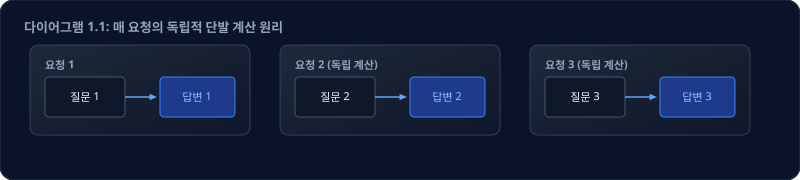
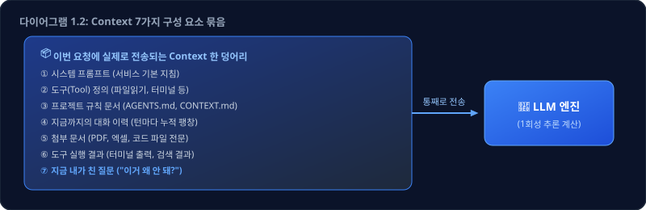
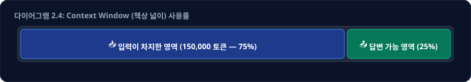
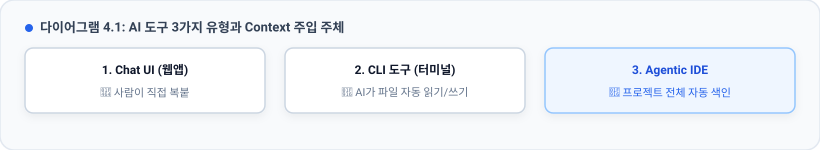
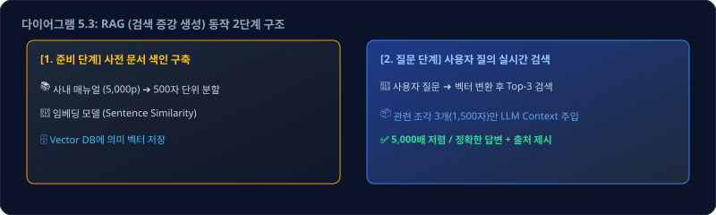
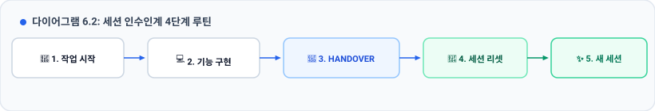
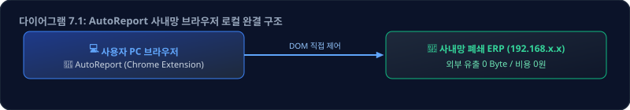
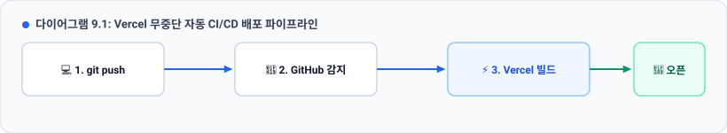
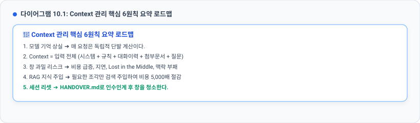

# 🧠 Context 관리 — 같은 AI인데 왜 결과가 다른가

> **선행 교재**: [2. AI의_이해.md](./2.%20AI의_이해.md) — 이 교재는 그 교재의 결론에서 곧바로 이어집니다
> **교육 대상**: 프로그래밍 경험이 없거나 적은 직장인 / 방송기술직 직원
> **교육 목표**: AI에게 "무엇을 넣어주는가(Context)"가 결과를 결정한다는 원리를 이해하고, 모델 스펙을 스스로 읽고, 비용과 품질을 관리하며, 만든 도구를 로컬에서 실행하거나 인터넷에 배포할 수 있다
> **핵심 메시지**: **"AI의 성능은 모델이 정하는 게 아니라, 그 모델에게 무엇을 넣어주느냐가 정한다. 그 '넣어주는 것 전체'가 Context다."**

---

## 🔗 교재 2에서 이어지는 질문

교재 2는 두 개의 문장으로 끝났습니다.

```
② 모델은 대화를 기억하지 못한다. 가중치는 학습이 끝나면 고정이다.
⑤ 그런데 대화가 길어지면 비용이 오르고 품질이 떨어진다.
```

여기서 **아주 자연스러운 모순**이 하나 생깁니다.

> **"기억을 못 한다면서, ChatGPT는 어떻게 3턴 전에 내가 한 말을 알고 있는가?"**
> **"기억을 안 하는데 대화가 길어질수록 왜 비싸지는가?"**

답은 하나입니다.

> ### 🔑 **모델이 기억하는 게 아니라, 서비스가 매번 처음부터 전부 다시 넣어주고 있습니다.**
>
> 그 **"매번 다시 넣어주는 것 전체"** 를 **Context(컨텍스트, 맥락)** 라고 부릅니다.
> 이 교재는 그 Context를 다루는 방법에 대한 것입니다.

---

## 📖 이 교재가 답하는 질문들

교재 2와 마찬가지로, **하나의 질문이 다음 질문으로 이어지는 순서**로 구성했습니다.

| Part | 제목 | 이 Part가 답하는 질문 | 시간 |
|:---:|------|----------------------|:---:|
| **Part 1** | Context란 무엇인가 | 모델이 볼 수 있는 세계의 전부는 무엇인가? | 20분 |
| **Part 2** | ⭐ 모델 스펙 읽는 법 | OpenRouter의 `Context: 200,000`은 무슨 뜻인가? 128k와 1M은 뭐가 다른가? | 30분 |
| **Part 3** | 창이 가득 차면 | AI가 "갑자기 멍청해지는" 순간 실제로 무슨 일이 일어나는가? | 25분<br>(실습 1 포함) |
| **Part 4** | AI 도구의 3유형 | 누가 Context를 채우는가? (Chat / CLI / IDE) | 15분 |
| **Part 5** | ⭐ 지식을 넣는 3가지 방법 | "매뉴얼을 업로드하면 학습되나?" (주입 / RAG / 파인튜닝) | 35분<br>(실습 2 포함) |
| **Part 6** | 실전 관리 기법 + 비용 | 어떻게 하면 싸고 똑똑하게 쓰는가? | 25분 |
| **Part 7** | AutoReport 사례 | 왜 Chrome Extension이었나? `docs/`는 왜 있나? | 30분 |
| **Part 8** | 로컬 vs 퍼블릭 | "왜 내 컴퓨터에서만 되나요?" | 30분 |
| **Part 9** | ⭐ Vercel 배포 실습 | 내 도구를 어떻게 세상에 공개하는가? | 60분 |

> 📅 **Part 1~6 = 1일차**, **Part 7~9 = 2일차** 입니다.

---

---

# # Part 1: Context — 모델이 볼 수 있는 세계의 전부

## 1.1 먼저 교재 2를 한 줄로 되짚습니다

| 핵심 명제 | 상세 원리 |
| :--- | :--- |
| **토큰 확률 계산** | LLM이 하는 일은 오직 "다음 토큰 하나의 확률 계산"의 반복이다. |
| **가중치 불변** | 계산에 쓰이는 가중치(Weight)는 학습 후 완전히 고정되어 있다. |
| **100% 추론** | 우리가 하는 모든 상호작용은 100% 추론(Inference)이다. |
| **독립적 계산** | **그러므로 매 요청은 이전 대화와 완전히 단절된 독립적 계산이다.** |

**"매 요청이 독립적"** 이라는 말을 그림으로 보면 이렇습니다.



모델 입장에서 **모든 요청은 "태어나서 처음 보는 텍스트"** 입니다.
그렇다면 요청 3에서 요청 1의 내용을 알게 하려면? **요청 3 안에 요청 1의 내용을 통째로 적어 넣는 수밖에 없습니다.**

---

## 1.2 Context의 정의

> 💡 **Context (컨텍스트, 맥락)**
> **이번 한 번의 계산을 위해 모델에게 넘기는 입력 텍스트 전체.**
> 모델은 이것만 봅니다. 여기에 없는 것은 모델에게 **존재하지 않습니다.**

우리가 채팅창에 타이핑한 한 줄만 들어가는 게 아닙니다. 실제로는 이런 것들이 **한 덩어리로 합쳐져서** 들어갑니다.



| # | 구성 요소 | 누가 넣는가 | 내가 조절할 수 있나 |
|:--:|----------|------------|------------------|
| ① | 시스템 프롬프트 | 서비스 제공자 | ❌ (API에서는 ✅) |
| ② | 도구 정의 | 사용 중인 도구 | △ (도구 켜고 끄기) |
| ③ | 프로젝트 규칙 문서 | **나** | ✅ **완전히** |
| ④ | 대화 이력 | 자동 누적 | ✅ **세션 리셋으로** |
| ⑤ | 첨부 문서 | **나** | ✅ **완전히** |
| ⑥ | 도구 실행 결과 | AI가 스스로 | △ (지시로 유도) |
| ⑦ | 현재 질문 | **나** | ✅ **완전히** |

> 🎯 **Context 관리란, 이 7칸 중 내가 통제할 수 있는 칸을 의도적으로 설계하는 일입니다.**
> "프롬프트를 잘 쓴다"는 말은 사실 ⑦번 한 칸만 잘 쓰는 것이고,
> **진짜 실력 차이는 ③④⑤⑥을 관리하는 데서 납니다.**

---

## 1.3 "AI가 기억한다"는 착각의 정체

교재 2에서 본 함정을 이제 정확히 그려봅니다.

```
[1번째 질문]
  전송되는 것: [시스템] + [질문 1]                        ≈ 1,000 토큰

[5번째 질문]
  전송되는 것: [시스템] + [질문1+답변1] + ... + [질문 5]   ≈ 8,000 토큰

[20번째 질문]  ← 내가 친 건 "고마워" 세 글자
  전송되는 것: [시스템] + [1~19번 대화 전부] + ["고마워"]  ≈ 45,000 토큰
                          ~~~~~~~~~~~~~~~~~
                          이게 매번 다시 전송됩니다
```

> ⚠️ **"고마워" 한 마디의 실제 가격**
> 내가 입력한 건 3글자지만, 청구되는 입력 토큰은 **45,000개**입니다.
> 이것이 교재 2 Part 4.2에서 예고한 **"가장 많이 놓치는 함정"** 의 실체입니다.
> 그리고 이것이 **길게 이어진 대화가 비싸지는 유일한 이유**입니다.

---

## 1.4 토큰 감각 — 내 문서는 대체 몇 토큰인가

교재 2에서 **토큰 = 모델이 다루는 텍스트의 최소 단위**라고 배웠습니다.
Context를 관리하려면 **"이 문서가 대략 몇 토큰인지" 감을 잡는 것**이 먼저입니다.

| 종류 | 환산 기준 | 예시 |
|------|----------|------|
| **영어** | 1 토큰 ≒ 약 4글자 ≒ 0.75 단어 | `Hello world` → 2 토큰 |
| **한글** | 1 글자 ≒ **1 ~ 1.5 토큰** | `안녕하세요` → 약 3~5 토큰 |
| **코드** | 1 줄 ≒ 약 **8 ~ 15 토큰** | 들여쓰기·괄호·변수명이 전부 토큰 |
| **JSON / 로그** | 매우 비효율 (기호가 전부 토큰) | 같은 정보량 대비 2~3배 |

### 실무용 암산 공식 3개

| 구분 | 계산 공식 | 실무 기준 예시 |
| :--- | :--- | :--- |
| **① 한글 문서** | **글자 수 ≒ 토큰 수** (넉넉히 1.3배) | A4 1페이지(한글 약 1,800자) ≒ **약 2,000 토큰** |
| **② 코드 파일** | **줄 수 × 12 ≒ 토큰 수** | 500줄짜리 JS 파일 ≒ **약 6,000 토큰** |
| **③ 영어 문서** | **글자 수 ÷ 4 ≒ 토큰 수** | 영어 4,000자 ≒ **약 1,000 토큰** |

> 💡 **정확히 세고 싶다면**
> OpenAI Tokenizer(`platform.openai.com/tokenizer`) 같은 웹 도구에 텍스트를 붙여넣으면
> 실제 토큰 수와 쪼개진 모양을 눈으로 볼 수 있습니다.
> **한글이 영어보다 토큰을 더 많이 먹는다**는 것도 여기서 직접 확인할 수 있습니다.

---

## 1.5 Context Window — 그 책상의 크기

모델은 Context를 무한정 받을 수 없습니다. **한 번에 올려놓을 수 있는 최대 분량**이 정해져 있고, 이것을 **Context Window(컨텍스트 창)** 라고 합니다.

| 개념 | 책상 비유 | 실무 의미 및 영향 |
| :--- | :--- | :--- |
| **Context** | 지금 책상 위에 올려둔 **서류 전체** | 모델이 이번 추론에 참조하는 데이터 총량 |
| **Context Window** | **책상의 넓이** (물리적 최대 한계) | 더 이상 서류를 올릴 수 없는 모델의 한계선 |
| **적정 활용** | 필요한 핵심 서류만 깔끔하게 정돈 | 참고할 맥락이 명확하여 높은 정확도 유지 |
| **과밀/오염** | 책상이 꽉 차서 서류가 엉망으로 널브러짐 | 엉뚱한 서류를 집어 들고 **환각 및 지침 누락** 발생 |

그리고 이 **"책상 넓이" 숫자는 모델마다 공개되어 있습니다.**
어디서 보느냐? **바로 다음 Part의 주제입니다.**

---

## 📌 Part 1 정리

| # | 핵심 원리 요약 |
|:-:| :--- |
| **1** | 모델은 기억하지 않는다. 매 요청은 완전히 독립적인 단발성 계산이다. |
| **2** | **Context = 이번 계산에 넘기는 입력 텍스트 전체** (시스템 + 규칙 + 대화이력 + 첨부 + 도구결과 + 질문) |
| **3** | "AI가 기억하는 것처럼 보이는 것"은 서비스가 매번 대화 이력을 통째로 재전송하기 때문이다. |
| **4** | 대화가 길어질수록 입력 토큰이 누적되어 **비용이 급증하고 응답 속도가 저하**된다. |
| **5** | 모델이 한 번에 처리할 수 있는 최대 용량을 **Context Window(컨텍스트 창)** 라고 부른다. |

> ### 🔗 그러면 다음 질문이 생깁니다
> 그 창의 크기는 **어디서 확인**하고, **128k와 1M은 실제로 무엇이 다른가?** → **Part 2**

---

---

# Part 2: ⭐ 모델 스펙 읽는 법 — OpenRouter의 "Context"가 바로 그것이다

## 2.1 OpenRouter — 모델의 스펙 시트가 모여 있는 곳

교재 2 Part 4에서 **[OpenRouter](https://openrouter.ai/models)** 를 "AI 모델의 가격 비교 사이트"로 소개했습니다.
사실 OpenRouter는 가격만 있는 곳이 아니라, **모델의 성능 규격표(스펙 시트)** 가 모여 있는 곳입니다.

자동차를 살 때 배기량·연비·연료탱크 용량을 보듯이, AI 모델도 **볼 줄 알아야 하는 숫자**가 있습니다.

---

## 2.2 모델 카드 해부 — 이 4개 숫자만 읽으면 됩니다

OpenRouter에서 아무 모델이나 클릭하면 이런 스펙란이 나옵니다.

| 스펙 항목 | 표시 예시 | 핵심 의미 |
| :--- | :--- | :--- |
| **Context** | `200,000 tokens` | ⭐ **책상의 넓이** (입력 + 출력 총합 한도) |
| **Max Output** | `64,000 tokens` | **답변 1회의 최대 생성 토큰 길이** |
| **Input 단가** | `$3.00 / 1M tokens` | 프롬프트/문서 주입 시 100만 토큰당 요금 |
| **Output 단가** | `$15.00 / 1M tokens` | 답변 텍스트 생성 시 100만 토큰당 요금 |
| **Modality** | `text + image -> text` | 텍스트 외 이미지/문서 멀티모달 입력 지원 여부 |
| **Providers** | `Anthropic, Bedrock, Vertex` | 모델을 서빙하는 클라우드 인프라 제공사 목록 |

| 항목 | 읽는 법 | 왜 중요한가 |
|------|--------|-----------|
| **Context** | **한 번의 요청에 넣을 수 있는 입력+출력 총량** | ⭐ 이 교재가 말하는 그 Context Window입니다 |
| **Max Output** | 답변 **한 번**이 최대 몇 토큰까지 나올 수 있는가 | 긴 문서 생성·대형 코드 출력 시 병목 |
| **Input 단가** | 100만 토큰 넣을 때의 값 | 대화가 길어질수록 여기가 커집니다 |
| **Output 단가** | 100만 토큰 생성할 때의 값 | 보통 Input의 **3~5배** |
| **Modality** | 텍스트만? 이미지·오디오도? | 스크린샷 첨부 가능 여부 |
| **Providers** | 같은 모델을 파는 여러 사업자 | 같은 모델도 **제공사마다 Context 한도가 다를 수 있음** ⚠️ |

> ⚠️ **놓치기 쉬운 함정: 같은 모델인데 Context가 다르다?**
> OpenRouter는 하나의 모델을 여러 제공사(Provider)를 통해 중계합니다.
> 제공사에 따라 **같은 모델이라도 Context 한도를 128k로 잘라서 제공**하는 경우가 있습니다.
> Providers 목록을 펼치면 제공사별 Context와 단가를 각각 확인할 수 있습니다.

---

## 2.3 ⭐ 128k, 256k, 1M — 실제로 무엇이 다른가

먼저 표기법입니다.

```
   k = 1,000 (천)        M = 1,000,000 (백만)

   8k   =      8,000 토큰
   128k =    128,000 토큰
   256k =    256,000 토큰
   1M   =  1,000,000 토큰
```

그런데 **"128,000 토큰"이라고 하면 감이 전혀 오지 않습니다.**
Part 1.4의 환산 공식으로 **우리가 아는 단위로 바꾸면** 이렇습니다.

| 표기 | 토큰 수 | 한글 글자 | A4 문서 | 코드 | 실제 체감 |
|:----:|:------:|:--------:|:------:|:----:|----------|
| **8k** | 8천 | 약 6천~8천 자 | 4~5 p | 약 700줄 | 짧은 질의응답 몇 번. 초기 GPT-3.5 수준 |
| **32k** | 3.2만 | 약 2.5만~3만 자 | 15~20 p | 약 3천 줄 | 보고서 1편 요약. 소형 오픈소스 모델 다수 |
| **128k** | 12.8만 | 약 10만~13만 자 | **60~80 p** | 약 1만 줄 | **현재 가장 흔한 표준**. 중형 프로젝트 몇 개 파일 |
| **200k** | 20만 | 약 15만~20만 자 | **90~120 p** | 약 1.5만 줄 | 장시간 코딩 세션. 실무 코딩 도구의 사실상 표준 |
| **256k** | 25.6만 | 약 20만~25만 자 | 120~150 p | 약 2만 줄 | 대형 코드베이스 일부 + 긴 대화 이력 동시 유지 |
| **1M** | 100만 | **약 70만~100만 자** | **400~500 p** | 약 8만 줄 | **단행본 3~5권**. 리포지토리를 통째로 |
| **2M** | 200만 | 약 150만~200만 자 | 800~1000 p | 약 16만 줄 | 논문 수십 편, 장편 영상 자막 전체 |

> 💡 **방송국 업무로 환산하면**
> - **송신소 장비 매뉴얼 1권 (300페이지)** ≒ 약 60만 토큰 → **1M 창이어야 통째로 들어갑니다**
> - **한 주치 편성표 + 큐시트** ≒ 수천~수만 토큰 → 128k로 충분
> - **AutoReport 프로젝트 전체 코드** ≒ 수만 토큰 → 128k~200k로 충분
> - **2시간짜리 방송 자막 전문** ≒ 약 3만~5만 토큰 → 128k로 충분

---

## 2.4 ⚠️ 오해 ①: Context는 "입력 칸"이 아니라 **입력 + 출력 총량**이다

이게 실무에서 가장 많이 헷갈리는 지점입니다.



| 증상 | 원인 |
|------|------|
| **긴 PDF를 붙였더니 답변이 중간에 뚝 끊긴다** | 입력이 창을 거의 다 먹어서 출력 공간이 없음 |
| **"전체 코드 다시 써줘" 했더니 일부만 나온다** | 요청한 분량이 `Max Output`을 초과 |
| **파일 첨부 자체가 거부된다** | 첨부만으로 Context Window 초과 |

> 🎯 그래서 스펙란에 **`Max Output`이 따로 있는 것**입니다.
> `Context 200,000 / Max Output 64,000` 이라면
> → **"총 20만까지 담을 수 있고, 그중 답변 하나는 최대 6.4만까지"** 라는 뜻입니다.

---

## 2.5 ⚠️ 오해 ②: 창이 크면 무조건 좋다?

> **결론부터: 아닙니다. 큰 창은 "가능성"이지 "성능"이 아닙니다.**
> 창을 꽉 채워 쓰면 **비용·속도·품질이 전부 나빠집니다.**

### 이유 1 — 💰 비용: 큰 창을 꽉 채우면 턴마다 그 값을 냅니다

Part 1.3에서 봤듯이 **매 턴 전체가 다시 전송**됩니다.

```
Context를 15만 토큰까지 채운 상태에서 대화를 10턴 더 하면?

  입력 토큰 = 150,000 × 10턴 = 1,500,000 토큰
  Input 단가 `$3/M` 기준 → `$4.5` (약 6,300원)

  "질문 10개 던졌을 뿐인데 6천 원"
```

> ⚠️ **장문 구간 할증(Long-context pricing)**
> 일부 모델은 **입력이 일정 구간(예: 20만 토큰)을 넘으면 단가가 2배로 뜁니다.**
> OpenRouter 가격란에 구간별 단가가 나뉘어 표시되는 모델이 이 경우입니다.
> **"1M 창을 지원한다"와 "1M을 써도 같은 값이다"는 완전히 다른 이야기입니다.**

### 이유 2 — ⏱️ 속도: 입력이 길수록 첫 글자가 늦게 나옵니다

교재 2 Part 1에서 본 대로, 모델은 **입력 전체를 읽고 나서** 첫 토큰을 계산합니다.
입력이 10배면 읽는 계산량도 대략 그만큼 늘어납니다.

```
  입력   5,000 토큰  →  첫 글자까지  약 1초
  입력 150,000 토큰  →  첫 글자까지  약 10~30초  (체감상 "멈춘 것 같다")
```

### 이유 3 — 🎯 품질: 광고된 창 크기 ≠ 실제로 잘 쓰는 크기

이게 가장 중요합니다.

> 💡 **Lost in the Middle (중간 소실)**
> 입력이 길어지면 모델은 **맨 앞과 맨 뒤는 잘 보지만, 가운데 내용의 활용률이 뚝 떨어집니다.**
> 정확도를 위치별로 그리면 **U자 곡선**이 나옵니다.

```
정확도 ▲
  높음 │ ●                                    ●
       │   ●                              ●
       │      ●                      ●
  낮음 │          ●   ●   ●   ●   ●
       └──┬─────────────────────────────┬──▶ 정보가 놓인 위치
         맨 앞          가운데          맨 뒤

  → 100페이지 문서 한가운데 있는 핵심 조항을, 모델은 자주 놓칩니다
```

> 💡 **Context Rot (맥락 부패)**
> 창을 채워갈수록 오래된 지시·수정된 코드·폐기된 아이디어가 **쓰레기처럼 쌓입니다.**
> 모델은 그 쓰레기와 현재 유효한 정보를 구분하지 못하고 **똑같은 무게로 참조**합니다.
> → "아까 지운 그 함수를 왜 또 부르지?"의 정확한 원인이 이것입니다.

```
체감 품질 ▲
    높음  │████████████████████████
          │                        ╲
          │                         ╲______
    낮음  │                                ╲_______
          └────┬─────┬─────┬─────┬─────┬────▶ 창 사용률
              20%   40%   60%   80%  100%
                              ↑
                  경험칙: 50~70%를 넘기면
                  지시 누락·혼동이 눈에 띄게 늘어납니다
```

### 📐 실무 3원칙

| # | 원칙 | 상세 실행 가이드 |
|:-:| :--- | :--- |
| **①** | **창 크기는 한도일 뿐** | 200k 창을 20k 정도로 가볍게 쓰는 것이 가장 빠르고 정확함 |
| **②** | **핵심 지시의 위치 배치** | Lost in the Middle을 피해 문서 뒤나 프롬프트 맨 끝에 질문을 재배치 |
| **③** | **50~70% 임계 시 리셋** | 창 사용량이 절반을 넘겼다고 체감되면 즉시 인수인계 후 새 세션 시작 |

---

## 2.6 그래서 무엇을 기준으로 모델을 고르는가

| 하려는 일 | 필요한 Context | 권장 |
|----------|---------------|------|
| 짧은 번역·요약·분류 (대량 반복) | 8k ~ 32k면 충분 | **경량·저가 모델**. 창 크기보다 단가가 중요 |
| 문서 1~2편 분석, 회의록 정리 | 32k ~ 128k | 중급 모델 |
| **바이브 코딩 (이 교육의 주력)** | **128k ~ 200k** | 코딩 특화 상위 모델. 창보다 **코드 품질**이 중요 |
| 수백 페이지 매뉴얼 통째 분석 | 1M | 대용량 창 모델. 단, **RAG가 더 싸고 정확** (→ Part 5) |
| 실시간 자막·대량 처리 | 작아도 됨 | **속도와 단가** 우선 |

> 🎯 **핵심 판단 기준**
> **"창이 큰 모델"을 고르는 게 아니라, "내 작업이 실제로 필요로 하는 창"을 고르는 것입니다.**
> 그리고 대부분의 업무는 **128k면 넘치도록 충분합니다.**

---

## 2.7 🔬 실습: 3분 만에 모델 스펙 비교하기

```
① openrouter.ai/models 접속
② 상단 정렬을 [Context High to Low] 로 바꿔본다 → 창이 큰 모델이 뭔지 확인
③ 서로 다른 성격의 모델 3개를 골라 클릭한다
   (예: 최상위 코딩 모델 1개 / 저가 경량 모델 1개 / 대용량 창 모델 1개)
④ 각 모델의 Providers 목록을 펼쳐 제공사별 Context가 다른지 확인한다
⑤ 아래 표를 채운다
```

| | 모델 A | 모델 B | 모델 C |
|---|---|---|---|
| 모델명 | | | |
| Context | | | |
| Max Output | | | |
| Input 단가 (`$/M`) | | | |
| Output 단가 (`$/M`) | | | |
| **한글 몇 자 들어가나** (Context×0.8) | | | |
| **이 모델이 맞는 업무** | | | |

> 💬 **토의**: 창이 1M인 모델과 200k인 모델의 **가격 차이**가 얼마나 나는가?
> 그 차이를 낼 만큼 우리 업무에 1M이 필요한가?

---

## 📌 Part 2 정리

| # | 핵심 원리 요약 |
|:-:| :--- |
| **1** | OpenRouter 스펙란의 **Context**가 바로 모델의 책상 크기(Context Window)이다. |
| **2** | 128k ≒ A4 60~80p / 1M ≒ 단행본 3~5권 수준의 텍스트 수용량이다. |
| **3** | Context는 [입력 + 출력] 총량이며, 1회 최대 출력 한도인 **Max Output**은 별개이다. |
| **4** | 창이 크다고 좋은 것이 아니며, **비용(재전송)·속도(지연)·품질(Lost in the Middle, 맥락부패)** 이 악화된다. |
| **5** | 실무 경험칙상 **창의 50~70%를 넘기면 즉시 새 세션으로 리셋**하는 것이 최선이다. |


> ### 🔗 그러면 다음 질문이 생깁니다
> 그 창이 **실제로 가득 차면** 무슨 일이 일어나는가? 에러가 나는가, 잘리는가? → **Part 3**

---

---

# Part 3: 창이 가득 차면 실제로 무슨 일이 일어나는가

## 3.1 세 가지 처리 방식 — 도구마다 다릅니다

| 방식 | 동작 원리 | 대표 도구 | 사용자 인지 및 위험도 |
| :--- | :--- | :--- | :--- |
| **방식 A: 거절 (Error)** | "컨텍스트 길이 초과" 에러 반환 | 순정 API 직접 호출 | ✅ **즉시 인지 가능** (가장 명확하고 안전함) |
| **방식 B: 잘라내기 (Truncation)** | 가장 오래된 앞쪽 대화부터 조용히 삭제 | 일반 웹 채팅 UI | ❌ **인지 불가 (위험)**<br>• 초반 규칙이 조용히 삭제됨 |
| **방식 C: 요약 압축 (Compaction)** | AI가 이전 대화를 요약본으로 자체 압축 | Claude Code, Cursor | △ **알림 표시**<br>• 디테일(변수명, 경로) 유실 주의 |

> 🎯 **가장 위험한 건 B입니다.** AI는 "제가 앞부분을 잊었습니다"라고 말해주지 않습니다.
> 아무 일 없다는 듯이 **모르는 상태로 자신 있게 답합니다.** (교재 2에서 배운 환각의 조건)

---

## 3.2 "AI가 갑자기 멍청해졌다" — 증상 사전

이 표는 실습 중에 반드시 겪게 됩니다. **증상을 원인으로 번역하는 표**입니다.

| 증상 | 진짜 원인 | 대처 |
|------|----------|------|
| 처음에 정한 규칙(한국어로 답해줘 등)을 안 지킨다 | 잘라내기(B)로 초반 지침 삭제 | 규칙을 **파일(AGENTS.md)로** 만들어 매번 주입 |
| 방금 고친 코드를 원래대로 되돌린다 | Context Rot — 구버전 코드가 아직 창 안에 있음 | 세션 리셋 후 **현재 파일만** 다시 읽히기 |
| 존재하지 않는 함수·파일을 부른다 | 여러 버전이 섞여 혼동 | 세션 리셋 |
| 100p 문서를 줬는데 가운데 내용을 못 찾는다 | Lost in the Middle | 해당 부분만 잘라서 주기 (= RAG, Part 5) |
| 답변이 점점 짧아지고 성의 없어진다 | 출력 공간 부족 | 입력을 줄이기 |
| 답변이 문장 중간에 끊긴다 | `Max Output` 초과 | 나눠서 요청 |
| 응답이 눈에 띄게 느려졌다 | 입력 토큰 누적 | 세션 리셋 |

> 💡 **핵심 인식 전환**
> 이 증상들은 **"AI가 나빠진 것"이 아니라 "내 Context가 어질러진 것"** 입니다.
> 모델을 바꿀 게 아니라 **책상을 치워야 합니다.**

---

## 3.3 바이브 코딩에서 Context를 가장 많이 먹는 것 — 대화가 아니라 **도구 결과**

초보자가 가장 크게 오해하는 부분입니다.

| 항목 | 오해와 실제 |
| :--- | :--- |
| ❌ **오해** | "내가 채팅으로 말을 길게 해서 Context가 찬다." |
| ✅ **실제** | **"AI가 파일을 읽고 터미널 명령을 돌린 결과가 창을 순식간에 채운다."** |

| AI의 행동 | 실제로 Context에 들어가는 양 |
|----------|---------------------------|
| 파일 1개 읽기 (500줄) | 약 **6,000 토큰** |
| `npm install` 실행 로그 | 약 **2,000 ~ 10,000 토큰** |
| 에러 스택 트레이스 1개 | 약 **1,000 ~ 3,000 토큰** |
| 웹 검색 결과 3건 | 약 **5,000 ~ 15,000 토큰** |
| 프로젝트 전체 구조 스캔 | 약 **3,000 ~ 20,000 토큰** |
| **내가 친 질문 한 줄** | 약 **20 토큰** |

> 🎯 **"AI가 파일을 읽었다" = 그 파일 전문이 Context에 통째로 붙었다.**
> 파일 10개를 읽히면 그 순간 창의 30~50%가 사라집니다.

### 실무 수칙 4가지

| # | 수칙 | 상세 실행 방법 |
|:-:| :--- | :--- |
| **①** | **로그 부분 복사** | 큰 로그 전체 대신 에러 핵심 5~10줄만 잘라서 전달 |
| **②** | **작업 범위 한정** | "전체 분석해줘" 대신 "src/popup.js의 저장 로직만 봐줘"로 타겟팅 |
| **③** | **파일 명시적 지정** | AI가 무작위로 파일을 뒤지지 않도록 읽을 파일 경로를 지정 |
| **④** | **탐색 작업 분리** | 대규모 코드 탐색은 Subagent에게 시키고 결론만 수신 (Part 6.3) |

---

## 3.4 세션을 언제 리셋해야 하는가 — 판단 기준 5가지

| # | 리셋 판단 상황 | 권장 대처 |
|:-:| :--- | :--- |
| **1** | **단위 작업 완료 시** | 기능 1개 구현이 끝나면 즉시 인수인계 후 리셋 ⭐ *(가장 중요)* |
| **2** | **주제/영역 변경 시** | UI 디자인 작업에서 배포/빌드 작업으로 넘어갈 때 |
| **3** | **동일 에러 3회 반복 시** | AI가 같은 오류를 잡지 못하고 코드를 맴돌 때 |
| **4** | **삭제된 코드 재언급 시** | Context Rot으로 인해 폐기된 코드를 다시 부를 때 |
| **5** | **응답 지연 체감 시** | 첫 글자 출력 시간이 눈에 띄게 느려졌을 때 |

**도구별 리셋 방법:**

| 도구 | 방법 |
|------|------|
| Claude Code | `/clear` (완전 초기화) / `/compact` (요약 후 이어가기) |
| Cursor, Antigravity | 새 채팅 생성 (Ctrl+N 계열) |
| ChatGPT, Claude 웹 | 새 대화 시작 |

> ⚠️ **리셋 = 맥락 상실**입니다. 그냥 리셋하면 처음부터 다시 설명해야 합니다.
> 그래서 **리셋 직전에 인수인계 문서를 남기는 습관**이 필요합니다. → **Part 6**

---

## 🧪 실습 1 — Context Window 한계를 눈으로 확인하기 (10분)

> 📄 상세 지침: [CONTEXT_MANAGEMENT_LAB.md](../CONTEXT_MANAGEMENT_LAB.md) 의 **실습 1**

```
① 새 대화를 열고 규칙을 하나 준다
   "앞으로 모든 답변 마지막 줄에 [규칙 준수 완료] 를 붙여줘"

② 규칙이 지켜지는지 2~3턴 확인한다

③ 긴 텍스트를 10~15회 주고받아 창을 채운다
   (예: "1,000자짜리 이야기 하나 더 써줘" 반복)

④ 다시 평범한 질문을 던진다
   "오늘 점심 뭐 먹을까?"
```

**관찰 포인트:**

| 확인할 것 | 이것이 증명하는 것 |
|----------|------------------|
| 마지막 줄 문구가 사라졌는가? | 방식 B(잘라내기)로 **초반 지침이 삭제**되었다 |
| AI가 "잊었다"고 말해주던가? | ❌ 말해주지 않는다 — 이것이 가장 위험한 점 |
| 응답이 느려졌는가? | 입력 토큰 누적으로 첫 응답 지연이 늘었다 |

---

## 📌 Part 3 정리

| # | 핵심 원리 요약 |
|:-:| :--- |
| **1** | 창이 차면 **에러 거절 / 앞부분 잘라내기 / 요약 압축** 3가지 중 하나로 처리된다. |
| **2** | 가장 위험한 것은 **말없이 잘라내는 Truncation**이며, AI는 모르는 상태로 답한다. |
| **3** | 규칙 미준수, 코드 원복, 환각 등의 증상은 모델 결함이 아닌 **Context 오염 문제**이다. |
| **4** | 창을 소모하는 주범은 사용자의 대화가 아니라 **파일 전문·터미널 로그·검색 결과**이다. |
| **5** | 단위 작업이 끝나면 즉시 **HANDOVER 문서를 남기고 세션을 리셋**해야 한다. |

> ### 🔗 그러면 다음 질문이 생깁니다
> 그런데 도구마다 **Context를 채우는 주체가 다릅니다.** 무엇을 써야 하는가? → **Part 4**

---

---

# Part 4: AI 도구의 3유형 — 누가 Context를 채우는가

## 4.1 세 가지 형태



## 4.2 비교표

| 구분 | Chat 웹앱 | CLI 도구 | Agentic IDE |
|------|----------|---------|-------------|
| **Context를 채우는 주체** | **사람이 손으로** | **AI가 스스로 파일 읽기** | **AI + 프로젝트 자동 색인** |
| **코드 반영 방식** | 답변을 복사해서 붙여넣기 | AI가 파일에 직접 쓰기 | Diff 확인 후 원클릭 Apply |
| **프로젝트 구조 인지** | ❌ 불가 | ✅ 탐색 가능 | ✅ 전체 색인 |
| **실행·검증** | ❌ 불가 | ✅ 터미널 실행 가능 | ✅ 실행 + 테스트 |
| **Context 낭비 위험** | 낮음 (내가 다 통제) | **높음** (AI가 마구 읽음) | **높음** |
| **추천 용도** | 아이디어, 단발 질문, 개념 설명 | 스크립트, 단일 파일 수정 | **본격 애플리케이션 개발** |

## 4.3 왜 Chat 웹 UI로는 복잡한 개발이 어려운가

Part 1의 Context 구성표로 설명하면 명확합니다.

| Context 칸 | Chat 웹앱에서는 | 결과 |
|-----------|----------------|------|
| ③ 프로젝트 규칙 | 매번 손으로 다시 붙여야 함 | 귀찮아서 안 하게 됨 |
| ⑤ 첨부 문서 | 파일 10개면 10번 복사 | 누락 발생 |
| ⑥ 도구 실행 결과 | **아예 없음** | AI가 검증을 못 함 → 사용자에게 떠넘김 |

> 💡 **바이브 코딩 결론**
> 개념 학습·아이디어는 **Chat**, 실제 제작은 **Agentic IDE 또는 CLI**.
> 단, ⚠️ IDE/CLI는 **AI가 Context를 스스로 채우기 때문에 훨씬 빨리 오염됩니다.**
> **편해지는 만큼 Context 관리 책임은 더 커집니다.** (Part 3.3의 실무 수칙이 여기서 필요합니다)

---

## 📌 Part 4 정리

| # | 핵심 원리 요약 |
|:-:| :--- |
| **1** | **Chat UI**: 사람이 Context를 직접 채움 (통제는 쉬우나 대량 작업 불가) |
| **2** | **CLI / IDE**: AI가 Context를 능동적으로 채움 (빠르고 강력하나 오염 속도 빠름) |
| **3** | 본격적인 개발은 IDE/CLI를 사용하되, **파일 범위를 한정해 주는 관리 습관이 필수** |


> ### 🔗 그러면 다음 질문이 생깁니다
> 우리 회사 매뉴얼 5,000페이지는? 창에 안 들어갑니다.
> "업로드해서 학습시키면" 되는 것 아닌가? → **Part 5**

---

---

# Part 5: ⭐ 지식을 넣는 3가지 방법 — Context 주입 / RAG / 파인튜닝

## 5.1 가장 흔한 오해부터 정리합니다

교재 2 Part 1.5의 **5번 현상**을 기억하십니까?

> **"파일을 올려도 학습되지 않는다. 가중치는 고정이다.
> 파일 업로드는 입력 텍스트 앞에 내용을 붙여주는 것뿐이다."**

즉, **"업로드 = 학습"이 아니라 "업로드 = Context 주입"** 입니다.
그리고 지식을 넣는 방법은 사실 **3가지**가 있으며, 셋은 완전히 다른 일입니다.

```
[지식을 넣는 3가지 방법 — 시험 비유]

  1. Context 주입 (Prompt Injection)
     📖 시험장에 교과서를 통째로 들고 들어가 펴놓고 푸는 오픈북

  2. RAG (Retrieval-Augmented Generation)
     🔍 색인을 보고 필요한 2페이지만 복사해서 책상에 놓고 푸는 오픈북

  3. 파인튜닝 (Fine-tuning)
     🧠 시험 전에 몇 달간 외워서 머릿속에 넣는 것
        (= 교재 2 Part 2.2의 "층위 2". 가중치를 실제로 고침)
```

> 🎯 **1, 2번은 교재 2의 "층위 1(추론)"입니다. 모델은 변하지 않습니다.**
> **3번만이 "층위 2"이고, 유일하게 모델 자체가 변합니다.**

---

## 5.2 3가지 방식 비교

| 구분 | Context 주입 | RAG | 파인튜닝 |
|------|-------------|-----|---------|
| **하는 일** | 문서를 질문에 통째로 붙임 | 관련 조각만 검색해 붙임 | 가중치를 실제로 수정 |
| **모델이 변하나** | ❌ | ❌ | ✅ |
| **교재 2의 층위** | 층위 1 (추론) | 층위 1 (추론) | **층위 2 (학습)** |
| **준비 비용** | 0원 | 중 (검색 시스템 구축) | 수백만~수천만 원 |
| **요청당 토큰** | 💸 매우 많음 | 🪙 매우 적음 | 🪙 적음 |
| **최신 정보 반영** | 즉시 (파일만 바꾸면 됨) | 즉시 (DB만 갱신) | ❌ 다시 학습해야 함 |
| **출처 제시** | △ | ✅ **가능** | ❌ 불가 |
| **적합한 상황** | 문서 1~2개, 단기 작업 | **사내 규정·매뉴얼·FAQ 검색** | 말투·형식·전문 도메인 고정 |
| **한계** | 창을 넘으면 불가 | 검색 품질에 의존 | 비싸고, 사실 갱신에 취약 |

> ⚠️ **가장 흔한 실무 착오**
> "우리 매뉴얼을 AI에게 **학습**시키자" → 대부분 **틀린 접근**입니다.
> 사실 조회가 목적이라면 **RAG가 훨씬 싸고, 정확하고, 출처까지 제시**합니다.
> 파인튜닝은 **"무엇을 아느냐"가 아니라 "어떤 말투·형식으로 답하느냐"를 고정할 때** 쓰는 도구입니다.

---

## 5.3 RAG는 실제로 어떻게 동작하는가

여기서 교재 2 Part 3의 HuggingFace Task 목록을 다시 봅니다.

> 교재 2에서 이런 줄이 있었습니다:
> `└─ Sentence Similarity (문장 유사도) ← RAG 검색의 핵심`
>
> **그게 바로 여기서 쓰입니다.**



> 💡 **"의미가 가까운"이 핵심입니다.**
> 단순 키워드 검색이 아닙니다. 질문에 "출력 저하"라고 썼는데 매뉴얼에 "파워 다운"이라고 적혀 있어도,
> **의미 벡터가 가까우면 찾아냅니다.** 이게 RAG가 Ctrl+F보다 강한 이유입니다.

---

## 5.4 🏢 사내 사례 1 — 방송기술 매뉴얼 Q&A (RAG)

| 단계 | 내용 |
|------|------|
| **상황** | 송신소 장비 매뉴얼 + 장애 조치 매뉴얼 합계 약 5,000페이지 |
| **처음 생각** | "PDF를 ChatGPT에 다 올리면 학습해서 답해주겠지" |
| **실제 문제** | 5,000p ≒ 약 **1,000만 토큰**. 1M 창 모델에도 **10배 초과**. 애초에 불가능 |
| **비용 문제** | 설령 들어간다 해도 **질문 한 번에 수천 원**. 하루 100건이면 감당 불가 |
| **해결** | Vector DB 구축 → 질문당 관련 조각 3개(약 1,500자)만 주입 |
| **결과** | 응답 1초 이내 / 질문당 토큰 약 **1/5,000** / **출처 페이지까지 제시** |

> 🎯 **여기서 계산을 직접 해보십시오.**
> 5,000p ≒ 1,000만 토큰. Input `$3/M` 기준 → **질문 1회 = `$30` (약 42,000원)**
> RAG 방식 → 질문 1회 ≒ 2,000 토큰 → **`$0.006` (약 8원)**
> **약 5,000배 차이**입니다. 이것이 RAG를 쓰는 이유의 전부입니다.

---

## 5.5 🏢 사내 사례 2 — 사내 전용 모델 (파인튜닝)

| 단계 | 내용 |
|------|------|
| **상황** | 미방송 원고·출연자 정보 등 **외부 API로 절대 보낼 수 없는 데이터** |
| **판단** | 교재 2 Part 2.3의 **"경로 C(로컬 실행)"** 이 필요한 경우 |
| **방법** | HuggingFace에서 오픈 웨이트 모델(Llama, Qwen 등)을 사내 GPU 서버에 설치 |
| **추가** | 사내 용어·문서 양식을 파인튜닝으로 학습시켜 사내 전용 모델 구축 |
| **비용** | GPU 서버 + 학습 데이터 정제 인건비 + 재학습 주기 관리 |

> ⚠️ **핵심 구분**
> 파일 업로드 = **Context 주입** (모델 안 변함, 대화 끝나면 사라짐)
> 파인튜닝 = **가중치 파일(.safetensors)을 새로 굽는 것** (모델이 실제로 변함)
> 이 둘을 같은 말로 쓰면 **예산 규모가 1,000배 틀립니다.**

---

## 🧪 실습 2 — RAG 시뮬레이션: 통째로 vs 조각만 (15분)

> 📄 상세 지침: [CONTEXT_MANAGEMENT_LAB.md](../CONTEXT_MANAGEMENT_LAB.md) 의 **실습 2**

Vector DB 없이도 **RAG의 효과를 손으로 흉내 내 볼 수 있습니다.**

```
[A 조건 — Context 주입]
  30페이지짜리 사내 규정 전문을 통째로 붙여넣고 질문한다
  → "제34조 2항의 유급휴가 신청 기한은 며칠 전까지인가?"

[B 조건 — RAG 흉내]
  Ctrl+F 로 제34조만 찾아 3줄만 붙여넣고 같은 질문을 한다
```

**결과 비교표를 직접 채워보십시오:**

| 항목 | A. 전체 주입 | B. 조각만 주입 |
|------|-------------|--------------|
| 답변까지 걸린 시간 | | |
| 대략 소모 토큰 (글자수÷0.8) | | |
| 답이 정확했는가 | | |
| 엉뚱한 조항을 섞어 말했는가 | | |

> 🎯 **이 실습에서 체감할 것**
> B가 A보다 **빠르고, 싸고, 정확합니다.** 셋 다 좋습니다.
> "더 많이 넣어주면 더 잘한다"는 직관이 **틀렸다는 것**을 손으로 확인하는 것이 이 실습의 목적입니다.
> (Part 2.5의 Lost in the Middle이 A 조건에서 실제로 관찰됩니다)

---

## 5.6 결정 트리 — 무엇을 써야 하는가


> 💡 **파인튜닝은 위 세 갈래 어디에도 없습니다.**  
> "무엇을 아느냐(지식)"가 아니라 "어떻게 말하느냐(말투·출력형식)"를 고정하고 싶을 때만 검토합니다.

---

## 📌 Part 5 정리

| # | 핵심 원리 요약 |
|:-:| :--- |
| **1** | 파일 업로드는 모델 학습이 아니라 **1회성 Context 주입**이다. |
| **2** | **Context 주입 / RAG**는 층위 1(추론)이며, **파인튜닝**만이 모델 가중치가 변하는 층위 2(학습)이다. |
| **3** | **RAG(검색 증강 생성)** 는 의미 검색으로 필요한 조각만 주입하여 **5,000배 싸고 정확하며 출처를 제시**한다. |
| **4** | "매뉴얼을 학습시키자"는 요구의 99%는 파인튜닝이 아닌 **RAG가 올바른 해답**이다. |
| **5** | 파인튜닝은 지식 축적이 아닌 **말투·전문 양식·형식을 고정하는 도구**이다. |

> ### 🔗 그러면 다음 질문이 생깁니다
> 이제 원리는 알았습니다. **매일의 작업에서 구체적으로 무엇을 해야 하는가?** → **Part 6**

---

---

# Part 6: Context 관리 실전 기법 + 비용 절감

## 6.1 4대 Context 관리 문서 — AI에게 주는 "업무 인수인계 바인더"

Part 3.4에서 "리셋 직전에 인수인계를 남겨라"고 했습니다. 그 인수인계의 표준 양식입니다.

```
📁 project-root/
├── 📄 AGENTS.md      ← [규칙]   AI가 지켜야 할 역할과 행동 지침
├── 📄 CONTEXT.md     ← [지도]   전체 구조와 데이터 흐름
├── 📄 TASKS.md       ← [목표]   지금 하는 일 / 끝난 일 / 실패한 일
└── 📄 HANDOVER.md    ← [인계]   마지막 상태와 다음에 할 일
```

새 세션을 열고 **"이 4개 파일 읽고 시작해"** 한 마디면, Part 1의 Context ③번 칸이 한 번에 채워집니다.

### 각 문서에 실제로 무엇을 쓰는가

**`AGENTS.md` — 규칙 (Context ③칸)**
```markdown
## 역할
너는 방송기술 실무를 이해하는 시니어 프론트엔드 개발자다.

## 반드시 지킬 것
- 모든 설명과 주석은 한국어로 작성한다
- 코드를 고치기 전에 무엇을 왜 고치는지 한 줄로 먼저 말한다
- 요청하지 않은 파일은 수정하지 않는다
- 라이브러리를 새로 추가하기 전에 먼저 묻는다
```

**`CONTEXT.md` — 지도**
```markdown
## 시스템 구조
ERP 페이지(DOM) → content.js(요소 추출) → popup.js(UI) → chrome.storage(저장)

## 핵심 파일
- manifest.json : 권한 및 진입점 정의
- content.js    : ERP 페이지에 주입되어 DOM 조작
- popup.js      : 사용자 UI 및 설정 저장
```

**`TASKS.md` — 목표**
```markdown
## 진행 중 (Doing)
- [ ] 결재 상신 후 리다이렉트 시 데이터 유실 문제 해결

## 완료 (Done)
- [x] 결재선 자동 채우기
- [x] 보고서 템플릿 저장 기능

## 실패·보류 (Failed / Hold)
- [ ] iframe 내부 자동 클릭 → 보안 정책으로 차단됨 (2026-07-20 확인)
```

**`HANDOVER.md` — 인수인계** ⭐ 가장 중요
```markdown
## 마지막 작업 (2026-08-05)
- popup.js 의 saveTemplate() 함수를 chrome.storage.sync 로 교체하는 중
- sync 는 용량 제한(8KB/항목)이 있어 큰 템플릿에서 실패함을 확인

## 다음 세션에서 바로 할 일
1. 큰 템플릿은 chrome.storage.local 로 분기 저장하도록 수정
2. 저장 실패 시 사용자에게 알림 표시

## 건드리지 말 것
- content.js 의 redirect 감지 로직 (LESSONS.md 3번 항목 참조)
```

> 🎯 **이 4개 문서의 진짜 정체**
> 사람이 읽는 문서가 아니라, **AI의 Context를 1초 만에 복구하는 부팅 디스크**입니다.
> 이게 있으면 **세션 리셋이 손실이 아니라 청소**가 됩니다.

---

## 6.2 세션 인수인계 루틴 (매일 쓰는 3단계)



> 💡 **한 문장으로**: **"작업 하나 = 세션 하나. 끝나면 인계하고 버린다."**

---

## 6.3 Subagent — Context를 분리해서 오염을 막는 법

Part 3.3에서 본 대로, **탐색·조사 작업은 Context를 엄청나게 먹습니다.**
그 오염을 메인 창에 묻히지 않는 방법이 Subagent입니다.


> 🎯 **원리**: 더러워질 일은 **버릴 창**에서 하고, **결론만 가져옵니다.**

---

## 6.4 프롬프트 캐싱 — 반복되는 앞부분은 1/10 값에

Part 1.3에서 "매 턴 전체가 재전송된다"고 했습니다.
그런데 **재전송되는 앞부분은 매번 똑같습니다.** (시스템 프롬프트 + 규칙 문서 + 초반 대화)

여기에 대한 해법이 **프롬프트 캐싱(Prompt Caching)** 입니다.

| 모드 | 1턴 요청 처리 | 2턴 이후 반복 요청 | 비용 절감 효과 |
| :--- | :--- | :--- | :--- |
| **캐싱 미사용** | 전체 재료 전액 과금 | [시스템 + 규칙문서 + 대화] **매 턴 전액 청구** | 💸 비용 누적 빠름 |
| **캐싱 사용** | 고정 재료를 캐시에 저장 (단가 1.25배) | **캐시에서 고속 로드 (단가 약 0.1배 ⭐)** | 🪙 **최대 70~90% 절감** |

| 토큰 종류 | 상대 단가 (대략) |
|----------|----------------|
| 일반 입력 | 1.0배 |
| **캐시 쓰기** | 약 1.25배 (처음 한 번) |
| **캐시 읽기** | 약 **0.1배** ⭐ |

> 💡 **실무에서 이게 왜 중요한가**
> Claude Code, Cursor 같은 코딩 에이전트는 **캐싱을 자동으로 씁니다.**
> 그래서 **"긴 대화를 이어가는 것"이 예상보다 싸게 나오는 경우**가 있습니다.
>
> 단, ⚠️ **캐시는 앞부분이 완전히 동일할 때만 작동**합니다.
> **대화 앞부분을 수정하거나 시스템 프롬프트를 바꾸면 캐시가 전부 무효화**됩니다.
> → 그래서 **규칙 문서(AGENTS.md)를 자주 바꾸지 않는 것**도 비용 절감 요령입니다.
> 캐시는 보통 **수 분~1시간 정도만 유지**되므로, 오래 쉬었다 돌아오면 다시 전액입니다.

---

## 6.5 비용 실전 계산 — 같은 작업, 3가지 방식

**조건**: 상위 코딩 모델 (Input `$3/M`, Output `$15/M`), 환율 1,400원 기준
**작업**: 기능 하나를 만드는 데 AI와 20턴 대화

| 방식 | 입력 토큰 총합 | 출력 토큰 총합 | 비용 |
|------|--------------|--------------|------|
| **① 한 세션에서 20턴 계속** | 약 300,000 | 약 16,000 | `$0.90 + $0.24` = **`$1.14` (약 1,600원)** |
| **② 5턴마다 리셋 + 인수인계** | 약 90,000 | 약 16,000 | `$0.27 + $0.24` = **`$0.51` (약 710원)** |
| **③ ② + 프롬프트 캐싱** | 실효 약 35,000 | 약 16,000 | `$0.11 + $0.24` = **`$0.35` (약 490원)** |

```
  ①  ████████████████████████  1,600원
  ②  ███████████               710원   (56% 절감)
  ③  ███████                   490원   (69% 절감)
```

> 🎯 **그런데 진짜 이득은 돈이 아닙니다.**
> ②③은 **Context가 깨끗해서 AI가 더 정확하게 동작합니다.**
> **비용을 아끼는 행동과 품질을 올리는 행동이 정확히 같습니다.** 이게 Context 관리의 핵심입니다.

---

## 6.6 비용·품질 동시 절감 체크리스트 8가지

| # | 점검 항목 | 구체적 실천 방법 |
|:-:| :--- | :--- |
| **1** | **단위 작업 후 리셋** | 하나의 기능 개발이 완료되면 즉시 세션을 초기화한다. |
| **2** | **HANDOVER.md 갱신** | 리셋 전 현재 상태와 다음 할 일을 반드시 파일로 남긴다. |
| **3** | **에러 로그 선별 주입** | 전체 콘솔 로그 대신 핵심 에러 메시지 5~10줄만 전달한다. |
| **4** | **조회 범위 한정** | "전체 코드 봐줘" 대신 대상 파일명과 함수명을 구체적으로 지정한다. |
| **5** | **Subagent 탐색 분리** | 대규모 파일 검색 및 디버깅은 하위 에이전트에게 위임한다. |
| **6** | **규칙 문서화** | 반복 지침은 대화창이 아닌 `AGENTS.md`에 작성하여 캐시를 보존한다. |
| **7** | **모델 다변화** | 아키텍처/설계는 최상위 모델, 단순 오타/수정은 경량 저가 모델을 사용한다. |
| **8** | **대용량 자료 RAG화** | 50페이지 이상의 상시 참조 매뉴얼은 Vector DB를 통해 검색한다. |

---

## 📌 Part 6 정리

| # | 핵심 원리 요약 |
|:-:| :--- |
| **1** | `AGENTS / CONTEXT / TASKS / HANDOVER` 문서는 AI의 **Context 복구 부팅 디스크**이다. |
| **2** | **"작업 하나 = 세션 하나"** 원칙으로 끝나면 인계하고 버리는 것이 최적이다. |
| **3** | 탐색과 로그 분석은 Subagent에게 맡겨 **메인 창의 Context 오염을 완벽히 차단**한다. |
| **4** | 프롬프트 캐싱을 활용하면 고정된 앞부분 텍스트를 **약 1/10 단가로 초고속 처리**한다. |
| **5** | **비용을 아끼는 습관이 곧 AI의 출력 품질을 올리는 지름길**이다. |


> ### 🔗 그러면 다음 질문이 생깁니다
> 이 원리들이 실제 프로젝트에서 어떻게 쓰였는가? → **Part 7 (AutoReport 사례)**

---

---

# Part 7: AutoReport 사례 — Chrome Extension과 docs/의 정체

## 7.1 무엇을 만들었나

**AutoReport**는 사내 ERP의 반복 입력을 자동화하는 **Chrome Extension**입니다.
교재 2 Part 6의 분류로는 **"의미 2 — 바이브 코딩으로 만든 프로그램"** 에 해당합니다.



| 구분 | 주요 특징 및 보안 상태 |
| :--- | :--- |
| **⭐ 실행 중 AI 호출** | **전혀 없음** (순수 JS 규칙 기반 자동화) |
| **⭐ 외부 데이터 전송** | **0 Byte** (모든 처리가 로컬 브라우저 내부에서 완결) |
| **⭐ 실행 비용** | **0원** (API 토큰 비용 일절 발생하지 않음) |


## 7.2 왜 Chrome Extension이었나 — 4가지 이유

| # | 이유 | 설명 |
|:--:|------|------|
| 1 | **보안** | ERP·송출 시스템은 인터넷에 노출할 수 없습니다. Extension은 **사용자 브라우저 안에서만** 동작하므로 데이터가 밖으로 나가지 않습니다 |
| 2 | **속도** | 서버를 거치지 않고 브라우저가 이미 그린 DOM을 직접 조작합니다. 왕복 지연이 **0**입니다 |
| 3 | **권한** | 일반 웹페이지는 다른 사이트의 DOM·쿠키에 접근할 수 없습니다(CORS). Extension은 **명시적 권한을 받아** ERP 페이지를 읽고 조작할 수 있습니다 |
| 4 | **배포 용이** | 백엔드 서버 구축이 전혀 필요 없습니다. `chrome://extensions`에서 **폴더 선택 한 번**으로 설치됩니다 |

> 🎯 **교재 2 Part 7의 로드맵에서 "1단계(안전도 ★★★★★)"에 해당합니다.**
> AI가 코드를 짜줬지만 완성품 안에는 AI가 없으므로, **동작이 100% 예측 가능**합니다.

---

## 7.3 `docs/` 폴더 = AI의 Context 저장소

AutoReport 프로젝트의 `docs/` 폴더는 **사람이 읽는 문서가 아니라, Part 6.1의 4대 문서를 실제로 구현한 것**입니다.

| 파일 | 역할 | AI가 이걸 읽으면 |
|------|------|----------------|
| `CONTEXT.md` | 시스템 구조, ERP 요소 ID 매핑 | 파일을 하나하나 뒤지지 않고 구조를 즉시 파악 |
| `TASKS.md` | 진행/완료/실패 목록 | 이미 실패한 접근을 다시 시도하지 않음 |
| `HANDOVER.md` | 마지막 작업 상태 | 새 세션이 1초 만에 이어받음 |
| `LESSONS.md` | 겪은 시행착오 기록 | **같은 버그를 다시 만들지 않음** |
| `CHANGELOG.md` | 변경 이력 | 왜 이렇게 되어 있는지 이해 |

> 💡 **`LESSONS.md`의 힘 — 실제 사례**
> ERP 결재 후 **무한 리다이렉트** 버그를 한 번 겪고 해결한 뒤 `LESSONS.md`에 기록했습니다.
> 이후 새 세션의 AI가 이 파일을 읽고 **같은 함정을 스스로 피해 갑니다.**
>
> **이것이 Part 1에서 말한 "③ 프로젝트 규칙 문서" 칸의 실전 활용입니다.**
> 모델은 학습되지 않지만, **문서는 매번 다시 주입되므로 사실상 "축적된 경험"처럼 작동합니다.**

---

## 📌 Part 7 정리

| # | 핵심 원리 요약 |
|:-:| :--- |
| **1** | AutoReport는 실행 중 AI를 호출하지 않는 순수 규칙 기반 자동화 도구로 **실행 비용 0원**이다. |
| **2** | **Chrome Extension**은 사내망 보안·초고속 DOM 조작·특수 권한·무서버 배포 4박자를 갖춘 최적의 형태이다. |
| **3** | 프로젝트의 `docs/` 폴더는 사람이 아닌 **AI의 Context 복구 및 유지용 저장소**이다. |
| **4** | 모델 가중치는 안 변하지만, **문서 주입을 통해 프로젝트 경험과 노하우가 지속 축적**된다. |

> ### 🔗 그러면 다음 질문이 생깁니다
> Extension은 내 브라우저 안에서만 돕니다.
> 그런데 **동료와 나눠 쓰고 싶은 도구**는 어떻게 하는가? → **Part 8**

---

---

# Part 8: 로컬 웹앱 vs 퍼블릭 웹앱

## 8.1 가장 흔한 질문

> **"내 컴퓨터에서는 브라우저로 잘 열리는데, 왜 옆자리 동료 휴대폰에서는 안 되나요?"**


## 8.2 비교

| 구분 | 로컬 (localhost) | 퍼블릭 (Public Cloud) |
|------|-----------------|---------------------|
| **주소** | `http://localhost:3000` / `127.0.0.1` | `https://my-app.vercel.app` |
| **접근 범위** | 내 컴퓨터만 | 인터넷이 되는 어디서나 |
| **내 PC를 끄면** | 앱도 꺼짐 | 계속 살아 있음 |
| **HTTPS 보안** | 기본 `http://` (비암호화) | `https://` 자동 적용 |
| **용도** | 개인 개발, 테스트, **사내 전용 도구** | 동료 공유, 실제 서비스 |

## 8.3 📺 방송으로 비유하면

```
📺 로컬 (localhost) = [우리 집 거실 TV]
   - 거실에 앉은 사람만 볼 수 있습니다
   - 남이 보려면 우리 집에 직접 들어와야 합니다

📡 퍼블릭 (Public) = [지상파 송출]
   - 송신소에서 전파를 쏘아 올립니다
   - 채널 번호(URL)만 알면 전국 누구나 봅니다
```

## 8.4 예전에는 왜 어려웠는가

과거에 내 PC의 웹앱을 외부에 공개하려면 이런 벽이 있었습니다.

```
① 공인 IP 확보 + 공유기 포트 포워딩 설정
② DDNS 등록 (집 IP가 바뀌므로)
③ 방화벽 예외 처리
④ SSL/TLS 인증서 구매 및 설치  ← http는 요즘 브라우저가 경고/차단
⑤ 서버가 24시간 켜져 있어야 함
```

> 🚀 **Vercel의 등장**
> 위 5단계를 **버튼 한 번(Import Project)** 으로 전부 대신 처리해 줍니다.
> 그래서 이제 **코딩을 모르는 사람도 자기 도구를 인터넷에 공개할 수 있습니다.**

---

## 8.5 ⚠️ 배포 전 반드시 확인할 것 — 보안 판단

교재 2 Part 7의 원칙이 여기에도 그대로 적용됩니다.

| 점검 항목 | 통과 기준 | 위반 시 조치 |
| :--- | :--- | :--- |
| **1. 사내 기밀 데이터** | 사내 문서, 출연자 정보, 미방송 원고 미포함 | 🚫 퍼블릭 배포 금지 ➔ **Chrome Extension(로컬)** 유지 |
| **2. 사내망 내부 주소** | `192.168.x.x` 등 내부 IP 및 비공개 도메인 없음 | 🚫 퍼블릭 배포 금지 ➔ **Chrome Extension(로컬)** 유지 |
| **3. API 키 및 인증키** | 소스코드 내 하드코딩된 API Key 없음 | 🚫 퍼블릭 배포 금지 ➔ **환경 변수화** 후 재검토 |
| **4. 열람 권한** | 로그인 없이 전 세계 누구나 봐도 무방한 정보 | 🚫 퍼블릭 배포 금지 ➔ **사내 로컬 실행** |

> 🎯 **판단 기준 한 줄**
> **ERP·사내망 데이터를 다루는 도구 = Extension (Part 7)**
> **공개해도 되는 도구 = Vercel (Part 9)**

---

## 📌 Part 8 정리

| # | 핵심 원리 요약 |
|:-:| :--- |
| **1** | `localhost`는 내 컴퓨터 내부 전용 주소로 외부 장치에서는 접속할 수 없다. |
| **2** | 퍼블릭 배포는 전 세계 인터넷 망에 오픈되어 누구나 URL로 접근 가능한 상태이다. |
| **3** | 예전의 복잡한 인프라(IP, 포트포워딩, SSL 인증서) 설정을 Vercel이 버튼 1회로 자동화한다. |
| **4** | **사내망 데이터나 기밀이 포함된 코드는 절대 퍼블릭에 배포하지 않는다.** |

> ### 🔗 마지막 질문
> 그러면 실제로 **어떻게 올리는가?** → **Part 9 (실습)**

---

---

# Part 9: ⭐ Vercel 배포 실습 — 내 도구를 세상에 공개하기



## 9.1 Vercel이란

프론트엔드 웹 앱을 위한 **서버리스 호스팅 플랫폼**입니다.

| 기능 | 설명 |
|------|------|
| **GitHub 연동** | 저장소를 연결하면 `push`할 때마다 자동으로 빌드·배포 |
| **무료 HTTPS** | `https://` 보안 인증서를 자동 발급 |
| **Global CDN** | 전 세계 거점 서버에 복제하여 어디서나 빠름 |
| **무료 등급** | 개인·소규모 업무용 웹앱은 무료로 사용 가능 |

---

## 9.2 Step 1 — AI에게 웹앱 만들게 하기

Agentic IDE(Antigravity, Cursor) 또는 CLI 도구에서 요청합니다.

```text
방송 사내 직원을 위한 "방송 장비 정기 점검 체크리스트 웹앱"을 만들어줘.

요구사항:
1. 송신기 / 카메라 / 오디오 믹서 점검 항목 포함
2. 체크박스로 점검 완료를 표시하고, 진행률을 막대그래프로 표시
3. 새로고침해도 체크 상태가 유지되도록 localStorage 사용
4. index.html, style.css, script.js 세 파일로 작성

⚠️ 사내 데이터·서버 주소는 절대 넣지 마. 샘플 데이터만 사용해.
```

> 💡 마지막 줄이 **Part 8.5의 체크리스트를 프롬프트에 미리 반영한 것**입니다.

## 9.3 Step 2 — 로컬에서 확인

- 생성된 `index.html`을 더블클릭하거나 Live Server로 엽니다.
- 동작을 확인합니다.

> ❓ **질문**: *"이 상태로 옆자리 동료 스마트폰에서 접속할 수 있나요?"*
> ➔ **아니오.** Part 8에서 배운 로컬 환경의 한계입니다.

## 9.4 Step 3 — GitHub에 올리기

GitHub에서 새 저장소(`broadcast-checklist`)를 만든 뒤, 터미널에서:

```bash
git init
git add .
git commit -m "Feat: 방송 장비 점검 체크리스트 웹앱"
git branch -M main
git remote add origin https://github.com/내계정/broadcast-checklist.git
git push -u origin main
```

## 9.5 Step 4 — Vercel 배포 (1분)

1. **vercel.com** 접속 ➔ **[Continue with GitHub]** 으로 로그인
2. **[Add New...]** ➔ **[Project]**
3. `broadcast-checklist` 저장소 옆 **[Import]** 클릭
4. Framework Preset: Other 확인 ➔ **[Deploy]** 클릭
5. 약 30초~1분 후 배포 완료 🎉

## 9.6 Step 5 — 퍼블릭 접속 확인

- 발급된 URL(예: `https://broadcast-checklist.vercel.app`)을 엽니다.
- **📱 스마트폰 테스트**: **Wi-Fi를 끄고 LTE/5G 상태로** 접속해 봅니다.
  → 되면, 내 컴퓨터와 무관하게 인터넷에 올라간 것이 증명됩니다.
- 옆자리 동료에게 링크를 보내 접속을 확인합니다.

## 9.7 Step 6 — 자동 재배포(CI/CD) 체험

1. AI에게 요청: *"배경색을 파스텔 톤으로 바꾸고 제목을 '장비 점검표'로 바꿔줘"*
2. `git add .` ➔ `git commit -m "Style: 디자인 변경"` ➔ `git push`
3. Vercel이 10초 내에 감지하여 퍼블릭 URL에 자동 재배포
4. 스마트폰에서 새로고침 ➔ 변경 확인

> 🎯 **여기서 배우는 것**
> 이제 **`git push` 한 번이 곧 배포**입니다.
> 서버 관리자도, 네트워크 담당자도 거치지 않고 도구를 개선해서 즉시 공유할 수 있습니다.

---

## 📌 Part 9 정리

| # | 핵심 원리 요약 |
|:-:| :--- |
| **1** | AI로 웹앱 생성 ➔ GitHub push ➔ Vercel Import로 배포 완료 |
| **2** | HTTPS 보안 인증서, 글로벌 CDN, 서버 인프라 운영을 Vercel이 무상 대행 |
| **3** | 이후 코드 수정 후 `git push` 한 번으로 무중단 자동 재배포(CI/CD) 완성 |
| **4** | 배포 전 반드시 Part 8.5의 **사내 보안 체크리스트를 철저히 점검** |

---

---

# 📝 전체 핵심 정리




---

## 용어 최종 점검표

| 용어 | 한 줄 정의 |
|------|-----------|
| **Context** | 이번 한 번의 계산을 위해 모델에게 넘기는 입력 텍스트 전체 |
| **Context Window** | 한 번에 넣을 수 있는 최대 토큰 수. OpenRouter 스펙란의 `Context` |
| **Max Output** | 답변 한 번이 생성할 수 있는 최대 토큰 수 (Context와 별개) |
| **k / M** | 천 / 백만. `128k` = 128,000 토큰, `1M` = 1,000,000 토큰 |
| **Truncation** | 창이 차면 오래된 대화부터 조용히 잘라내는 처리 |
| **Compaction** | 창이 차면 대화를 요약본으로 압축하는 처리 |
| **Lost in the Middle** | 긴 입력의 **가운데** 정보를 모델이 잘 못 쓰는 현상 |
| **Context Rot** | 창에 낡은 정보가 쌓여 판단이 흐려지는 현상 |
| **Context 주입** | 문서를 질문에 통째로 붙여 넣는 방식 (오픈북) |
| **RAG** | 의미 검색으로 관련 조각만 찾아 주입하는 방식 |
| **파인튜닝** | 가중치를 실제로 수정하는 것. 지식보다 말투·형식용 |
| **프롬프트 캐싱** | 반복되는 앞부분을 캐시에서 읽어 약 1/10 단가로 처리 |
| **Subagent** | 별도 Context에서 작업하고 결론만 전달하는 하위 에이전트 |
| **HANDOVER.md** | 세션 리셋 시 맥락을 복구하기 위한 인수인계 문서 |
| **localhost** | 내 컴퓨터 안에서만 접속되는 주소 |
| **Vercel** | GitHub와 연동해 자동 배포·HTTPS를 처리하는 호스팅 플랫폼 |

---

## ✅ 수료 자가 점검

```
□ Context가 무엇으로 구성되는지 7가지 칸을 말할 수 있다
□ "AI가 기억한다"가 왜 착각인지 설명할 수 있다
□ OpenRouter 모델 페이지에서 Context / Max Output / 단가를 읽을 수 있다
□ 128k와 1M이 실무에서 무엇이 다른지 말할 수 있다
□ 창이 큰 모델이 항상 좋은 게 아닌 이유 3가지를 말할 수 있다
□ AI가 멍청해졌을 때 원인이 Context에 있음을 진단할 수 있다
□ Context 주입 / RAG / 파인튜닝을 구분해서 설명할 수 있다
□ HANDOVER.md를 작성하고 새 세션을 이어받아 본 적이 있다
□ 내 웹앱을 Vercel에 배포하고 스마트폰으로 접속해 봤다
□ 이 도구를 퍼블릭에 올려도 되는지 스스로 판단할 수 있다
```

---

## 📚 더 읽을거리

| 문서 | 언제 읽는가 |
|------|-----------|
| [3-1. 영상생성AI의_Context.md](./3-1.%20영상생성AI의_Context.md) | **"영상 생성 AI에도 Context가 있나?"** 가 궁금할 때<br>"5초 제한"의 정체 · 참고 영상 주입은 RAG가 아닌 이유 |
| [3-2. 사례연구_AI_수어통역.md](./3-2.%20사례연구_AI_수어통역.md) | **AI가 못 하는 일의 구조**를 끝까지 따라가 보고 싶을 때<br>교재 2·3·3-1을 한 사례에 전부 적용하는 종합 훈련 |
| ⭐ [참고2_AI_도입_판별표.md](./참고2_AI_도입_판별표.md) | **회의에서 "이거 AI로 되지 않나요?"** 가 나왔을 때<br>판별 5문항 · 채점표 · 인쇄용 한 장 |
| [참고1_AI_TOOLS_COMPARISON.md](./참고1_AI_TOOLS_COMPARISON.md) | AI 도구·호스팅 플랫폼 명세를 비교할 때 |

---

> **이전 교재**: [2. AI의_이해.md](./2.%20AI의_이해.md) — AI가 무엇을 계산하는가
> **교육 계획**: [1-2. 교육과정.md](./1-2.%20교육과정.md) — 교육 계획서 | [1-3. 왜_바이브코딩인가.md](./1-3.%20왜_바이브코딩인가.md) — 왜 바이브 코딩인가
> **실습 가이드**: [CONTEXT_MANAGEMENT_LAB.md](../CONTEXT_MANAGEMENT_LAB.md) — 실습 1~4 상세 지침
