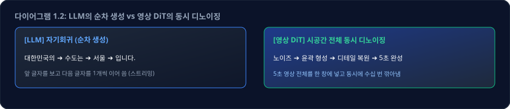
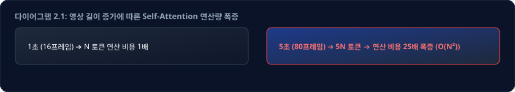
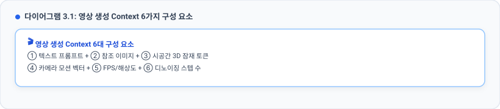

# 🎬 영상 생성 AI의 Context — 5초짜리 영상 한 편이 소설 반 권인 이유

> **문서 성격**: **참고자료 (보충)**. 교육 필수 과정이 아니라, [3-0. CONTEXT_관리.md](./3-0.%20CONTEXT_관리.md) 를 읽고 나서
> **"그러면 영상 생성 AI는?"** 이라는 질문이 생겼을 때 읽는 자료입니다.
> **선행 교재**: [2. AI의_이해.md](./2.%20AI의_이해.md) · [3-0. CONTEXT_관리.md](./3-0.%20CONTEXT_관리.md)
> **핵심 메시지**: **"영상 AI에도 Context Window가 있다. 다만 그 단위가 '글자 수'가 아니라 '해상도 × 시간'일 뿐이다."**

---

## 🔗 이 자료가 출발하는 질문

교재 3까지 읽고 나서 영상 생성 AI 서비스를 처음 열어 보면, **채팅 AI에는 없던 화면**을 만나게 됩니다.

| UI 요소 | 일반적인 설정값 | 영상 생성만의 특이점 |
| :--- | :--- | :--- |
| **프롬프트 입력** | `해변을 달리는 사람, 노을...` | 자연어 묘사 입력 |
| **참고 이미지** | `[ + 파일 올리기 ]` | 텍스트 외에 이미지 파일 주입 칸 존재 |
| **영상 길이** | `[ 5초 ▾ ]` (최대 10초) | ⚠️ 왜 하필 5~10초 단위에서 막히는가? |
| **해상도 / 규격** | `[ 1080p ▾ ] / 16:9` | 해상도별 생성 비용 및 연산량 급증 |
| **생성 진행률** | `███████░░░░░ 62%` | 글자처럼 한 자씩 나오지 않고 **전체 %로 진행** |

세 군데가 걸립니다.

- 채팅 AI는 답이 **한 글자씩 타자 치듯** 나왔습니다. 그런데 여기는 **퍼센트만 올라갑니다.**
- 채팅 AI의 스펙란에는 **`Context: 200,000`** 이 적혀 있었습니다. 여기 적힌 숫자는 **`5초 / 1080p`** 입니다.
- 그리고 채팅창에 PDF를 첨부하듯, **참고 이미지를 올리라는 칸**이 있습니다.

이 화면 앞에서 교재 3을 떠올리면, 다음 다섯 가지가 순서대로 걸려 나옵니다.

> **① 참고 영상을 넣으면 그걸 바탕으로 새 영상을 만들어 준다. 이것도 트랜스포머인가?**
> **② 채팅에는 Context가 있었다. 그러면 영상에는 Context가 없는 건가?**
> **③ 없다면, 대신 "생성 가능한 시간 / 해상도" 같은 걸로 규정하는 건가?**
> **④ 참고 이미지를 넣는 저 칸은, 교재 3에서 배운 RAG인가?**
> **⑤ 만들어진 영상은 완전히 새로운 영상인가, 어디선가 가져온 것인가?**

이 다섯 개가 그대로 이 자료의 목차입니다. 먼저 **결론부터** 정리하면 이렇습니다.

| # | 질문 | 핵심 결론 |
|:-:| :--- | :--- |
| **①** | **트랜스포머 기반인가?** | **예.** 최신 영상 AI의 본체는 트랜스포머(DiT)입니다. 단, 생성 방식(디퓨전)이 다릅니다. |
| **②, ③** | **영상에도 Context가 있나?** | **예.** 영상 AI의 Context Window는 **[해상도 × 시간(프레임)]** 으로 규정됩니다. |
| **④** | **참고 이미지는 RAG인가?** | ⚠️ **아닙니다.** 검색 단계가 없으므로 교재 3의 **"Context 주입"** 에 해당합니다. |
| **⑤** | **새로운 영상인가, 짜깁기인가?** | 노이즈에서 새로 계산한 픽셀입니다. 단, 학습 데이터 저작권 이슈는 별개입니다. |

---

## 📖 이 자료가 답하는 질문들

| Part | 제목 | 이 Part가 답하는 질문 | 출발 질문 |
|:---:|------|----------------------|:--------:|
| **Part 1** | 영상 AI는 LLM과 같은가 | 트랜스포머는 맞다는데, 그럼 왜 다르게 느껴지는가? | ① |
| **Part 2** | ⭐ 영상 AI의 Context | "5초/1080p 제한"은 대체 무엇의 한계인가? | ② ③ |
| **Part 3** | 긴 영상은 어떻게 만드나 | 1분짜리는 어떻게? 왜 뒤로 갈수록 이상해지는가? | ②의 연장 |
| **Part 4** | ⚠️ 영상에도 RAG가 있는가 | 참고 이미지를 넣는 건 RAG인가 주입인가? | ④ |
| **Part 5** | 만들어진 영상의 정체 | 완전히 새로운 것인가? 재현은 되는가? | ⑤ |
| **Part 6** | 방송국에서 쓸 때의 기준 | 어디까지 써도 되는가? | 실무 적용 |

---

---

# Part 1: 영상 AI는 LLM과 같은가, 다른가

## 1.1 "교재 2에서는 Diffusion이 트랜스포머가 아니라고 하지 않았나?"

①번 질문을 붙들고 교재 2를 다시 펴 보면, 오히려 더 헷갈립니다.
교재 2 Part 3.2의 아키텍처 표에 이런 줄이 있었기 때문입니다.

| 분야 | Task | 대표 모델 | 실제 아키텍처 | 트랜스포머? |
|------|------|----------|--------------|:----------:|
| 비전 | 이미지 생성 | Stable Diffusion 1.5 / XL | Diffusion + **U-Net(CNN)** | ❌ |
| 비전 | 이미지 생성 | **SD3, FLUX** | Diffusion + **DiT(Transformer)** | ✅ |

**같은 "이미지 생성"인데 두 줄의 표시가 다릅니다.** 그리고 이 두 줄의 차이가 바로 ①번의 답입니다.

| 세대 구분 | 결합 구조 | 특징 및 현주소 |
| :--- | :--- | :--- |
| **구세대 (~2023)** | Diffusion + **U-Net (CNN 기반)** | • 트랜스포머 아님<br>• 확장성 및 대규모 연산 수용 한계 |
| **현세대 (2024~)** | Diffusion + **DiT (Diffusion Transformer)** | • **본체가 트랜스포머**<br>• Sora, FLUX 등 최신 모델 표준 (규모 비례 성능 향상) |

> 💡 **왜 바꿨을까요?**
> 교재 2 Part 1.6에서 트랜스포머가 점령한 이유 3가지를 봤습니다.
> 그중 **1번 "병렬 처리 가능 → 모델을 거대하게 키울 수 있음"** 이 결정적이었습니다.
> LLM이 크게 키울수록 똑똑해졌던 것처럼, **영상 생성도 트랜스포머로 바꾸니 키운 만큼 좋아졌습니다.**
> (물리 법칙·움직임의 일관성이 크기에 비례해 좋아짐)

> 🎯 그러니까 정확한 표현은 이렇습니다.
> **"영상 생성 AI = 디퓨전(방법) + 트랜스포머(엔진)"**
> 디퓨전은 **"어떻게 만들 것인가"** 이고, 트랜스포머는 **"무엇으로 계산할 것인가"** 입니다.
> 둘은 경쟁 관계가 아니라 **조합**입니다.

---

## 1.2 ⭐ 결정적 차이 — LLM은 "이어 쓰고", 영상은 "동시에 깎아낸다"

엔진이 같은 트랜스포머라면, 앞의 화면에서 봤던 그 장면이 설명되지 않습니다.

> **채팅 AI는 글자가 한 자씩 나왔는데, 영상은 왜 진행률 퍼센트만 올라가는가?**

여기가 이 문서에서 **가장 중요한 부분**입니다. 이것만 이해하면 나머지가 전부 따라옵니다.



| 구분 | LLM (텍스트) | 영상 디퓨전 (DiT) |
| :--- | :--- | :--- |
| **생성 알고리즘** | 앞 토큰을 보고 뒤 토큰을 1개씩 순차 생성 | 5초 전체 시공간 블록을 동시에 수십 회 깎아냄 |
| **출력 체감** | 타자 치듯 1글자씩 스트리밍 | 진행률 바(%)가 차오르며 일괄 완성 |
| **시간 축 일관성** | 이전 생성 토큰들을 프롬프트로 재참조 | 전체 프레임이 **동일 Context 안에서 동시 Attention** |

> ⚠️ **여기서 흔히 도는 잘못된 설명 하나를 바로잡습니다.**
>
> **"영상 AI는 LLM처럼 KV Cache로 이전 프레임을 기억하며 다음 프레임을 그린다"**
> → **아닙니다.**
>
> · `KV Cache`는 LLM이 **한 글자씩 순차 생성할 때 계산을 재활용하는 속도 최적화 장치**이지, 맥락 저장소가 아닙니다.
> · 영상 디퓨전은 애초에 **프레임을 순서대로 만들지 않습니다.** 5초 구간 전체가 한 덩어리로 동시에 만들어집니다.
> · 1초 프레임과 5초 프레임의 일관성은 "기억"이 아니라, **둘 다 같은 Context 안에 들어와 있어서 서로를 동시에 참조(Attention)하기 때문**에 유지됩니다.
>
> 🎯 **이 차이가 왜 중요한가**: 프레임을 하나씩 만드는 게 아니라 **전부 한 창에 넣고 동시에 계산**하기 때문에,
> **"몇 초까지 만들 수 있는가"가 곧 "창이 얼마나 큰가"** 가 됩니다. → **Part 2의 핵심**

---

## 1.3 영상 한 편이 만들어지는 4단계


### LLM과 나란히 놓고 보면

| | LLM (텍스트) | 영상 생성 AI |
|---|-------------|-------------|
| **토큰의 정체** | 단어 조각 (1차원) | **시공간 블록** (3차원: 가로×세로×시간) |
| **엔진** | Transformer | **Transformer (DiT)** ← 같음 |
| **생성 방식** | 앞에서부터 하나씩 (자기회귀) | **전체를 동시에, 여러 번 다듬기 (디퓨전)** |
| **출력 진행 표시** | 글자가 한 자씩 나옴 | 진행률 % 만 보임 |
| **Context Window** | 토큰 수 (128k, 1M …) | **해상도 × 시간** |

---

## 📌 Part 1 정리

| # | 핵심 원리 요약 |
|:-:| :--- |
| **1** | 최신 영상 생성 AI는 **"디퓨전(생성 기법) + 트랜스포머(DiT 연산 엔진)"** 의 결합 구조이다. |
| **2** | 영상 모델의 토큰은 1차원 단어가 아니라 **3차원 시공간 블록(가로 × 세로 × 시간)** 이다. |
| **3** | LLM은 글자를 순차적으로 이어 쓰고, 영상 AI는 **지정된 시간 전체를 노이즈에서 동시에 깎아낸다.** |
| **4** | 따라서 영상의 **"최대 생성 길이(초)"는 곧 모델의 "Context Window 용량"** 과 직결된다. |

> ### 🔗 그러면 다음 질문이 생깁니다
> 그 창은 실제로 얼마나 크고, **왜 5초·10초에서 막히는가?**
> 맨 앞에서 걸렸던 **②·③번**이 여기서 풀립니다. → **Part 2**

---

---

# Part 2: ⭐ 영상 AI의 Context — "해상도 × 시간"이 곧 창의 크기다

## 2.1 "영상에는 Context가 없는 건가?" — 없는 게 아니라 단위가 다릅니다

②·③번 질문으로 돌아옵니다. 두 화면의 스펙란을 나란히 놓으면 이렇습니다.

```
[채팅 AI]   Context      200,000        ← 이건 배웠다
[영상 AI]   Max Duration 10 s
            Resolution   1080p          ← 그런데 Context 칸이 없다
```

여기서 갈림길이 두 개입니다.

> **ⓐ 영상 AI에는 Context라는 개념 자체가 없고, 대신 시간·해상도로 한계를 정하는 것인가?**
> **ⓑ 아니면 Context는 있는데, 표기만 시간·해상도로 하는 것인가?**

**답은 ⓑ입니다. 시간 × 해상도가 곧 그 Context입니다.**

```
[LLM]      Context Window = 몇 개의 단어 토큰을 담을 수 있는가
                            → "128k 토큰"

[영상 AI]  Context Window = 몇 개의 시공간 토큰을 담을 수 있는가
                            → 그런데 시공간 토큰 수는
                              해상도와 길이로 결정되므로
                            → "1080p / 10초" 라고 표시하는 것
```

> 🎯 **표기만 다를 뿐, 완전히 같은 개념입니다.**
> 교재 3 Part 2에서 OpenRouter의 `Context: 200,000`을 읽었던 것처럼,
> 영상 서비스의 **`최대 10초 / 1080p / 24fps`** 가 바로 그 스펙란입니다.

---

## 2.2 ⭐ 그래서 5초짜리 영상은 몇 토큰인가

직접 계산해 보면 감이 확 옵니다.
(압축률은 모델마다 다르므로 **자릿수 감각용 예시**입니다)

| 처리 단계 | 수치 계산 | 산출 결과 |
| :--- | :--- | :--- |
| **1. 원본 규격** | 720p (1280×720), 5초, 24fps | 총 120장 프레임 |
| **2. VAE 공간 압축 (1/8)** | $1280 \div 8 = 160$, $720 \div 8 = 90$ | 프레임당 잠재 크기 $160 \times 90$ |
| **3. VAE 시간 압축 (1/4)** | $120\text{장} \div 4$ | 총 30장 잠재 프레임 |
| **4. 패치 분할 (2×2)** | $(160 \div 2) \times (90 \div 2) = 80 \times 45$ | 프레임당 3,600개 패치 |
| **🔥 총 토큰 수** | $3,600 \times 30\text{프레임}$ | **약 108,000 토큰 (≒ 108k)** |

**교재 3 Part 2.3의 환산표를 다시 꺼내 보십시오.**

| 표기 | 토큰 수 | 한글 환산 |
|:----:|:------:|:--------:|
| **128k** | 12.8만 | 약 10만~13만 자 / A4 60~80p |

> ### 🔑 **720p 5초짜리 영상 한 편 ≒ 약 10만 토큰 ≒ LLM으로 치면 A4 50~60페이지를 한 번에 처리하는 것**
>
> "고작 5초"가 아닙니다. **소설 반 권 분량의 창을 통째로 쓰는 작업**입니다.

### 조건을 올리면 어떻게 되는가

| 조건 | 대략 토큰 수 | 720p 5초 대비 | 교재 3 기준 체감 |
|------|:-----------:|:------------:|----------------|
| **720p / 5초** | 약 **11만** | 1배 | 128k 창 하나 |
| **1080p / 5초** | 약 **24만** | 2.2배 | 256k 창 |
| **1080p / 10초** | 약 **49만** | 4.5배 | 0.5M |
| **1080p / 1분** | 약 **294만** | **27배** | **단행본 10~15권** |
| **4K / 10초** | 약 **194만** | 18배 | 단행본 6~10권 |

---

## 2.3 왜 5초, 10초에서 막히는가 — 연산량이 제곱으로 터진다

교재 2 Part 1.6에서 트랜스포머의 Attention은 **"모든 토큰이 서로를 동시에 쳐다본다"** 고 했습니다.
장점이지만, **대가**가 있습니다.

```
토큰이 N개면, 서로를 쳐다보는 쌍의 수는 대략 N × N 입니다.

   토큰 2배  →  연산 약 4배
   토큰 5배  →  연산 약 25배
   토큰 27배 →  연산 약 730배   ← 1080p 1분이 여기
```

| 생성 규격 | 토큰 규모 | 연산량 배수 ($N^2$) | 실무 GPU 요구 수준 |
| :--- | :--- | :--- | :--- |
| **720p / 5초** | 약 11만 토큰 | **1.0배 (기준)** | 상용 단일 GPU 서빙 가능 |
| **1080p / 10초** | 약 49만 토큰 | **약 20배** | 대용량 VRAM GPU 클러스터 필요 |
| **1080p / 1분** | 약 294만 토큰 | **약 730배 폭발** | 일반 서버에서 단발 계산 불가 경계선 |

> 🎯 **결론**
> "5초 제한"은 AI가 못 만들어서가 아니라, **한 번에 창에 올릴 수 있는 시공간 토큰의 한계**입니다.
> 교재 3에서 **"Context Window는 GPU 메모리의 한계"** 라고 했던 것과 **정확히 같은 이유**입니다.
> 그리고 이것이 **텍스트 AI보다 영상 AI가 압도적으로 비싼 이유**이기도 합니다. (교재 2 Part 4)

> ⚠️ **다만 "무조건 5초"는 아닙니다.**
> 서비스와 모델에 따라 5초 / 8초 / 10초 / 20초 등 제각각이고, 계속 늘어나고 있습니다.
> **중요한 건 숫자가 아니라 "왜 한계가 존재하는가"** 입니다.

---

## 2.4 영상 서비스의 "스펙란" 읽는 법

교재 3 Part 2에서 OpenRouter 모델 카드를 읽었던 것과 **같은 훈련**을 영상 서비스에서 하면 됩니다.

| 스펙 항목 | 표시 예시 | 실무적 의미 및 LLM 대응 |
| :--- | :--- | :--- |
| **Max Duration** | `10 s` | ⭐ **시간 축 Context Window** (1회 생성 길이 한도) |
| **Resolution** | `1080p` | ⭐ **공간 축 Context Window** (프레임당 토큰 수) |
| **Frame Rate** | `24 fps` | 초당 프레임 수 (fps 2배 = 토큰 약 2배) |
| **Aspect Ratio** | `16:9 / 9:16` | 화면 비율에 따른 가로·세로 토큰 분배 |
| **Reference Images** | `최대 3장` | 조건 주입 가능한 참고 에셋 수 한도 |
| **Cost** | `○○ 크레딧` | [해상도 × 시간 × fps]에 비례하여 차감 |

| 항목 | LLM에서 대응하는 것 | 의미 |
|------|-------------------|------|
| **Max Duration** | Context Window (시간 축) | 한 번에 만들 수 있는 길이 |
| **Resolution** | Context Window (공간 축) | 한 프레임이 먹는 토큰 수 |
| **Frame Rate** | — | fps가 2배면 토큰도 대략 2배 |
| **Reference Images** | 첨부 파일 수 제한 | 조건으로 넣을 수 있는 자료의 양 |
| **Cost (크레딧)** | Input/Output 단가 | **해상도 × 길이 × fps에 비례** |

> 💡 **실무 요령**
> 크레딧이 아까우면 **먼저 480p·짧은 길이로 여러 번 시도해 구도를 확정**하고,
> 마음에 드는 결과가 나왔을 때만 **같은 시드·같은 프롬프트로 고해상도 재생성**합니다.
> (교재 3 Part 6의 "경량 모델로 초안, 상위 모델로 마무리"와 정확히 같은 전략입니다)

---

## 📌 Part 2 정리

| # | 핵심 원리 요약 |
|:-:| :--- |
| **1** | 영상 AI의 Context Window는 **[해상도 × 시간(초)]** 으로 결정된다. |
| **2** | 720p 5초 영상 하나가 **약 10만 토큰(A4 50~60페이지 분량)** 에 달한다. |
| **3** | 트랜스포머 Attention 연산 특성상 길이와 해상도가 늘면 **연산량이 제곱($N^2$)으로 폭발**한다. |
| **4** | "5초·10초 제한"은 모델 성능 한계가 아닌 **단일 추론 시 수용 가능한 Context Window 한계**이다. |
| **5** | 영상 서비스의 스펙 시트(초, 해상도, fps)는 LLM의 토큰 용량표와 동일하게 해석한다. |


> ### 🔗 그러면 다음 질문이 생깁니다
> 그런데 유튜브에는 1분, 5분짜리 AI 영상이 있습니다. **어떻게 만든 건가?** → **Part 3**

---

---

# Part 3: 긴 영상은 어떻게 만드는가 — 그리고 왜 뒤로 갈수록 이상해지는가

## 3.1 이어붙이기 (Extension / Continuation)

창에 다 안 들어가면, **나눠서 이어 붙이는 수밖에 없습니다.**



> 💡 **교재 3 Part 3.1의 "요약 압축(Compaction)"과 구조가 똑같습니다.**
> 창이 넘치니까 → **직전 상태를 압축한 요약본(= 마지막 프레임)만 넘겨서** 다음 구간을 이어 만듭니다.

---

## 3.2 ⚠️ 그래서 뒤로 갈수록 무너진다 — 영상판 Context Rot

교재 3 Part 2.5에서 **Context Rot(맥락 부패)** 를 배웠습니다.
영상에서도 **정확히 같은 현상**이 일어나며, 이쪽은 **눈으로 보입니다.**

```
1구간 (0~5초)    :  ✅ 선명하고 의도대로
2구간 (5~10초)   :  🙂 대체로 유지되나 색감이 미세하게 변함
3구간 (10~15초)  :  😐 인물 얼굴이 조금씩 달라짐, 배경 디테일 뭉개짐
4구간 (15~20초)  :  😟 옷 색·소품이 바뀜, 화질 저하
5구간 이후       :  ❌ 다른 사람이 되어 있음
```

| 원인 | 설명 |
|------|------|
| **정보 손실** | 5초 구간 전체의 맥락이 **마지막 프레임 1장**으로 압축되어 전달됨 |
| **오차 누적** | 각 구간의 미세한 편차가 **복리로 쌓임** (복사본의 복사본) |
| **압축 열화** | VAE 인코딩/디코딩을 반복할수록 디테일이 깎임 |

> 🎯 **교재 3의 표현을 그대로 쓰면**
> **"이어붙이기는 무한정 되지 않습니다. 어느 시점에는 세션을 리셋해야 합니다."**
> 영상에서 "세션 리셋"에 해당하는 것이 바로 **컷을 나누는 것**입니다.

---

### 3.3 실무 요령 — 긴 AI 영상은 이렇게 만듭니다

| 구분 | 제작 방식 | 상세 내용 및 결과 |
| :--- | :--- | :--- |
| ❌ **하지 말 것** | 1분짜리를 단일 세션에서 이어붙이기 10회 반복 | • 뒤쪽 50% 구간에서 인물·배경 형태 붕괴 및 품질 파탄 |
| ✅ **실제 제작 방식** | **① 컷(Cut) 단위 분할** | 시나리오를 5~10초 단위의 컷으로 분할 |
| | **② 독립 세션 생성** | 각 컷을 독립된 창에서 새로 생성 (맥락 오염 원천 차단) |
| | **③ 참조 일관성 유지** | 동일한 참고 이미지(Character Sheet)를 각 컷에 주입 |
| | **④ NLE 편집 결합** | 프리미어/파이널컷 등 편집 툴에서 컷들을 조립 |
| | **⑤ 색보정(DI)** | 컬러 그레이딩으로 컷 간의 톤 앤 매너 통일 |

> 💡 **이건 사실 방송 제작의 기본과 완전히 같습니다.**
> 드라마도 5분을 한 테이크로 찍지 않습니다. **컷을 나눠 찍고 편집으로 붙입니다.**
> AI 영상 제작도 결국 같은 문법으로 돌아옵니다.

---

## 📌 Part 3 정리

| # | 핵심 원리 요약 |
|:-:| :--- |
| **1** | 긴 AI 영상은 통 생성이 아니라 **짧은 구간(5~10초)을 이어 붙여 제작**한다. |
| **2** | 단순 이어붙이기는 직전 마지막 프레임만 넘기므로 **교재 3의 요약 압축(Compaction)과 동일한 정보 유실**을 겪는다. |
| **3** | 이어붙이기가 반복될수록 인물·색감이 변형되는 **영상판 Context Rot(드리프트)** 이 발생한다. |
| **4** | 실무 정답은 **"컷 단위 분할 생성 ➔ 편집기 조립"** 방식이다. |

> ### 🔗 그러면 다음 질문이 생깁니다
> 그런데 컷마다 **같은 인물**을 유지하려면? 맨 앞 화면에 있던 그 칸, 참고 이미지를 넣습니다.
> **그게 ④번 — RAG인가?** → **Part 4**

---

---

# Part 4: ⚠️ 영상 AI에도 RAG가 있는가 — 여기서 헷갈리면 안 됩니다

## 4.1 판단 기준부터 — 교재 3의 3분류를 그대로 가져옵니다

④번 질문입니다. 맨 처음 화면의 **`참고 이미지 [ + 파일 올리기 ]`** 칸,
그리고 Part 3에서 "컷마다 같은 인물을 유지하려면 참고 이미지를 쓴다"고 했던 그 기능.
**저것을 RAG라고 부르는 설명을 인터넷에서 흔히 만나게 됩니다.** 맞는 말인지 따져 봅니다.

먼저 판단 기준을 세워야 합니다. 교재 3 Part 5에서 지식을 넣는 방법을 셋으로 나눴습니다.

| 방법 | 정의 | 결정적 특징 |
|------|------|-----------|
| **Context 주입** | 자료를 요청에 통째로 붙임 | **내가 직접 골라서** 넣는다 |
| **RAG** | 검색해서 관련 조각만 붙임 | **시스템이 질문에 맞춰 찾아온다** ⭐ |
| **파인튜닝** | 가중치를 실제로 수정 | 모델 자체가 변한다 |

> 🔑 **RAG를 RAG이게 만드는 것은 "검색(Retrieval)" 단계입니다.**
> 자료 더미가 따로 있고, **질문에 따라 무엇을 가져올지 시스템이 판단**해야 RAG입니다.

---

## 4.2 그래서 "참고 이미지·영상 넣기"는 무엇인가


> ❓ **이 과정 어디에 "검색(Retrieval)"이 있습니까?**  
> ➔ **없습니다.** 사용자가 이미지를 직접 지정해서 넣었으므로 **Context 주입**입니다.

> ### ⚠️ **그러므로 이것은 RAG가 아니라 교재 3의 "Context 주입"입니다.**
>
> 기술 문서에서는 이것을 **조건 주입(Conditioning)**, 또는 구현체 이름으로
> `IP-Adapter`, `Reference / ControlNet`, `Image-to-Video`, `Video-to-Video` 등으로 부릅니다.
>
> **텍스트로 치면**: 채팅창에 PDF를 첨부한 것과 **완전히 같은 층위**입니다.
> PDF 첨부를 "RAG"라고 부르지 않듯, 참고 이미지 첨부도 RAG가 아닙니다.

---

## 4.3 그럼 "캐릭터를 아예 기억시키는 것"은?

같은 캐릭터를 수십 개 컷에서 반복해 써야 한다면, 참고 이미지 주입만으로는 부족합니다.
이때 쓰는 것이 **LoRA 학습**입니다.

```
  캐릭터 사진 15~30장  ──학습(수십 분~수 시간, GPU 사용)──▶  작은 가중치 파일
                                                             (LoRA, 수십 MB)
                                            │
                                            ▼
                              이후 생성 시 본체 모델에 얹어서 사용
```

> ### 🔑 **이것은 교재 3의 "파인튜닝(층위 2)"입니다.**
> 본체 가중치 전부가 아니라 **작은 보조 가중치만 학습**하는 **경량 파인튜닝**입니다.
> 하지만 **가중치가 실제로 만들어진다**는 점에서, 주입과는 층위가 완전히 다릅니다.

---

## 4.4 그러면 진짜 RAG는 영상 AI에 없는가

| 형태 | RAG인가 | 설명 |
|------|:------:|------|
| 참고 이미지·영상 업로드 | ❌ | Context 주입 (내가 직접 지정) |
| 캐릭터 LoRA | ❌ | 파인튜닝 (가중치 생성) |
| 프롬프트에 스타일 설명 | ❌ | 그냥 프롬프트 |
| **사내 에셋 라이브러리에서 "질문에 맞는 소스를 자동 검색"해 조건으로 주입** | ✅ | **이것이 진짜 Video RAG** |
| 연구 단계의 검색 증강 영상 생성 | ✅ | 논문 수준. 상용 서비스에는 드묾 |

> 🎯 **정리하면**
> **"영상 AI에도 RAG가 있다"는 말은 2026년 현재 대체로 과장입니다.**
> 일반 사용자가 쓰는 기능은 거의 전부 **Context 주입**이고,
> 일부는 **경량 파인튜닝(LoRA)** 입니다.
>
> 다만 **개념적으로는 충분히 가능**하며, 방송국처럼 **자체 영상 아카이브가 있는 조직**이
> "우리 아카이브에서 관련 소스를 자동으로 찾아 조건으로 넣는" 시스템을 만든다면
> **그것이 진짜 Video RAG**가 됩니다.

---

## 4.5 오해 정리표

| 흔히 듣는 말 | 정확한 표현 |
|-------------|-----------|
| "참고 영상을 넣으면 AI가 학습해요" | ❌ 학습이 아니라 **조건 주입**입니다. 다음 생성엔 남지 않습니다 |
| "IP-Adapter는 영상판 RAG예요" | ❌ 검색 단계가 없으므로 **Context 주입**입니다 |
| "KV Cache로 이전 프레임을 기억해요" | ❌ 구간 전체를 **동시에** 만들기 때문에 기억이 아니라 **동시 참조**입니다 |
| "LoRA는 그냥 참고 이미지 같은 거예요" | ❌ LoRA는 **가중치를 만드는 파인튜닝**입니다 (층위가 다름) |

---

## 📌 Part 4 정리

| # | 핵심 원리 요약 |
|:-:| :--- |
| **1** | RAG 성립의 핵심 기준은 **"시스템의 자동 검색(Retrieval) 단계 유무"** 이다. |
| **2** | 참고 이미지/영상 업로드는 검색이 없으므로 **Context 주입(Conditioning)** 이다. |
| **3** | 캐릭터 LoRA는 보조 가중치 파일을 생성하는 **경량 파인튜닝(층위 2)** 이다. |
| **4** | 방송국 아카이브와 결합하여 적합 소스를 자동 추출해 주입할 때 비로소 **진짜 Video RAG**가 된다. |

> ### 🔗 그러면 마지막 궁금증이 남습니다
> 그렇게 만들어진 영상은 **완전히 새로운 것인가?** 맨 앞의 **⑤번**입니다. → **Part 5**

---

---

# Part 5: 만들어진 영상의 정체 — 새로운 것인가, 가져온 것인가

## 5.1 짜깁기가 아닙니다

마지막 ⑤번입니다. 완성된 영상을 처음 받아 보면 누구나 한 번은 이 생각을 합니다.

> **"학습한 영상이 모델 안에 들어 있다가, 비슷한 장면을 잘라 붙여 준 것 아닌가?"**
> 회의 자리에서도 **"그럼 남의 영상 갖다 쓰는 거 아니냐"** 는 질문으로 반드시 나옵니다.

```
❌ 오해: 기존 영상들을 잘라서 이어 붙인다
✅ 실제: 무작위 노이즈에서 시작해 픽셀을 새로 계산해 만든다
```

교재 2 Part 1.3에서 배운 **가중치(Weight)** 를 떠올리십시오.

> 모델 파일 안에 들어 있는 것은 **영상이 아니라 숫자(가중치)** 입니다.
> 학습이란 수억 개의 영상을 보면서
> **"사람이 달리면 옷자락이 이렇게 날린다", "물은 이렇게 반사한다"** 같은
> **통계적 규칙**을 그 숫자들에 새겨 넣은 것입니다.
>
> 생성이란, 그 규칙을 이용해 **노이즈를 조각처럼 깎아내는 것**입니다.
> 결과물은 **그 조합으로 처음 만들어진 픽셀 배열**입니다.

---

## 5.2 ⚠️ 하지만 "학습 데이터와 무관하다"는 뜻은 아닙니다

이 부분은 **방송국에서 특히 중요**하므로 분명히 해 둡니다.

| 오해 | 사실 |
|------|------|
| "새로 만든 거니까 저작권 문제 없다" | ⚠️ **아닙니다.** 학습 데이터의 저작권, 생성물의 권리 귀속은 **여전히 논쟁 중이며 국가별로 다릅니다** |
| "특정 작품과 똑같이 나올 리 없다" | ⚠️ 학습 데이터에 아주 많이 등장한 이미지는 **매우 유사하게 재현될 수 있습니다** |
| "실존 인물처럼 생겨도 우연이다" | ⚠️ **초상권·퍼블리시티권 문제가 발생할 수 있습니다** |
| "AI가 만들었으니 사실이 아니라고 다 안다" | ⚠️ **모릅니다.** 그래서 표기 의무 논의가 진행 중입니다 |

> 🎯 **"짜깁기가 아니다"는 기술적 사실이고,**
> **"그러므로 법적·윤리적으로 자유롭다"는 별개의 문제입니다.** 둘을 섞지 마십시오.

---

## 5.3 같은 프롬프트를 넣으면 같은 영상이 나오는가

교재 2 Part 1.5의 **2번 현상**을 기억하십니까?

> **"같은 질문에 매번 다른 답이 나온다 — 확률표에서 매번 새로 뽑기 때문"**

영상도 똑같습니다. 다만 영상에는 **"뽑기의 출발점"을 고정하는 장치**가 있습니다.

| 파라미터 | 동작 원리 | 실무 재현성 |
| :--- | :--- | :--- |
| **Seed (시드)** | 시작 노이즈 캔버스를 결정하는 고유 난수 값 | • 동일 모델 + 동일 프롬프트 + **동일 Seed** ➔ **재현 가능 ✅**<br>• Seed 변경 시 ➔ 완전히 다른 영상 산출 ❌ |

> 💡 **실무 요령**
> 마음에 드는 결과가 나왔다면 **반드시 시드 값을 기록**해 두십시오.
> 프롬프트만 저장하고 시드를 안 적으면 **두 번 다시 같은 영상을 못 만듭니다.**
> (교재 3의 `HANDOVER.md`와 같은 역할입니다 — **재현에 필요한 조건을 남겨두기**)

---

## 📌 Part 5 정리

| # | 핵심 원리 요약 |
|:-:| :--- |
| **1** | 영상 생성 결과물은 기존 영상을 짜깁기한 것이 아니라 **규칙에 의해 새로 연산된 픽셀**이다. |
| **2** | 기술적 독창성과 별개로, **학습 데이터 저작권·초상권·퍼블리시티권 법적 리스크는 엄존**한다. |
| **3** | **Seed(시드 값)** 를 기록해 두어야만 동일한 연출 구도를 추후 완벽하게 재현할 수 있다. |

---

---

# Part 6: 방송국에서 영상 생성 AI를 쓸 때의 기준

교재 2 Part 7의 원칙이 여기에도 **그대로, 오히려 더 강하게** 적용됩니다.

> 🎯 **"AI는 사람의 판단을 보조하는 도구이지, 최종 결정권자가 될 수 없다."**

## 6.1 위험도 등급

| 위험도 등급 | 대상 영역 | 실무 운영 수칙 |
| :--- | :--- | :--- |
| **[안전 ★★★★★]** | 사내 검토용 콘티·시안·스토리보드 | • 기획 회의 연출안 공유용<br>• 방송 미송출 영역이므로 **적극 도입 권장** |
| **[주의 ★★★☆☆]** | 방송용 추상 배경·이펙트·타이틀 소스 | • 실사 인물 없는 그래픽에 한정<br>• 상업용 라이선스 확인 및 AI 표기 검토 |
| **[고위험 ★☆☆☆☆]** | 실존 인물·특정 장소 재현 영상 | • 초상권/퍼블리시티권 침해 위험<br>• **법무팀 사전 검토 필수** |
| **[금지 ☆☆☆☆☆]** | **보도·시사 프로그램 내 AI 화면** | • 팩트 전달 화면에 가상 영상 사용 엄금<br>• 방송 신뢰도 훼손 위험 극대화 |

## 6.2 사용 전 체크리스트

| # | 점검 항목 | 통과 기준 |
|:-:| :--- | :--- |
| **1** | **용도 구분** | 방송 송출용이 아닌 사내 내부 기획/검토용인가? |
| **2** | **인물 초상권** | 특정 실존 인물로 오인될 수 있는 얼굴이 배제되었는가? |
| **3** | **사실 왜곡** | 뉴스/보도에서 실제 사건·장소로 오인될 소지가 없는가? |
| **4** | **상업 라이선스** | 이용 중인 영상 AI 플랫폼의 상업적 송출 권한을 확인했는가? |
| **5** | **주입 자료 권리** | 참고 이미지/영상으로 업로드한 소스의 사내 저작권이 확보되었는가? |
| **6** | **표기 의무** | AI 생성물 자막 표기 지침을 준수하였는가? |
| **7** | **인간 최종 검수** | 송출 직전 연출자/데스크의 육안 검수 파이프라인이 존재하는가? |

> 🎯 **가장 중요한 한 줄**
> **참고 이미지·영상을 업로드하는 순간, 그 자료는 우리 망 밖으로 나갑니다.**
> 교재 2에서 배운 보안 판단 기준이 **영상 AI에서 가장 자주 무너지는 지점**입니다.

---

---

# 📝 전체 정리




---

## 용어 점검표

| 용어 | 한 줄 정의 |
|------|-----------|
| **디퓨전 (Diffusion)** | 노이즈에서 시작해 조금씩 걷어내며 형상을 만드는 생성 **방법** |
| **DiT (Diffusion Transformer)** | 그 디노이징 계산을 트랜스포머로 하는 현세대 구조 |
| **VAE** | 영상을 작은 잠재 공간으로 압축·복원하는 부품 |
| **Spacetime Patch** | 가로×세로×시간으로 자른 영상 조각. **영상의 토큰** |
| **잠재 공간 (Latent Space)** | 픽셀이 아닌, 압축된 숫자 공간. 실제 계산이 일어나는 곳 |
| **Temporal Attention** | 프레임끼리 서로를 참조해 움직임의 일관성을 맞추는 계산 |
| **Conditioning (조건 주입)** | 프롬프트·참고 이미지를 생성 과정에 가이드로 넣는 것 = **Context 주입** |
| **LoRA** | 소량의 보조 가중치만 학습하는 **경량 파인튜닝** |
| **Seed (시드)** | 시작 노이즈를 정하는 숫자. 고정하면 결과가 재현됨 |
| **Extension / Continuation** | 마지막 프레임을 조건으로 다음 구간을 이어 만드는 것 |
| **드리프트 (Drift)** | 이어붙일수록 인물·색감이 어긋나는 현상. **영상판 Context Rot** |

---

## 📎 부록: 인터넷 설명 중 자주 틀리는 3가지

이 주제를 검색해 보거나 AI에게 물어보면, 높은 확률로 다음 세 가지 설명을 만나게 됩니다.
**세 가지 모두 틀렸습니다.** 여기까지 읽었다면 왜 틀렸는지 직접 반박할 수 있어야 합니다.

| # | 자주 도는 설명 | 실제 |
|:--:|--------------|------|
| 1 | "비디오 AI는 **KV Cache**로 이전 프레임을 기억해 다음 프레임을 그린다" | ❌ KV Cache는 LLM의 **순차 생성 속도 최적화** 장치입니다. 영상 디퓨전은 구간 전체를 **동시에** 만들므로 "기억"이 아니라 **같은 창 안에서의 동시 참조(Attention)** 입니다 |
| 2 | "IP-Adapter / 참고 이미지 기능은 **영상판 RAG**다" | ❌ **검색 단계가 없습니다.** 사용자가 직접 지정하므로 교재 3의 **Context 주입**입니다. RAG라 부르면 비용·구조 판단이 통째로 틀어집니다 |
| 3 | "영상 AI는 **최대 5초**까지만 만들 수 있다" | ⚠️ 모델·서비스마다 5초~20초 이상으로 제각각이고 계속 늘고 있습니다. **고정된 숫자가 아니라 "왜 한계가 있는가"** 를 기억하십시오 |

> 💡 **이 부록의 교훈이 사실 교재 3의 메시지와 같습니다.**
> AI의 설명은 **"확률적으로 그럴듯한 텍스트"** 입니다 (교재 2 Part 1.5).
> 그럴듯한 전문 용어가 섞여 있을수록 **오히려 검증이 필요합니다.**

---

> **이어지는 사례 연구**: [3-2. 사례연구_AI_수어통역.md](./3-2.%20사례연구_AI_수어통역.md)
> 이 문서에서 배운 **창 크기 한계(Part 2)와 드리프트(Part 3)** 가
> **"정보를 전달하는 영상"** 을 만들려 할 때 어떤 벽이 되는지를,
> 방송국에서 실제로 제안되는 **AI 수어통역** 사례로 끝까지 따라가 봅니다.
>
> **관련 교재**
> · [2. AI의_이해.md](./2.%20AI의_이해.md) — Part 1.6(트랜스포머), Part 3.2(아키텍처 표), Part 7(방송국 기준)
> · [3-0. CONTEXT_관리.md](./3-0.%20CONTEXT_관리.md) — Part 2(Context Window), Part 3(Context Rot), Part 5(주입/RAG/파인튜닝)
