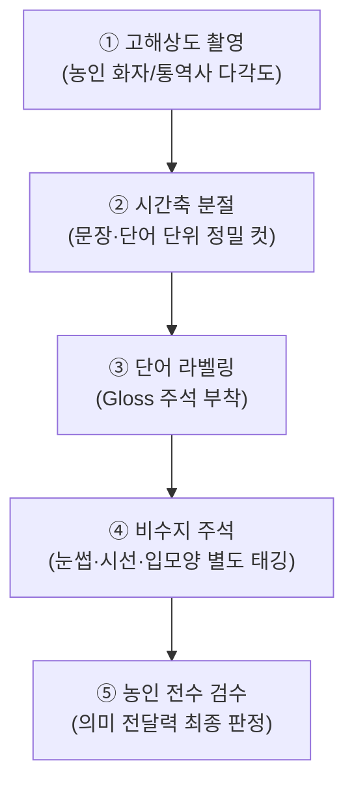
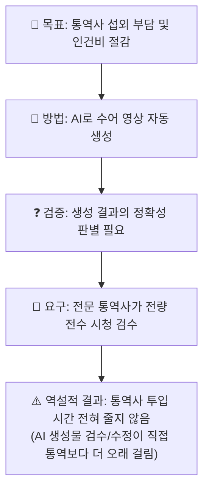
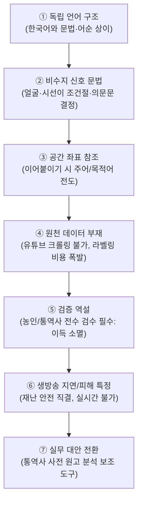

# 🤟 사례 연구 — "AI로 수어통역을 만들자"는 왜 어려운가

> **문서 성격**: **참고자료 / 사례 연구**. 교재 2·3·3-1에서 배운 것을 **하나의 실제 제안에 적용해 보는 종합 훈련**입니다.
> **선행 교재**: [2. AI의_이해.md](./2.%20AI의_이해.md) · [3-0. CONTEXT_관리.md](./3-0.%20CONTEXT_관리.md) · [3-1. 영상생성AI의_Context.md](./3-1.%20영상생성AI의_Context.md)
> **핵심 메시지**: **"AI가 무엇을 못 하는지를 설명할 수 있어야, AI를 안다고 할 수 있다."**

---

## 🔗 이 문서를 읽는 이유

회의에서 이런 제안이 나옵니다.

> **"요즘 AI로 영상도 만드는데, 수어통역사도 AI로 만들면 되지 않나요?
> 통역사 섭외도 어렵고 비용도 드는데, 텍스트만 넣으면 수어 영상이 나오게 하면 되잖아요."**

이때 **"어려울 것 같습니다"** 는 답변은 아무 힘이 없습니다. 회의에서 이깁니다, 지느냐의 문제가 아니라 **근거가 없으면 결국 예산이 잘못 집행되기 때문**입니다.

이 문서의 목표는 하나입니다.

> ### 🎯 **"왜 어려운가"를 6개 층위로 나눠, 감정이 아니라 구조로 설명할 수 있게 되는 것.**
>
> 그리고 이 6개 층위는 **수어에만 해당하는 것이 아닙니다.**
> 다 읽고 나면 **"이 업무에 AI를 써도 되는가"를 판별하는 5문항 체크리스트**가 손에 남습니다. (Part 8)

---

## ⚠️ 먼저 분명히 해 둘 것

이 문서는 **"AI가 영원히 못 한다"** 고 주장하지 않습니다. 연구는 계속 진행 중입니다.
이 문서가 말하는 것은 이것입니다.

| 핵심 구분 | 상세 분석 |
| :--- | :--- |
| **구조적 한계** | 이 문제가 막혀 있는 이유는 "모델 성능 부족"이 아닌 **원천 데이터 부재와 검증 비용의 구조적 문제**이다. |
| **데이터 부재** | 학습 데이터가 인터넷에 존재하지 않으며, 신규 구축 비용이 극단적으로 비싸다. |
| **전문가 검증 필수** | 산출물의 정답 여부를 검증하는 데 고도의 도메인 전문가(수어통역사/농인)가 반드시 필요하다. |
| **스케일업 한계** | 모델을 10배 키워도 이 두 가지 구조적 문제는 자동으로 해결되지 않는다. |

---

## 📖 이 문서의 구성

| Part | 벽(장애물) | 한 줄 요약 |
|:---:|-----------|-----------|
| **Part 0** | 무엇을 만들자는 것인가 | 논의 대상을 정확히 좁힌다 |
| **Part 1** | 벽 ① **언어** | 수어는 한국어를 손으로 옮긴 것이 아니다 |
| **Part 2** | 벽 ② **비수지 신호** | 문법이 손이 아니라 얼굴에 실린다 |
| **Part 3** | 벽 ③ **공간 문법** | 교재 3-1의 드리프트가 여기서는 문법 파괴가 된다 |
| **Part 4** | 벽 ④ **데이터** | ⭐ 가장 결정적. 인터넷에서 긁어올 수 없다 |
| **Part 5** | 벽 ⑤ **검증** | 통역사를 대체하려는데 검수에 통역사가 필요하다 |
| **Part 6** | 벽 ⑥ **실시간성과 책임** | 오류의 피해자가 특정된다 |
| **Part 7** | 그럼 무엇이 가능한가 | 건설적 대안 |
| **Part 8** | ⭐ 일반화 | AI 도입 판별 5문항 |
| **Part 9** | 실전 | 회의에서 할 말, 업체에 던질 질문 |

---

---

# Part 0: 무엇을 만들자는 것인가 — 대상 좁히기

## 0.1 두 개의 반대 방향을 구분합니다

| 작업 방향 | 기술 명칭 (Task) | 설명 및 현주소 |
| :--- | :--- | :--- |
| **[방향 A] 수어 ➔ 텍스트** | **수어 인식 (SLR)** | • 카메라로 수어를 촬영하여 한국어 자막/텍스트로 변환<br>• 상대적 연구 진전 있으나 완벽한 실용화는 여전히 연구 중 |
| **[방향 B] 텍스트 ➔ 수어** | **수어 생성 (SLP)** ⭐ | • 방송 대본을 입력받아 실사 수어 영상을 자동 생성<br>• **방향 A보다 압도적으로 높은 난이도** (본 문서의 분석 대상) |

방송국에서 나오는 제안은 거의 항상 **방향 B**입니다.

## 0.2 그리고 구현 방식이 3가지입니다 — 이걸 섞으면 논의가 산으로 갑니다

| 방식 | 정체 | 교재 2 기준 분류 |
|------|------|----------------|
| **① 실사 생성 AI** | 디퓨전으로 사람처럼 보이는 수어 영상을 생성 | 진짜 생성 AI (교재 3-1의 주제) |
| **② 3D 아바타 + 모션 사전** | 사람이 미리 캡처해 둔 동작을 규칙대로 이어 붙임 | **생성 AI가 아님.** 교재 2 Part 6의 "의미 2(규칙 기반)"에 가까움 |
| **③ 실제 통역사 촬영** | 현재 방송국이 하는 방식 | AI 무관 |

> ⚠️ **가장 흔한 혼선**
> 업체가 **②번(아바타)** 을 가져와서 **"AI 수어"** 라고 부르는 경우가 매우 많습니다.
> 교재 2 Part 7.3의 **"AI 기반이라고 광고하는 앱의 진실"** 이 여기서 그대로 재현됩니다.
> **"실행 중에 모델이 추론을 합니까, 아니면 미리 만든 동작을 재생합니까?"** 를 반드시 물어야 합니다.

이 문서는 **①번(실사 생성 AI)** 을 중심으로 하고, ②번은 Part 7에서 별도로 다룹니다.

---

---

# Part 1: 벽 ① — 수어는 "한국어를 손으로 옮긴 것"이 아니다

## 1.1 가장 근본적인 오해

| 관점 | 명제 |
| :--- | :--- |
| ❌ **오해** | "한국어 문장의 단어를 하나씩 1:1로 손동작으로 바꾸면 수어가 된다." |
| ✅ **사실** | **"한국수어(KSL)는 한국어와 어순·문법 체계가 완전히 다른 독립된 자연 언어이다."** |

한국수어는 한국어의 "표기법"이 아닙니다. **자체 문법을 가진 별개의 자연 언어**입니다.
(영어와 미국수어(ASL)의 관계도, 일본어와 일본수어의 관계도 마찬가지입니다.)

| 구분 | 한국어 표현 | 한국수어(KSL) 실제 표현 방식 |
| :--- | :--- | :--- |
| **원문** | "내일 비가 오면 행사는 취소됩니다." | `[내일] [비] [오다]` + **눈썹 올림 & 고개 기울임 (조건절 표정)**<br>➔ `[행사] [취소]` + **고개 끄덕임 (귀결)** |
| **문법 특징** | 조사/어미 `~면`을 단어로 발화 | **손동작 단어가 따로 없고 표정·얼굴 각도가 조건문 문법을 전담** |

## 1.2 그래서 문제가 2단이 됩니다

```mermaid
graph LR
    Step1["① 한국어 대본"] -->|1차: 기계 번역<br/>(한국어-KSL 병렬 코퍼스 극도 부족)| Step2["② 한국수어 문법 구조<br/>(손 + 비수지 결합)"]
    Step2 -->|2차: 시공간 비디오 생성<br/>(정렬된 수어 영상 데이터 극도 부족)| Step3["③ 최종 수어 영상<br/>(손·표정·공간좌표 동기화)"]
```

> 💡 **비유로 정리하면**
> 이건 "한국어 영상에 자막을 다는 일"이 아니라,
> **"병렬 데이터가 거의 없는 언어쌍의 번역기를 만들고, 그 결과를 영상으로 연기까지 시키는 일"** 입니다.
>
> 교재 2 Part 3.2에서 번역 모델(NLLB, M2M100)이 트랜스포머로 잘 된다고 했지만,
> **그건 그 언어쌍의 데이터가 많았기 때문**입니다. 데이터가 없으면 구조가 같아도 안 됩니다.

---

---

# Part 2: 벽 ② — 손만 맞으면 되는 게 아니다 (비수지 신호)

## 2.1 문법의 상당 부분이 얼굴과 몸에 실립니다

수어에서 **손이 아닌 요소**를 **비수지 신호(Non-Manual Signals)** 라고 합니다.

| 요소 | 담당하는 것 (예) |
|------|----------------|
| **눈썹** | 의문문 / 조건절 표시 |
| **고개 흔들기·기울임** | 부정 / 조건 / 화제 전환 |
| **시선 방향** | 누구를/무엇을 가리키는지 (Part 3의 공간 참조와 직결) |
| **입 모양** | 단어 구분, 정도 표현 (크다/조금 크다) |
| **볼·눈 크기** | 정도·강조 |
| **어깨·상체 이동** | 화자 전환 (인용, 역할 바꾸기) |

| 손동작 조합 | 결합되는 표정/얼굴 신호 | 최종 문장 의미 |
| :--- | :--- | :--- |
| `[내일 · 비 · 오다]` | **평평한 기본 표정** | "내일 비가 옵니다." (평서문) |
| `[내일 · 비 · 오다]` | **눈썹을 위로 치켜올림** | "내일 비가 오나요?" (의문문) |
| `[내일 · 비 · 오다]` | **고개를 좌우로 저음** | "내일 비가 오지 않습니다." (부정문) |

## 2.2 그런데 하필 생성 AI가 가장 못 하는 부분입니다

교재 3-1에서 디퓨전이 어떻게 만드는지 봤습니다. 노이즈를 깎아내는 방식입니다.
그런데 이 방식이 **구조적으로 약한 영역**이 정확히 두 곳입니다.

| 취약 영역 | AI 모델의 한계 | 수어에서의 치명적 영향 |
| :--- | :--- | :--- |
| **① 손과 손가락** | 관절 꺾임, 손가락 수 오류(6개), 미세 형태 뭉개짐 | **손 모양(Handshape) 하나 차이로 전혀 엉뚱한 단어로 변질** |
| **② 안면 미세 표정** | 전체 인상은 유사하나 눈썹 각도·시선 각도 미세 제어 불안정 | **평서문이 의문문으로 바뀌거나 긍정이 부정으로 왜곡됨** |

> ### ⚠️ **여기가 결정적입니다.**
> 일반 영상에서 손가락이 뭉개지면 **"좀 이상하네"** 로 끝납니다. **미관의 문제**입니다.
>
> 수어에서는 **손 모양(handshape) 하나 차이가 다른 단어**입니다.
> 눈썹 각도 하나가 **평서문과 의문문을 가릅니다.**
>
> → **미관의 문제가 아니라 의미 오류가 됩니다.**
> → 그리고 **틀렸는지 대부분의 사람은 알아볼 수 없습니다.** (Part 5)

---

---

# Part 3: 벽 ③ — 공간 문법과 Context (교재 3-1과 직결)

## 3.1 수어의 대명사는 "공간 좌표"입니다

수어에는 아주 독특한 문법이 있습니다.

| 단계 | 담화 공간(Signing Space) 활용 방식 | 실무 의미 |
| :--- | :--- | :--- |
| **1. 인물 배치 (Anchor)** | 화자의 오른쪽 앞 공간을 가리켜 `김 국장` 배치 (📍A)<br>화자의 왼쪽 앞 공간을 가리켜 `이 팀장` 배치 (📍B) | 공간에 고유 좌표 부여 |
| **2. 지속 참조 (Reference)** | 담화 내내 📍A를 가리키면 `"김 국장이"` 지칭<br>📍B를 가리키면 `"이 팀장이"` 지칭 | 지칭 대명사 역할 수행 |
| **3. 방향성 동사 (Action)** | 손이 📍A에서 📍B로 이동하며 동작 | `"김 국장이 이 팀장에게 지시/전달"` |

> ⚠️ 한 번 정한 공간 좌표는 **담화가 끝날 때까지 1픽셀도 흔들리지 않고 유지**되어야 합니다.

## 3.2 ⭐ 그런데 교재 3-1에서 무엇을 배웠습니까

교재 3-1 Part 3에서 이렇게 배웠습니다.

> **"영상 생성 AI는 5~10초 단위로만 만들 수 있고,
> 긴 영상은 마지막 프레임을 조건으로 이어붙이며,
> 이어붙일수록 인물·색감·구도가 드리프트한다."**

이 두 사실을 겹쳐 보십시오.

| 구간 번호 | 생성 시간대 | 공간 좌표 상태 | 시청자가 보게 되는 실제 결과 |
| :--- | :--- | :--- | :--- |
| **구간 1** | `0 ~ 5초` | 📍A = 김 국장, 📍B = 이 팀장 | ✅ 정상 문장 전달 |
| **구간 5** | `20 ~ 25초` | 인물 자세와 카메라 앵글 미세 드리프트 | 🙂 약한 불안정성 발생 |
| **구간 12** | `55 ~ 60초` | 화자 중심축 이동으로 좌우 좌표 왜곡 | 😐 인물 지칭 혼선 시작 |
| **구간 20** | `95 ~ 100초` | 📍A와 📍B의 위치가 완전히 뒤바뀜 | ❌ **"김 국장" 자리에 "이 팀장"이 지시한 것으로 정반대 오역** |

> ### 🔑 **교재 3의 Context Rot이, 여기서는 "문법 파괴"가 됩니다.**
>
> 일반 영상에서 드리프트는 **화질 저하**입니다.
> 수어에서 드리프트는 **주어와 목적어가 뒤바뀌는 것**입니다.
>
> 그리고 이건 "모델이 좀 더 좋아지면" 해결되는 문제가 아니라,
> **Context Window 안에 담화 전체가 들어가야 풀리는 문제**입니다.
> 교재 3-1 Part 2에서 계산했듯, **1080p 2분 = 약 600만 토큰**입니다.


> ### 🔑 **교재 3의 Context Rot이, 여기서는 "문법 파괴"가 됩니다.**
>
> 일반 영상에서 드리프트는 **화질 저하**입니다.
> 수어에서 드리프트는 **주어와 목적어가 뒤바뀌는 것**입니다.
>
> 그리고 이건 "모델이 좀 더 좋아지면" 해결되는 문제가 아니라,
> **Context Window 안에 담화 전체가 들어가야 풀리는 문제**입니다.
> 교재 3-1 Part 2에서 계산했듯, **1080p 2분 = 약 600만 토큰**입니다.

---

---

# Part 4: ⭐ 벽 ④ — 데이터가 없다 (가장 결정적인 벽)

## 4.0 먼저, 이 회의에서 실제로 오가는 말들

| 기호 | 회의실에서 흔히 나오는 발언 | 성격 |
|:---:| :--- | :--- |
| **ⓐ** | "이미 만들어 놓은 수어 AI 모델이 어딘가 있지 않을까?" | ❓ 사전 구축 모델 유무 |
| **ⓑ** | "LLM은 책과 뉴스로 배웠다는데, 수어는 글이 아니라 실제 영상이어야 하지 않나?" | ❓ 데이터 모달리티 |
| **ⓒ** | "그 영상이랑 뜻을 하나하나 짝지어 주는 게 일이겠는데?" | ❓ 데이터 라벨링 |
| **ⓓ** | "유튜브에 수어 영상 많잖아요. 그거 긁어다 학습시키면 되죠." | ❓ 데이터 크롤링 |

Part 4는 이 네 가지를 **하나씩 사실 확인**합니다.
그리고 **Part 4 끝의 정리 표(4.5)에서 채점 결과를 확인합니다.**

> 💡 **읽는 방법**: 지금 ⓐ~ⓓ 중 어느 것이 맞고 어느 것이 틀렸을지 먼저 찍어 보십시오.
> 대부분 **ⓓ에서 틀립니다.** 그리고 그 이유가 이 문서에서 가장 중요한 대목입니다.

---

## 4.1 LLM은 왜 됐는가 — 공짜로 존재하는 데이터가 있었기 때문

교재 2 Part 2.2에서 층위 3(Pre-training)이 "수백억 원"이라고 했습니다.
하지만 **돈보다 더 근본적인 전제**가 있었습니다.

```
| 비교 항목 | LLM (텍스트) | 수어 (비디오) |
| :--- | :--- | :--- |
| **원천 데이터** | 인터넷에 수조 토큰의 텍스트가 이미 무료로 존재 | 공개된 정밀 정렬 비디오 데이터가 전 세계 수십 시간에 불과 |
| **정답 라벨** | 사람이 자연어로 써둔 글 자체가 정답 ("다음 단어 맞추기") | 정답 라벨(자막-손-비수지 신호)이 짝지어져 있지 않음 |
| **수집 비용** | 사실상 0원 (웹 크롤링) | 전문 통역사/농인의 막대한 유료 수작업 라벨링 필수 |

**수어에는 이 전제가 없습니다.** 여기가 핵심입니다.

---

## 4.2 규모 비교 — 자릿수가 다릅니다

| 분야 | 대표 학습 데이터 규모 | 성격 |
|------|---------------------|------|
| **LLM (텍스트)** | **수조 토큰** | 이미 존재, 수집 거의 무료 |
| **음성 인식 (Whisper)** | **약 68만 시간** | 웹 오디오+자막 자동 수집 |
| **수어 — 영어권 대형 공개** | **약 1,400시간** (BOBSL) | 정렬이 약함(weakly aligned) |
| **수어 — 정밀 정렬 공개** | **약 11시간** (독일수어 PHOENIX14T)<br>**약 80시간** (미국수어 How2Sign) | 전문가 주석 완료 |
| **한국수어** | **위보다 더 적고 도메인 제한적** | |

```
규모 감각 (로그 스케일)

  텍스트(LLM)     ████████████████████████████████████  수조 토큰
  음성(Whisper)   ████████████████████                  68만 시간
  수어(대형/약정렬)████                                  1,400 시간
  수어(정밀정렬)  ▏                                      11 ~ 80 시간
  한국수어        ▏                                      그보다 더 적음

  ※ 대표 공개 데이터셋 기준의 자릿수 감각용입니다
```

> ### 🔑 **ⓐ "이미 나온 모델이 있지 않을까?" → 사실상 없습니다.**
> 정확히 말하면 **연구용 모델은 있지만, 방송 송출 품질의 모델은 없습니다.**
> 그리고 그 이유는 **연구자들이 게을러서가 아니라 학습시킬 데이터가 없기 때문**입니다.
>
> 참고: 방송 수어 통역 대표 벤치마크인 **PHOENIX14T는 "독일 기상예보"라는 단 하나의 도메인, 약 11시간** 분량입니다.
> 어휘도 수천 단어 수준입니다. **뉴스 전 분야를 감당할 규모가 전혀 아닙니다.**

---

## 4.3 ⓓ "유튜브에서 긁어오면 되지 않나" — 안 되는 3가지 이유

**여기가 회의에서 가장 자주 나오고, 가장 확실하게 틀리는 대목입니다.**

영상 생성 AI가 웹의 방대한 영상으로 학습한 것은 사실입니다.
그러니 "수어 영상도 유튜브에 널려 있으니 똑같이 하면 되지 않나" 는 생각이 자연스럽게 따라옵니다.
**그런데 수어는 그 방식이 통하지 않습니다.**

| # | 극복 불가능한 이유 | 상세 설명 |
|:-:| :--- | :--- |
| **①** | **정렬(Alignment) 부재**<br>⭐ *(가장 큰 문제)* | • 화면 구석 수어 영상의 3.2초 동작이 원고의 어느 문장에 매칭되는지 타임스탬프가 없음<br>• 음성인식은 자막 싱크가 있었으나 수어는 짝이 없어 전수 수동 매핑 필요 |
| **②** | **초상권 및 저작권** | • 통역사의 얼굴과 신체 영상은 개인의 인격권/초상권 보호 대상<br>• 대량 크롤링 및 무단 모델 학습 시 법적 분쟁 불가피 |
| **③** | **품질 및 변이 한계** | • 방송 속 수어 창은 작고 저해상도라 손가락 관절 정보 유실<br>• 지역 방언, 개인별 수어 변이로 노이즈 극심 |

---

## 4.4 ⭐ 그래서 데이터를 "만들어야" 합니다 — 그 비용

ⓒ에서 나온 **"영상이랑 뜻을 하나하나 짝지어 주는 작업"**,
이것이 이 분야에서 말하는 **주석(gloss annotation)** 입니다. 정식 용어가 따로 있을 만큼 큰 일입니다.



| 구분 | 투입 인력 및 소요 시간 |
| :--- | :--- |
| **투입 인력** | 일반 아르바이트 불가 ➔ **농인 당사자 또는 공인 수어통역사 필수** |
| **작업 시간** | **수어 영상 1분 정밀 주석에 전문가 기준 수 시간 소요** |
| **구축 비용** | 11시간 분량 코퍼스 구축에만 수천 시간의 최고급 전문 인건비 소요 |

> ### 🎯 **결론을 정확히 표현하면**
> **"데이터가 없어서 못 만든다"가 아니라,
> "데이터를 만드는 데 그 일을 대체하려는 바로 그 전문가의 노동이 대량으로 필요하다"** 입니다.
>
> 그리고 그 규모는 **11시간이 아니라 수천~수만 시간**이 필요합니다.
> LLM이 공짜로 얻은 것을, 여기서는 **전부 돈과 사람으로 사야 합니다.**

---

## 4.5 📌 Part 4 채점 — 아까 그 네 가지는 맞았을까

**4.0에서 나온 회의실의 네 가지 말**을 이제 채점합니다.

| | 회의에서 나온 말 | 채점 | 근거 |
|:---:|---|:---:|---|
| **ⓐ** | "이미 만들어 놓은 모델이 있지 않을까?" | ✅ **맞음** | 연구용 모델은 있으나 **방송 품질은 없음.** 그 원인이 데이터 (4.2) |
| **ⓑ** | "글이 아니라 실제 영상이 있어야 한다" | ✅ **맞음** | LLM은 인터넷의 공짜 텍스트로 됐지만, 수어는 그 전제가 없음 (4.1) |
| **ⓒ** | "영상과 뜻을 짝지어 주는 게 일이겠다" | ✅ **맞음** | 그게 gloss annotation. **전문가 기준 영상 1분당 수 시간** (4.4) |
| **ⓓ** | "유튜브에서 긁어다 학습시키면 된다" | ❌ **틀림** | 정렬이 없고 초상권도 막힘. **긁어와도 학습 데이터가 되지 않음** (4.3) |

> ### 🎯 여기서 가져갈 것
>
> 대부분의 사람은 **ⓐⓑⓒ까지는 직감으로 맞힙니다.**
> 그런데 **ⓓ에서 어긋납니다.** "데이터가 인터넷에 있다"와
> **"학습에 쓸 수 있는 형태로 있다"** 는 완전히 다른 말이기 때문입니다.
>
> ```
>   영상이 존재한다          ≠   학습 데이터가 존재한다
>
>   학습 데이터가 되려면 "정답과 짝지어져" 있어야 합니다.
>   · 음성인식 → 자막이 짝이었다        ✅ 공짜
>   · 이미지생성 → alt 텍스트가 짝이었다 ✅ 공짜
>   · 수어      → 짝이 아예 없다        ❌ 사람이 만들어야
> ```
>
> ⭐ **이 구분 하나가 이 문서에서 가장 실무에 오래 남는 부분입니다.**
> 앞으로 어떤 AI 제안을 받든 **"그 데이터, 정답과 짝지어져 있습니까?"** 를 물으면 됩니다.

---

---

# Part 5: 벽 ⑤ — 틀렸는지 아무도 모른다 (검증의 벽)

## 5.1 일반 영상 생성과 결정적으로 다른 점

| 생성 도메인 | 작업 예시 | 오류 발생 시 인지 방식 | 검증 비용 |
| :--- | :--- | :--- | :--- |
| **일반 영상 생성** | "우주에서 춤추는 고양이" | 비전문가 일반 시청자 누구나 즉시 인지 | **0원** (즉시 파악) |
| **수어 생성** | "뉴스 재난 대피 원고" | ⚠️ **수어를 아는 농인/통역사만 오역 인지 가능** | **통역사 1인의 전수 시청 시간** |

## 5.2 ⭐ 그래서 발생하는 역설



> 🎯 **교재 3 Part 6에서 배운 것과 같은 구조입니다.**
> AI 자동화의 이득은 **"생성이 빨라진 만큼 검수가 싸야"** 성립합니다.
> 검수 비용이 그대로면, **자동화의 이득이 통째로 사라집니다.**

## 5.3 자동 채점도 안 됩니다

| 분야 | 자동 평가 방법 |
|------|--------------|
| 번역 | BLEU 등 자동 지표 (완벽하진 않아도 대량 비교 가능) |
| 음성 인식 | 정답 텍스트와 글자 단위 비교 |
| 이미지 생성 | 사람 선호 평가 + 자동 지표 |
| **수어 생성** | ⚠️ **실질적 표준이 없음.** 손·표정·공간을 종합한 "이해 가능성"을 자동으로 잴 방법이 마땅치 않음 |

> 💡 **이게 왜 치명적인가**
> 자동 평가가 없으면 **모델을 개선할 수 없습니다.**
> AI 발전은 "점수를 정의하고 → 점수를 올리는" 반복인데,
> **점수를 매길 수 없으면 그 순환 자체가 돌지 않습니다.**
>
> → 이것이 이 분야가 **모델을 키운다고 자동으로 좋아지지 않는** 이유입니다.

---

---

# Part 6: 벽 ⑥ — 실시간성과 오류의 책임

## 6.1 라이브 방송의 시간 예산

| 항목 | 요구 및 실태 | 실무 결론 |
| :--- | :--- | :--- |
| **뉴스 생방송 허용 지연** | 사실상 **수 초 이내** | 실시간 스트리밍 필수 |
| **현재 영상 AI 생성 속도** | 5~10초 영상 1개에 **수십 초 ~ 수 분 소요** | **물리적으로 라이브 송출 성립 불가** |

## 6.2 오류의 성격이 다릅니다

교재 2 Part 7.1의 문장을 다시 꺼냅니다.

> **"LLM은 확률적으로 그럴듯한 것을 생성하는 장치입니다.
> 즉 구조적으로 오답 확률이 0이 될 수 없습니다."**

여기에 수어의 특수성을 얹으면 이렇게 됩니다.

| | 일반 방송 사고 | 수어 오역 |
|---|--------------|----------|
| **누가 알아채나** | 시청자 다수 | ⚠️ 수어 사용자만 |
| **언제 알아채나** | 즉시 | 지연되거나 끝내 모름 |
| **정정 통로** | 시청자 항의가 즉시 쏟아짐 | 상대적으로 좁음 |
| **피해자** | 불특정 다수 | **그 정보에 접근할 유일한 통로가 수어인 시청자** |

| 위험 영역 | 영향도 분석 |
| :--- | :--- |
| **🚨 재난/안전 방송의 치명성** | • 대피 요령, 감염병 지침, 태풍 경보는 수어 시청자에게 부가 서비스가 아닌 **생명과 직결된 유일한 정보 통로**<br>• 여기서의 오역은 단순 불편이 아닌 **인명 피해와 법적 안전 책임 문제**로 비화 |

> 🎯 **정리하면**
> **가장 검증하기 어려운 채널에, 가장 정확해야 하는 정보를,
> 오답 확률이 구조적으로 0이 될 수 없는 장치로 내보내는 것**입니다.
> 교재 2 Part 7.2의 **"❌ AI에게 결정권을 주면 안 되는 사례"** 에 이미 들어 있는 이유가 이것입니다.

## 6.3 당사자 커뮤니티의 입장도 고려 사항입니다

세계농아인연맹(WFD)과 세계수어통역사협회(WASLI)는 **수어 아바타·자동 수어 생성 기술에 대해 공동 입장을 밝힌 바 있습니다.** 요지는 대체로 이렇습니다.

- 실시간·대화형·응급 상황에서 **사람 통역사를 대체해서는 안 된다**
- 개발 과정에 **농인 당사자가 참여해야 한다**
- 적용 가능 범위는 **정형화된 제한적 상황**에 한정된다

> 💡 **이건 기술 논의가 아니라 사회적 합의의 층위입니다.**
> 설령 기술적 벽이 풀리더라도, **"당사자 동의 없이 도입해도 되는가"는 별개의 질문**으로 남습니다.
> 방송사가 이 부분을 건너뛰면 기술 성공 여부와 무관하게 문제가 됩니다.

---

---

# Part 7: 그러면 무엇이 가능한가

**"안 됩니다"** 로 끝나면 회의에서 아무것도 남지 않습니다. **대안을 같이 내야 합니다.**

## 7.1 가능성 스펙트럼

| 가능 등급 | 구현 방식 | 상세 조건 및 실무 평가 |
| :--- | :--- | :--- |
| ❌ **완전 불가** | 실사 생성 AI로 뉴스 수어 라이브 송출 | Part 1~6의 6대 구조적 벽으로 인해 방송 사고 확정 |
| 🔺 **제한적 가능** | 3D 아바타 + 정형 모션 사전 | • 생성 AI가 아닌 사전 녹화형 규칙 기반 방식<br>• 공항/역사 등 고정 문형 안내에만 한정<br>• 어휘가 열려 있는 뉴스/시사에는 적용 불가 |
| ✅ **적극 권장** | **수어통역사 전용 AI 업무 보조 도구** | • 대본 사전 분석 및 전문용어 추출 자동화<br>• 통역사의 실제 준비 부담을 획기적으로 경감 (7.2 참조) |


## 7.2 ✅ 지금 당장 가치가 있는 것 — "대체"가 아니라 "보조"

통역사에게 실제로 부담이 되는 것은 **통역 그 자체만이 아닙니다.**
그 주변의 준비 작업이 상당한데, **이쪽은 대부분 텍스트 작업이라 LLM으로 즉시 됩니다.**

| 실제 부담 | AI 보조 방식 | 교재 기준 |
|----------|-------------|----------|
| 방송 직전에야 원고를 받음 | 대본·큐시트를 **자동으로 정리해 사전 전달** | 교재 2 "의미 2(바이브 코딩)" — 비용 0 |
| 낯선 고유명사·전문용어 | 원고에서 **고유명사·수치·전문용어를 자동 추출**해 사전 목록화 | LLM 텍스트 작업 |
| 지명·인명 표기 확인 | 표기 대조표 자동 생성 | LLM 텍스트 작업 |
| 장시간 통역 시 피로 | 교대 스케줄·구간 배분 도구 | 규칙 기반 자동화 |
| 과거 방송 자료 찾기 | 아카이브 검색 (사람 검수 전제) | RAG (교재 3 Part 5) |

> ### 🎯 **이것이 교재 2 Part 7 로드맵의 "1단계(안전도 ★★★★★)" 입니다.**
> · AI가 코드나 텍스트만 만들고, **최종 통역은 사람이 합니다**
> · 실행 중 AI 호출이 없거나 최소이므로 **비용이 거의 들지 않습니다**
> · 실패해도 **방송 사고가 되지 않습니다**
> · 그리고 **통역사의 실제 부담을 줄입니다** — 대체가 아니라 지원이므로 당사자 반발도 없습니다

> 💡 **회의에서 방향을 돌리는 법**
> **"수어통역사를 AI로 대체하자"** → 6개의 벽에 전부 막힘
> **"수어통역사의 준비 부담을 AI로 줄이자"** → 오늘 당장 만들 수 있고, 비용이 거의 0이며, 효과가 즉시 보임
>
> **같은 예산으로 후자를 하면 실제 성과가 나옵니다.**

---

---

# Part 8: ⭐ 일반화 — 이 사례에서 무엇을 가져갈 것인가

이 문서의 진짜 목적은 수어가 아닙니다. **판별 기준을 손에 넣는 것**입니다.

## 8.1 벽 6개를 5개의 질문으로 압축하면

앞에서 본 벽들을 **다른 업무에도 쓸 수 있는 형태**로 다시 쓰면 이렇게 됩니다.

| # | 핵심 질문 | 수어통역 사례에서의 판별 |
|:-:| :--- | :--- |
| **① 데이터** | 학습·참고할 정제 데이터가 이미 대량으로 존재하는가? | • 수어: 세계적으로도 수십 시간 수준 (❌) |
| **② 정답** | "그럴듯함"으로 충분한가, "정밀한 정확성"이 필수인가? | • 손가락 각도 하나가 의미를 완전히 바꿈 (❌) |
| **③ 검증** | 산출물의 오류를 누가, 얼마나 저렴하게 검증할 수 있는가? | • 통역사 1인의 전수 검수 필수 = 검증 역설 (❌) |
| **④ 시간** | 실시간성이 요구되는가, 사후 수정 및 회수가 가능한가? | • 생방송은 지연 예산 없음 (❌) |
| **⑤ 피해** | 오류 발생 시 직접적 피해를 입는 특정 집단이 존재하는가? | • 수어가 유일한 안전 정보 통로인 농인 시청자 (❌) |

## 8.2 AI 수어 라이브 송출의 채점 결과

| 업무 | ① 데이터 | ② 정답 | ③ 검증 | ④ 시간 | ⑤ 피해 | 판정 |
|------|:-------:|:-----:|:-----:|:-----:|:-----:|:----:|
| **AI 수어 라이브 송출** | ❌ 없음 | ❌ 정확 필수 | ❌ 통역사 필요 | ❌ 실시간 | ❌ 특정됨 | **❌ 금지** |
| (비교) 바이브 코딩 자동화 도구 | — | ✅ 규칙 기반 | ✅ 실행하면 즉시 | ✅ 여유 | ✅ 없음 | ✅ **적극 권장** |

> **5개 문항에서 ❌가 전부 나오는 경우는 흔치 않습니다.**
> 그래서 이 사례가 **판별표를 설명하는 교과서적 예시**가 됩니다.

---

> ### 📄 **판별 5문항은 별도 문서로 분리되어 있습니다**
>
> **➡️ [참고2_AI_도입_판별표.md](./참고2_AI_도입_판별표.md)**
>
> 각 문항의 판정 기준, 채점표, **실제 업무 12건 판정 사례**, 자주 나오는 반론과 답변,
> 업체 제안서에 던질 질문, **인쇄해서 회의에 들고 갈 한 장 요약**이 들어 있습니다.
>
> 수어 사례를 다 읽지 않은 사람에게 설명할 때는 **그 문서만 건네주면 됩니다.**

---

## 8.3 ⭐ 이 사례가 알려주는 AI의 진짜 약점

이 긴 문서의 결론은, 사실 **[교재 1](./1.%20교육과정.md) 맨 앞에서 이미 한 번 나왔던 이야기**로 돌아옵니다.

> **"영상·이미지 생성 AI는 '그럴듯함'을 잘 만들도록 발전했지,
> '정확함'을 만들도록 발전한 것이 아니다."**
> — 분위기 있는 배경 영상은 ✅ / 정보를 전달하는 영상은 ❌

교재 1에서는 이것을 **"현장에서 보니 그렇더라"** 는 관찰로만 던졌습니다.
이제 Part 1~7을 거쳤으니, **왜 그런지를 구조로 설명할 수 있습니다.**
| 최적화 축 | AI 모델의 실제 동작 | 실무적 파급 효과 |
| :--- | :--- | :--- |
| **그럴듯함 (Plausibility)** | • 사람이 보았을 때 자연스럽고 그럴듯한 외형을 극대화<br>• 미디어/예술/엔터테인먼트 창작에 최적화 | ✅ 감성적 비디오·배경 그래픽 성공 |
| **정확함 (Correctness)** | • 손가락 각도, 문법적 비수지 표정, 공간 좌표의 무결성<br>• 사실 검증 데이터 및 채점 기준 부재로 학습 미반영 | ❌ **정보 전달용 수어통역 파탄 (환각 발생)** |

> ⭐ 교재 2 Part 1.5의 "환각"과 정확히 같은 뿌리입니다.  
> 환각은 버그가 아니라, **"그럴듯함을 최적화한 모델 구조의 필연적 결과"** 입니다.

### AI가 막히는 일의 공통 패턴 4가지

| # | 구조적 병목 요인 | 수어통역 사례에서의 발현 |
|:-:| :--- | :--- |
| **①** | **정답 데이터 결여** | 웹 크롤링 가능한 텍스트-영상 정렬 데이터셋 전무 |
| **②** | **그럴듯함 ≠ 정확함** | 외형이 자연스러워도 손가락 각도 하나로 의미 왜곡 발생 |
| **③** | **검증 비용의 역설** | 오역 검수를 위해 통역사 전수 모니터링 필수 (자동화 이득 소멸) |
| **④** | **실시간 비가역성** | 라이브 생방송 중 발생한 오역은 수정 불가능하며 안전 위협 |

> 💡 **반대로, 이 4가지에 하나도 해당하지 않는 일은 지금 당장 하면 됩니다.**
> 그게 이 교육 과정에서 만드는 **바이브 코딩 자동화 도구**입니다.

---

---

# Part 9: 실전 — 회의에서 무엇을 말할 것인가

## 9.1 3단 답변 예시

> **"AI 수어통역, 결론부터 말씀드리면 현재 기술로는 방송 송출은 불가능합니다.
> 다만 성능이 부족해서가 아니라 구조적인 이유가 있어서, 세 가지만 말씀드리겠습니다.**
>
> **첫째, 데이터입니다.** LLM은 인터넷에 이미 있던 텍스트로 학습했지만,
> 수어는 학습에 쓸 정렬된 영상 데이터가 세계적으로도 수십 시간 수준입니다.
> 그리고 그 데이터를 만들려면 수어통역사가 직접 주석을 달아야 합니다.
> **우리가 줄이려던 바로 그 인력이 대량으로 필요합니다.**
>
> **둘째, 검증입니다.** 생성된 수어가 맞는지 확인하려면 통역사가 전량을 봐야 합니다.
> 통역 시간을 줄이려고 했는데 **검수 시간이 그만큼 늘어납니다.**
>
> **셋째, 오류의 성격입니다.** 재난 방송에서 수어는 부가 서비스가 아니라
> 그 시청자에게는 **유일한 정보 통로**입니다. 여기서의 오역은 안전 문제입니다.
>
> **대신 제안드립니다.** 통역사분들이 실제로 힘들어하시는 건
> 원고를 방송 직전에야 받는 것, 낯선 고유명사와 전문용어입니다.
> 원고에서 고유명사와 용어를 자동 추출해 사전에 전달하는 도구는
> **지금 만들 수 있고 비용도 거의 들지 않습니다.**
> 같은 예산으로 이쪽이 실제 성과가 납니다."

## 9.2 업체 제안서를 받았다면 — 던져야 할 질문 8개

교재 2 Part 7.3의 질문 3개를 이 사안에 맞게 확장한 것입니다.

| # | 검증 질문 | 질문의 진짜 의도 및 판별 포인트 |
|:-:| :--- | :--- |
| **①** | **실시간 추론 vs 모션 재생** | 생성 AI인가, 아니면 단순 3D 아바타 규칙 재생인가? (Part 0) |
| **②** | **학습 데이터 출처 및 규모** | 한국수어 정밀 코퍼스인가, 해외 수어 모델을 둔갑시킨 것인가? |
| **③** | **주석 작업 주체 및 검수** | 전문 농인/통역사의 정밀 라벨링 검증을 거쳤는가? |
| **④** | **비수지 신호 생성 여부** | 눈썹·시선·입모양 제어가 되는가? (미지원 시 문법 파괴) |
| **⑤** | **2분 연속 공간 참조 데모** | ⭐ **5초 데모가 아닌 2분 뉴스 원고에서 좌우 좌표가 유지되는가?** |
| **⑥** | **오류율 측정 및 평가 주체** | 자동 수치 지표가 아닌 농인 평가단의 정성 검증을 거쳤는가? |
| **⑦** | **당사자 단체 공인 여부** | 농아인협회/수어통역사협회의 사용 동의와 윤리 검토를 거쳤는가? |
| **⑧** | **실시간 지연 및 책임 소재** | 방송사고 발생 시 개입 파이프라인과 책임 한계가 정의되어 있는가? |

> ⚠️ **⑤번이 실전에서 가장 강력합니다.**
> 데모는 대개 5~10초짜리 짧은 문장입니다.
> **2분짜리 실제 뉴스 원고**를 그 자리에서 넣어 보자고 하면 대부분 판별이 끝납니다.

---

---

# 📝 전체 정리




---

## 🔑 이 문서의 한 문장

> ### **"현재 생성 AI는 '그럴듯함'을 최적화한 기술이지, '정확함'을 최적화한 기술이 아니다.**
> ### **그래서 멋진 영상은 만들지만, 정보를 전달하는 영상은 만들지 못한다."**

이 문장을 자신의 말로 설명할 수 있다면, **AI의 한계를 제대로 이해한 것**입니다.

---

## 용어 점검표

| 용어 | 한 줄 정의 |
|------|-----------|
| **한국수어 (KSL)** | 한국어와 어순·문법이 다른 독립된 자연 언어 |
| **SLP (수어 생성)** | 텍스트·음성 → 수어 영상. 이 문서의 주제 |
| **SLR (수어 인식)** | 수어 영상 → 텍스트. 반대 방향, 상대적으로 진전 있음 |
| **비수지 신호 (NMS)** | 눈썹·시선·입모양·고개·어깨 등 손이 아닌 문법 요소 |
| **담화 공간** | 화자 앞 공간에 대상을 배치해 대명사처럼 쓰는 수어 문법 |
| **Gloss 주석** | 수어 영상 구간에 어떤 단어인지 라벨을 붙이는 작업 |
| **정렬 (Alignment)** | 영상의 어느 구간이 어느 문장인지 짝지어 놓은 상태 |
| **수어 아바타** | 미리 만든 모션을 규칙대로 재생하는 3D 캐릭터. **생성 AI가 아님** |

---

> **이 문서에서 뽑아낸 판단 도구**: [참고2_AI_도입_판별표.md](./참고2_AI_도입_판별표.md)
> 회의에 들고 갈 것은 이 사례 연구가 아니라 **그 판별표 한 장**입니다.
>
> **관련 교재**
> · [1. 교육과정.md](./1.%20교육과정.md) — 이 사례가 왜 "바이브 코딩부터"라는 결론으로 이어지는가
> · [2. AI의_이해.md](./2.%20AI의_이해.md) — Part 1.5(환각), Part 2.2(학습 층위), Part 7(방송국 기준·업체 질문)
> · [3-0. CONTEXT_관리.md](./3-0.%20CONTEXT_관리.md) — Part 5(주입/RAG/파인튜닝), Part 6(검증 비용)
> · [3-1. 영상생성AI의_Context.md](./3-1.%20영상생성AI의_Context.md) — Part 2(창 크기), Part 3(드리프트)
