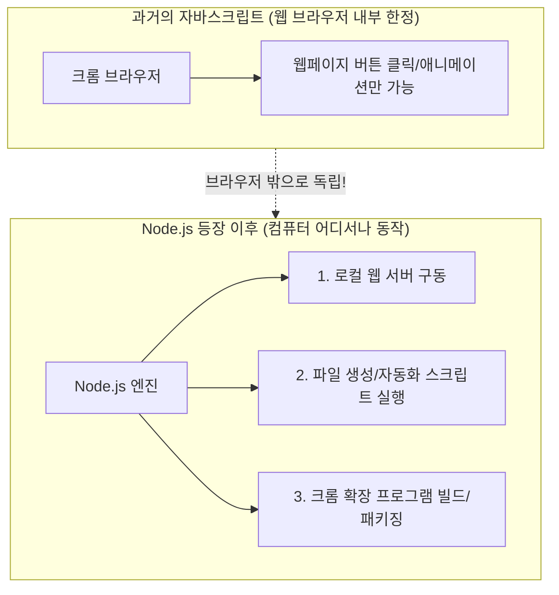

# 📚 [Wiki] Node.js 24 LTS란 무엇인가요?

> 🔙 **[돌아가기: 1-1. 교육준비물_Windows.md로 돌아가기](../1-1.%20교육준비물_Windows.md)**  
> 📌 *이 문서는 [1-1. 교육준비물_Windows.md](../1-1.%20교육준비물_Windows.md)의 "6️⃣ Node.js 24 LTS" 항목을 누구나 알기 쉽게 풀어서 설명한 보충 위키(백과사전) 문서입니다.*

---

## ☕ 1분 요약: 비전공자를 위한 핵심 비유

이름이 영어로 되어 있어서 어렵게 느껴지지만, 아주 친숙한 일상 비유로 이해할 수 있습니다!

### 1. Node.js (노드제이에스) 란?
- 원래 **자바스크립트(JavaScript)**라는 프로그래밍 언어는 오직 **크롬(Chrome) 브라우저 안에서만** 움직일 수 있는 웹 화면용 언어였습니다.
- **Node.js**는 자바스크립트를 브라우저 밖으로 꺼내서, **"내 컴퓨터(Windows)에서 파일도 읽고, 서버도 돌리고, 프로그램을 직접 실행할 수 있게 해주는 엔진(모터)"**입니다.
- **비유**: 
  - *자바스크립트가 배달 앱 화면에 버튼을 띄우는 ‘주방 요리사’라면,*
  - *Node.js는 요리사가 주방 밖으로 나와 컴퓨터 전체를 지휘하며 공장을 돌릴 수 있게 해준 ‘마법의 작업장’입니다.*

---

### 2. LTS (Long Term Support) 란?
- **LTS**는 **"Long Term Support"**의 약자로, 우리말로 **"장기 안정 지원 버전"**을 뜻합니다.
- 새로운 기능이 마구 추가되는 실험용 버전이 아니라, **"기업이나 실무에서 오류 없이 믿고 쓸 수 있도록 개발팀이 최소 2~3년간 버그와 보안 패치를 철저하게 보증해 주는 가장 안정적인 표준판"**입니다.
- **비유**: 
  - *최신 컨셉트카(새 버전) 대신, 전 세계 수백만 명이 타보고 결함이 없음을 검증받은 ‘국민 세단 정규 생산 모델(LTS)’을 타는 것과 같습니다.*

---

### 3. 왜 '24'인가요? (버전 번호의 비밀)
- Node.js는 매년 새로운 버전을 출시하는데, 규칙이 정해져 있습니다:
  - **홀수 버전 (21, 23, 25 ...)**: 새로운 실험적 기능을 테스트하는 버전 (단기 지원 후 폐기)
  - **짝수 버전 (20, 22, 24 ...)**: 충분히 검증된 후 공식 **LTS(장기 지원판)**로 승격되는 버전!
- **Node.js 24 LTS**는 2026년 현재 가장 최신의 안전하고 빠른 표준 버전입니다.

---

## 🏗️ 핵심 구조 한눈에 보기 (Mermaid)



---

## 🎯 우리 교육(2026.WeLearning)에서 왜 꼭 필요한가요?

본 교육의 실습 과정 전반에서 Node.js는 다음과 같은 필수 역할을 합니다:

1. **2단계 AI 채팅앱 실습 (`2.AI 채팅앱`)**:
   - 프론트엔드와 백엔드가 데이터를 주고받는 로컬 개발 서버를 내 컴퓨터에서 구동할 때 사용합니다.
2. **3단계 사내 업무 자동화 (`3.autoreport_크롬확장앱`)**:
   - ERP 업무일지를 자동 입력하는 크롬 확장 프로그램을 컴파일하고 패키징하는 도구들이 Node.js 위에서 실행됩니다.
3. **4단계 실시간 화면 미러링 (`4.Presentation_Mirror`)**:
   - 강사의 교육 화면과 판서 내용을 수강생 브라우저에 실시간 동기화해 주는 고속 통신 서버를 작동시킵니다.
4. **5단계 아시안게임 웹사이트 (`5.KBS_2026_아시안게임_웹사이트`)**:
   - 브라우저 보안 제약(CORS) 없이 안전하게 로컬 웹 환경을 띄우고 테스트할 수 있습니다.

---

## 🔍 내 컴퓨터에 잘 설치되었는지 확인하는 법

설치가 끝났다면, **Git Bash** 또는 **PowerShell** 터미널을 열고 아래 명령어를 입력해 보세요:

```bash
# 1. Node.js 버전 확인 (v24.x.x 형태로 표시되면 정상)
node -v

# 2. npm(패키지 매니저) 버전 확인 (함께 자동 설치됩니다)
npm -v
```

> 💡 **Tip:** `node -v`를 쳤을 때 `v24.xx.x`와 같이 24로 시작하는 버전이 나오면 모든 준비가 완벽히 끝난 것입니다!

---

## 🔗 관련 문서 및 백링크

- 🔙 **본문 교재로 돌아가기**: [1-1. 교육준비물_Windows.md](../1-1.%20%EA%B5%90%EC%9C%A1%EC%A4%80%EB%B9%84%EB%AC%BC_Windows.md)
- 📋 **전체 교재 목록**: [0-1. 마크다운_문서_읽는_법.md](../0-1.%20%EB%A7%88%ED%81%AC%EB%8B%A4%EC%9A%B4_%EB%AC%B8%EC%84%9C_%EC%9D%BD%EB%8A%94_%EB%B2%95.md)
- 💡 **위키 확장 방법**: [0-3. 나만의_AI_학습위키_확장가이드.md](../0-3.%20%EB%82%98%EB%A7%8C%EC%9D%98_AI_%ED%95%99%EC%8A%B5%EC%9C%84%ED%82%A4_%ED%99%95%EC%9E%A5%EA%B0%80%EC%9D%B4%EB%93%9C.md)
