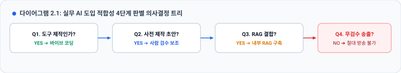

# 🧭 이 업무에 AI를 써도 되는가 — 판별 5문항

> **문서 성격**: **현업 판단 도구.** 교육 자료이자, 회의실에 들고 들어가는 체크리스트입니다.
> **쓰는 때**: "이거 AI로 하면 되지 않나요?" 라는 말이 나왔을 때 / 업체 제안서를 받았을 때 / 부서 AI 과제를 고를 때
> **핵심 메시지**: **"AI를 쓸 수 있느냐가 아니라, 이 일이 AI가 잘하는 종류의 일이냐를 먼저 묻는다."**

---

## 📌 이 문서를 1분 만에 쓰는 법

| 판정 단계 | 질문 내용 | 판단 기준 |
| :--- | :--- | :--- |
| **① 데이터** | 학습·참고할 자료가 이미 대량으로 존재하는가? | 새로 구축해야 하면 ❌ |
| **② 정답** | "그럴듯함"으로 족한가, "정밀한 정확성"이 필수인가? | 한 글자 틀려도 방송사고면 ❌ |
| **③ 검증** | 산출물 오류를 누가, 얼마나 싸게 알아내는가? | 전문가 전수 검수 필수면 ❌ (검증 역설) |
| **④ 시간** | 실시간성이 요구되는가, 되돌릴 수 있는가? | 생방송 실시간 송출이면 ❌ |
| **⑤ 피해** | 오류 시 직접 피해를 입는 특정 집단이 있는가? | 정보 소외 계층 직결 시 ❌ |

| 종합 점수 | 권고 액션 |
| :--- | :--- |
| **✅ 5개 전부 안전** | **지금 즉시 착수**하십시오. |
| **🔺 1~2개 주의** | 사람의 검수 단계를 명시하고 **조건부 진행**하십시오. |
| **❌ 1개 이상 (특히 ③, ⑤)** | **즉시 중단**하고 재설계하거나 다른 방식을 찾으십시오. |

> 💡 **바쁘시면 맨 마지막 [📄 인쇄용 한 장]만 출력해서 쓰셔도 됩니다.**

---

## 🤔 왜 이런 게 필요한가

AI 도입 논의는 대개 이런 식으로 흘러갑니다.

```
   "요즘 AI가 영상도 만들던데, 우리도 뭐 좀 해보죠"
        ↓
   "그거 되나요?"  →  "될 것 같은데요"  →  "그럼 해봅시다"
        ↓
   (6개월 뒤) 예산은 썼는데 쓸 수 있는 게 없다
```

문제는 **"되나요?"** 라는 질문 자체입니다.
데모 영상만 보면 **거의 모든 것이 "되는 것처럼" 보이기 때문**입니다.

> ### 🎯 물어야 할 질문은 이것입니다.
> **"되나요?"** ❌
> **"이 일은 AI가 잘하는 종류의 일인가요?"** ✅
>
> 이 문서는 그 판별을 **5개 질문으로 기계적으로** 할 수 있게 만든 것입니다.

---

---

# 5문항 상세

## ① 데이터 — 학습·참고할 자료가 이미 대량으로 존재하는가

### 왜 묻는가

AI가 잘하는 분야와 못하는 분야를 가르는 **가장 근본적인 요인**입니다.

| 구분 | LLM (텍스트/코드) | 신규 비디오/전문 수어 등 |
| :--- | :--- | :--- |
| **원천 데이터** | 인터넷에 수조 토큰이 무료로 존재 | 공개된 정제 데이터가 전무하거나 극소량 |
| **라벨링 비용** | 정답을 따로 만들 필요 없음 (비용 0원) | 전문 도메인 인력 투입 필수 (비용 수억~수십억) |
| **결과** | **자동화 성공** | **자동화하려던 인력이 데이터 구축에 더 많이 투입됨** |

### 판정하는 법

| 신호 | 판정 |
|------|------|
| 인터넷·공개 데이터에 이미 대량으로 있다 (일반 텍스트, 사진, 코드, 음성) | ✅ |
| 사내에 있고 이미 정리되어 있다 (매뉴얼, 규정, 과거 문서) | ✅ RAG로 가능 |
| 사내에 있지만 형식이 제각각이라 정리부터 해야 한다 | 🔺 정리 비용을 먼저 계산 |
| **아예 없어서 전문가가 새로 만들어야 한다** | ❌ 여기서 대부분 끝납니다 |

> 💬 **회의에서 던질 한 마디**
> **"이걸 학습시키려면 자료가 얼마나 필요하고, 그 자료는 지금 어디에 있습니까?"**
> 답이 **"만들어야죠"** 면, 그 순간 비용 규모가 자릿수 단위로 달라집니다.

---

## ② 정답의 성격 — "그럴듯하면" 되는가, "정확해야만" 하는가

### 왜 묻는가

이것이 **현재 AI의 가장 본질적인 한계**입니다.

| 최적화 목표 | AI의 실제 동작 | 실무 파급 효과 |
| :--- | :--- | :--- |
| **그럴듯함 (Plausibility)** | 사람이 보기에 매끄럽고 자연스러운 확률적 조합 생성 | ✅ 시안·배경·초안 생성 적합 |
| **정확함 (Correctness)** | 팩트와 수치, 문법의 100% 무결성 | ❌ **환각(Hallucination) 구조적 상존** |

> ⭐ 환각(Hallucination)은 고장이 아니라, **확률 기반 생성 AI의 정상 동작**입니다.

### 판정하는 법

| 이 업무의 성격 | 판정 |
|--------------|------|
| 초안·아이디어·시안 — 사람이 어차피 고쳐 쓴다 | ✅ |
| 분위기·디자인·배경 — "보기 좋으면" 되는 것 | ✅ |
| 요약·분류 — 대략 맞으면 되고 틀려도 되돌릴 수 있다 | ✅ |
| 계산·집계·번역 — **한 글자 틀리면 안 되는 것** | 🔺 검수 필수 |
| **사실 전달 — 틀리면 그 자체로 사고인 것** | ❌ |

> ⚠️ **가장 위험한 착각**
> **"AI가 요즘 잘하던데 이 정도는 맞히겠지"**
> → 잘하는 것과 **틀리지 않는 것**은 다른 문제입니다.
> 정확도 95%는 훌륭한 성능이지만, **20건 중 1건이 틀린다**는 뜻이기도 합니다.

---

## ③ 검증 비용 — 틀렸는지 누가, 얼마나 싸게 알아내는가

### 왜 묻는가

**실무에서 자동화가 실패하는 1순위 원인**이고, 가장 자주 빠뜨리는 항목입니다.

   자동화의 이득 = (생성이 빨라진 만큼) − (검증에 드는 비용)

   생성이 100배 빨라져도
   검증 비용이 그대로면 → 전체 시간은 거의 안 줄어듭니다

### ⚠️ 가장 나쁜 형태 — "검증 역설"



### 판정하는 법

| 누가 검증하는가 | 판정 |
|---------------|------|
| **프로그램이 자동으로** (실행해 보면 됨, 숫자가 맞는지 대조) | ✅ 최고 |
| 담당자 본인이 결과를 보면 5초 만에 안다 | ✅ |
| 담당자가 원본과 대조해야 안다 | 🔺 |
| **그 분야 전문가가 전량을 봐야 안다** | ❌ **검증 역설** |
| **아무도 확인할 방법이 없다** | ❌ 절대 금지 |

> 💡 **바이브 코딩이 안전한 이유가 바로 이 칸입니다.**
> AI가 짜준 코드는 **실행해 보면 맞는지 즉시 압니다.**
> 검증 비용이 거의 0이라, 생성 속도 향상이 **그대로 이득**이 됩니다.

---

## ④ 시간 — 실시간이어야 하는가, 되돌릴 수 있는가

### 왜 묻는가

방송국 환경에서 특히 중요합니다. **되돌릴 수 없는 일에는 확률적 장치를 붙이면 안 됩니다.**

### 판정하는 법

| 상황 | 판정 |
|------|------|
| 언제 해도 되고, 틀리면 다시 하면 된다 | ✅ |
| 마감이 있지만 검수할 시간은 있다 | ✅ |
| 당일·수 시간 내 처리해야 한다 | 🔺 |
| **실시간이고 되돌릴 수 없다 (생방송 송출)** | ❌ |

> ⚠️ **속도 자체도 확인해야 합니다.**
> 영상 생성은 5~10초짜리 하나에 **수십 초~수 분**이 걸립니다.
> "실시간"을 요구하는 업무에는 **물리적으로 성립하지 않는** 경우가 많습니다.

---

## ⑤ 피해 — 틀렸을 때 피해 입는 특정한 사람이 있는가

### 왜 묻는가

앞의 4개가 **"될까?"** 를 묻는다면, 이 질문은 **"해도 되는가?"** 를 묻습니다.
기술 판단이 아니라 **책임 판단**입니다.

### 판정하는 법

| 상황 | 판정 |
|------|------|
| 틀려도 내부 손해로 끝난다 | ✅ |
| 틀리면 외부에 나가지만 즉시 알아채고 정정할 수 있다 | 🔺 |
| **틀렸을 때 특정 개인·집단이 불이익을 받는다** | ❌ |
| **피해자가 오류를 알아채기 어렵거나, 정정을 요구할 통로가 좁다** | ❌ **최악** |

| 위험 조합 | 취약점 및 발생 사례 |
| :--- | :--- |
| **🚨 치명적 결합**<br>`유일한 접근 경로` × `오류 인지 불가` | • 수어 통역, 화면해설 방송, 외국인 재난 안내<br>• 재난·안전 속보, 법률/의료 고지<br>➔ 단순 불편이 아닌 **생명·안전·인권의 법적 책임 문제**로 비화 |

> 🎯 **원칙**
> **"AI는 사람의 판단을 보조하는 도구이지, 사람을 대신해 최종 결정을 내리는 주체가 될 수 없다."**
> ⑤번이 ❌면, 나머지가 아무리 좋아도 **사람 승인 단계 없이는 진행 불가**입니다.

---

---

# 📊 판정표

## 채점 방법

각 문항을 **✅ / 🔺 / ❌** 로 표시한 뒤, 아래 표로 결론을 냅니다.

| 결과 | 결론 | 다음 행동 |
|------|------|----------|
| **✅ 5개** | **지금 하십시오** | 바로 착수. 승인 절차도 가벼워도 됩니다 |
| **✅ 4개 + 🔺 1개** | **조건부 진행** | 🔺 항목에 사람 검수 단계를 명시하고 착수 |
| **🔺 2~3개** | **파일럿만** | 작은 범위로 시범 운영 후 재평가. 전면 도입 금지 |
| **❌ 1개 이상** | **재설계** | ❌ 항목을 우회할 다른 방법을 찾으십시오 |
| **❌ 3개 이상** | **하지 마십시오** | 기술 문제가 아니라 구조 문제입니다 |

> ⚠️ **❌는 개수가 아니라 존재 자체가 신호입니다.**
> 특히 **③(검증)이나 ⑤(피해)에 ❌가 하나라도 있으면**, 다른 항목이 전부 ✅여도 진행하면 안 됩니다.

---

## 실제 업무 채점 사례

| 업무 | ① 데이터 | ② 정답 | ③ 검증 | ④ 시간 | ⑤ 피해 | 판정 |
|------|:-------:|:-----:|:-----:|:-----:|:-----:|:----:|
| **AI가 짜준 업무 자동화 도구 (바이브 코딩)** | — | ✅ 규칙 기반 | ✅ 실행하면 즉시 | ✅ | ✅ | ✅ **적극 권장** |
| 회의록 요약 | ✅ | ✅ 대략 OK | ✅ 참석자가 확인 | ✅ | ✅ | ✅ **가능** |
| 방송 배경·타이틀 그래픽 생성 | ✅ | ✅ 보기 좋으면 됨 | ✅ 누구나 판단 | ✅ | 🔺 저작권 | ✅ **가능** |
| 사내 매뉴얼 검색 (RAG) | ✅ 사내 문서 | 🔺 출처 확인 필요 | ✅ 원문 대조 | ✅ | ✅ | ✅ **가능** |
| 엑셀·문서 정리 자동화 | — | ✅ 규칙 기반 | ✅ 자동 대조 | ✅ | ✅ | ✅ **적극 권장** |
| 뉴스 기사 초안 작성 | ✅ | 🔺 사실 확인 필수 | ✅ 기자가 즉시 | ✅ | 🔺 검수로 차단 | 🔺 **검수 조건부** |
| 자막 초안 생성 (사전 제작) | ✅ | 🔺 고유명사 오인식 | 🔺 대조 필요 | ✅ | 🔺 | 🔺 **검수 조건부** |
| 시청률·로그 데이터 분석 | ✅ 사내 데이터 | 🔺 해석은 사람이 | 🔺 원본 대조 | ✅ | ✅ | 🔺 **보조로만** |
| 실시간 자막 무검수 송출 | ✅ | ❌ 정확 필수 | ❌ 실시간엔 불가 | ❌ 실시간 | ❌ | ❌ **금지** |
| **AI 수어 라이브 송출** | ❌ 없음 | ❌ 정확 필수 | ❌ 통역사 필요 | ❌ 실시간 | ❌ 특정됨 | ❌ **금지** |
| AI 자동 조명·장비 제어 | 🔺 | ❌ 정확 필수 | 🔺 | ❌ 되돌릴 수 없음 | ❌ | ❌ **금지** |
| AI 자동 편집 후 즉시 송출 | ✅ | ❌ 맥락 오류 | ❌ 사람 필요 | ❌ | ❌ | ❌ **금지** |

> ### 🎯 **표를 세로로 읽어 보십시오.**
> **5개 항목이 전부 안전한 칸은 맨 위 두 줄** — 바이브 코딩으로 만든 자동화 도구뿐입니다.
> 그리고 이 두 줄에는 공통점이 있습니다. **완성된 도구 안에 AI가 없습니다.**
> AI는 만들 때만 쓰이고, 실행할 때는 정해진 규칙대로만 돕니다.
>
> **이것이 이 교육 과정이 바이브 코딩부터 시작하는 이유입니다.**

---

---

# 🧠 왜 하필 이 5개인가

각 문항은 AI의 특정한 구조적 성질에서 나옵니다. 외울 필요는 없지만, **근거를 알면 응용이 됩니다.**

| 문항 | 뿌리가 되는 AI의 성질 | 상세 |
|------|---------------------|------|
| ① 데이터 | 가중치는 **학습 데이터로만** 만들어진다. 없는 건 못 배운다 | [2. AI의_이해](./2.%20AI의_이해.md) Part 2 |
| ② 정답 | LLM은 **확률적으로 그럴듯한 것**을 생성한다. 오답 확률이 0이 될 수 없다 | [2. AI의_이해](./2.%20AI의_이해.md) Part 1.5 |
| ③ 검증 | 매번 결과가 달라서 **재현·자동 채점이 어렵다** | [3-0. CONTEXT_관리](./3-0.%20CONTEXT_관리.md) Part 6 |
| ④ 시간 | 추론에는 시간이 걸리고, **긴 출력일수록 더 걸린다** | [3-1. 영상생성AI의_Context](./3-1.%20영상생성AI의_Context.md) Part 2 |
| ⑤ 피해 | AI는 책임 주체가 될 수 없다 | [2. AI의_이해](./2.%20AI의_이해.md) Part 7 |

## AI가 막히는 일의 공통 패턴 4가지

```
① 학습 데이터가 "정답과 짝지어진 채로" 존재하지 않는 일
② "그럴듯함"과 "정확함"이 다른 일
③ 결과 검증에 그 일의 전문가가 필요한 일
④ 실시간이고, 틀려도 되돌릴 수 없는 일
```

> 💡 **반대로, 이 4가지에 하나도 해당하지 않는 일은 지금 당장 하면 됩니다.**
> 그게 **업무 자동화 도구 만들기**입니다.

---

---

# 💬 자주 나오는 반론과 답변

| 반론 | 답변 |
|------|------|
| **"모델이 더 좋아지면 되지 않나요?"** | ①(데이터 없음)과 ③(검증 비용)은 **모델을 키운다고 풀리지 않습니다.** 데이터가 없으면 학습할 게 없고, 자동 채점이 없으면 개선 순환 자체가 돌지 않습니다. 반면 ②④는 시간이 지나면 나아질 수 있습니다. **성능 문제와 구조 문제를 구분하십시오.** |
| **"다른 방송사도 한다던데요"** | 무엇을 하는지 확인하십시오. 대개 **[사전 제작 + 사람 검수]** 이거나, **AI가 아니라 규칙 기반 자동화**입니다. |
| **"일단 시범으로라도 해보면 안 되나요?"** | ①②④에만 문제가 있다면 파일럿은 좋습니다. 그러나 **③(검증)이나 ⑤(피해)에 ❌가 있으면 파일럿도 위험합니다.** 시범 운영 중에도 피해는 실제로 발생하기 때문입니다. |
| **"데모를 봤는데 잘 되던데요"** | 데모는 대개 **가장 잘 되는 5~10초**입니다. **실제 업무 데이터를 그 자리에서 넣어 달라**고 하십시오. 대부분 여기서 판별이 끝납니다. |
| **"AI가 하면 인건비가 줄지 않나요?"** | ③번을 다시 보십시오. **검증에 그 전문가가 필요하면 인건비는 줄지 않습니다.** 오히려 "검수+수정"이 "처음부터 직접"보다 느린 경우가 많습니다. |
| **"우리 데이터로 학습시키면 되잖아요"** | "학습"이 아니라 대개 **RAG나 Context 주입**으로 충분하고, 그게 훨씬 쌉니다. 진짜 학습(파인튜닝)은 **지식이 아니라 말투·형식**을 고정할 때 쓰는 도구입니다. → [3-0. CONTEXT_관리](./3-0.%20CONTEXT_관리.md) Part 5 |

---

# 📋 업체 제안서를 받았을 때 던질 질문

| # | 질문 항목 | 의도 및 검증 포인트 |
|:-:| :--- | :--- |
| **①** | **실시간 추론 vs 사전 규칙 재생** | 실제 딥러닝 모델 추론인가, 3D 아바타 모션 재생인가? |
| **②** | **가중치 위치 및 데이터 경로** | API 전송 시 데이터가 외부로 유출되는가? (보안 경로 B 확인) |
| **③** | **학습/참고 데이터 출처 및 규모** | 합법적인 저작권 및 정밀 라벨링 데이터를 확보했는가? |
| **④** | **정확도 측정 지표 및 평가자** | 단순 자동 BLEU 점수가 아닌 실제 전문가/사용자 평가인가? |
| **⑤** | **실제 사내 업무 데이터 즉석 시연** | ⭐ **준비된 5초 데모가 아닌 우리 회사 실제 2분 데이터를 즉석 처리 가능한가?** |
| **⑥** | **오답 발생 시 인간 개입 파이프라인** | 방송사고 발생 시 즉시 중단/대체할 책임 소재 및 수동 개입 장치가 있는가? |
| **⑦** | **건당 실행 비용 및 스케일링 과금** | 트래픽 증가 시 API 토큰 비용이 선형 폭증하는 구조인가? |

---

---

# 📄 인쇄용 한 장

| 검토 대상 업무명 |  |
| :--- | :--- |

| # | 판별 문항 | 핵심 점검 내용 | 판정 (택1) |
|:-:| :--- | :--- | :---: |
| **①** | **데이터** | 학습·참고할 자료가 이미 대량으로 존재하는가?<br>*(새로 만들어야 한다면 ❌)* | `[ ] ✅` `[ ] 🔺` `[ ] ❌` |
| **②** | **정답** | "그럴듯함"으로 족한가, "정밀한 정확성"이 필수인가?<br>*(틀리면 그 자체로 방송 사고라면 ❌)* | `[ ] ✅` `[ ] 🔺` `[ ] ❌` |
| **③** | **검증** | 틀렸는지 누가, 얼마나 싸게 알아내는가?<br>*(전문가가 전량을 검수해야 하면 ❌ - 검증 역설)* | `[ ] ✅` `[ ] 🔺` `[ ] ❌` |
| **④** | **시간** | 실시간이어야 하는가? 되돌릴 수 있는가?<br>*(생방송 즉시 송출이라면 ❌)* | `[ ] ✅` `[ ] 🔺` `[ ] ❌` |
| **⑤** | **피해** | 틀렸을 때 피해 입는 특정한 사람이 있는가?<br>*(피해자가 오류를 알아채기 어렵다면 ❌ - 최악)* | `[ ] ✅` `[ ] 🔺` `[ ] ❌` |

### 🎯 종합 판정 기준
- **`✅ 5개`** ➔ **지금 즉시 착수하십시오.**
- **`✅ 4개 + 🔺 1개`** ➔ **사람 검수 단계를 명시하고 진행하십시오.**
- **`🔺 2~3개`** ➔ **작은 범위 파일럿만 수행하십시오.**
- **`❌ 1개 이상`** ➔ **즉시 재설계하십시오. (특히 ③, ⑤가 ❌면 전면 중단)**

> ⚠️ **데모는 가장 잘 되는 5초입니다. 우리 회사의 실제 자료를 그 자리에서 넣어 검증하십시오.**

---

> **관련 교재**
> · [1-2. 교육과정.md](./1-2.%20교육과정.md) 및 [1-3. 왜_바이브코딩인가.md](./1-3.%20왜_바이브코딩인가.md) — 이 판별표가 왜 "바이브 코딩"으로 귀결되는가
> · [2. AI의_이해.md](./2.%20AI의_이해.md) — 5문항의 근거가 되는 AI의 작동 원리
> · [3-2. 사례연구_AI_수어통역.md](./3-2.%20사례연구_AI_수어통역.md) — 이 5문항이 실제로 도출된 사례. **❌ 5개가 전부 나오는 교과서적 예시**
