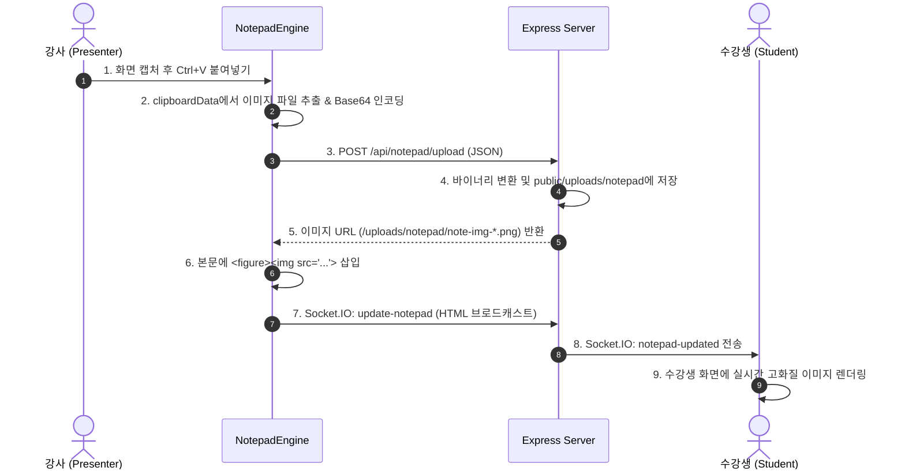

# 🏛️ ADR 004: 실시간 노션형 라이브 노트패드(Live Notepad) 아키텍처 및 동기화 설계

- **상태(Status):** 승인 및 구현 완료 (Accepted & Implemented)
- **작성일(Date):** 2026-09-01
- **결정자(Deciders):** 15년 차 시니어 아키텍트 & 페어 프로그래밍 엔지니어
- **적용 대상:** `4.Presentation_Mirror` (PresentationApp, NotepadEngine, Server.js, SyncEngine)

---

## 💡 1. 일상 비유로 이해하는 아키텍처 (파인만 기법)

> **"교탁 위의 마법 칠판 메모장과 실시간 복사기"**  
> 강사가 강의 도중 교탁에 놓인 마법 메모장에 즉흥적으로 요약 글을 쓰고, PC 화면에서 캡처한 사진을 `Ctrl+V`로 '툭' 올려두면, 별도의 파일 전송이나 새로고침 없이 **모든 수강생의 책상 위에 놓인 태블릿에 글자와 사진이 0.05초 만에 똑같이 떠오르는 실시간 반응형 라이브 노트**입니다.

---

## 🎯 2. 배경 및 해결하려는 문제 (Context & Problem)

1. **강의 중 즉흥적 판서 및 서머리의 한계:**
   - 기존에는 사전 준비된 마크다운 교육자료 문서나 전체 화면 공유만을 지원했습니다.
   - 수강생들의 실시간 질문이나 실습 중 발생한 오류를 즉석에서 요약하고 도식화하여 공유할 수 있는 **즉흥적 메모 및 리치 텍스트 공간**이 필요했습니다.
2. **스크린샷/이미지 공유의 번거로움:**
   - 실습 도중 에러 화면이나 터미널 실행 결과 스크린샷을 메신저나 이메일로 별도 전송하는 과정은 교육 흐름을 끊습니다.
   - 강사가 캡처 후 **`Ctrl+V` (클립보드 붙여넣기)**만으로 모든 수강생 화면에 고화질 이미지를 즉시 띄울 수 있어야 합니다.
3. **3가지 화면 모드의 유기적 통합:**
   - 마크다운 교재 뷰어(`markdown`), 실시간 라이브 노트(`notepad`), 전체 데스크톱 공유(`desktop`)가 하나의 툴바에서 원클릭으로 전환되고, 수강생 화면도 지체 없이 따라와야 합니다.

---

## 🏗 3. 기술적 결정 사항 및 Trade-off 분석 (Decision & Trade-offs)

### 1) ContentEditable 기반 하이브리드 리치 에디터 채택
- **선택:** 경량 HTML5 `contenteditable` + DOM 커스텀 블록 파이프라인
- **대안 비교:**
  - *Monaco Editor / CodeMirror (마크다운 원문 에디터):* 텍스트 타이핑은 강력하나, 이미지 인라인 뷰어와 노션 스타일의 직관적인 WYSIWYG 서식 경험이 떨어짐.
  - *Quill / Draft.js / Tiptap 등 대형 라이브러리:* 번들 크기가 크고 웹소켓과의 2-way 바인딩 시 커서 튕김 현상 발생 가능.
- **Why (채택 이유):**
  - 가볍고 외부 의존성이 없으며, 노션과 동일하게 H1/H2 제목, 인용구, 코드블록, 콜아웃(💡 Callout), 체크리스트, 구분선, 인라인 이미지 카드를 자유롭게 렌더링.
  - 수강생 화면에서는 `contenteditable="false"`로 깔끔하게 읽기 전용으로 전환되어 성능 최적화.

### 2) 이중 파이프라인 이미지 전송 아키텍처 (Hybrid Image Pipeline)

- **Why (채택 이유):**
  - 거대한 이미지 바이너리를 WebSocket 프레임으로 직접 전송하면 소켓 버퍼가 오버플로우되거나 텍스트 타이핑 지연이 발생합니다.
  - REST API로 고속 업로드 후 **정적 URL**만 웹소켓으로 브로드캐스트하여 네트워크 부하를 90% 이상 절감했습니다.

### 3) 50ms 디바운스 실시간 타이핑 동기화
- **선택:** 강사 타이핑 입력 시 50ms 디바운스로 Socket.IO `update-notepad` 발송
- **Why (채택 이유):**
  - 수십 명의 수강생이 접속해 있을 때 글자 하나마다 소켓을 쏘면 서버 I/O 부하가 커지므로, 사람의 눈에는 실시간(30~60fps)으로 느껴지면서 서버 리소스는 극적으로 아끼는 50ms 최적 주기를 적용했습니다.

### 4) 원클릭 마크다운 내보내기 (Export as .md)
- **선택:** 클라이언트 사이드 HTML-to-Markdown 파서 내장
- **Why (채택 이유):**
  - 강의가 끝난 뒤 강사와 수강생 모두 작성된 요약본과 이미지 링크를 즉시 `.md` 파일로 다운로드하여 개인 지식 베이스(Obsidian, Notion, GitHub)에 보관할 수 있습니다.

---

## 📊 4. 결과 및 기대 효과 (Outcomes)

1. **강의 전달력 및 몰입도 극대화:**
   - 교재(`markdown`) -> 실시간 요약/질의응답(`notepad`) -> 실제 코딩 도구(`desktop`)의 3단 콤보가 완성되어 완벽한 강의 환경 구축.
2. **초저지연(Ultra Low Latency) 사진 공유:**
   - 강사가 화면 캡처 도구(Win+Shift+S 등)로 자른 사진을 `Ctrl+V`만 누르면 0.2초 안에 모든 수강생 화면에 고해상도로 렌더링.
3. **네트워크 안정성 보장:**
   - REST 이미지 업로드 + WebSocket URL 전달 아키텍처로 다수의 수강생이 동시 접속해도 끊김 없는 스트리밍 유지.
